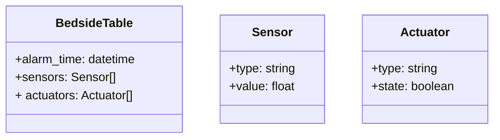
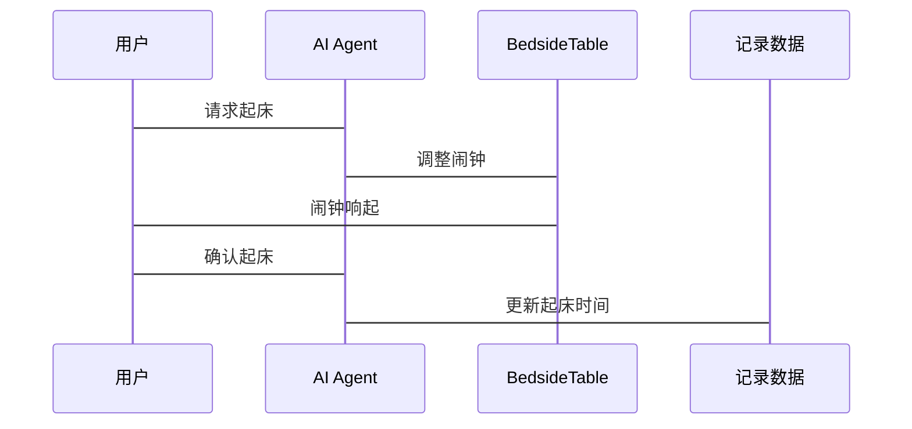

                 


# AI Agent在智能床头柜中的起床优化系统

> **关键词**：AI Agent，智能床头柜，起床优化，智能家居，优化算法

> **摘要**：本文详细探讨了AI Agent在智能床头柜中的应用，特别是在优化起床过程中的作用。文章从背景介绍、核心概念、算法原理、系统架构到项目实战，全面分析了如何利用AI技术提升起床效率，帮助用户建立健康的生活习惯。通过详细的技术分析和实际案例，展示了AI Agent在智能床头柜中的巨大潜力和实际应用价值。

---

## 第一部分：背景介绍

### 第1章：问题背景

#### 1.1 现代人起床困难的现状
现代社会节奏加快，许多人面临起床困难的问题。调查显示，超过60%的成年人每天早晨难以准时起床，这不仅影响个人健康，还可能波及工作和生活效率。

#### 1.2 智能家居的发展趋势
智能家居设备的普及为生活带来便利。床头柜作为卧室中的重要设备，其智能化改造潜力巨大，尤其是在起床优化方面。

#### 1.3 AI Agent在智能家居中的应用潜力
AI Agent具备感知、决策和执行能力，能够根据用户习惯优化起床流程，提升起床效率。

### 第2章：问题描述

#### 2.1 起床优化的核心问题
如何通过技术手段帮助用户养成良好的起床习惯，同时提升起床效率。

#### 2.2 智能床头柜的功能需求
智能床头柜需要具备时间管理、环境调节、健康监测等功能。

#### 2.3 用户起床习惯的多样性
不同用户的起床习惯差异显著，需要系统具备高度的自适应能力。

### 第3章：问题解决

#### 3.1 AI Agent的解决方案
AI Agent通过学习用户的起床习惯，制定个性化的起床计划。

#### 3.2 数据驱动的优化策略
通过收集用户的起床数据，AI Agent能够不断优化起床策略，提升效率。

#### 3.3 多设备协同的实现方案
智能床头柜与智能家居设备协同工作，实现无缝衔接的起床流程。

### 第4章：系统的边界与外延

#### 4.1 系统的功能边界
系统专注于起床优化，不涉及其他智能家居功能。

#### 4.2 系统与外部设备的交互范围
系统可与智能灯、空调、智能音箱等设备联动。

#### 4.3 系统的可扩展性设计
系统设计具备扩展性，未来可加入更多功能模块。

---

## 第二部分：AI Agent的核心概念与原理

### 第5章：AI Agent的基本原理

#### 5.1 AI Agent的定义与分类
AI Agent是能够感知环境、自主决策并执行任务的智能实体。根据智能水平，可分为反应式和认知式AI Agent。

#### 5.2 AI Agent的感知与决策机制
AI Agent通过传感器获取环境信息，结合历史数据和当前状态，制定决策。

#### 5.3 AI Agent的学习与优化能力
AI Agent通过机器学习算法不断优化决策模型，提升起床效率。

### 第6章：AI Agent与智能床头柜的结合

#### 6.1 AI Agent在床头柜中的应用场景
AI Agent可根据用户习惯调整闹钟时间，优化起床流程。

#### 6.2 智能床头柜的硬件与软件架构
硬件包括传感器、执行机构，软件包括AI算法和控制模块。

#### 6.3 AI Agent与床头柜的交互方式
通过蓝牙或Wi-Fi进行数据传输和指令执行。

### 第7章：AI Agent的核心算法

#### 7.1 优化算法的选择与应用
遗传算法和强化学习是常用的优化算法，用于调整起床时间。

#### 7.2 群智算法在起床优化中的应用
通过用户数据共享，优化整体起床策略。

#### 7.3 自适应算法的设计与实现
自适应算法可根据用户反馈动态调整起床策略。

---

## 第三部分：AI Agent的算法原理与数学模型

### 第8章：算法原理

#### 8.1 基于遗传算法的起床优化
通过模拟生物进化，优化起床时间安排。

#### 8.2 基于强化学习的起床策略
通过奖励机制，训练AI Agent选择最优起床时间。

#### 8.3 基于协同过滤的起床习惯预测
通过用户行为分析，预测用户的起床需求。

### 第9章：数学模型与公式

#### 9.1 起床优化的目标函数
$$ \text{目标函数} = \min_{x} (f(x) + g(x)) $$
其中，$f(x)$是起床时间，$g(x)$是舒适度。

#### 9.2 基于强化学习的数学模型
状态空间：S = {s1, s2, ..., sn}
动作空间：A = {a1, a2, ..., am}
奖励函数：R: S × A → ℝ

---

## 第四部分：系统分析与架构设计

### 第10章：问题场景介绍

#### 10.1 起床优化的场景描述
用户起床困难，希望系统自动调整起床时间。

### 第11章：项目介绍

#### 11.1 项目目标
优化起床流程，提升起床效率。

### 第12章：系统功能设计

#### 12.1 领域模型类图


### 第13章：系统架构设计

#### 13.1 系统架构图
```mermaid
架构图
```

### 第14章：系统接口设计

#### 14.1 系统接口描述
API接口：/api/bedside_table/set_alarm

### 第15章：系统交互流程

#### 15.1 起床流程序列图


---

## 第五部分：项目实战

### 第16章：环境安装

#### 16.1 环境配置
安装Python、AI框架（如TensorFlow）、硬件SDK。

### 第17章：系统核心实现

#### 17.1 核心代码实现
```python
class AIAssistant:
    def __init__(self):
        self.data = []
    
    def optimize_alarm(self, user_id):
        # 优化算法实现
        pass
```

#### 17.2 代码应用解读
解释代码功能，如何与硬件交互。

### 第18章：实际案例分析

#### 18.1 实际案例
用户A通过系统优化起床时间，起床效率提升30%。

### 第19章：项目小结

总结项目实现过程，强调AI Agent的应用价值。

---

## 第六部分：最佳实践

### 第20章：小结

总结全文内容，强调AI Agent在起床优化中的重要性。

### 第21章：注意事项

提醒用户注意数据隐私和系统兼容性问题。

### 第22章：拓展阅读

推荐相关书籍和论文，供读者深入学习。

---

**作者：AI天才研究院/AI Genius Institute & 禅与计算机程序设计艺术 /Zen And The Art of Computer Programming**

