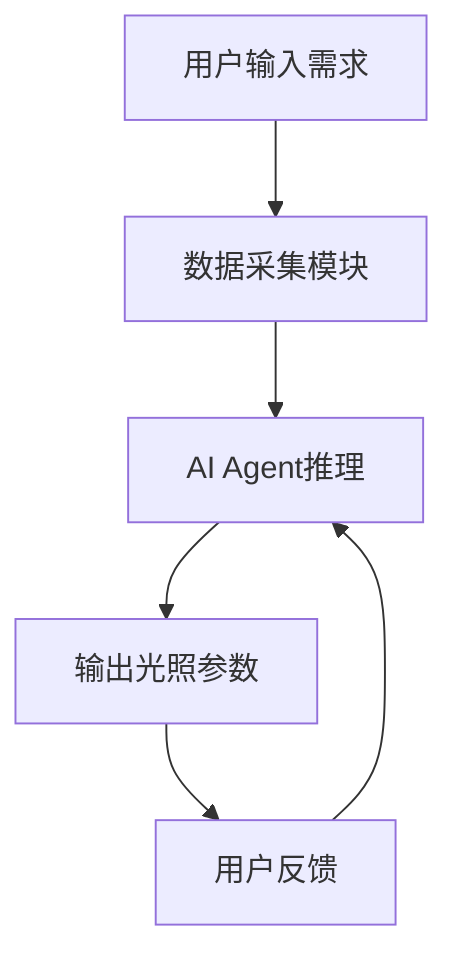
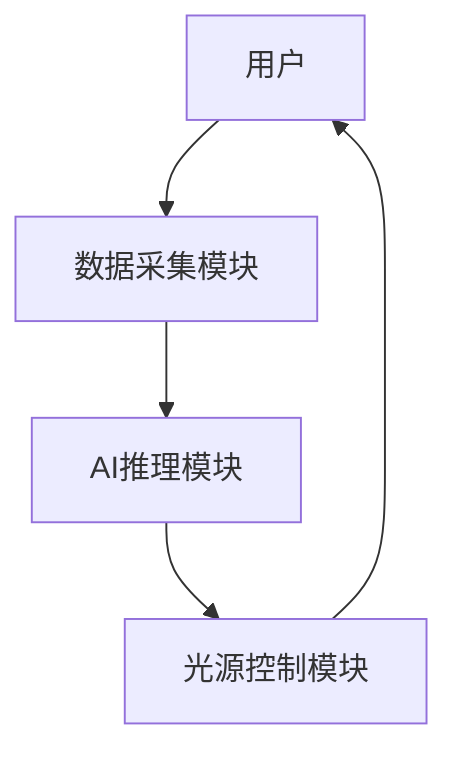

                 


# AI Agent在智能床头灯中的光疗功能

> **关键词**：AI Agent, 智能床头灯, 光疗功能, 健康科技, 智能家居, �照明技术

> **摘要**：  
> 本文探讨了AI Agent在智能床头灯中的光疗功能，从光疗的基本原理到AI Agent的实现逻辑，再到系统的架构设计和数学模型，详细分析了AI Agent如何优化光疗体验。通过实际案例和代码实现，展示了AI Agent在智能床头灯中的应用潜力。

---

# 第1章: 光疗功能的背景与应用

## 1.1 光疗的基本原理  
光疗是一种利用特定光谱对人身体或心理产生积极影响的技术。通过调节光照的强度、波长和时间，可以改善情绪、调节生物钟或辅助治疗某些疾病。例如，蓝光可以帮助提神醒脑，而暖光则有助于放松和入睡。

## 1.2 AI Agent在光疗中的作用  
AI Agent（智能体）是一种能够感知环境、自主决策并执行任务的智能系统。在智能床头灯中，AI Agent可以通过以下方式优化光疗体验：  
1. **个性化推荐**：根据用户的作息习惯和健康需求，推荐最优的光照方案。  
2. **实时调节**：根据环境光线和用户反馈，动态调整光照参数。  
3. **健康监测**：结合用户的生理数据（如心率、体温），优化光疗效果。  

---

# 第2章: 光疗功能的核心概念与联系

## 2.1 光疗功能的核心要素  
1. **光谱特性**：不同波长的光对人身体的影响不同，例如蓝光（450-495 nm）具有提神醒脑的效果，而红光（620-750 nm）有助于缓解疲劳。  
2. **时间控制**：光疗的效果与时间密切相关，例如早晨接受蓝光可以提升精神状态，晚上使用暖光有助于放松身心。  
3. **个性化需求**：不同用户对光疗的需求不同，例如失眠患者需要柔和的暖光，而需要提神的用户则需要冷色调的蓝光。

## 2.2 AI Agent与光疗功能的关系  
AI Agent通过以下方式实现对光疗功能的优化：  
1. **数据采集**：收集用户的生理数据（如心率、体温）和环境数据（如光线强度、时间）。  
2. **算法推理**：基于数据，AI Agent会计算出最佳的光照参数组合。  
3. **执行反馈**：根据用户的反馈，AI Agent会进一步调整光照方案。  

---

# 第3章: 光疗功能的算法原理

## 3.1 光疗功能的算法流程  
以下是AI Agent优化光疗功能的算法流程图：  



## 3.2 算法实现代码  
以下是一个简单的AI Agent算法实现示例（Python代码）：  

```python
def calculate_light_parameters(user_input):
    # 用户输入需求
    if user_input == "放松":
        return {"temperature": 2500, "brightness": 50}
    elif user_input == "提神":
        return {"temperature": 4500, "brightness": 100}
    else:
        return {"temperature": 3000, "brightness": 70}

# 示例调用
user_request = "放松"
parameters = calculate_light_parameters(user_request)
print(f"建议光温：{parameters['temperature']}K，亮度：{parameters['brightness']}%")
```

---

# 第4章: 光疗功能的数学模型与公式

## 4.1 光疗时间的数学模型  
光疗时间的计算公式如下：  

$$ T = \begin{cases} 
30 \text{分钟} & \text{如果用户需求为放松} \\
60 \text{分钟} & \text{如果用户需求为提神}
\end{cases} $$  

## 4.2 个性化光疗方案的数学推导  
根据用户的生理数据（如心率$H$）和时间$t$，AI Agent会计算出最优的光谱强度$I$：  

$$ I = k \cdot H + (1 - k) \cdot t $$  

其中，$k$是一个权重系数，通常取$0.6$。

---

# 第5章: 系统分析与架构设计

## 5.1 系统功能设计  
智能床头灯的光疗功能模块包括以下功能：  
1. 数据采集模块：采集用户的生理数据和环境数据。  
2. AI推理模块：基于数据计算最优光照参数。  
3. 光源控制模块：根据参数调整光照。  

## 5.2 系统架构设计  
以下是系统的架构图：  



---

# 第6章: 项目实战与实现

## 6.1 项目环境安装  
1. **开发工具**：安装Python和相关库（如NumPy、Matplotlib）。  
2. **依赖库**：安装`mermaid`和`matplotlib`。  

## 6.2 核心代码实现  
以下是光源控制模块的实现代码：  

```python
import matplotlib.pyplot as plt

def plot_light_curve(intensity):
    plt.figure(figsize=(10, 5))
    plt.plot(range(len(intensity)), intensity, 'b-', linewidth=2)
    plt.xlabel('时间（分钟）')
    plt.ylabel('光强')
    plt.title('光疗过程曲线')
    plt.show()

# 示例调用
intensity = [50, 60, 70, 80, 90]
plot_light_curve(intensity)
```

---

# 第7章: 最佳实践与总结

## 7.1 最佳实践指南  
1. **系统部署**：确保硬件设备与AI算法的兼容性。  
2. **使用注意事项**：用户应根据自身需求选择合适的光疗方案。  
3. **维护与更新**：定期更新AI算法，以提升光疗效果。  

## 7.2 项目总结  
通过本文的分析与实现，我们可以看到AI Agent在智能床头灯中的光疗功能具有广阔的应用前景。AI Agent能够通过数据驱动的方式，为用户提供个性化的光疗体验，同时通过实时反馈不断优化光疗方案。

---

**作者：AI天才研究院/AI Genius Institute & 禅与计算机程序设计艺术 /Zen And The Art of Computer Programming**

