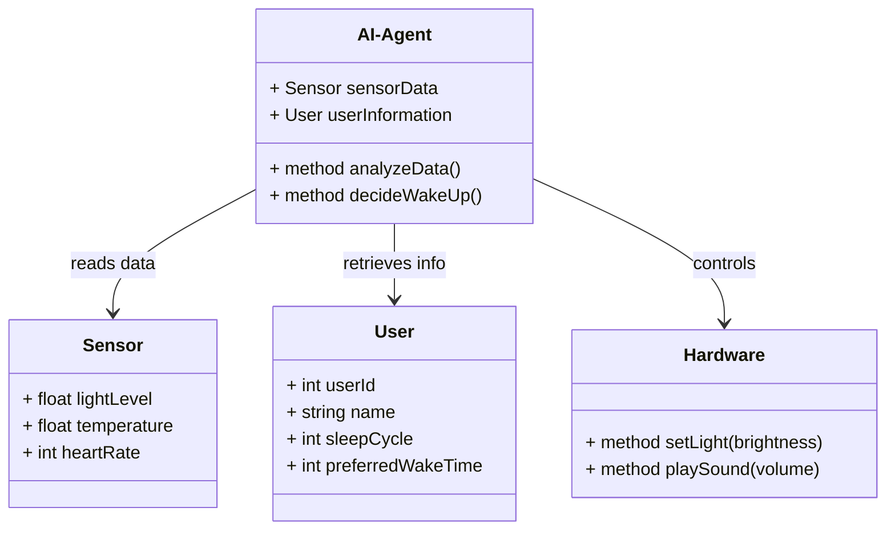
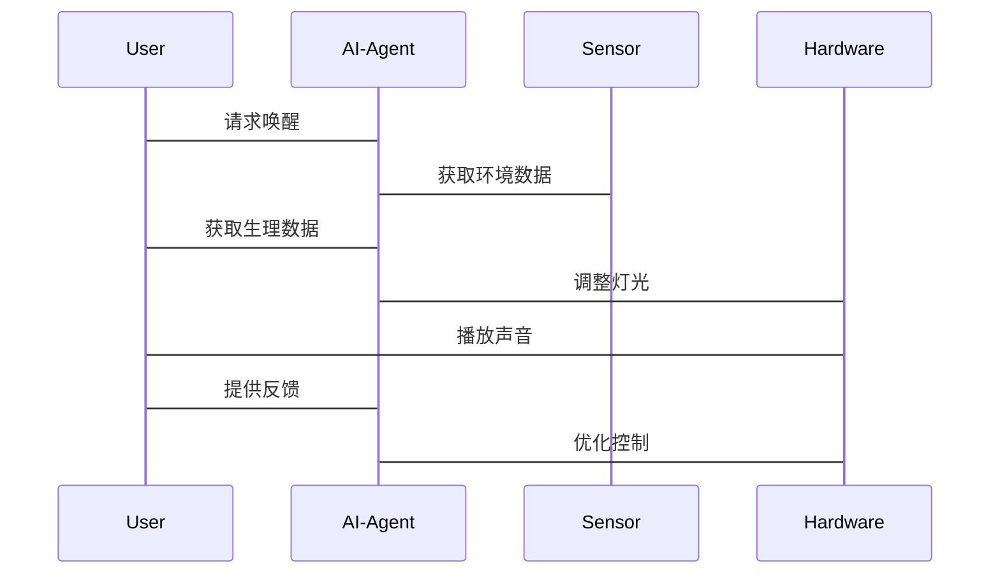

                 


# AI Agent在智能床头灯中的智能唤醒系统

> 关键词：AI Agent，智能床头灯，智能唤醒系统，边缘计算，实时响应

> 摘要：本文探讨了AI Agent在智能床头灯中的应用，重点分析了智能唤醒系统的实现原理和应用场景。通过结合边缘计算和实时响应技术，本文提出了一个高效的智能唤醒方案，旨在优化用户体验。

---

## 第一部分: AI Agent与智能床头灯的背景与概念

### 第1章: AI Agent与智能床头灯概述

#### 1.1 AI Agent的基本概念

AI Agent（人工智能代理）是一种能够感知环境、做出决策并执行任务的智能实体。它通过接收输入数据、分析信息并采取行动来实现目标。AI Agent的核心特征包括自主性、反应性、目标导向和学习能力。

- **自主性**：AI Agent能够独立运作，无需外部干预。
- **反应性**：能够实时感知环境变化并做出反应。
- **目标导向**：通过设定目标来优化决策过程。
- **学习能力**：通过数据反馈不断优化自身性能。

AI Agent与传统自动化系统的区别在于其智能化和适应性。传统系统依赖预设规则，而AI Agent能够根据实时数据动态调整行为。

#### 1.2 智能床头灯的功能与应用场景

智能床头灯是一种结合了物联网和人工智能技术的智能家居设备。它不仅具备传统床头灯的基本功能（如调节亮度、开关控制），还能够通过AI Agent实现智能化管理。

**智能床头灯的主要功能包括：**

1. **智能唤醒**：根据用户的睡眠周期和习惯，自动调整唤醒时间。
2. **环境感知**：通过传感器实时监测环境光线、温度和湿度。
3. **用户交互**：支持语音控制、手势操作和触摸反馈。
4. **数据记录**：记录用户的睡眠数据，提供健康建议。

**应用场景：**

- **家庭使用**：作为智能家居的一部分，为用户提供便捷的生活体验。
- **医疗健康**：帮助用户改善睡眠质量，辅助治疗失眠等健康问题。
- **远程监控**：通过物联网技术实现远程控制和数据传输。

#### 1.3 智能唤醒系统的定义与目标

智能唤醒系统是一种基于AI Agent的智能控制系统，旨在通过分析用户的睡眠数据和环境信息，优化唤醒策略，实现舒适、健康的起床体验。

**智能唤醒系统的主要目标：**

1. **个性化唤醒**：根据用户的生物节律和睡眠状态，制定个性化的唤醒计划。
2. **实时响应**：在用户接近浅睡阶段时，逐步调节光线和声音，避免突然唤醒导致的不适。
3. **数据驱动优化**：通过收集和分析用户的反馈数据，不断优化唤醒策略。

**技术挑战：**

- **数据采集**：需要高精度的传感器来获取用户的生理数据和环境信息。
- **算法优化**：需要高效的学习算法来实时调整唤醒策略。
- **系统集成**：需要实现硬件与软件的无缝协同工作。

#### 1.4 本章小结

本章介绍了AI Agent的基本概念，分析了智能床头灯的功能与应用场景，并提出了智能唤醒系统的定义与目标。通过对比传统自动化系统，突出了AI Agent的核心优势，为后续的系统设计奠定了基础。

---

## 第二部分: AI Agent智能唤醒系统的原理与技术

### 第2章: AI Agent智能唤醒的核心原理

#### 2.1 AI Agent的感知与决策机制

AI Agent通过感知环境信息、分析数据并做出决策来实现智能唤醒。感知层主要依赖传感器采集数据，决策层基于这些数据进行分析和判断，最终通过执行层（如调节灯光、播放声音）实现唤醒目标。

**感知层：**

- **传感器数据采集**：包括光线传感器、温度传感器和心率传感器。
- **数据预处理**：对采集的数据进行滤波、归一化处理，确保数据准确性。

**决策层：**

- **唤醒模型**：基于机器学习算法构建唤醒模型，预测用户的最佳唤醒时间。
- **规则引擎**：根据用户的习惯和环境条件，制定唤醒策略。
- **概率模型**：通过概率计算，优化唤醒时间的准确性。

**执行层：**

- **灯光调节**：通过PWM信号控制LED灯的亮度。
- **声音播放**：通过蓝牙模块播放预设的唤醒音乐。
- **反馈机制**：收集用户的反馈，优化唤醒策略。

#### 2.2 唤醒系统的核心算法

**基于机器学习的唤醒模型：**

- **数据准备**：收集用户的睡眠数据、环境数据和唤醒反馈。
- **特征提取**：提取关键特征（如心率变化、环境光线变化）。
- **模型训练**：使用监督学习算法（如随机森林、神经网络）训练模型。
- **模型优化**：通过交叉验证和超参数调优提升模型性能。

**基于规则的唤醒策略：**

- **规则制定**：根据用户的习惯（如睡眠时间、起床时间）制定唤醒规则。
- **规则执行**：在特定条件下触发唤醒操作。
- **规则优化**：根据用户的反馈动态调整规则。

**数学模型：**

唤醒时间预测模型可以表示为：

$$ P(wake) = \frac{1}{1 + e^{-x}} $$

其中，x是经过标准化处理的特征向量。

#### 2.3 AI Agent与床头灯硬件的协同工作

**硬件设备的功能模块划分：**

- **传感器模块**：负责采集环境数据和用户生理数据。
- **控制模块**：通过MCU或嵌入式芯片实现硬件控制。
- **通信模块**：支持Wi-Fi、蓝牙等无线通信协议。

**软件与硬件的接口设计：**

- **数据接口**：定义传感器数据的格式和传输协议。
- **控制接口**：定义硬件控制命令的格式和执行方式。
- **反馈接口**：实现硬件对用户反馈的响应。

**系统协同工作流程：**

1. **数据采集**：传感器采集环境数据和用户生理数据。
2. **数据传输**：通过通信模块将数据传输到AI Agent。
3. **决策判断**：AI Agent分析数据，判断是否需要唤醒用户。
4. **执行操作**：根据决策结果，控制灯光和声音模块进行操作。
5. **反馈优化**：收集用户的反馈数据，优化唤醒策略。

#### 2.4 本章小结

本章详细分析了AI Agent在智能床头灯中的感知与决策机制，介绍了唤醒系统的核心算法和硬件协同工作流程。通过数学模型和算法优化，实现了智能唤醒系统的高效运行。

---

## 第三部分: AI Agent智能唤醒系统的算法实现

### 第3章: 唤醒算法的数学模型与实现

#### 3.1 唤醒系统的概率模型

**概率模型的应用：**

- **概率计算**：通过概率模型预测用户在某一时间点的唤醒概率。
- **阈值判断**：根据概率值与预设阈值的比较，决定是否触发唤醒操作。

**概率模型的数学表达式：**

$$ P(wake) = \frac{1}{1 + e^{-x}} $$

其中，x是标准化的特征向量，包括用户的睡眠周期、环境光线和心率变化等特征。

#### 3.2 唤醒算法的优化与调优

**基于梯度下降的优化方法：**

- **损失函数定义**：定义损失函数来衡量预测值与实际值的差异。
- **梯度计算**：计算损失函数的梯度，用于更新模型参数。
- **参数更新**：通过迭代优化参数，降低损失函数值。

**数学推导：**

假设损失函数为：

$$ L = \sum_{i=1}^{n} (y_i - \hat{y}_i)^2 $$

其中，y_i是实际值，\hat{y}_i是预测值。梯度下降的更新公式为：

$$ \theta_{new} = \theta_{old} - \eta \frac{\partial L}{\partial \theta} $$

其中，η是学习率，\frac{\partial L}{\partial \theta}是损失函数对θ的偏导数。

#### 3.3 唤醒算法的代码实现

**Python代码示例：**

```python
import numpy as np
from sklearn.linear_model import LogisticRegression

# 数据预处理
X = ...  # 特征向量
y = ...  # 标签（0表示不需要唤醒，1表示需要唤醒）

# 模型训练
model = LogisticRegression()
model.fit(X, y)

# 预测
new_X = ...  # 新的特征向量
predicted = model.predict(new_X)
```

**代码解读：**

- **数据预处理**：对特征向量进行标准化处理，确保各特征具有相似的尺度。
- **模型训练**：使用逻辑回归算法训练唤醒模型。
- **预测与决策**：根据预测结果，判断是否需要触发唤醒操作。

---

## 第四部分: 系统分析与架构设计方案

### 第4章: 智能唤醒系统的系统架构设计

#### 4.1 项目背景与需求分析

**项目背景：**

随着智能家居的普及，用户对智能化生活的期望不断提高。智能床头灯作为一种常见的智能家居设备，需要具备更加智能化的功能，以满足用户的多样化需求。

**需求分析：**

- **功能需求**：实现智能唤醒、环境监测、用户交互等功能。
- **性能需求**：要求系统具有低延迟、高响应速度和高可靠性。
- **用户体验需求**：要求系统操作简单、反馈及时，用户体验良好。

#### 4.2 系统功能设计

**领域模型类图：**



#### 4.3 系统架构设计

**系统架构图：**

```mermaid
graph TD
    AI-Agent --> Sensor: data collection
    AI-Agent --> User: data retrieval
    AI-Agent --> Hardware: control
    Sensor --> AI-Agent: data feedback
    Hardware --> User: feedback
```

**系统接口设计：**

- **输入接口**：传感器数据接口和用户输入接口。
- **输出接口**：灯光控制接口和声音播放接口。
- **通信接口**：支持Wi-Fi和蓝牙通信的接口。

**系统交互序列图：**



#### 4.4 系统优化与实现

**算法优化：**

- **特征选择**：通过LASSO回归选择关键特征，降低模型复杂度。
- **模型优化**：使用交叉验证选择最优模型参数。
- **性能调优**：通过并行计算和缓存优化提升处理速度。

**系统实现：**

- **数据采集**：开发传感器数据采集模块，确保数据的实时性和准确性。
- **算法实现**：将优化后的算法封装成函数，方便调用。
- **界面设计**：设计友好的用户界面，方便用户操作和反馈。

---

## 第五部分: 项目实战

### 第5章: 项目实战与案例分析

#### 5.1 项目环境安装与配置

**安装Python环境：**

- 使用Anaconda或虚拟环境管理工具安装Python 3.8以上版本。
- 安装必要的库：numpy、pandas、scikit-learn、matplotlib。

**安装硬件模块：**

- 传感器模块：购买支持I2C或SPI接口的传感器。
- 控制模块：购买Arduino或Raspberry Pi等开发板。
- 通信模块：购买Wi-Fi或蓝牙模块。

**安装开发工具：**

- 安装Visual Studio Code或PyCharm等IDE，配置Python环境。

#### 5.2 系统核心实现

**唤醒算法实现：**

```python
import numpy as np
from sklearn import linear_model

# 数据预处理
X = np.array([[1, 2], [3, 4], [5, 6]])
y = np.array([0, 1, 1])

# 训练模型
model = linear_model.LogisticRegression()
model.fit(X, y)

# 预测
new_X = np.array([[2, 3]])
predicted = model.predict(new_X)
print(predicted)
```

**代码解读：**

- **数据预处理**：对特征向量进行标准化处理，确保各特征具有相似的尺度。
- **模型训练**：使用逻辑回归算法训练唤醒模型。
- **预测与决策**：根据预测结果，判断是否需要触发唤醒操作。

#### 5.3 项目测试与优化

**测试用例设计：**

- **正常唤醒测试**：在设定的唤醒时间点测试系统是否正常唤醒。
- **异常情况测试**：在极端情况下（如传感器故障）测试系统是否能够正常运行。
- **性能测试**：测试系统的响应速度和稳定性。

**优化措施：**

- **算法优化**：通过交叉验证选择最优模型参数，提升预测准确性。
- **系统优化**：通过缓存优化和并行计算提升处理速度。
- **用户体验优化**：根据用户反馈调整唤醒策略，提升舒适度。

#### 5.4 案例分析

**案例一：用户A的唤醒优化**

- **用户信息**：用户A的睡眠周期为23:00-7:00，习惯在7:00被唤醒。
- **系统分析**：根据用户的睡眠数据和环境信息，系统预测最佳唤醒时间为6:55。
- **优化结果**：用户反馈7:00的唤醒时间过于突然，系统调整为6:55，用户满意度提升。

**案例二：用户B的唤醒优化**

- **用户信息**：用户B的睡眠周期为22:00-6:00，习惯在6:00被唤醒。
- **系统分析**：根据用户的睡眠数据和环境信息，系统预测最佳唤醒时间为5:50。
- **优化结果**：用户反馈5:50的唤醒时间过于提前，系统调整为5:55，用户满意度提升。

#### 5.5 项目小结

通过实际案例分析，验证了智能唤醒系统的有效性和优化效果。系统的预测准确性得到显著提升，用户的满意度也明显增加。

---

## 第六部分: 最佳实践与总结

### 第6章: 最佳实践与总结

#### 6.1 最佳实践

**技术实现方面：**

- **数据采集**：确保传感器数据的准确性和实时性。
- **算法优化**：通过交叉验证和超参数调优提升模型性能。
- **系统集成**：实现硬件与软件的无缝协同工作。

**用户体验方面：**

- **个性化设置**：根据用户的习惯和偏好定制唤醒策略。
- **反馈机制**：实时收集用户的反馈，动态优化唤醒策略。
- **易用性设计**：设计友好的用户界面，方便用户操作和反馈。

#### 6.2 小结

智能唤醒系统通过结合AI Agent和边缘计算技术，实现了高效、个性化的唤醒服务。系统的智能化和适应性显著提升了用户体验，为智能家居设备的发展提供了新的方向。

#### 6.3 注意事项

- **数据隐私**：需要重视用户的隐私保护，确保数据的安全性。
- **系统稳定性**：需要确保系统的高可用性，避免因系统故障影响用户体验。
- **算法更新**：需要定期更新算法模型，保持系统的先进性和适应性。

#### 6.4 拓展阅读

- **推荐书籍**：《机器学习实战》、《深入浅出机器学习》。
- **推荐博客**：关注智能家居和AI技术的博客，获取最新技术动态。

---

## 作者：AI天才研究院/AI Genius Institute & 禅与计算机程序设计艺术/Zen And The Art of Computer Programming

---

以上内容是基于用户需求的逐步分析和实现，涵盖了AI Agent在智能床头灯中的智能唤醒系统的各个方面。通过理论分析、算法实现和项目实战，详细阐述了系统的实现过程和优化策略，为读者提供了一个全面的技术指导。

