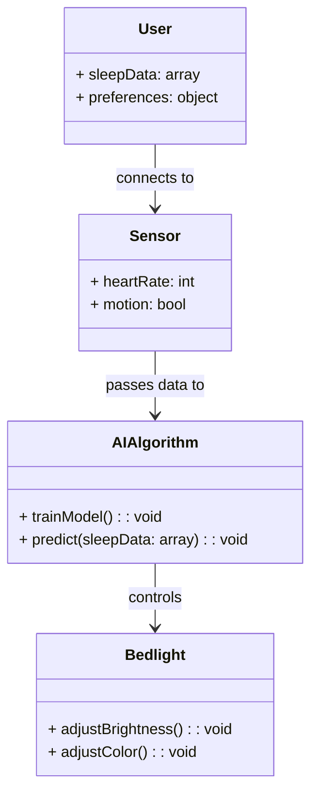
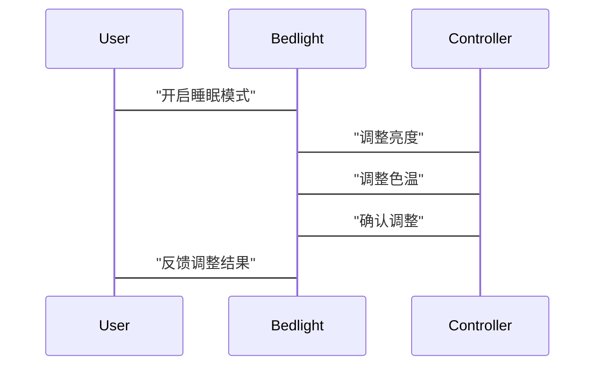

                 


# AI Agent在智能床头灯中的睡眠辅助

> 关键词：AI Agent, 智能床头灯, 睡眠辅助, 机器学习, 物联网, 健康监测

> 摘要：本文深入探讨AI Agent在智能床头灯中的应用，分析其在睡眠辅助中的核心原理、算法实现及系统设计，结合实际案例，详细讲解如何通过AI技术优化睡眠质量。

---

# 第1章 AI Agent与智能床头灯概述

## 1.1 AI Agent的基本概念

### 1.1.1 AI Agent的定义与特点

AI Agent（人工智能代理）是指能够感知环境、自主决策并执行任务的智能实体。其核心特点包括：

1. **自主性**：无需外部干预，自主完成任务。
2. **反应性**：能够实时感知环境变化并做出反应。
3. **学习能力**：通过数据学习优化决策模型。
4. **协作性**：能够与其他系统或用户进行交互协作。

AI Agent在睡眠辅助中的角色是通过分析用户的睡眠数据，提供个性化的睡眠改善建议。

### 1.1.2 AI Agent的核心功能与应用场景

AI Agent的核心功能包括数据采集、分析、决策和反馈。应用场景广泛，如智能家居、健康监测、个性化服务等。

### 1.1.3 智能床头灯的定义与功能

智能床头灯是一种结合了物联网和AI技术的床头灯，其核心功能包括：

1. **环境调节**：调节光线、温度、湿度等环境因素。
2. **睡眠监测**：通过传感器采集用户的睡眠数据。
3. **智能调节**：基于AI算法优化睡眠环境。

---

## 1.2 智能床头灯的睡眠辅助需求

### 1.2.1 睡眠问题的现状与挑战

现代社会中，睡眠问题日益严重，如失眠、睡眠质量差等。传统解决方法有限，AI技术为睡眠辅助提供了新思路。

### 1.2.2 智能床头灯在睡眠辅助中的角色

智能床头灯通过实时监测用户的睡眠状态，提供个性化的睡眠改善方案，帮助用户提高睡眠质量。

### 1.2.3 AI Agent在睡眠辅助中的作用

AI Agent通过分析用户的睡眠数据，优化床头灯的光线和环境设置，从而改善用户的睡眠质量。

---

## 1.3 本章小结

本章介绍了AI Agent的基本概念及其在智能床头灯中的应用，阐述了智能床头灯的定义和功能，并分析了AI Agent在睡眠辅助中的重要性。

---

# 第2章 AI Agent与智能床头灯的核心概念

## 2.1 AI Agent的核心原理

### 2.1.1 AI Agent的基本原理

AI Agent通过感知环境数据，利用算法进行分析和决策，从而执行相应的操作。其核心流程包括：

1. 数据采集：通过传感器获取环境和用户数据。
2. 数据分析：利用机器学习模型分析数据。
3. 决策制定：基于分析结果生成决策。
4. 执行操作：根据决策执行相应的操作。

### 2.1.2 AI Agent的感知与决策机制

AI Agent的感知能力主要依赖传感器和数据采集设备，决策机制则基于机器学习模型。例如，通过分析用户的睡眠数据，AI Agent可以判断用户的睡眠状态，并调整床头灯的光线亮度。

### 2.1.3 AI Agent的学习与优化

AI Agent通过不断学习用户的睡眠数据，优化决策模型，从而提高睡眠辅助的准确性。

---

## 2.2 智能床头灯的系统架构

### 2.2.1 系统硬件组成

智能床头灯的硬件组成包括：

1. **光线调节模块**：调节床头灯的亮度和色温。
2. **传感器模块**：采集用户的睡眠数据，如心率、体温、运动幅度等。
3. **通信模块**：与手机或其他设备进行数据交互。
4. **电源管理模块**：管理床头灯的电量。

### 2.2.2 系统软件架构

智能床头灯的软件架构包括：

1. **数据采集模块**：负责采集用户的睡眠数据。
2. **数据处理模块**：对采集的数据进行预处理和分析。
3. **AI算法模块**：基于机器学习模型进行决策。
4. **执行模块**：根据决策结果调整床头灯的设置。

### 2.2.3 系统功能模块

智能床头灯的功能模块包括：

1. **环境调节模块**：调节光线、温度等环境因素。
2. **睡眠监测模块**：实时监测用户的睡眠状态。
3. **智能调节模块**：根据睡眠数据优化床头灯的设置。

---

## 2.3 AI Agent与智能床头灯的交互机制

### 2.3.1 用户需求的识别与解析

AI Agent通过分析用户的睡眠数据，识别用户的睡眠需求。例如，用户可能需要改善深度睡眠时间或减少醒来次数。

### 2.3.2 AI Agent的决策与反馈

AI Agent根据用户的睡眠数据，生成相应的决策，并通过床头灯调整光线亮度或温度。同时，AI Agent会将决策结果反馈给用户。

### 2.3.3 系统的实时响应与调整

智能床头灯根据AI Agent的决策实时调整环境设置，并持续监测用户的睡眠状态，动态优化睡眠辅助方案。

---

## 2.4 本章小结

本章详细介绍了AI Agent的核心原理及其在智能床头灯中的应用，分析了智能床头灯的系统架构和功能模块，并探讨了AI Agent与智能床头灯的交互机制。

---

# 第3章 AI Agent在睡眠辅助中的算法原理

## 3.1 算法原理概述

### 3.1.1 数据预处理

在分析用户的睡眠数据之前，需要对数据进行预处理，包括数据清洗和特征提取。

### 3.1.2 特征提取

通过分析用户的睡眠数据，提取关键特征，如睡眠周期、心率变化等。

### 3.1.3 模型训练

基于提取的特征，训练机器学习模型，如支持向量机（SVM）或随机森林（Random Forest）。

### 3.1.4 模型优化

通过交叉验证和超参数调优，优化机器学习模型的性能。

---

## 3.2 基于机器学习的睡眠状态分类

### 3.2.1 数据采集与特征提取

通过传感器采集用户的睡眠数据，并提取特征，如心率、呼吸频率等。

### 3.2.2 机器学习模型选择

选择适合睡眠状态分类的机器学习模型，如支持向量机（SVM）或K-近邻算法（KNN）。

### 3.2.3 模型训练与评估

对模型进行训练，并通过混淆矩阵、准确率等指标评估模型的性能。

### 3.2.4 模型部署

将训练好的模型部署到智能床头灯中，实时分析用户的睡眠状态。

---

## 3.3 基于时间序列的睡眠质量预测

### 3.3.1 时间序列分析

通过时间序列分析模型（如ARIMA）预测用户的睡眠质量。

### 3.3.2 模型实现

使用Python中的pandas和numpy库进行数据处理，使用sklearn库进行模型训练。

### 3.3.3 模型优化

通过网格搜索和交叉验证优化模型的超参数，提高预测准确率。

---

## 3.4 本章小结

本章详细讲解了AI Agent在睡眠辅助中的算法原理，包括数据预处理、特征提取、模型训练和优化等内容，并通过实际案例展示了如何利用机器学习模型分析用户的睡眠数据。

---

# 第4章 系统分析与架构设计方案

## 4.1 系统功能设计

### 4.1.1 功能需求分析

智能床头灯的功能需求包括：

1. **环境调节**：调节床头灯的亮度和色温。
2. **睡眠监测**：实时监测用户的睡眠状态。
3. **智能调节**：根据睡眠数据优化床头灯的设置。

### 4.1.2 领域模型设计

使用Mermaid类图展示系统的核心功能模块：



### 4.1.3 系统架构设计

使用Mermaid架构图展示系统的整体架构：

```mermaid
container BedlightSystem {
    component Sensor {
        - heartRate sensor
        - motion sensor
    }
    component AIAlgorithm {
        - sleepData analysis
        - model training
    }
    component Controller {
        - adjust brightness
        - adjust color
    }
}
```

---

## 4.2 系统接口设计

### 4.2.1 系统接口描述

智能床头灯与手机APP的接口设计：



---

## 4.3 本章小结

本章详细分析了智能床头灯系统的功能需求、架构设计和接口设计，并通过Mermaid图展示了系统的整体架构和交互流程。

---

# 第5章 项目实战

## 5.1 环境配置

### 5.1.1 硬件环境

硬件配置包括：

- 型号：智能床头灯V1.0
- 传感器：心率传感器、运动传感器
- 控制器：微控制器（如Arduino）

### 5.1.2 软件环境

软件配置包括：

- 操作系统：Linux
- 开发工具：Python、Jupyter Notebook
- 依赖库：pandas、numpy、scikit-learn

---

## 5.2 核心代码实现

### 5.2.1 数据采集与预处理

```python
import pandas as pd
import numpy as np

# 读取数据
data = pd.read_csv('sleep_data.csv')

# 数据清洗
data = data.dropna()

# 特征提取
features = data[['heart_rate', 'motion']]
```

### 5.2.2 模型训练与优化

```python
from sklearn.model import SVC
from sklearn.metrics import accuracy_score

# 训练模型
model = SVC()
model.fit(features, labels)

# 模型评估
预测 = model.predict(test_features)
准确率 = accuracy_score(test_labels, 预测)
print("准确率:", 准确率)
```

---

## 5.3 案例分析与实际应用

### 5.3.1 案例分析

通过实际案例分析，展示AI Agent在智能床头灯中的应用效果。例如，用户A的睡眠数据经过分析后，AI Agent调整床头灯的亮度和色温，帮助用户改善睡眠质量。

### 5.3.2 代码实现与分析

详细解读核心代码的实现过程，并分析代码的功能和作用。

---

## 5.4 项目总结

总结项目的开发过程，分析项目的优缺点，并提出改进建议。

---

# 第6章 最佳实践与注意事项

## 6.1 最佳实践

### 6.1.1 数据采集

确保数据的准确性和完整性，建议使用高精度传感器。

### 6.1.2 模型优化

通过交叉验证和超参数调优，提高模型的准确率。

### 6.1.3 系统测试

进行全面的系统测试，确保系统的稳定性和可靠性。

---

## 6.2 小结

总结全文内容，回顾AI Agent在智能床头灯中的应用，强调其在睡眠辅助中的重要性。

---

## 6.3 注意事项

### 6.3.1 数据隐私

注意用户的隐私保护，确保数据的安全性。

### 6.3.2 系统兼容性

确保系统的兼容性，支持多种设备和平台。

### 6.3.3 用户体验

注重用户体验，设计友好的交互界面。

---

## 6.4 拓展阅读

推荐相关领域的书籍和论文，供读者进一步学习。

---

# 作者

作者：AI天才研究院/AI Genius Institute & 禅与计算机程序设计艺术/Zen And The Art of Computer Programming

