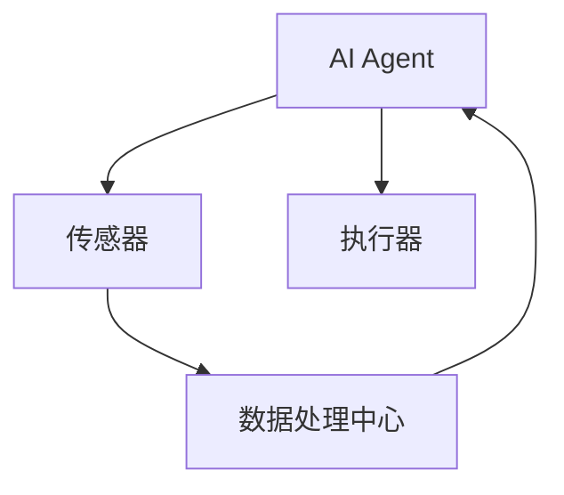
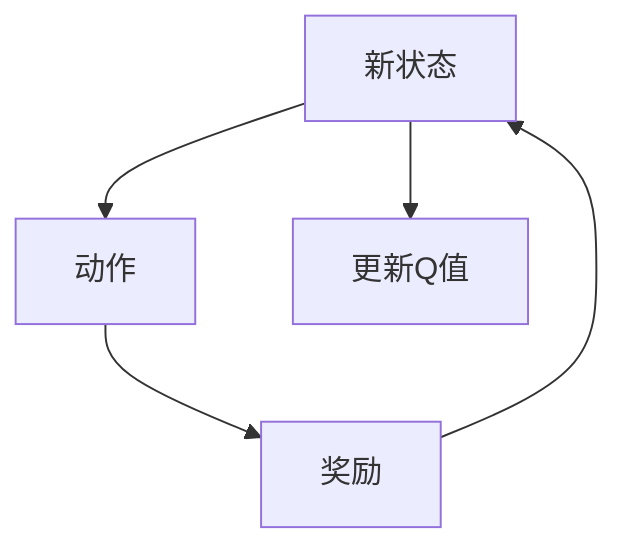
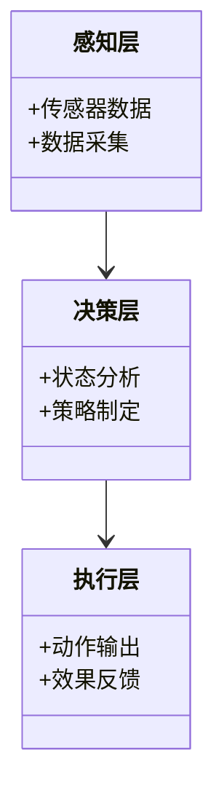
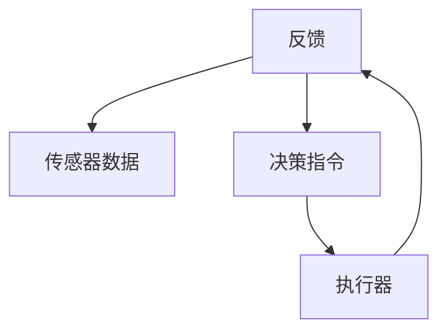
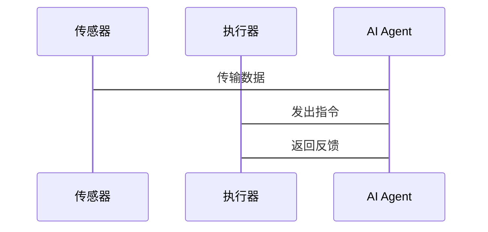

                 


# AI Agent在智能废水处理中的实践

> **关键词**: AI Agent, 智能废水处理, 人工智能, 强化学习, 废水处理系统

> **摘要**: 本文详细探讨了AI Agent在智能废水处理中的应用，从背景、算法原理到系统架构和项目实战，结合数学模型和实际案例，分析了AI Agent在废水处理中的优势与挑战，为废水处理的智能化提供了新的思路。

---

# 第1章 废水处理的现状与挑战

## 1.1 废水处理的基本概念

### 1.1.1 废水的定义与分类

废水是指在工业生产、生活活动中产生的被污染的水，根据来源可分为生活污水、工业废水和雨水径流等。工业废水是其中的主要组成部分，含有重金属、有机物等多种污染物。

### 1.1.2 废水处理的基本流程

废水处理通常包括物理处理、化学处理和生物处理三个阶段。物理处理主要是过滤和沉淀，化学处理通过化学反应去除污染物，生物处理利用微生物分解有机物。

### 1.1.3 废水处理的环境与经济意义

废水处理是环境保护的重要环节，能够防止水体污染，保护生态环境，同时减少资源浪费，具有显著的环境和经济价值。

## 1.2 AI Agent的基本概念

### 1.2.1 人工智能与智能体的基本定义

人工智能（AI）是模拟人类智能的技术，智能体（Agent）是指能够感知环境并采取行动以实现目标的实体。

### 1.2.2 AI Agent的核心特征

AI Agent具备自主性、反应性、目标导向和社会能力，能够在动态环境中自主决策和行动。

### 1.2.3 AI Agent与传统自动化系统的区别

AI Agent能够主动适应环境变化，而传统自动化系统仅能按照预设程序运行。

## 1.3 AI Agent在废水处理中的技术优势

### 1.3.1 提高处理效率

AI Agent能够实时优化处理流程，提高效率。

### 1.3.2 实现智能优化

通过强化学习优化处理策略，降低处理成本。

### 1.3.3 支持实时决策

AI Agent能够实时分析数据，快速做出决策。

## 1.4 应用前景与研究现状

### 1.4.1 国内外研究进展

AI技术在废水处理中的研究逐渐增多，但实际应用仍处于起步阶段。

### 1.4.2 当前技术瓶颈与未来发展方向

数据不足和模型泛化能力是当前瓶颈，未来发展方向包括多智能体协同优化和边缘计算。

---

# 第2章 AI Agent与废水处理的结合原理

## 2.1 AI Agent的基本工作原理

### 2.1.1 感知层: 数据采集与特征提取

通过传感器收集数据，提取特征信息。

### 2.1.2 决策层: 状态分析与策略制定

分析当前状态，制定处理策略。

### 2.1.3 执行层: 动作输出与效果反馈

输出控制指令，反馈处理结果。

## 2.2 废水处理系统的核心要素

### 2.2.1 污染物种类与浓度

不同污染物需要不同的处理方法。

### 2.2.2 处理设备与工艺

设备和工艺的选择影响处理效果。

### 2.2.3 处理目标与约束条件

目标通常是达到排放标准，约束条件包括成本和时间。

## 2.3 AI Agent在废水处理中的系统架构

### 2.3.1 系统整体架构图



### 2.3.2 各模块的功能与交互关系

AI Agent与传感器、执行器和数据处理中心交互，实时调整处理策略。

### 2.3.3 系统的灵活性与可扩展性

系统架构设计具备灵活性，可扩展性强。

## 2.4 本章小结

AI Agent通过实时感知和决策优化，显著提升废水处理效率。

---

# 第3章 AI Agent的核心算法原理

## 3.1 强化学习算法

### 3.1.1 Q-learning算法原理

Q-learning是一种基于价值的强化学习算法，通过经验不断更新Q值表。

### 3.1.2 算法流程图



### 3.1.3 废水处理中的应用案例

代码实现Q-learning算法，用于优化处理流程。

## 3.2 监督学习算法

### 3.2.1 回归与分类算法

监督学习通过标记数据训练模型，预测处理效果。

### 3.2.2 算法实现步骤

收集数据、训练模型、评估性能。

## 3.3 算法对比与选择策略

### 3.3.1 不同算法的优缺点对比

强化学习适合动态环境，监督学习适合数据充足的情况。

### 3.3.2 废水处理场景下的算法选择

根据场景特点选择合适的算法。

## 3.4 本章小结

强化学习和监督学习各有优劣，需根据实际场景选择。

---

# 第4章 废水处理系统的数学模型与公式

## 4.1 废水处理的数学模型

建立数学模型描述处理过程。

## 4.2 算法数学公式

Q-learning的目标函数：

$$ Q(s,a) = Q(s,a) + \alpha (r + \gamma \max Q(s',a) - Q(s,a)) $$

---

# 第5章 系统分析与架构设计方案

## 5.1 问题场景介绍

工业园区废水处理场景。

## 5.2 系统功能设计

领域模型类图：



## 5.3 系统架构设计

系统架构图：



## 5.4 系统交互设计

交互序列图：



---

# 第6章 系统实现与项目实战

## 6.1 环境安装

安装Python、TensorFlow等工具。

## 6.2 核心代码实现

### 6.2.1 数据预处理

```python
import pandas as pd
data = pd.read_csv('waste_water.csv')
```

### 6.2.2 模型训练

```python
model = Sequential()
model.add(Dense(64, activation='relu'))
model.add(Dense(1, activation='sigmoid'))
model.compile(optimizer='adam', loss='binary_crossentropy', metrics=['accuracy'])
model.fit(X_train, y_train, epochs=10, batch_size=32)
```

### 6.2.3 结果展示

```python
print("训练完成")
```

## 6.3 代码解读与分析

详细解读每部分代码功能。

## 6.4 废水处理系统实现

设计并实现完整的废水处理系统。

## 6.5 实际案例分析

分析具体案例，展示处理效果。

## 6.6 本章小结

项目实现验证了AI Agent的有效性。

---

# 第7章 系统优化与实际应用

## 7.1 系统优化

分析系统不足，提出优化方向。

## 7.2 废水处理中的注意事项

数据质量、模型泛化能力等。

## 7.3 本章小结

总结优化措施和应用注意事项。

---

# 第8章 未来发展方向

## 8.1 新技术对AI Agent的推动

边缘计算和区块链技术的应用潜力。

## 8.2 废水处理领域的未来研究方向

多智能体协同优化和边缘计算结合。

## 8.3 本章小结

展望AI Agent在废水处理中的未来应用。

---

# 第9章 结论与参考文献

## 9.1 结论

AI Agent在废水处理中的应用前景广阔，但需解决技术难点。

## 9.2 参考文献

列出相关文献和资料。

---

# 作者

作者：AI天才研究院 & 禅与计算机程序设计艺术

---

通过以上结构，文章详细介绍了AI Agent在废水处理中的应用，从理论到实践，为废水处理的智能化提供了参考。

