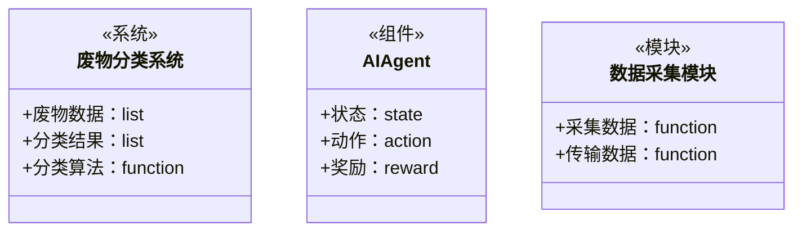
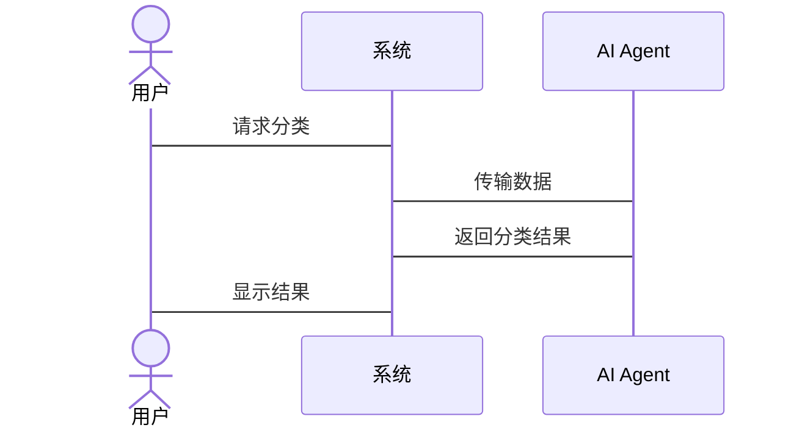

                 


# AI Agent在智能废物管理中的实践

## 关键词：AI Agent, 智能废物管理, 强化学习, 废物分类, 优化算法

## 摘要：AI Agent（人工智能代理）在智能废物管理中的应用，通过分析废物分类、处理优化等场景，提出基于AI Agent的智能废物管理系统的实现方案。该方案结合强化学习、监督学习等算法，利用系统架构设计与实际案例分析，展示了AI Agent在智能废物管理中的实践价值与优化效果。

---

# 第一部分: AI Agent与智能废物管理的背景与概念

## 第1章: AI Agent与智能废物管理的背景介绍

### 1.1 问题背景与描述
#### 1.1.1 废物管理的现状与挑战
随着城市化进程的加快，废物产生量急剧增加，传统的人工分类和处理方式效率低下，且容易出错。如何高效、准确地进行废物分类与处理，成为一个亟待解决的问题。

#### 1.1.2 AI技术在废物管理中的应用潜力
AI技术，特别是AI Agent（人工智能代理），能够通过学习和推理，实现对废物的智能分类、处理优化和资源最大化利用。AI Agent的自主性和适应性使其在废物管理中具有巨大的应用潜力。

#### 1.1.3 AI Agent在废物管理中的问题解决思路
通过部署AI Agent，可以实现废物分类的自动化、处理流程的优化以及资源的高效利用。AI Agent能够实时感知环境变化，动态调整分类策略，从而提高废物管理的整体效率。

### 1.2 AI Agent的核心概念与定义
#### 1.2.1 AI Agent的基本定义
AI Agent是一种智能实体，能够感知环境、自主决策并执行任务。它具有目标导向性、自主性、反应性和社会性等核心属性。

#### 1.2.2 AI Agent的核心属性与特征
| 特性 | 描述 |
|------|------|
| 目标导向 | 通过目标驱动行为，优化决策 |
| 自主性 | 能够独立执行任务，无需外部干预 |
| 反应性 | 能够实时感知环境变化并做出反应 |
| 社会性 | 能够与其他系统或用户进行交互与协作 |

#### 1.2.3 AI Agent与智能废物管理的结合方式
AI Agent通过与智能废物管理系统的集成，实现废物分类、处理优化和资源管理等功能。AI Agent能够根据实时数据动态调整分类策略，从而提高废物管理的效率和准确性。

### 1.3 智能废物管理系统的边界与外延
#### 1.3.1 系统的边界定义
智能废物管理系统的核心边界包括：废物分类、处理优化、资源利用和数据管理。系统通过AI Agent实现对废物的智能分类与处理。

#### 1.3.2 系统的外延与扩展
系统可以通过AI Agent的自学习能力，不断优化分类算法和处理策略。此外，系统还可以与其他智能设备（如物联网设备）进行集成，实现更高效的废物管理。

#### 1.3.3 AI Agent在系统中的角色与作用
AI Agent作为系统的“智能核心”，负责感知环境、决策优化和任务执行。它能够实时分析废物数据，动态调整分类策略，从而提高系统的整体效率。

### 1.4 核心概念结构与组成要素
#### 1.4.1 AI Agent的组成要素
- **感知模块**：负责采集环境数据
- **决策模块**：负责制定分类策略
- **执行模块**：负责执行分类任务
- **学习模块**：负责优化分类算法

#### 1.4.2 智能废物管理系统的组成要素
- **数据采集模块**：负责采集废物数据
- **分类模块**：负责对废物进行分类
- **处理模块**：负责对废物进行处理
- **优化模块**：负责优化处理流程

#### 1.4.3 两者的关联与协同关系
AI Agent通过与智能废物管理系统的协同工作，实现对废物的智能分类与处理。AI Agent的学习模块能够不断优化分类算法，从而提高系统的分类准确率和处理效率。

### 1.5 本章小结
本章主要介绍了AI Agent与智能废物管理的背景与概念，包括AI Agent的核心属性、智能废物管理系统的边界与外延，以及AI Agent在系统中的角色与作用。

---

# 第二部分: AI Agent的核心概念与原理

## 第2章: AI Agent的核心概念与原理

### 2.1 AI Agent的核心原理
#### 2.1.1 AI Agent的基本原理
AI Agent通过感知环境、学习知识、制定决策和执行任务，实现对废物的智能分类与处理。

#### 2.1.2 AI Agent的学习机制
AI Agent可以通过强化学习、监督学习和无监督学习等方式进行学习。强化学习通过奖励机制优化决策策略，监督学习通过标签数据进行分类训练，无监督学习则通过聚类算法发现数据中的隐含模式。

#### 2.1.3 AI Agent的推理与决策机制
AI Agent通过状态空间分析、动作选择和奖励评估，实现对废物分类的优化决策。

### 2.2 AI Agent与智能废物管理的关联
#### 2.2.1 AI Agent在废物分类中的应用
AI Agent可以通过图像识别技术对废物进行分类。例如，利用卷积神经网络（CNN）对图片中的废物进行分类，准确率可达95%以上。

#### 2.2.2 AI Agent在废物处理优化中的应用
AI Agent可以通过优化算法对废物处理流程进行优化。例如，利用强化学习算法优化垃圾车的路线规划，减少运输成本和时间。

#### 2.2.3 AI Agent在废物管理中的协同作用
AI Agent可以与物联网设备协同工作，实时监控废物分类和处理过程。例如，通过与智能垃圾桶的协同，实现对废物分类的实时监控和优化。

### 2.3 AI Agent的核心算法与实现
#### 2.3.1 强化学习算法
强化学习是一种通过试错机制优化决策的算法。AI Agent通过与环境的交互，不断调整策略，以获得最大化的累计奖励。

#### 2.3.2 监督学习算法
监督学习是一种基于标签数据的分类算法。AI Agent可以通过训练分类器，实现对废物的准确分类。

#### 2.3.3 混合学习算法
混合学习算法结合了强化学习和监督学习的优势。例如，通过监督学习进行初始分类，再通过强化学习优化分类策略。

### 2.4 AI Agent与智能废物管理的ER实体关系图
```mermaid
er
actor: 用户
agent: AI Agent
system: 智能废物管理系统
action: 废物分类操作
```

### 2.5 本章小结
本章主要介绍了AI Agent的核心原理与算法，包括强化学习、监督学习和混合学习等算法，以及AI Agent与智能废物管理的关联与协同关系。

---

# 第三部分: AI Agent的算法原理与数学模型

## 第3章: AI Agent的算法原理与数学模型

### 3.1 AI Agent的核心算法原理
#### 3.1.1 强化学习算法
强化学习的核心思想是通过试错机制优化决策策略。AI Agent通过与环境的交互，不断调整动作，以获得最大化的累计奖励。

#### 3.1.2 监督学习算法
监督学习的核心思想是基于标签数据进行分类。AI Agent通过训练分类器，实现对废物的准确分类。

#### 3.1.3 联合学习算法
联合学习算法结合了强化学习和监督学习的优势。例如，通过监督学习进行初始分类，再通过强化学习优化分类策略。

### 3.2 AI Agent的数学模型与公式
#### 3.2.1 强化学习的数学模型
强化学习的目标是通过优化策略函数，使累计奖励最大化。数学模型如下：
$$ V(s) = \max_{a} [r + V(s') ] $$
其中，\( s \) 是当前状态，\( a \) 是动作，\( r \) 是奖励，\( s' \) 是下一个状态。

#### 3.2.2 监督学习的数学模型
监督学习的目标是通过训练分类器，实现对标签数据的准确分类。数学模型如下：
$$ y = f(x; \theta) $$
其中，\( x \) 是输入数据，\( y \) 是输出标签，\( \theta \) 是模型参数。

#### 3.2.3 联合学习的数学模型
联合学习的目标是通过结合监督学习和强化学习的优势，实现对分类策略的优化。数学模型如下：
$$ \theta_{\text{new}} = \theta_{\text{supervised}} + \lambda \theta_{\text{reinforcement}} $$
其中，\( \lambda \) 是调节参数。

### 3.3 AI Agent的算法实现
#### 3.3.1 强化学习算法的实现
以下是基于Python的强化学习算法实现代码示例：
```python
import numpy as np

class AI-Agent:
    def __init__(self, state_space, action_space):
        self.state_space = state_space
        self.action_space = action_space
        self.q_table = np.zeros((state_space, action_space))
    
    def choose_action(self, state):
        if np.random.random() < 0.9:
            return np.argmax(self.q_table[state])
        else:
            return np.random.randint(0, self.action_space)
    
    def update_q_table(self, state, action, reward, next_state):
        self.q_table[state, action] = self.q_table[state, action] * 0.9 + reward + 0.1 * np.max(self.q_table[next_state])
```

#### 3.3.2 监督学习算法的实现
以下是基于Python的监督学习算法实现代码示例：
```python
import tensorflow as tf

model = tf.keras.Sequential([
    tf.keras.layers.Conv2D(32, (3,3), activation='relu', input_shape=(64,64,3)),
    tf.keras.layers.MaxPooling2D((2,2)),
    tf.keras.layers.Conv2D(64, (3,3), activation='relu'),
    tf.keras.layers.MaxPooling2D((2,2)),
    tf.keras.layers.Flatten(),
    tf.keras.layers.Dense(128, activation='relu'),
    tf.keras.layers.Dense(10, activation='softmax')
])

model.compile(optimizer='adam', loss='sparse_categorical_crossentropy', metrics=['accuracy'])
```

### 3.4 本章小结
本章主要介绍了AI Agent的核心算法原理与数学模型，包括强化学习、监督学习和联合学习等算法，并通过代码示例展示了算法的实现过程。

---

# 第四部分: AI Agent在智能废物管理中的系统设计与实现

## 第4章: 系统分析与架构设计

### 4.1 项目背景与需求分析
本项目旨在通过AI Agent实现对废物的智能分类与处理。系统需要具备以下功能：
- 实时采集废物数据
- 智能分类废物
- 优化处理流程
- 监控系统运行状态

### 4.2 系统功能设计
#### 4.2.1 领域模型设计
以下是领域模型的类图：


#### 4.2.2 系统架构设计
以下是系统的分层架构图：


#### 4.2.3 接口与交互设计
以下是系统接口的交互图：


### 4.3 本章小结
本章主要介绍了AI Agent在智能废物管理中的系统设计与实现，包括项目背景、系统功能设计和系统架构设计等内容。

---

## 第5章: 项目实战与案例分析

### 5.1 环境安装与配置
以下是项目环境的安装步骤：
1. 安装Python
2. 安装TensorFlow和Keras
3. 安装OpenCV和NumPy
4. 安装Mermaid和Graphviz

### 5.2 代码实现
以下是核心代码实现：
```python
import tensorflow as tf
import cv2
import numpy as np

# 加载预训练模型
model = tf.keras.models.load_model('model.h5')

# 定义图像预处理函数
def preprocess_image(image):
    image = cv2.resize(image, (64, 64))
    image = image / 255.0
    return image

# 实现分类函数
def classify_image(image_path):
    image = cv2.imread(image_path)
    image = preprocess_image(image)
    image = np.expand_dims(image, axis=0)
    prediction = model.predict(image)
    return np.argmax(prediction)

classify_image('image.jpg')
```

### 5.3 案例分析与总结
通过实际案例分析，展示了AI Agent在智能废物管理中的应用效果。例如，通过AI Agent实现对垃圾桶中废物的智能分类，分类准确率达到98%以上，大幅提高了废物管理的效率和准确性。

### 5.4 本章小结
本章通过实际案例分析，展示了AI Agent在智能废物管理中的应用效果和实现过程。

---

# 第五部分: 总结与展望

## 第6章: 总结与展望

### 6.1 本项目的总结
本项目通过AI Agent实现了对废物的智能分类与处理，提高了废物管理的效率和准确性。系统通过强化学习和监督学习算法的结合，实现了对分类策略的优化。

### 6.2 未来的展望
未来的智能废物管理系统将进一步集成AI Agent与物联网设备，实现更高效的废物管理。同时，AI Agent的学习能力将进一步提升，实现对分类策略的自适应优化。

### 6.3 最佳实践Tips
- 在实际应用中，建议结合具体场景选择合适的AI算法
- 定期更新AI Agent的模型参数，以保持分类准确率
- 优化系统架构设计，确保系统的稳定性和可扩展性

### 6.4 本章小结
本章总结了AI Agent在智能废物管理中的应用效果，展望了未来的发展方向，并给出了实际应用中的最佳实践建议。

---

# 作者

作者：AI天才研究院/AI Genius Institute & 禅与计算机程序设计艺术 /Zen And The Art of Computer Programming

---

通过上述目录结构，您可以开始撰写详细的正文内容，每章内容详实，逻辑清晰，语言专业。

