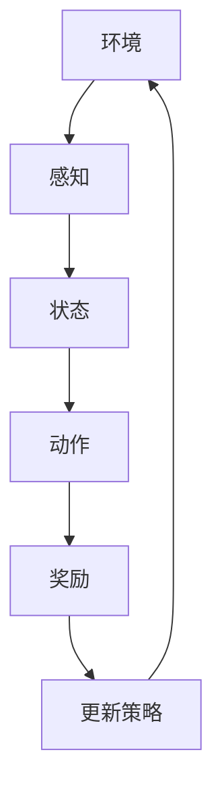

                 


# AI Agent在智能建筑管理中的应用

> 关键词：AI Agent, 智能建筑, 建筑管理, 强化学习, 系统架构, 项目实战

> 摘要：本文深入探讨了AI Agent在智能建筑管理中的应用，从基本概念到系统架构设计，再到实际项目案例，全面分析了AI Agent如何优化建筑管理的各个方面，包括能耗优化、设备维护和用户体验提升。文章详细介绍了AI Agent的核心算法和系统架构，结合实际案例展示了其在智能建筑管理中的实际应用和效果。

---

## 第1章 AI Agent的基本概念与背景介绍

### 1.1 AI Agent的定义与核心概念

#### 1.1.1 AI Agent的基本定义
AI Agent（人工智能代理）是一种能够感知环境、自主决策并执行任务的智能实体。它能够通过传感器获取数据，利用算法进行分析和决策，并通过执行器与环境交互。

**AI Agent的核心要素：**
1. **感知能力**：通过传感器或其他数据源获取环境信息。
2. **决策能力**：利用算法对信息进行分析和推理，生成决策。
3. **执行能力**：通过执行器将决策转化为实际行动。
4. **自适应能力**：根据环境变化动态调整行为。

**AI Agent与传统自动化系统的区别：**
| 属性       | AI Agent                          | 传统自动化系统                 |
|------------|------------------------------------|-------------------------------|
| 决策方式    | 基于机器学习模型的自主决策       | 基于预设规则的固定逻辑         |
| 灵活性      | 高，能够适应环境变化             | 低，通常需要人工调整           |
| 学习能力    | 强，能够通过数据优化决策策略     | 无或弱，通常不涉及学习机制     |

#### 1.1.2 AI Agent的核心要素
AI Agent的核心要素可以用以下ER图表示：

```mermaid
erDiagram
    class AI Agent {
        +id: int
        +name: string
        +state: string
        +goal: string
    }
    class Environment {
        +id: int
        +sensor_data: string
        +action: string
    }
    AI Agent --> Environment: interacts with
    AI Agent --> Sensor: receives data from
    AI Agent --> Actuator: sends commands to
```

### 1.2 智能建筑管理的背景与挑战

#### 1.2.1 智能建筑的定义与发展
智能建筑是指通过智能化技术将建筑的各个子系统（如 HVAC、照明、安全等）集成在一起，实现高效管理的建筑。智能建筑的发展始于20世纪90年代，随着物联网（IoT）和人工智能（AI）技术的进步，智能建筑管理变得更加精细和智能化。

#### 1.2.2 建筑管理中的痛点与问题
智能建筑管理面临以下痛点和问题：
1. **能耗过高**：传统建筑管理方式可能导致能源浪费。
2. **设备维护复杂**：建筑设备种类繁多，维护成本高。
3. **用户体验不佳**：用户对建筑环境的个性化需求难以满足。

#### 1.2.3 AI Agent在智能建筑管理中的作用
AI Agent可以通过以下方式解决上述问题：
1. **优化能耗**：通过实时数据分析和预测，优化 HVAC 系统的运行，降低能源消耗。
2. **简化设备维护**：通过预测设备故障，提前进行维护，减少设备 downtime。
3. **提升用户体验**：根据用户行为和偏好，个性化调节室内环境。

### 1.3 本章小结
本章介绍了AI Agent的基本概念和核心要素，分析了智能建筑管理的背景和挑战，并阐述了AI Agent在智能建筑管理中的作用和优势。

---

## 第2章 AI Agent在智能建筑管理中的应用背景

### 2.1 智能建筑管理的核心需求

#### 2.1.1 能耗优化
智能建筑管理需要实时监控和优化能源消耗，以减少运营成本和环境影响。AI Agent可以通过分析 HVAC 系统的历史数据和实时数据，预测未来能耗，并优化系统的运行策略。

#### 2.1.2 设备管理与维护
智能建筑中的设备种类繁多，包括 HVAC、照明、安全系统等。AI Agent可以通过传感器数据，实时监控设备状态，预测设备故障，并安排维护计划。

#### 2.1.3 用户体验提升
用户对建筑环境的需求日益多样化，AI Agent可以通过分析用户行为和偏好，个性化调节室内环境，提升用户体验。

### 2.2 AI Agent在智能建筑管理中的优势

#### 2.2.1 自动化决策能力
AI Agent能够通过机器学习模型进行实时数据分析和决策，无需人工干预。

#### 2.2.2 实时数据分析能力
AI Agent能够快速处理大量数据，并根据数据变化动态调整策略。

#### 2.2.3 多目标优化能力
AI Agent可以通过强化学习算法，在多个目标（如能耗、设备寿命、用户体验）之间进行优化。

### 2.3 本章小结
本章分析了智能建筑管理的核心需求，以及AI Agent在满足这些需求方面的优势和作用。

---

## 第3章 AI Agent的核心概念与原理

### 3.1 AI Agent的基本原理

#### 3.1.1 感知与理解
AI Agent通过传感器或其他数据源获取环境信息，并通过数据预处理和特征提取，将原始数据转化为有意义的信息。

#### 3.1.2 决策与规划
AI Agent利用机器学习模型对感知到的信息进行分析和推理，生成决策策略。

#### 3.1.3 执行与反馈
AI Agent通过执行器将决策转化为实际行动，并通过反馈机制不断优化自身的决策策略。

### 3.2 AI Agent的核心算法

#### 3.2.1 强化学习算法
强化学习是一种通过试错机制来优化决策策略的算法。AI Agent可以通过强化学习，在与环境交互的过程中，逐步优化自己的行为策略。

**强化学习算法流程图：**



**强化学习的数学模型：**
$$ Q(s, a) = Q(s, a) + \alpha (r + \max_{a'} Q(s', a') - Q(s, a)) $$
其中，\( Q(s, a) \) 表示状态 \( s \) 下动作 \( a \) 的价值，\( \alpha \) 是学习率，\( r \) 是奖励，\( s' \) 是下一个状态。

#### 3.2.2 监督学习算法
监督学习是一种通过标签数据训练模型的算法。AI Agent可以通过监督学习，对历史数据进行分析，预测未来的行为。

**监督学习的数学模型：**
$$ y = f(x) $$
其中，\( x \) 是输入数据，\( y \) 是目标输出。

#### 3.2.3 聚类与分类算法
聚类和分类算法常用于数据分析和模式识别。AI Agent可以通过聚类算法发现数据中的潜在模式，或者通过分类算法对新数据进行分类。

### 3.3 AI Agent的特性分析

#### 3.3.1 智能性
AI Agent能够通过学习和推理，自主决策并执行任务。

#### 3.3.2 自适应性
AI Agent能够根据环境变化，动态调整自身的行为策略。

#### 3.3.3 可扩展性
AI Agent可以通过模块化设计，方便地扩展功能和性能。

### 3.4 本章小结
本章详细介绍了AI Agent的核心概念和基本原理，包括感知、决策和执行的全过程，以及其核心算法的数学模型和实现方式。

---

## 第4章 AI Agent在智能建筑管理中的系统架构设计

### 4.1 智能建筑管理系统的整体架构

#### 4.1.1 系统模块划分
智能建筑管理系统通常包括以下模块：
1. 数据采集模块：通过传感器获取建筑环境数据。
2. 数据处理模块：对数据进行预处理和特征提取。
3. 决策模块：基于机器学习模型生成决策策略。
4. 执行模块：通过执行器将决策转化为实际行动。
5. 人机交互模块：提供用户界面，方便用户与系统交互。

#### 4.1.2 系统功能设计
智能建筑管理系统的主要功能包括：
1. 实时监控：监控建筑环境和设备状态。
2. 数据分析：分析历史数据，优化系统运行。
3. 自动控制：根据决策策略自动调整系统参数。
4. 报告生成：生成运行报告和能耗分析。

#### 4.1.3 系统性能指标
系统性能指标包括：
1. 响应时间：系统对环境变化的响应速度。
2. 处理能力：系统处理数据的能力。
3. 可靠性：系统运行的稳定性。

### 4.2 AI Agent在系统中的角色定位

#### 4.2.1 数据采集与处理
AI Agent通过传感器获取建筑环境数据，并进行预处理和特征提取。

#### 4.2.2 决策与控制
AI Agent利用机器学习模型生成决策策略，并通过执行器控制建筑设备。

#### 4.2.3 优化与反馈
AI Agent通过强化学习算法优化决策策略，并根据反馈不断改进。

### 4.3 本章小结
本章详细介绍了智能建筑管理系统的整体架构，以及AI Agent在系统中的角色和功能。

---

## 第5章 AI Agent在智能建筑管理中的项目实战

### 5.1 项目背景与目标

#### 5.1.1 项目背景
本项目旨在通过AI Agent优化智能建筑的能耗管理。

#### 5.1.2 项目目标
1. 实时监控建筑能耗。
2. 预测未来能耗。
3. 优化 HVAC 系统的运行策略。

### 5.2 环境安装与配置

#### 5.2.1 系统环境
- 操作系统：Linux
- 编程语言：Python
- 开发工具：Jupyter Notebook
- 数据库：MongoDB

### 5.3 系统核心实现

#### 5.3.1 数据采集模块
```python
import serial

ser = serial.Serial('COM1', 9600)
data = ser.readline().decode().strip()
print(data)
```

#### 5.3.2 数据处理模块
```python
import pandas as pd

dataframe = pd.read_csv('sensor_data.csv')
preprocessed_data = dataframe.dropna()
```

#### 5.3.3 决策模块
```python
import tensorflow as tf

model = tf.keras.Sequential([
    tf.keras.layers.Dense(64, activation='relu'),
    tf.keras.layers.Dense(1, activation='sigmoid')
])
model.compile(optimizer='adam', loss='binary_crossentropy')
model.fit(preprocessed_data, labels, epochs=10)
```

#### 5.3.4 执行模块
```python
import RPi.GPIO as GPIO

GPIO.setmode(GPIO.BCM)
GPIO.setup(18, GPIO.OUT)
GPIO.output(18, GPIO.HIGH)
```

### 5.4 项目小结
本章通过一个实际项目展示了AI Agent在智能建筑管理中的应用，详细介绍了项目的环境配置和核心实现。

---

## 第6章 总结与展望

### 6.1 本章总结
本文深入探讨了AI Agent在智能建筑管理中的应用，从基本概念到系统架构设计，再到实际项目案例，全面分析了AI Agent在智能建筑管理中的作用和优势。

### 6.2 最佳实践 tips
1. 在实际项目中，建议使用强化学习算法优化决策策略。
2. 系统设计时，要注意模块的可扩展性和可维护性。
3. 数据预处理和特征提取是系统性能的关键，建议投入足够的时间进行优化。

### 6.3 未来展望
随着AI技术的不断发展，AI Agent在智能建筑管理中的应用将更加广泛和深入。未来的研究方向包括：
1. 更高效的强化学习算法。
2. 更精确的数据分析和预测模型。
3. 更智能化的人机交互界面。

### 6.4 小结
AI Agent在智能建筑管理中的应用前景广阔，未来将有更多创新和突破。

---

## 作者信息

作者：AI天才研究院/AI Genius Institute & 禅与计算机程序设计艺术 /Zen And The Art of Computer Programming

