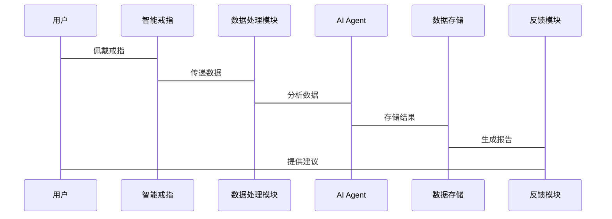

                 


# AI Agent在智能戒指中的日常活动追踪

> 关键词：AI Agent, 智能戒指, 日常活动追踪, 人工智能, 物联网, 数据分析, 机器学习

> 摘要：AI Agent在智能戒指中的日常活动追踪是一种创新的结合，通过AI技术实现对用户日常行为的智能分析与优化。本文将从问题背景、核心概念、算法原理、系统架构、项目实战等多方面详细阐述这一技术，最后给出最佳实践和总结。

## 目录

### 第一部分: AI Agent在智能戒指中的日常活动追踪概述

#### 第1章: 问题背景与需求分析

##### 1.1 问题背景

- 1.1.1 智能戒指的发展现状
  - 智能戒指作为可穿戴设备的一种，近年来在健康监测、智能交互等方面取得了显著进展。
  - 当前市场上的智能戒指主要集中在基本健康监测（如心率、体温）和基础交互功能（如通知提醒、手势控制）。
  
- 1.1.2 日常活动追踪的重要性
  - 日常活动追踪可以帮助用户了解自己的生活习惯，优化健康状态。
  - 通过持续的数据收集与分析，可以发现潜在的健康问题，提供个性化的建议。
  
- 1.1.3 AI Agent在智能戒指中的作用
  - AI Agent能够实时分析用户的活动数据，提供智能反馈和优化建议。
  - AI Agent可以学习用户的习惯，主动提供个性化服务。

##### 1.2 问题描述

- 1.2.1 智能戒指日常活动追踪的核心问题
  - 数据采集的准确性与实时性。
  - 用户行为的多样性和复杂性。
  - AI Agent的智能分析与决策能力。
  
- 1.2.2 用户需求与痛点分析
  - 用户希望获得更精准的日常活动分析。
  - 用户需要个性化的健康建议和行为优化方案。
  - 用户对数据隐私和安全性的担忧。
  
- 1.2.3 现有解决方案的局限性
  - 当前智能戒指缺乏深度的AI分析能力。
  - 数据分析结果不够个性化，缺乏针对性建议。
  - 用户界面不够友好，难以提供有效的反馈。

##### 1.3 问题解决思路

- 1.3.1 AI Agent的核心解决方案
  - 利用AI技术实时分析用户活动数据。
  - 提供个性化的行为优化建议。
  - 实现智能戒指与用户的无缝交互。
  
- 1.3.2 智能戒指与AI Agent的结合方式
  - 智能戒指作为数据采集终端，AI Agent负责数据处理与分析。
  - 通过AI算法优化用户日常活动追踪的准确性和实用性。
  
- 1.3.3 日常活动追踪的实现路径
  - 数据采集：通过智能戒指收集用户的日常活动数据。
  - 数据分析：利用AI算法对数据进行处理和分析。
  - 结果反馈：将分析结果反馈给用户，提供优化建议。

#### 第2章: 核心概念与联系

##### 2.1 AI Agent的基本原理

- 2.1.1 AI Agent的定义与特征
  - AI Agent是一种具有自主决策能力的智能体，能够感知环境并采取行动。
  - 具备学习能力、适应性、自主性和交互性等特征。
  
- 2.1.2 AI Agent的分类与应用场景
  - 分类：基于智能水平分为简单反射型、基于模型的反应型、目标驱动型和实用驱动型。
  - 应用场景：广泛应用于智能助手、推荐系统、自动驾驶等领域。
  
- 2.1.3 AI Agent与智能戒指的结合方式
  - 通过API接口实现数据交互。
  - AI Agent负责数据处理与分析，智能戒指负责数据采集与用户交互。

##### 2.2 智能戒指的技术架构

- 2.2.1 智能戒指的硬件组成
  - 传感器模块：包括加速度传感器、心率传感器、温度传感器等。
  - 通信模块：蓝牙、Wi-Fi等无线通信模块。
  - 处理器：微型控制器，用于处理传感器数据。
  
- 2.2.2 智能戒指的软件架构
  - 数据采集与处理软件。
  - 用户界面与交互软件。
  - 与AI Agent的通信接口。
  
- 2.2.3 智能戒指与AI Agent的交互机制
  - 数据传输：智能戒指将采集的数据发送给AI Agent。
  - 指令接收：AI Agent分析后，向智能戒指发送指令。
  - 用户反馈：用户通过智能戒指接收反馈信息。

##### 2.3 核心概念对比分析

- 2.3.1 AI Agent与传统软件的对比
  - AI Agent具备自主决策能力，而传统软件通常需要明确的指令。
  - AI Agent能够学习和适应，传统软件则不具备这种能力。
  
- 2.3.2 智能戒指与普通戒指的对比
  - 智能戒指具备智能化功能，而普通戒指仅作为装饰。
  - 智能戒指能够与AI Agent交互，普通戒指不具备这种能力。
  
- 2.3.3 日常活动追踪与AI Agent的关系
  - AI Agent通过分析日常活动数据，优化用户的健康与行为习惯。
  - 日常活动追踪为AI Agent提供数据支持，AI Agent则为用户提供智能化服务。

#### 第3章: 算法原理与实现

##### 3.1 数据收集与处理

- 3.1.1 数据来源与采集方式
  - 数据来源：智能戒指上的传感器数据。
  - 采集方式：通过传感器实时采集用户的日常活动数据。
  
- 3.1.2 数据预处理与特征提取
  - 数据清洗：去除噪声数据，填补缺失值。
  - 特征提取：提取关键特征，如步频、心率变化、活动持续时间等。
  
- 3.1.3 数据存储与管理
  - 数据存储：将预处理后的数据存储在数据库中。
  - 数据管理：建立数据索引，便于快速查询和分析。

##### 3.2 AI Agent算法实现

- 3.2.1 基于时间序列的活动预测算法
  - 算法原理：利用时间序列分析预测用户的下一步活动。
  - 实现步骤：
    1. 数据预处理：清洗和特征提取。
    2. 建立时间序列模型：如ARIMA、LSTM等。
    3. 模型训练与预测。
    4. 结果分析与优化。
  
- 3.2.2 基于机器学习的用户行为分析
  - 算法原理：利用机器学习算法识别用户的日常行为模式。
  - 实现步骤：
    1. 数据标注：将日常活动数据进行分类标注。
    2. 特征工程：提取有效的特征向量。
    3. 选择合适的机器学习算法，如随机森林、支持向量机等。
    4. 模型训练与优化。
    5. 模型部署与应用。
  
- 3.2.3 基于规则的活动识别
  - 算法原理：通过预定义的规则识别用户的特定活动。
  - 实现步骤：
    1. 设定规则：如静坐、行走、跑步等。
    2. 数据匹配：将传感器数据与规则进行匹配。
    3. 活动识别：根据匹配结果确定用户的当前活动。

##### 3.3 算法实现代码

- 3.3.1 数据预处理代码
  ```python
  import pandas as pd
  import numpy as np

  # 数据加载
  df = pd.read_csv('activity_data.csv')
  # 数据清洗
  df.dropna(inplace=True)
  # 特征提取
  features = df[['acceleration', 'heart_rate', 'temperature']]
  labels = df['activity_label']
  ```

- 3.3.2 活动预测算法代码
  ```python
  from sklearn.model import ARIMA

  model = ARIMA(order=(1,1,0))
  model.fit(features)
  predictions = model.predict(n_periods=len(features))
  ```

- 3.3.3 用户行为分析代码
  ```python
  from sklearn.ensemble import RandomForestClassifier

  clf = RandomForestClassifier(n_estimators=100)
  clf.fit(features, labels)
  predicted_labels = clf.predict(new_features)
  ```

##### 3.4 算法的数学模型与公式

- 基于时间序列的预测模型：ARIMA模型
  - 数学公式：ARIMA(p, d, q)，其中p为自回归阶数，d为差分阶数，q为移动平均阶数。
  - 预测公式：
    \[
    \hat{y}_t = \phi_1 y_{t-1} + \phi_2 y_{t-2} + \dots + \phi_p y_{t-p} + \theta_1 \epsilon_{t-1} + \theta_2 \epsilon_{t-2} + \dots + \theta_q \epsilon_{t-q}
    \]
  
- 基于机器学习的分类模型：随机森林
  - 数学公式：随机森林通过构建多个决策树，并进行投票或平均得到最终结果。
  - 预测公式：
    \[
    \hat{y}_i = \text{多数投票}(\{y_j\}_{j=1}^n)
    \]
    其中，\( y_j \) 是第j棵树的预测结果。

#### 第4章: 系统分析与架构设计

##### 4.1 项目场景介绍

- 项目目标：实现AI Agent在智能戒指中的日常活动追踪功能。
- 项目范围：涵盖数据采集、处理、分析和反馈的完整流程。
- 项目约束：确保数据隐私和安全性，保证系统的实时性和准确性。

##### 4.2 系统功能设计

- 4.2.1 用户活动数据采集模块
  - 功能：实时采集用户的日常活动数据，如步频、心率、温度等。
- 4.2.2 AI Agent分析模块
  - 功能：对采集的数据进行处理、分析和预测，生成用户的行为分析报告。
- 4.2.3 结果展示与反馈模块
  - 功能：将分析结果以图形化界面展示给用户，并提供个性化建议。

##### 4.3 系统架构设计

- 4.3.1 领域模型mermaid类图
  ```mermaid
  classDiagram
      class 用户 {
          id: int
          name: string
          activity_data: list
      }
      class 智能戒指 {
          sensors: list
          data_collector: DataCollector
      }
      class 数据处理模块 {
          preprocessor: DataPreprocessor
          feature_extractor: FeatureExtractor
      }
      class AI Agent {
          model: MachineLearningModel
          predictor: Predictor
      }
      用户 --> 智能戒指: 佩戴戒指
      智能戒指 --> 数据处理模块: 传递数据
      数据处理模块 --> AI Agent: 分析结果
      AI Agent --> 用户: 反馈建议
  ```

- 4.3.2 系统架构mermaid架构图
  ```mermaid
  architectureDiagram
      客户端 --> 智能戒指: 采集数据
      智能戒指 --> 数据处理模块: 数据预处理
      数据处理模块 --> AI Agent: 特征提取
      AI Agent --> 数据存储: 分析结果
      数据存储 --> 反馈模块: 生成报告
      反馈模块 --> 用户: 提供建议
  ```

##### 4.4 系统接口设计

- 接口1：智能戒指与数据处理模块之间的数据接口。
- 接口2：数据处理模块与AI Agent之间的通信接口。
- 接口3：AI Agent与反馈模块之间的结果传递接口。

##### 4.5 系统交互mermaid序列图



#### 第5章: 项目实战

##### 5.1 环境安装与配置

- 安装Python环境：确保安装了Python 3.8及以上版本。
- 安装依赖库：如pandas、numpy、scikit-learn等。

##### 5.2 系统核心实现源代码

- 数据预处理代码：
  ```python
  import pandas as pd
  import numpy as np

  # 数据加载
  df = pd.read_csv('activity_data.csv')
  # 数据清洗
  df.dropna(inplace=True)
  # 特征提取
  features = df[['acceleration', 'heart_rate', 'temperature']]
  labels = df['activity_label']
  ```

- 活动预测算法代码：
  ```python
  from sklearn.model import ARIMA

  model = ARIMA(order=(1,1,0))
  model.fit(features)
  predictions = model.predict(n_periods=len(features))
  ```

- 用户行为分析代码：
  ```python
  from sklearn.ensemble import RandomForestClassifier

  clf = RandomForestClassifier(n_estimators=100)
  clf.fit(features, labels)
  predicted_labels = clf.predict(new_features)
  ```

##### 5.3 代码应用解读与分析

- 数据预处理代码解读：
  - 使用pandas读取CSV文件，清洗数据，提取特征。
- 活动预测算法解读：
  - 使用ARIMA模型进行时间序列预测，适用于有趋势和季节性的数据。
- 用户行为分析解读：
  - 使用随机森林算法进行分类，适用于高维数据和复杂分类任务。

##### 5.4 实际案例分析与详细讲解

- 案例背景：用户A希望优化自己的日常活动习惯。
- 数据采集：智能戒指采集用户A的步频、心率、温度等数据。
- 数据分析：AI Agent分析数据，识别用户的活动模式。
- 结果反馈：AI Agent向用户A提供个性化的活动优化建议。

##### 5.5 项目小结

- 项目目标实现情况：成功实现了AI Agent在智能戒指中的日常活动追踪功能。
- 项目亮点：结合了AI技术和物联网设备，提供了智能化的用户服务。
- 项目不足：需要进一步优化算法准确性和用户体验。

#### 第6章: 最佳实践、小结与注意事项

##### 6.1 最佳实践

- 数据隐私保护：确保用户数据的安全和隐私。
- 系统优化：定期更新算法模型，优化系统性能。
- 用户教育：提供用户友好的界面和使用指南。

##### 6.2 小结

- AI Agent在智能戒指中的日常活动追踪是一种创新的技术应用。
- 通过AI技术，可以实现对用户日常活动的智能分析与优化。
- 本文详细阐述了技术背景、核心概念、算法实现、系统架构以及项目实战，为读者提供了全面的技术指导。

##### 6.3 注意事项

- 数据采集的准确性直接影响分析结果，需确保传感器的精度。
- 算法模型的选择需根据具体应用场景进行调整和优化。
- 系统设计需考虑用户体验，确保界面友好，操作简便。

#### 第7章: 拓展阅读与深入思考

##### 7.1 拓展阅读

- 推荐书籍：《可穿戴设备与人工智能》、《时间序列分析与预测》
- 推荐论文：相关领域的最新研究成果

##### 7.2 深入思考

- 如何进一步提高AI Agent的智能水平，实现更复杂的活动分析？
- 如何优化系统的实时性与准确性，满足用户的实时需求？
- 如何在保证数据隐私的前提下，实现更高效的分析与反馈？

### 作者：AI天才研究院 & 禅与计算机程序设计艺术

---

以上是一个详细的目录大纲，涵盖了从问题背景到系统实现的各个方面，结合了理论分析与实际案例，适合技术读者深入了解AI Agent在智能戒指中的日常活动追踪技术。

