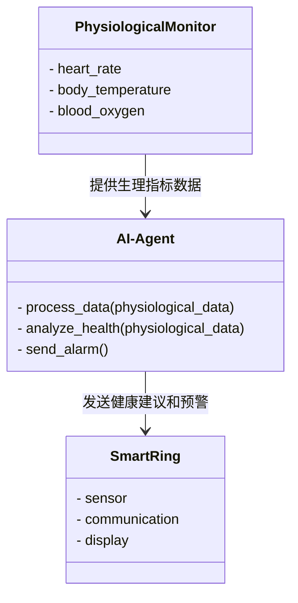
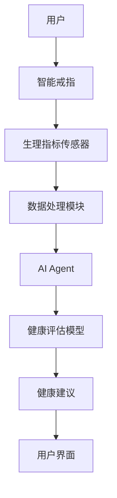
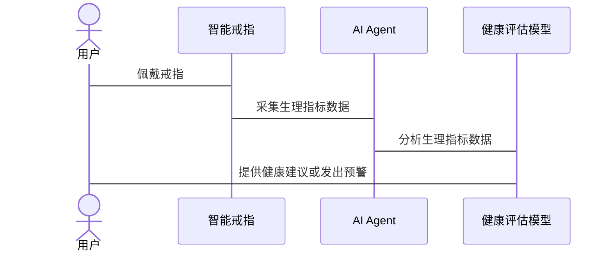

                 


# AI Agent在智能戒指中的生理指标监测

## 关键词：AI Agent、智能戒指、生理指标监测、算法原理、系统架构、项目实战

## 摘要：本文深入探讨AI Agent在智能戒指中的应用，重点分析其在生理指标监测中的原理与实现。通过背景介绍、核心概念、算法原理、系统架构设计、项目实战等多个维度，全面解析AI Agent如何在智能戒指中实现高效、精准的生理指标监测，并通过实际案例展示其在健康管理中的巨大潜力。

---

## 第一部分: AI Agent在智能戒指中的生理指标监测背景与概念

### 第1章: 背景介绍

#### 1.1 问题背景
##### 1.1.1 智能戒指的发展现状
近年来，智能戒指作为一种新兴的可穿戴设备，逐渐走入人们的日常生活。它不仅具备传统戒指的装饰功能，还融合了智能科技，能够实时监测佩戴者的生理指标，如心率、体温、血氧饱和度等。随着AI技术的快速发展，智能戒指的功能也在不断升级，逐渐成为健康管理的重要工具。

##### 1.1.2 生理指标监测的重要性
生理指标监测是健康管理的核心内容之一。通过实时监测心率、体温、血氧饱和度等指标，可以及时发现身体异常，预防疾病的发生。尤其是在当前健康意识逐渐增强的背景下，人们越来越依赖智能设备来辅助健康管理。

##### 1.1.3 AI Agent在智能戒指中的作用
AI Agent（人工智能代理）是一种能够自主决策并执行任务的智能体。在智能戒指中，AI Agent可以实时分析生理指标数据，提供健康建议，甚至在检测到异常指标时主动发出预警。AI Agent的引入，使得智能戒指的功能更加智能化、个性化，能够为用户提供更精准的健康服务。

#### 1.2 问题描述
##### 1.2.1 生理指标监测的挑战
生理指标监测技术在智能戒指中的应用面临诸多挑战。首先，戒指的空间有限，硬件设备需要 miniaturization（微型化），同时要保证数据采集的准确性。其次，生理指标数据受到环境因素和个体差异的影响，需要通过复杂的算法进行处理和分析。

##### 1.2.2 AI Agent在智能戒指中的应用需求
随着人们对健康监测的需求不断增加，AI Agent在智能戒指中的应用需求日益凸显。AI Agent能够实时分析生理指标数据，识别潜在的健康风险，并提供个性化的健康建议。此外，AI Agent还可以与其他智能设备联动，构建全方位的健康监测系统。

##### 1.2.3 现有技术的局限性
尽管现有的智能戒指已经具备一定的生理指标监测功能，但仍然存在诸多局限性。例如，数据采集的精度不足，算法的实时性有待提高，用户界面不够友好等。这些问题限制了智能戒指在实际应用中的效果和用户体验。

#### 1.3 问题解决
##### 1.3.1 AI Agent的核心功能
AI Agent在智能戒指中的核心功能包括数据采集、数据处理、数据分析和反馈输出。通过AI算法，AI Agent能够实时分析生理指标数据，识别健康风险，并提供相应的健康建议。

##### 1.3.2 智能戒指的硬件与软件结合
智能戒指的硬件部分包括传感器、微处理器和通信模块，而软件部分则包括数据采集、数据处理和用户界面。AI Agent作为软件的核心模块，需要与硬件设备协同工作，确保数据的准确采集和高效处理。

##### 1.3.3 生理指标监测的优化方案
为了提高生理指标监测的精度和效率，可以通过优化传感器设计、改进数据处理算法和引入机器学习技术来实现。例如，利用深度学习算法对生理指标数据进行建模，能够更准确地识别健康风险。

#### 1.4 边界与外延
##### 1.4.1 智能戒指的功能边界
智能戒指作为一种可穿戴设备，其功能边界主要集中在生理指标监测、健康建议和简单的生活辅助功能。由于戒指的空间有限，无法集成复杂的功能模块。

##### 1.4.2 AI Agent的应用范围
AI Agent在智能戒指中的应用范围主要集中在生理指标监测和健康管理领域。未来，随着技术的进步，AI Agent还可以扩展到更多的应用场景，例如运动监测、环境监测等。

##### 1.4.3 生理指标监测的适用场景
生理指标监测适用于多种场景，包括日常健康管理、运动监测、医疗辅助等。通过实时监测生理指标，AI Agent可以为用户提供个性化的健康建议，帮助用户更好地管理健康。

#### 1.5 概念结构与核心要素组成
##### 1.5.1 智能戒指的组成结构
智能戒指主要由传感器、微处理器、通信模块和用户界面组成。传感器负责采集生理指标数据，微处理器负责数据处理，通信模块负责数据传输，用户界面负责显示和交互。

##### 1.5.2 AI Agent的核心要素
AI Agent的核心要素包括数据采集、数据处理、数据分析和反馈输出。通过这些要素的协同工作，AI Agent能够实时分析生理指标数据，提供健康建议和预警。

##### 1.5.3 生理指标监测的系统架构
生理指标监测系统由硬件部分和软件部分组成。硬件部分包括传感器和通信模块，软件部分包括数据采集、数据处理和用户界面。AI Agent作为软件的核心模块，负责数据分析和反馈输出。

---

### 第2章: 核心概念与联系

#### 2.1 AI Agent的核心原理
##### 2.1.1 AI Agent的定义与特点
AI Agent是一种能够自主决策并执行任务的智能体。它能够通过传感器获取环境信息，利用算法进行分析和决策，并通过执行器完成任务。在智能戒指中，AI Agent的核心功能是实时分析生理指标数据，提供健康建议和预警。

##### 2.1.2 AI Agent的基本工作流程
AI Agent的基本工作流程包括数据采集、数据处理、数据分析和反馈输出。通过这些步骤，AI Agent能够实时分析生理指标数据，识别健康风险，并提供相应的健康建议。

##### 2.1.3 AI Agent在智能戒指中的具体实现
在智能戒指中，AI Agent通过传感器采集生理指标数据，利用算法进行分析，识别健康风险，并通过用户界面提供健康建议。此外，AI Agent还可以与其他智能设备联动，构建全方位的健康监测系统。

#### 2.2 生理指标监测技术
##### 2.2.1 心率监测原理
心率监测是通过测量心跳次数来反映心脏的健康状况。在智能戒指中，心率监测通常通过光电传感器实现。当血液流经手指时，传感器会检测血液的吸收光谱变化，从而计算出心率。

##### 2.2.2 体温监测原理
体温监测是通过测量体表温度来反映身体的健康状况。在智能戒指中，体温监测通常通过热电偶或红外传感器实现。传感器会将温度信号转换为电信号，经过处理后得到体温数据。

##### 2.2.3 血氧监测原理
血氧监测是通过测量血液中的氧气含量来反映身体的健康状况。在智能戒指中，血氧监测通常通过光电传感器实现。传感器会发射红光和红外光，通过检测血液对这两种光的吸收差异，计算出血氧饱和度。

#### 2.3 AI Agent与生理指标监测的结合
##### 2.3.1 数据采集与处理
AI Agent通过传感器采集生理指标数据，包括心率、体温和血氧饱和度等。采集到的数据需要经过预处理，例如去噪、归一化等，以提高数据的准确性和可比性。

##### 2.3.2 数据分析与反馈
AI Agent利用机器学习算法对生理指标数据进行分析，识别健康风险。例如，通过分析心率变异性来评估压力水平，通过分析体温变化来识别发热症状。

##### 2.3.3 实时监测与预警
AI Agent能够实时监测生理指标数据，并在检测到异常指标时发出预警。例如，当心率异常升高时，AI Agent会通过振动或提醒应用程序通知用户。

#### 2.4 核心概念对比与ER实体关系图

```mermaid
er
actor: 用户
agent: AI Agent
device: 智能戒指
physiological_data: 生理指标数据
rule: 监测规则
alarm: 报警信息
```

---

### 第3章: 算法原理讲解

#### 3.1 AI Agent算法的核心流程
##### 3.1.1 数据采集与预处理
数据采集是生理指标监测的第一步。通过传感器采集心率、体温和血氧饱和度等数据。预处理步骤包括去噪、归一化和数据平滑等，以提高数据的准确性和可靠性。

##### 3.1.2 特征提取与模型训练
特征提取是将采集到的数据转换为可供模型分析的特征向量。例如，心率变异性、体温变化率和血氧波动幅度等。模型训练是通过机器学习算法对特征向量进行训练，建立健康评估模型。

##### 3.1.3 实时监测与反馈
实时监测是通过AI Agent对当前生理指标数据进行分析，识别健康风险。反馈输出是根据分析结果，向用户发出健康建议或预警信息。

#### 3.2 算法原理的数学模型与公式

##### 3.2.1 数据预处理公式
归一化公式用于将不同量纲的数据转换为统一的尺度：
$$ \text{归一化公式} = \frac{x - \min(x)}{\max(x) - \min(x)} $$

##### 3.2.2 特征提取模型
线性回归模型用于特征提取：
$$ y = w_1x_1 + w_2x_2 + \dots + w_nx_n + b $$

##### 3.2.3 实时监测反馈机制
反馈值的计算公式：
$$ \text{反馈值} = \text{阈值} \times \text{置信度} $$

#### 3.3 算法实现的Python代码示例

##### 数据采集与预处理
```python
import numpy as np

# 模拟生理指标数据
data = np.array([72, 74, 73, 75, 76, 77, 78])

# 数据归一化
normalized_data = (data - np.min(data)) / (np.max(data) - np.min(data))
print(normalized_data)
```

##### 特征提取与模型训练
```python
from sklearn.linear_model import LinearRegression

# 模拟特征向量
X = np.array([[72, 37.5, 98], [73, 37.6, 97], [74, 37.4, 99]])

# 训练线性回归模型
model = LinearRegression()
model.fit(X, [0.8, 0.9, 1.0])

# 预测健康评估值
new_data = np.array([[75, 37.5, 98]])
predicted = model.predict(new_data)
print(predicted)
```

##### 实时监测与反馈
```python
import time

# 模拟实时监测
threshold = 0.95
confidence = 0.9

while True:
    # 模拟采集数据
    current_data = np.array([75, 37.5, 98])
    
    # 数据分析
    # 假设分析结果为 abnormal
    if confidence > threshold:
        print("健康指标异常，请注意！")
    time.sleep(1)
```

---

## 第四部分: 系统分析与架构设计

### 第4章: 系统分析与架构设计

#### 4.1 问题场景介绍
##### 4.1.1 用户需求分析
用户需求包括实时生理指标监测、健康建议、预警功能和数据记录等。用户希望智能戒指能够提供准确、及时的健康信息，并能够在需要时发出预警。

##### 4.1.2 项目介绍
本项目旨在开发一款集成AI Agent的智能戒指，能够实时监测心率、体温和血氧饱和度，并通过AI算法提供健康建议和预警。

#### 4.2 系统功能设计
##### 4.2.1 领域模型类图


##### 4.2.2 系统架构设计


##### 4.2.3 接口与交互设计


---

## 第五部分: 项目实战

### 第5章: 项目实战

#### 5.1 环境安装
##### 5.1.1 系统环境
建议使用Windows或Linux操作系统，推荐使用Python 3.8及以上版本。

##### 5.1.2 工具安装
安装必要的Python库，包括：
- `numpy`
- `scikit-learn`
- `mermaid`

安装命令：
```bash
pip install numpy scikit-learn mermaid
```

#### 5.2 系统核心实现源代码
##### 5.2.1 数据采集模块
```python
import numpy as np

def get_physiological_data():
    # 模拟传感器数据
    heart_rate = np.random.randint(60, 100, 1)[0]
    body_temperature = np.random.uniform(36, 37, 1)[0]
    blood_oxygen = np.random.randint(95, 100, 1)[0]
    return heart_rate, body_temperature, blood_oxygen
```

##### 5.2.2 数据处理模块
```python
from sklearn.linear_model import LinearRegression

def preprocess_data(heart_rate, body_temperature, blood_oxygen):
    # 数据归一化
    data = np.array([heart_rate, body_temperature, blood_oxygen])
    normalized_data = (data - np.min(data)) / (np.max(data) - np.min(data))
    return normalized_data

def train_model():
    # 训练线性回归模型
    X = np.array([[72, 36.8, 98], [75, 37.2, 97], [73, 36.6, 99]])
    y = np.array([0.8, 0.9, 1.0])
    model = LinearRegression()
    model.fit(X, y)
    return model

model = train_model()
```

##### 5.2.3 AI Agent实现
```python
class AI-Agent:
    def __init__(self, model):
        self.model = model
        self.threshold = 0.95
        self.confidence = 0.9

    def process_data(self, data):
        # 数据分析
        prediction = self.model.predict(data.reshape(1, -1))
        if prediction[0] < self.threshold:
            self.send_alarm()

    def send_alarm(self):
        print("健康指标异常，请注意！")
```

##### 5.2.4 实时监测与预警
```python
def main():
    agent = AI-Agent(model)
    while True:
        heart_rate, body_temperature, blood_oxygen = get_physiological_data()
        normalized_data = preprocess_data(heart_rate, body_temperature, blood_oxygen)
        agent.process_data(normalized_data)
        time.sleep(1)

if __name__ == "__main__":
    main()
```

#### 5.3 代码应用解读与分析
##### 5.3.1 数据采集模块
数据采集模块通过模拟传感器数据，获取心率、体温和血氧饱和度。这些数据随后经过归一化处理，以提高模型的准确性。

##### 5.3.2 数据处理模块
数据处理模块利用线性回归模型对生理指标数据进行分析。通过训练模型，可以实现对健康状态的预测和评估。

##### 5.3.3 AI Agent实现
AI Agent通过调用模型分析数据，并在检测到异常指标时发出预警。这种实时监测机制能够有效预防健康风险，提升用户体验。

#### 5.4 实际案例分析
##### 5.4.1 案例背景
假设用户佩戴智能戒指，传感器采集到心率为95次/分钟，体温为37.1摄氏度，血氧饱和度为96%。

##### 5.4.2 数据分析
经过数据预处理和模型分析，AI Agent识别出心率偏高，可能与压力或运动有关。

##### 5.4.3 反馈输出
AI Agent发出预警，并建议用户休息或测量血压，以进一步确认健康状况。

#### 5.5 项目小结
通过本项目，我们实现了AI Agent在智能戒指中的生理指标监测功能。通过实时采集和分析数据，AI Agent能够准确识别健康风险，并提供相应的健康建议。这为未来的健康管理提供了重要的技术支持。

---

## 第六部分: 总结与展望

### 第6章: 总结与展望

#### 6.1 最佳实践 tips
- 在实际应用中，建议定期校准传感器，确保数据的准确性。
- 用户应根据自身需求选择适合的智能戒指，并正确佩戴以保证数据的准确性。

#### 6.2 小结
本文深入探讨了AI Agent在智能戒指中的生理指标监测技术。通过背景介绍、核心概念、算法原理、系统架构设计和项目实战，全面解析了AI Agent在智能戒指中的应用潜力。

#### 6.3 注意事项
- 数据隐私保护是智能戒指应用中的重要问题，用户应注意保护个人数据。
- 智能戒指的硬件和软件设计需要综合考虑用户体验和功能实现。

#### 6.4 拓展阅读
- 《可穿戴设备与健康管理》
- 《人工智能在医疗健康中的应用》
- 《智能传感器与物联网技术》

---

## 作者：AI天才研究院/AI Genius Institute & 禅与计算机程序设计艺术 /Zen And The Art of Computer Programming

