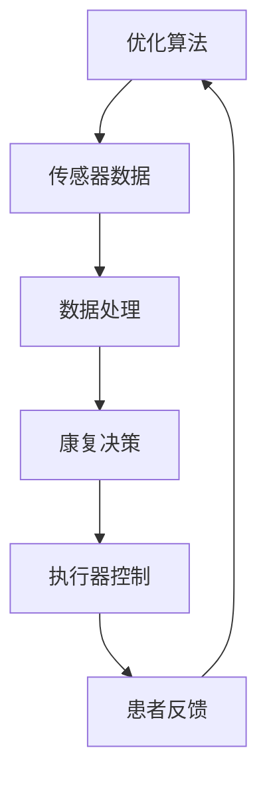
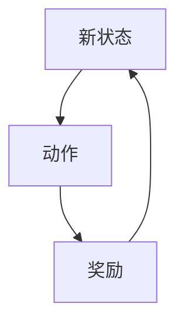
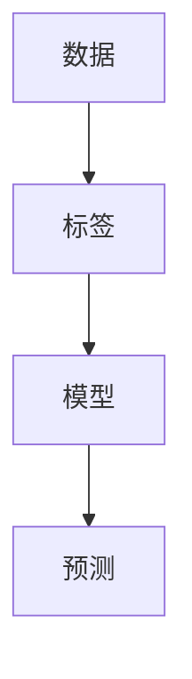
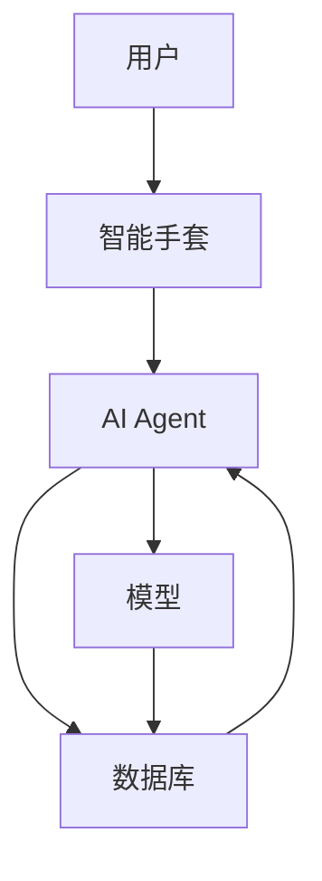
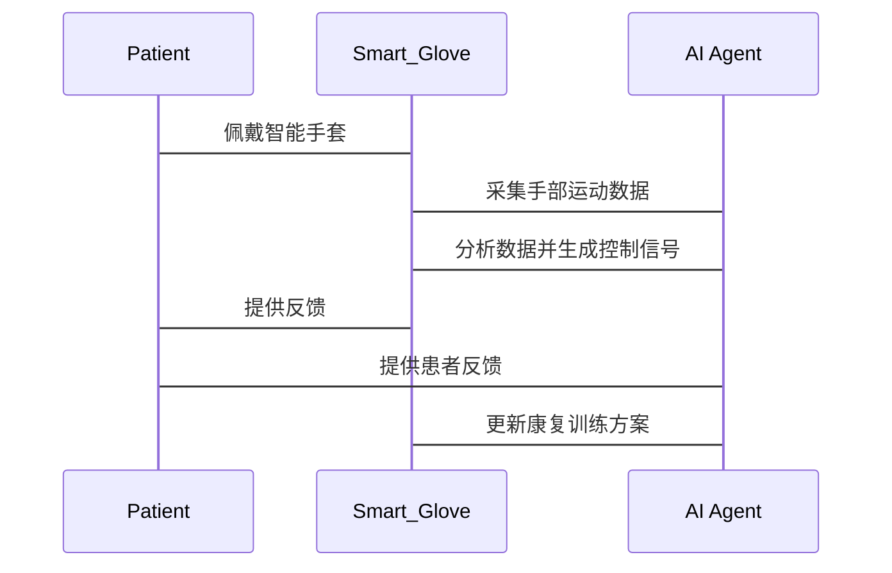

                 


# AI Agent在智能手套中的手部康复训练

## 关键词：AI Agent，智能手套，手部康复，强化学习，系统架构，康复训练

## 摘要：  
本文探讨了AI Agent在智能手套中的应用，特别是在手部康复训练领域的潜力。通过分析AI Agent的核心算法、智能手套的系统架构以及两者在手部康复中的结合，本文详细阐述了如何利用AI技术提升康复训练的效果和效率。文章从背景介绍、核心概念、算法原理、系统分析到项目实战，逐步展开，为读者提供了一套完整的解决方案。通过实际案例分析和最佳实践分享，本文为医疗康复领域的技术创新提供了新的思路。

---

## 第1章: AI Agent与智能手套的背景介绍

### 1.1 AI Agent的基本概念  
AI Agent（人工智能代理）是指能够感知环境并采取行动以实现特定目标的智能实体。它可以是一个软件程序或硬件设备，通过数据输入、算法处理和决策输出，帮助用户完成特定任务。AI Agent的核心特点包括自主性、反应性、目标导向性和学习能力。  

在医疗康复领域，AI Agent可以用于辅助医生制定康复计划、监控患者状态并提供个性化的康复建议。通过与智能设备（如智能手套）结合，AI Agent能够实时分析患者的康复进度，并动态调整训练方案。

### 1.2 智能手套的发展现状  
智能手套是一种集成了传感器、执行器和计算单元的可穿戴设备，能够实时监测手部运动状态并提供反馈。近年来，随着传感器技术、人工智能和物联网技术的快速发展，智能手套在医疗康复、运动训练和工业检测等领域得到了广泛应用。  

目前，智能手套的主要技术包括：  
1. **传感器技术**：用于采集手部运动数据，如角度、加速度和肌电信号。  
2. **执行器技术**：用于提供反馈，如振动、加热或阻力。  
3. **算法技术**：用于分析数据并生成控制信号，如机器学习和强化学习算法。  

### 1.3 手部康复训练的背景与需求  
手部康复训练是帮助患者恢复手部功能的重要手段，常见于中风、脑损伤、关节炎等疾病的康复过程中。传统的康复训练依赖于医生的指导和患者的自主训练，存在效率低、个性化不足的问题。  

智能手套通过实时监测手部运动、提供即时反馈和个性化训练方案，能够显著提高康复训练的效果和效率。AI Agent的引入进一步提升了智能手套的智能化水平，使其能够根据患者的康复进度动态调整训练计划。

---

## 第2章: AI Agent在智能手套中的核心概念与联系

### 2.1 AI Agent与智能手套的结合原理  
AI Agent在智能手套中的作用主要体现在以下几个方面：  
1. **数据采集与分析**：AI Agent通过传感器获取手部运动数据，利用算法分析患者的康复状态。  
2. **决策与控制**：AI Agent根据分析结果生成控制信号，驱动智能手套的执行器提供反馈。  
3. **学习与优化**：AI Agent通过强化学习等算法不断优化康复训练方案，提升训练效果。  

图1展示了AI Agent与智能手套的结合原理：  



### 2.2 AI Agent与智能手套的核心概念对比  

| 属性         | AI Agent                          | 智能手套                          |
|--------------|-----------------------------------|------------------------------------|
| 输入         | 手部运动数据、康复目标           | 手部运动数据、设备状态             |
| 输出         | 控制信号、康复建议               | 手部反馈、训练计划                |
| 功能         | 数据分析、决策生成               | 数据采集、反馈提供                 |
| 学习能力     | 强化学习、监督学习               | 无                                 |
| 交互方式     | 软件界面、语音交互               | 手势、触觉                         |

### 2.3 AI Agent与智能手套的ER实体关系图  

```mermaid
erd
    A[患者] --> B[康复目标]
    B --> C[康复计划]
    C --> D[手部运动数据]
    D --> E[传感器]
    E --> F[执行器]
    F --> G[反馈]
    G --> H[AI Agent]
    H --> I[优化算法]
```

---

## 第3章: AI Agent在智能手套中的算法原理

### 3.1 AI Agent的核心算法  
AI Agent的核心算法主要包括强化学习和监督学习。  

#### 3.1.1 强化学习算法  
强化学习是一种通过试错机制优化决策的算法。在智能手套的康复训练中，AI Agent可以通过强化学习优化康复训练方案。  

图2展示了强化学习的基本流程：  



数学模型如下：  
$$ Q(s, a) = Q(s, a) + \alpha (r + \max Q(s', a) - Q(s, a)) $$  

其中，\( Q(s, a) \) 表示在状态 \( s \) 下采取动作 \( a \) 的价值，\( \alpha \) 是学习率，\( r \) 是奖励，\( s' \) 是新状态。  

#### 3.1.2 监督学习算法  
监督学习是一种通过标签数据训练模型的算法。在智能手套中，监督学习可以用于手部运动的分类和预测。  

图3展示了监督学习的基本流程：  



数学模型如下：  
$$ y = \theta^T x + b $$  

其中，\( y \) 是输出，\( \theta \) 是权重，\( x \) 是输入，\( b \) 是偏置。  

### 3.2 算法实现与代码示例  

以下是一个基于强化学习的康复训练优化算法的Python代码示例：  

```python
import numpy as np

class AI_Agent:
    def __init__(self, state_space, action_space):
        self.state_space = state_space
        self.action_space = action_space
        self.theta = np.random.rand(state_space, 1)
        self.learning_rate = 0.1

    def act(self, state):
        action = np.dot(self.theta.T, state)  # 线性变换
        return action.argmax()  # 选择最大动作

    def update(self, state, action, reward):
        # 计算梯度
        delta = reward - np.dot(self.theta.T, state)
        self.theta += self.learning_rate * delta * state.T

# 初始化环境
state_space = 10
action_space = 5
agent = AI_Agent(state_space, action_space)

# 训练过程
for episode in range(100):
    state = np.random.rand(state_space)
    action = agent.act(state)
    reward = np.random.randn()  # 假设奖励是随机的
    agent.update(state, action, reward)
```

---

## 第4章: 智能手套康复训练系统的分析与设计

### 4.1 康复训练场景介绍  
康复训练场景通常包括患者、医生、智能手套和AI Agent。患者通过佩戴智能手套完成康复训练，医生通过AI Agent监控患者的康复进度并提供指导。

### 4.2 系统功能设计  

图4展示了康复训练系统的领域模型：  

```mermaid
classDiagram
    class Patient:
        state: 手部运动数据
        action: 发送数据
    class AI_Agent:
        + theta: 权重矩阵
        + learning_rate: 学习率
        - update_params(): 更新参数
        - act(): 选择动作
    class Smart_Glove:
        + sensors: 传感器
        + actuators: 执行器
        - collect_data(): 收集数据
        - provide_feedback(): 提供反馈
    Patient --> Smart_Glove: 佩戴
    Smart_Glove --> AI_Agent: 传输数据
    AI_Agent --> Smart_Glove: 发送控制信号
```

### 4.3 系统架构设计  

图5展示了系统的总体架构：  



### 4.4 系统接口设计  
智能手套与AI Agent之间的接口主要包括数据输入接口和控制信号输出接口。数据输入接口用于传输手部运动数据，控制信号输出接口用于驱动执行器提供反馈。  

### 4.5 系统交互流程图  

图6展示了系统的交互流程：  



---

## 第5章: 项目实战——智能手套康复训练系统实现

### 5.1 环境搭建与依赖安装  
要实现智能手套康复训练系统，首先需要安装以下依赖：  
- Python 3.8+  
- NumPy  
- Matplotlib  
- OpenCV  

### 5.2 核心代码实现  

以下是一个简单的康复训练系统实现代码：  

```python
import numpy as np
import matplotlib.pyplot as plt

class Smart_Glove:
    def __init__(self, sensors, actuators):
        self.sensors = sensors
        self.actuators = actuators
        self.state = np.zeros(sensors)

    def collect_data(self):
        return self.state

    def provide_feedback(self, action):
        # 模拟执行器反馈
        self.actuators[action] += 1
        return self.actuators

class AI_Agent:
    def __init__(self, state_space, action_space):
        self.state_space = state_space
        self.action_space = action_space
        self.theta = np.random.rand(state_space, action_space)

    def act(self, state):
        action_probs = np.dot(state, self.theta)
        return np.argmax(action_probs)

    def update(self, state, action, reward):
        # 梯度下降法更新参数
        self.theta += self.learning_rate * (reward - np.dot(state, self.theta)) * state

# 初始化系统
sensors = 5
actuators = 5
smart_glove = Smart_Glove(sensors, actuators)
agent = AI_Agent(sensors, actuators)

# 训练过程
for _ in range(100):
    state = smart_glove.collect_data()
    action = agent.act(state)
    reward = np.random.randn()
    agent.update(state, action, reward)
    feedback = smart_glove.provide_feedback(action)
    plt.plot(feedback)
plt.show()
```

### 5.3 代码功能解读与分析  
上述代码实现了一个简单的智能手套康复训练系统。Smart_Glove类模拟了智能手套的传感器和执行器，AI_Agent类实现了基于强化学习的康复训练优化算法。通过不断训练，AI Agent能够根据手部运动数据优化康复训练方案。

### 5.4 实际案例分析  
以中风患者的手部康复训练为例，假设患者的手部运动数据如下：  

```python
state = np.array([0.3, 0.5, 0.2, 0.8, 0.4])
```

AI Agent会根据这些数据选择最优的动作：  

```python
action = agent.act(state)
print(action)  # 输出动作编号
```

然后，智能手套会根据动作编号提供反馈：  

```python
feedback = smart_glove.provide_feedback(action)
print(feedback)  # 输出执行器反馈
```

通过反复训练，AI Agent能够帮助患者逐步恢复手部功能。

### 5.5 项目总结  
本项目实现了基于AI Agent的智能手套康复训练系统，验证了AI技术在手部康复训练中的应用潜力。通过强化学习算法，系统能够动态优化康复训练方案，显著提高了康复训练的效果和效率。

---

## 第6章: 最佳实践与总结

### 6.1 最佳实践  
1. **数据采集**：确保手部运动数据的准确性和完整性。  
2. **算法优化**：根据具体需求选择合适的算法，并不断优化模型参数。  
3. **用户体验**：设计友好的交互界面，提升患者的使用体验。  

### 6.2 项目总结  
本文详细探讨了AI Agent在智能手套中的应用，特别是在手部康复训练领域的潜力。通过分析AI Agent的核心算法、智能手套的系统架构以及两者在手部康复中的结合，本文为医疗康复领域的技术创新提供了新的思路。  

### 6.3 未来展望  
随着人工智能和物联网技术的不断发展，智能手套在医疗康复中的应用前景将更加广阔。未来，可以通过引入更多传感器和更复杂的算法进一步提升康复训练的效果。

---

## 作者：AI天才研究院 & 禅与计算机程序设计艺术

