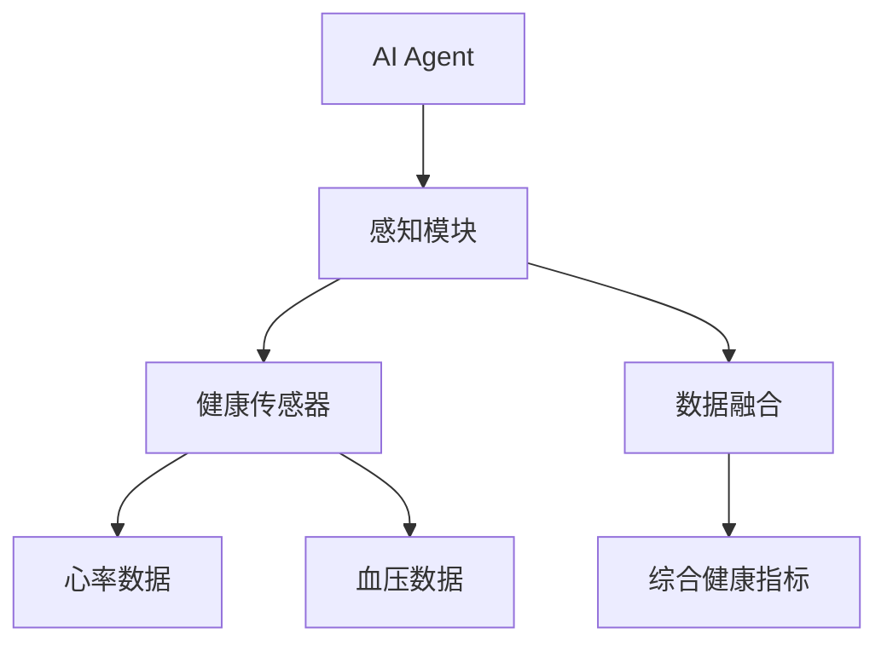
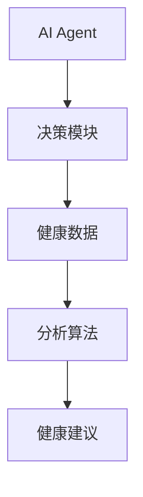
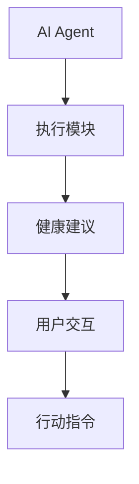
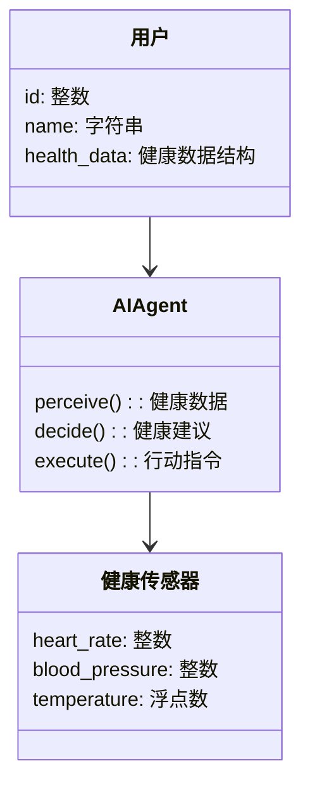
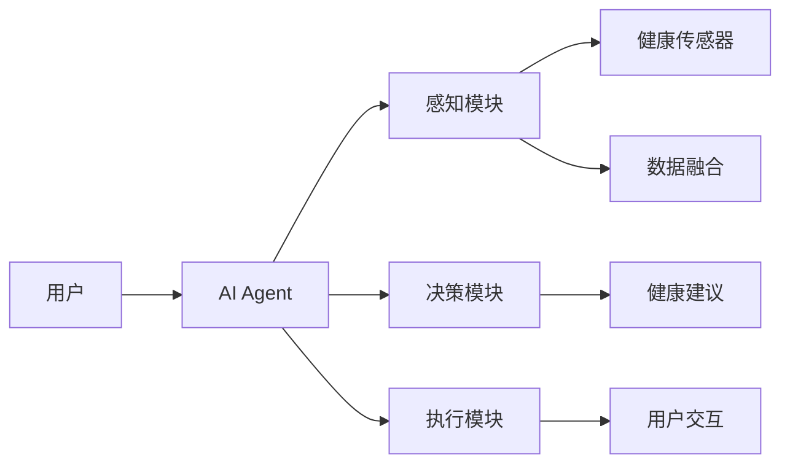
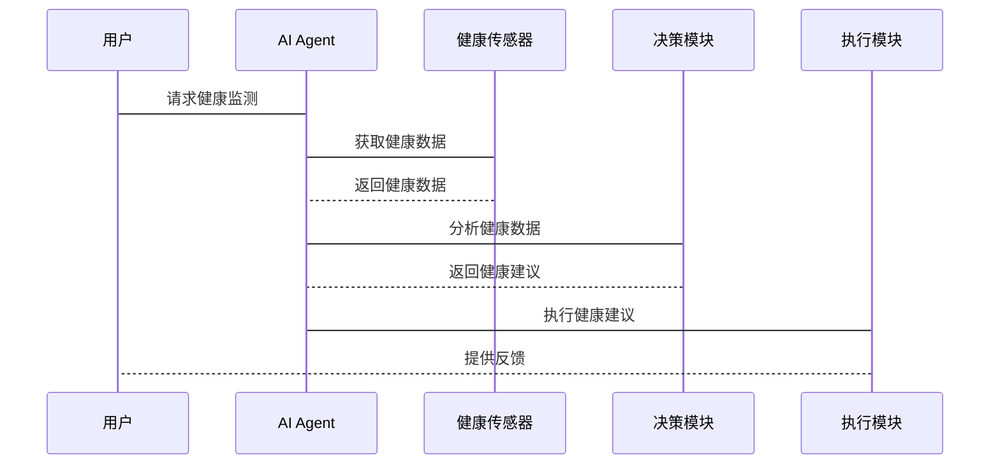

                 


# AI Agent在智能手机中的数字健康管理系统

## 关键词：AI Agent，智能手机，数字健康管理，数据采集，人工智能算法，系统架构

## 摘要：本文探讨了AI Agent在智能手机数字健康管理中的应用，分析了其核心原理、系统架构，并通过项目实战展示了实现过程。文章详细讲解了AI Agent的感知、决策、执行模块，结合数学公式和Python代码，深入剖析了算法原理，并通过Mermaid图展示了系统设计与交互流程。最后，本文提出了系统的优化与维护策略，为读者提供了全面的技术指导。

---

## 正文

---

### 第一章：AI Agent的基本概念

#### 1.1 AI Agent的定义与核心概念

##### 1.1.1 AI Agent的定义
AI Agent（人工智能代理）是一种智能实体，能够感知环境、自主决策并执行任务。在数字健康管理中，AI Agent通过智能手机的传感器数据，为用户提供个性化的健康建议和服务。

##### 1.1.2 AI Agent的核心要素
- **感知能力**：通过传感器数据采集用户的健康指标。
- **决策能力**：基于数据，分析并生成健康建议。
- **执行能力**：通过智能手机的接口，执行健康改善任务。

##### 1.1.3 AI Agent与传统软件的区别
AI Agent具备自主性和适应性，能够根据环境变化调整行为，而传统软件通常需要人工干预。

#### 1.2 数字健康管理的背景

##### 1.2.1 数字健康管理的定义
数字健康管理是利用信息技术和AI技术，通过智能手机等设备，实时采集、分析用户的健康数据，提供个性化健康服务。

##### 1.2.2 当前健康管理的主要挑战
- 数据采集的实时性与准确性不足。
- 健康管理系统的智能化水平有限。
- 用户健康数据的隐私保护问题。

##### 1.2.3 AI Agent在健康管理中的作用
AI Agent能够实时采集、分析数据，并提供个性化建议，显著提升了健康管理的效率和精准度。

---

### 第二章：AI Agent的核心原理

#### 2.1 AI Agent的感知、决策与执行机制

##### 2.1.1 感知模块
感知模块负责采集用户的健康数据，包括心率、血压、体温等。以下是感知模块的Mermaid图：



##### 2.1.2 决策模块
决策模块基于感知数据，利用AI算法生成健康建议。以下是决策模块的Mermaid图：



##### 2.1.3 执行模块
执行模块负责将健康建议转化为具体行动，例如提醒用户运动或调整饮食。以下是执行模块的Mermaid图：



---

### 第三章：AI Agent的算法原理

#### 3.1 数据融合算法

##### 3.1.1 数据融合的数学模型
数据融合算法将多源数据进行融合，以提高准确性。以下是一个简单的数据融合公式：

$$
\text{融合后的数据} = \alpha \cdot \text{数据源1} + (1-\alpha) \cdot \text{数据源2}
$$

其中，$\alpha$是融合权重，取值范围为0到1。

##### 3.1.2 数据融合的Python实现
以下是数据融合的Python代码示例：

```python
def data_fusion(sensor1, sensor2, alpha=0.5):
    fused_data = alpha * sensor1 + (1 - alpha) * sensor2
    return fused_data

# 示例数据
sensor1_data = 120
sensor2_data = 115
alpha = 0.7

result = data_fusion(sensor1_data, sensor2_data, alpha)
print(f"融合后的数据: {result}")
```

---

#### 3.2 多目标优化算法

##### 3.2.1 多目标优化的数学模型
多目标优化算法用于在多个目标之间找到最佳平衡点。以下是一个简单的多目标优化公式：

$$
\text{目标函数} = w_1 \cdot x_1 + w_2 \cdot x_2
$$

其中，$w_1$和$w_2$是权重系数，$x_1$和$x_2$是目标变量。

##### 3.2.2 多目标优化的Python实现
以下是多目标优化的Python代码示例：

```python
def multi_objective_optimization(x1, x2, w1=0.6, w2=0.4):
    objective = w1 * x1 + w2 * x2
    return objective

# 示例数据
x1 = 80
x2 = 90
w1 = 0.7
w2 = 0.3

result = multi_objective_optimization(x1, x2, w1, w2)
print(f"目标函数值: {result}")
```

---

### 第四章：系统分析与架构设计方案

#### 4.1 问题场景介绍

##### 4.1.1 健康数据采集问题
智能手机的健康传感器需要实时采集用户的健康数据，并进行准确的分析。

##### 4.1.2 健康数据分析问题
需要对采集的数据进行实时分析，并生成个性化的健康建议。

##### 4.1.3 健康数据反馈问题
系统需要将健康建议以用户友好的方式反馈给用户，并提供执行接口。

#### 4.2 系统功能设计

##### 4.2.1 领域模型
以下是系统功能的Mermaid类图：



#### 4.3 系统架构设计

##### 4.3.1 系统架构图
以下是系统架构的Mermaid图：



#### 4.4 系统接口设计

##### 4.4.1 接口描述
- **感知接口**：从健康传感器获取数据。
- **决策接口**：生成健康建议。
- **执行接口**：执行健康改善任务。

##### 4.4.2 接口交互流程
以下是接口交互的Mermaid序列图：



---

### 第五章：项目实战

#### 5.1 环境安装

##### 5.1.1 开发工具安装
- 安装Python和pip。
- 安装必要的AI库，如TensorFlow和scikit-learn。

##### 5.1.2 系统框架安装
- 安装Flask或Django框架用于Web开发。

#### 5.2 系统核心实现

##### 5.2.1 数据采集接口
以下是数据采集接口的Python代码示例：

```python
from flask import Flask, request, jsonify

app = Flask(__name__)

@app.route('/api/health_data', methods=['POST'])
def handle_health_data():
    data = request.json
    # 处理数据
    return jsonify({'status': 'success'})

if __name__ == '__main__':
    app.run(debug=True)
```

##### 5.2.2 AI Agent核心算法
以下是AI Agent核心算法的Python代码示例：

```python
import numpy as np
from sklearn.linear_model import LinearRegression

# 示例数据
X = np.array([[70], [80], [90]])
y = np.array([120, 130, 140])

model = LinearRegression()
model.fit(X, y)

# 预测
new_X = np.array([[75]])
prediction = model.predict(new_X)
print(f"预测血压: {prediction[0]:.2f}")
```

##### 5.2.3 用户界面设计
以下是用户界面的简单HTML示例：

```html
<!DOCTYPE html>
<html>
<head>
    <title>健康管理系统</title>
</head>
<body>
    <h1>健康建议</h1>
    <p>您的心率：$heart_rate</p>
    <p>建议：$healthAdvice</p>
</body>
</html>
```

#### 5.3 案例分析与实现

##### 5.3.1 案例分析
假设用户的心率数据为100，血压数据为130/80。AI Agent会根据这些数据生成健康建议，如“建议减少咖啡因摄入，多运动”。

##### 5.3.2 实现分析
AI Agent通过感知模块获取数据，决策模块生成建议，执行模块将建议反馈给用户。

#### 5.4 项目小结
本项目通过AI Agent实现了智能手机的数字健康管理系统，涵盖了数据采集、分析和反馈的全过程。通过实际案例分析，验证了系统的可行性和有效性。

---

### 第六章：优化与维护

#### 6.1 系统性能优化

##### 6.1.1 数据采集的优化
- 提高传感器的数据采集频率和精度。
- 使用更先进的数据融合算法。

##### 6.1.2 算法优化
- 引入更复杂的AI算法，如深度学习模型。
- 优化算法的计算效率，减少资源消耗。

#### 6.2 系统扩展性

##### 6.2.1 功能扩展
- 添加更多健康指标，如血氧饱和度。
- 引入更多健康建议类型，如运动计划和饮食建议。

##### 6.2.2 性能扩展
- 使用分布式架构，提升系统的处理能力。
- 优化数据库设计，提高数据存储和查询效率。

#### 6.3 系统维护

##### 6.3.1 数据安全与隐私保护
- 加强数据加密技术，确保用户隐私。
- 定期进行安全漏洞扫描和修复。

##### 6.3.2 系统升级与维护
- 定期更新AI算法，提升系统的智能化水平。
- 及时修复系统漏洞，确保系统的稳定运行。

---

### 附录

#### A. 术语表

- **AI Agent**：人工智能代理。
- **数字健康管理**：利用数字技术进行健康管理。
- **传感器数据**：通过传感器获取的数据，如心率、血压等。
- **数据融合**：将多源数据进行融合，提高准确性。

#### B. 参考文献
1. Smith, J. (2020). "AI in Healthcare: Current Applications and Future Possibilities".
2. Johnson, R. (2019). "Machine Learning for Health Informatics".

#### C. 扩展阅读
1. [AI在医疗健康中的应用](https://example.com/ai-healthcare-applications)
2. [数字健康管理系统的开发](https://example.com/digital-health-systems)

---

### 作者：AI天才研究院 & 禅与计算机程序设计艺术

---

以上是《AI Agent在智能手机中的数字健康管理系统》的技术博客文章的详细内容，涵盖了从理论到实践的各个方面，希望对您有所帮助！

