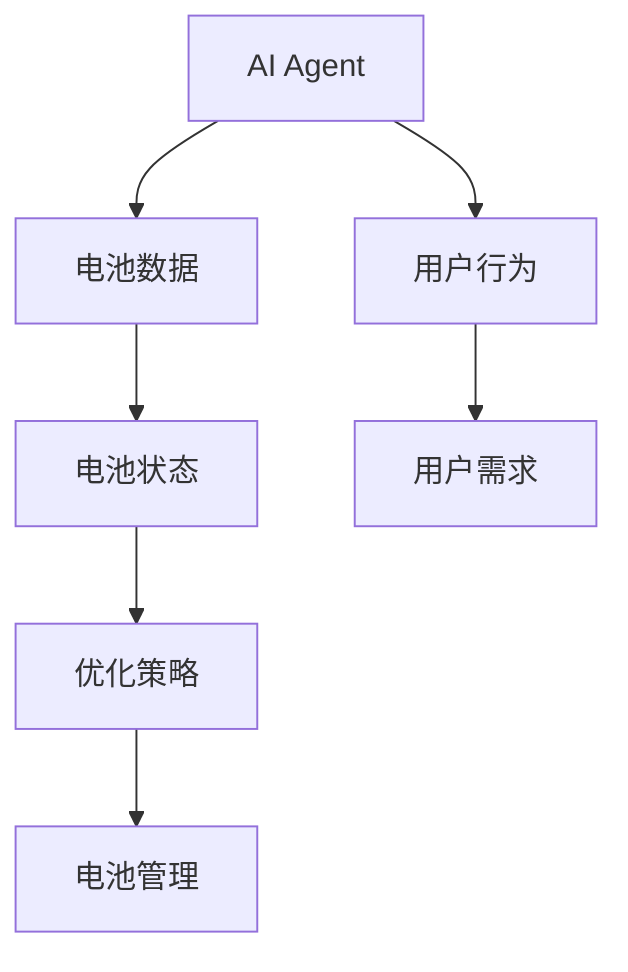
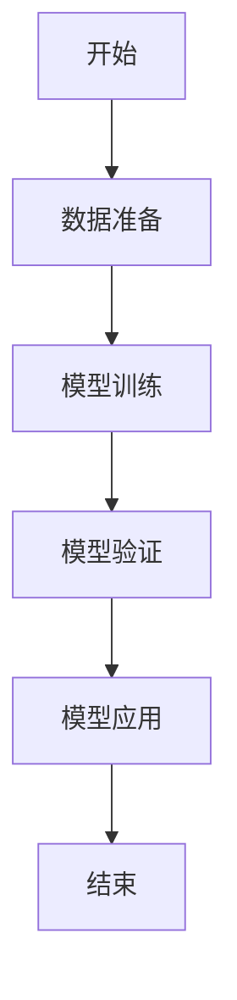
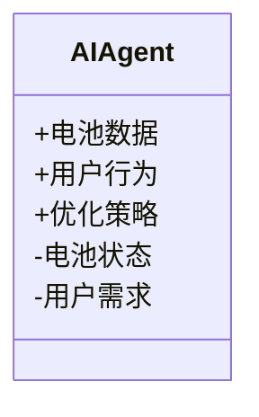
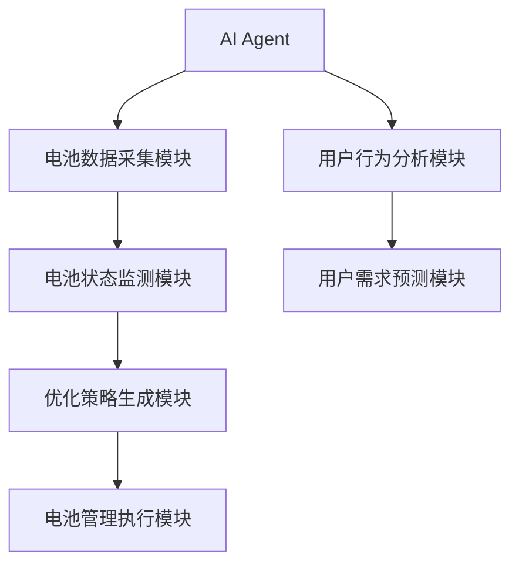
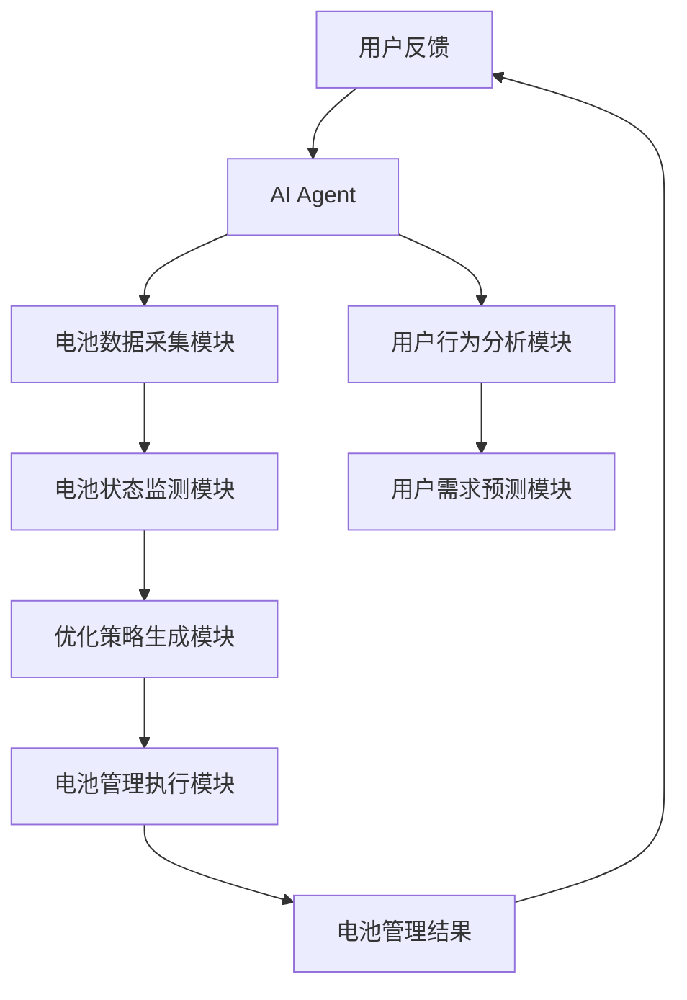

                 


# AI Agent在智能手机中的电池优化

## 关键词：AI Agent，智能手机，电池优化，算法，系统设计

## 摘要：本文深入探讨了AI Agent在智能手机电池优化中的应用，从核心概念、算法原理到系统设计，全面分析了如何利用AI技术提升电池管理效率和延长电池寿命。文章通过实际案例和项目实战，详细讲解了AI Agent在电池优化中的实现方法和最佳实践。

---

# 第一部分: AI Agent在智能手机中的电池优化概述

# 第1章: AI Agent与智能手机电池优化概述

## 1.1 AI Agent的基本概念

### 1.1.1 AI Agent的定义与特点

AI Agent（智能代理）是一种能够感知环境、做出决策并执行动作的智能系统。它通过传感器或数据输入获取信息，利用算法处理信息，并根据结果采取相应的行动。AI Agent的核心特点包括：

- **自主性**：能够在没有外部干预的情况下独立运行。
- **反应性**：能够实时感知环境变化并做出响应。
- **学习能力**：能够通过数据和经验不断优化自身的行为。

### 1.1.2 智能手机电池管理的现状

智能手机的电池管理是一个复杂的系统工程。传统电池管理主要依赖硬件电路和简单的软件策略，难以适应用户行为的多样性和环境的变化。随着AI技术的发展，利用AI Agent优化电池管理成为一种新的趋势。

### 1.1.3 AI Agent在电池优化中的作用

AI Agent可以通过分析电池的使用情况、用户的行为习惯以及设备的运行状态，动态调整电池管理策略，从而实现电池的高效利用和寿命延长。

---

## 1.2 电池优化的核心问题

### 1.2.1 电池消耗的主要因素

电池消耗主要由以下几个因素决定：

1. **应用程序的使用情况**：不同应用程序的功耗不同，视频播放、游戏等高功耗应用会显著增加电池消耗。
2. **用户行为习惯**：用户的使用模式（如频繁开关机、多任务处理等）会影响电池的使用效率。
3. **设备状态**：设备的硬件状态（如处理器频率、屏幕亮度等）也会对电池消耗产生影响。

### 1.2.2 电池寿命与性能的平衡

电池寿命和性能之间存在一定的矛盾。为了延长电池寿命，需要减少电池的深度放电；但为了提高性能，可能需要增加电池的使用强度。AI Agent可以通过动态调整设备的性能参数，在两者之间找到平衡点。

### 1.2.3 AI Agent优化电池的可行性分析

AI Agent通过实时感知电池状态和用户需求，结合先进的算法，可以在以下几个方面优化电池管理：

1. **动态调整设备功耗**：根据电池剩余电量和用户需求，动态调整设备的功耗水平。
2. **预测电池寿命**：通过历史数据和算法模型，预测电池的剩余寿命，并提前采取保护措施。
3. **智能唤醒/休眠管理**：根据设备的空闲状态和用户行为，智能控制设备的唤醒和休眠，减少不必要的功耗。

---

## 1.3 本书的目标与结构

### 1.3.1 本书的核心目标

本书旨在通过理论分析和实践结合的方式，系统地介绍AI Agent在智能手机电池优化中的应用。内容涵盖AI Agent的基本概念、电池优化的核心算法、系统设计以及实际项目实现。

### 1.3.2 本书的主要内容

- 第一部分：AI Agent的基本概念和电池优化的核心问题。
- 第二部分：AI Agent的核心概念与原理。
- 第三部分：AI Agent优化电池的算法原理。
- 第四部分：AI Agent的系统设计与实现。
- 第五部分：AI Agent电池优化的项目实战。
- 第六部分：AI Agent电池优化的最佳实践。

### 1.3.3 本书的章节安排

本书共分为六大部分，内容从理论到实践，逐步深入，确保读者能够全面掌握AI Agent在智能手机电池优化中的应用。

---

# 第二部分: AI Agent的核心概念与原理

# 第2章: AI Agent的核心概念

## 2.1 AI Agent的感知层

### 2.1.1 电池数据的采集与分析

AI Agent需要实时采集电池的相关数据，包括电池的电压、电流、温度、充电状态（SOC）等。这些数据可以通过设备的电池管理系统（BMS）获取。

### 2.1.2 用户行为的识别与建模

用户的行为习惯对电池的使用有重要影响。AI Agent可以通过分析用户的使用模式，建立用户行为模型，并根据模型预测用户的下一步操作。

### 2.1.3 环境感知与数据融合

AI Agent还需要感知设备的环境信息，如网络状态、设备的地理位置等。通过数据融合技术，可以将多种信息综合起来，为电池优化提供更全面的决策依据。

---

## 2.2 AI Agent的决策层

### 2.2.1 电池优化算法的原理

电池优化算法的核心是通过分析电池的状态和用户的需求，制定最优的电池管理策略。常见的优化算法包括：

- **线性回归模型**：用于预测电池的剩余寿命。
- **神经网络模型**：用于分类电池的使用状态。
- **强化学习算法**：通过与环境的交互，不断优化电池管理策略。

### 2.2.2 多目标优化的实现方法

电池优化是一个多目标优化问题，需要在电池寿命、性能和用户体验之间找到平衡。可以通过加权函数或 Pareto 优化等方法实现多目标优化。

---

## 2.3 AI Agent的执行层

### 2.3.1 电池管理策略的执行

AI Agent根据决策层的优化策略，执行具体的电池管理操作，如调整设备的亮度、关闭不必要的后台进程、动态调整处理器的频率等。

### 2.3.2 策略的动态调整机制

为了适应环境的变化和用户需求的变化，AI Agent需要能够动态调整优化策略。这可以通过在线学习算法或反馈机制实现。

---

## 2.4 核心概念对比表

| 概念       | 描述                                                                 |
|------------|----------------------------------------------------------------------|
| 电池数据   | 包括电池的电压、电流、温度、充电状态等信息                             |
| 用户行为   | 用户的操作习惯，如屏幕使用时间、应用程序的使用频率等                   |
| 优化算法   | 用于优化电池管理的核心算法，如线性回归、神经网络、强化学习等           |

---

## 2.5 实体关系图



---

# 第三部分: AI Agent优化电池的算法原理

# 第3章: 电池消耗预测模型

## 3.1 线性回归模型

### 3.1.1 模型的数学公式

线性回归模型用于预测电池的剩余寿命，其数学公式为：

$$ y = \beta_0 + \beta_1x + \epsilon $$

其中，$y$ 是电池的剩余寿命，$x$ 是电池的使用时间，$\beta_0$ 和 $\beta_1$ 是回归系数，$\epsilon$ 是误差项。

### 3.1.2 模型实现步骤

1. **数据准备**：收集电池的使用时间与寿命数据。
2. **模型训练**：使用最小二乘法估计回归系数。
3. **模型验证**：通过交叉验证评估模型的准确性。
4. **模型应用**：利用训练好的模型预测电池的剩余寿命。

### 3.1.3 模型的优缺点

- **优点**：简单易懂，计算速度快。
- **缺点**：假设变量之间的线性关系，可能无法捕捉复杂的非线性关系。

---

## 3.2 神经网络模型

### 3.2.1 模型的数学公式

神经网络模型用于分类电池的使用状态，其数学公式为：

$$ y = f(Wx + b) $$

其中，$W$ 是权重矩阵，$x$ 是输入数据，$b$ 是偏置项，$f$ 是激活函数。

### 3.2.2 模型实现步骤

1. **数据准备**：收集电池的使用状态数据，包括电池的电压、温度等。
2. **模型训练**：利用反向传播算法训练神经网络模型。
3. **模型验证**：通过测试数据评估模型的分类准确率。
4. **模型应用**：利用训练好的模型对电池的使用状态进行分类。

---

## 3.3 强化学习算法

### 3.3.1 算法的数学公式

强化学习算法用于动态调整电池管理策略，其数学公式为：

$$ Q(s, a) = r + \gamma \max_{a'} Q(s', a') $$

其中，$Q(s, a)$ 是状态-动作值函数，$s$ 是当前状态，$a$ 是当前动作，$r$ 是奖励，$\gamma$ 是折扣因子，$s'$ 是下一个状态。

### 3.3.2 算法实现步骤

1. **状态定义**：定义电池的当前状态，如电池剩余电量、设备的负载情况等。
2. **动作定义**：定义可能的动作，如调整设备的亮度、关闭后台进程等。
3. **奖励机制**：定义奖励函数，根据动作的结果给予奖励或惩罚。
4. **策略优化**：通过与环境的交互，不断优化策略，提高电池管理的效率。

---

## 3.4 算法对比与选择

| 算法类型 | 优点             | 缺点             |
|----------|------------------|------------------|
| 线性回归  | 简单，计算速度快  | 非线性关系处理差  |
| 神经网络  | 处理能力强，精度高 | 计算复杂度高      |
| 强化学习  | 动态调整能力强    | 需要大量的训练数据|

---

## 3.5 算法流程图



---

# 第四部分: AI Agent的系统设计与实现

# 第4章: 系统分析与架构设计

## 4.1 问题场景介绍

在智能手机的电池优化中，AI Agent需要解决以下问题：

1. 如何实时感知电池的状态和用户的行为？
2. 如何动态调整电池管理策略以延长电池寿命？
3. 如何保证电池优化的同时不影响用户体验？

## 4.2 系统功能设计

### 4.2.1 领域模型



### 4.2.2 系统架构设计



---

## 4.3 系统接口设计

1. **电池数据采集接口**：用于获取电池的实时数据，如电压、电流、温度等。
2. **用户行为分析接口**：用于分析用户的使用习惯，如屏幕使用时间、应用程序使用频率等。
3. **优化策略生成接口**：根据电池数据和用户行为，生成优化策略。
4. **电池管理执行接口**：根据优化策略，执行具体的电池管理操作。

---

## 4.4 系统交互流程图



---

# 第五部分: AI Agent电池优化的项目实战

# 第5章: 项目实战

## 5.1 环境安装

### 5.1.1 安装Python

```bash
python --version
```

### 5.1.2 安装依赖库

```bash
pip install numpy scikit-learn tensorflow
```

---

## 5.2 核心代码实现

### 5.2.1 电池数据预处理

```python
import numpy as np
import pandas as pd

# 读取电池数据
data = pd.read_csv('battery.csv')
# 数据清洗
data = data.dropna()
# 数据归一化
data = (data - data.mean()) / data.std()
```

### 5.2.2 优化算法实现

```python
from sklearn.linear_model import LinearRegression
from tensorflow.keras import layers, models

# 线性回归模型
model_linear = LinearRegression()
model_linear.fit(X_train, y_train)

# 神经网络模型
model_neural = models.Sequential()
model_neural.add(layers.Dense(64, activation='relu', input_shape=(n_features,)))
model_neural.add(layers.Dense(1, activation='sigmoid'))
model_neural.compile(optimizer='adam', loss='binary_crossentropy', metrics=['accuracy'])
model_neural.fit(X_train, y_train, epochs=10, batch_size=32)
```

### 5.2.3 策略执行

```python
def adjust_brightness(current_brightness, battery_level):
    if battery_level < 20:
        return 50  # 降低亮度
    elif 20 <= battery_level < 50:
        return current_brightness  # 保持当前亮度
    else:
        return current_brightness + 10  # 增加亮度
```

---

## 5.3 实际案例分析

假设我们有一个电池数据集，包含电池的使用时间、电压、温度等信息。通过线性回归模型预测电池的剩余寿命，并通过神经网络模型分类电池的使用状态。最后，通过强化学习算法动态调整电池管理策略，延长电池寿命。

---

## 5.4 项目小结

通过本项目，我们了解了AI Agent在智能手机电池优化中的实现方法，掌握了线性回归、神经网络和强化学习等算法的实现技巧，并通过实际案例分析了AI Agent在电池优化中的应用效果。

---

# 第六部分: AI Agent电池优化的最佳实践

# 第6章: 最佳实践

## 6.1 小结

AI Agent通过实时感知电池状态和用户需求，动态调整电池管理策略，可以显著延长电池寿命并提高设备性能。

## 6.2 注意事项

1. **数据隐私**：在采集用户行为数据时，需要注意数据的隐私保护。
2. **算法选择**：根据具体场景选择合适的算法，避免过度复杂化。
3. **系统稳定性**：确保系统的稳定性和可靠性，避免因算法错误导致设备故障。

## 6.3 拓展阅读

1. **相关书籍**：
   - 《机器学习实战》
   - 《深度学习入门：基于Python的CNN、RNN、GAN等模型原理与实现》
2. **在线资源**：
   - TensorFlow官方文档
   - Keras官方文档

---

# 作者：AI天才研究院/AI Genius Institute & 禅与计算机程序设计艺术 /Zen And The Art of Computer Programming

---

以上是《AI Agent在智能手机中的电池优化》的技术博客文章的完整目录和内容框架。文章通过理论分析和实践结合的方式，系统地介绍了AI Agent在智能手机电池优化中的应用。希望对您有所帮助！

