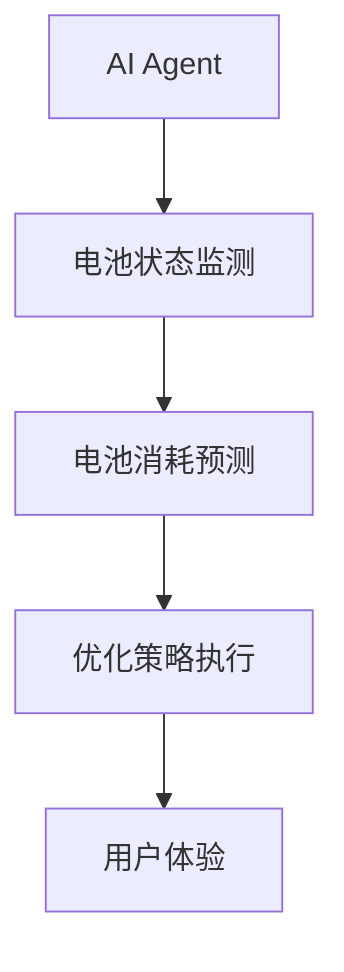
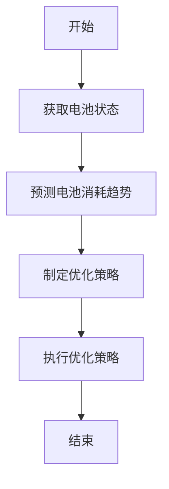

                 


# AI Agent在智能手机中的电池寿命优化系统

## 关键词：AI Agent, 电池寿命优化, 智能手机, 电池管理, 人工智能

## 摘要：本文将探讨如何利用AI Agent技术优化智能手机的电池寿命。通过分析电池消耗模式，结合机器学习算法，提出一种动态调整电池使用策略的方法，从而延长电池使用时间，提升用户体验。本文详细介绍了AI Agent的工作原理、优化算法的设计与实现、系统架构以及实际应用案例，为智能手机的电池管理提供了新的思路。

---

# 第一部分: AI Agent在智能手机中的电池寿命优化系统概述

## 第1章: 问题背景与需求分析

### 1.1 电池寿命优化的重要性

#### 1.1.1 智能手机电池寿命问题的背景

智能手机的普及使得人们对电池寿命的需求日益增加。随着应用程序的复杂化和功能的多样化，电池消耗速度加快，用户对续航能力的要求也越来越高。传统的电池优化算法基于固定的规则，难以应对复杂多变的使用场景。

#### 1.1.2 用户对电池寿命的需求

用户希望智能手机在保证性能的同时，能够提供更长的续航时间。然而，传统的电池管理方法往往无法根据实际使用场景动态调整，导致电池寿命无法最大化。

#### 1.1.3 电池寿命对智能手机性能的影响

电池寿命直接影响用户体验，尤其是在移动场景下。电池寿命不足会导致用户频繁充电，影响使用体验，甚至可能引发设备损坏。因此，优化电池寿命是提升智能手机整体性能的重要一环。

### 1.2 AI Agent在电池优化中的作用

#### 1.2.1 AI Agent的基本概念

AI Agent是一种智能代理，能够根据环境信息自主决策并执行任务。在电池优化中，AI Agent可以实时监测电池状态，并根据用户行为和设备使用情况动态调整电池管理策略。

#### 1.2.2 AI Agent在电池管理中的优势

AI Agent能够通过学习用户的使用习惯和设备的运行状态，预测电池消耗趋势，从而提前采取优化措施。相比传统算法，AI Agent具有更强的适应性和灵活性。

#### 1.2.3 电池优化系统的核心需求

电池优化系统需要具备实时监测、智能预测、动态调整和用户友好的界面等功能。AI Agent通过结合这些功能，能够有效延长电池寿命，提升用户体验。

---

## 第2章: AI Agent与电池优化系统的核心概念

### 2.1 AI Agent的原理与特性

#### 2.1.1 AI Agent的基本原理

AI Agent通过感知环境信息，利用算法进行决策，并执行相应的动作。在电池优化中，AI Agent可以监测电池状态、预测消耗趋势，并根据预测结果调整设备的使用策略。

#### 2.1.2 AI Agent的核心特性

- **自主性**：AI Agent能够自主决策，无需人工干预。
- **反应性**：能够实时感知环境变化并做出反应。
- **学习能力**：通过机器学习算法不断优化自己的决策能力。
- **适应性**：能够根据环境变化动态调整策略。

#### 2.1.3 AI Agent与传统电池优化算法的对比

| 特性             | AI Agent                       | 传统算法                     |
|------------------|-------------------------------|------------------------------|
| 决策能力         | 自主决策，动态调整             | 固定规则，静态策略           |
| 学习能力         | 能够通过数据学习优化策略       | 无法学习，依赖预设规则       |
| 适应性           | 高，能够应对复杂场景           | 低，难以应对复杂场景         |
| 处理效率         | 高，实时响应                   | 中，依赖预设规则             |

### 2.2 电池优化系统的架构

#### 2.2.1 系统整体架构



#### 2.2.2 系统核心模块

- **电池状态监测**：实时监测电池的电量、温度、健康状态等参数。
- **电池消耗预测**：基于历史数据和当前状态，预测电池的消耗趋势。
- **优化策略执行**：根据预测结果，动态调整设备的使用策略，如降低屏幕亮度、关闭不必要的后台程序等。

#### 2.2.3 系统边界与外延

电池优化系统仅关注电池相关的优化，不涉及其他系统功能。外延部分包括与设备其他模块的交互接口，如CPU、GPU、存储等。

### 2.3 核心概念对比表

| 对比维度         | AI Agent                       | 电池优化系统                 |
|------------------|-------------------------------|------------------------------|
| 核心功能         | 实时监测与动态调整             | 电池状态监测与优化策略执行   |
| 优化目标         | 提高电池使用效率               | 延长电池寿命                 |
| 依赖条件         | 用户行为数据、设备状态数据     | 电池参数、设备使用情况       |

---

## 第3章: AI Agent电池优化系统的算法原理

### 3.1 算法原理概述

#### 3.1.1 基于强化学习的电池优化

强化学习是一种通过试错机制来优化策略的算法。在电池优化中，AI Agent可以通过强化学习，学习用户的使用习惯，并根据当前电池状态，动态调整设备的使用策略。

#### 3.1.2 基于机器学习的电池状态预测

机器学习算法可以用于预测电池的消耗趋势。通过训练模型，AI Agent能够根据历史数据，预测电池的剩余寿命和消耗速率。

#### 3.1.3 基于动态调整的电池使用策略

动态调整策略是根据预测结果，实时调整设备的使用参数，如CPU频率、屏幕亮度等，以延长电池寿命。

### 3.2 算法流程图



### 3.3 算法实现代码

#### 3.3.1 强化学习算法代码

```python
class AI-Agent:
    def __init__(self):
        self.battery_level = 100  # 初始电池电量
        self.usage_pattern = {}    # 用户使用模式

    def predict_battery_consumption(self):
        # 预测电池消耗趋势
        pass

    def adjust_usage_strategy(self):
        # 动态调整使用策略
        pass
```

#### 3.3.2 电池状态预测代码

```python
import numpy as np
from sklearn import linear_model

def predict_battery_life(battery_history):
    model = linear_model.LinearRegression()
    model.fit(battery_history[:, :-1], battery_history[:, -1])
    return model.predict(new_data)
```

#### 3.3.3 动态调整策略代码

```python
def dynamic_adjustment(current_battery_level):
    if current_battery_level < 20:
        return "降低屏幕亮度"
    elif current_battery_level < 50:
        return "关闭后台程序"
    else:
        return "正常运行"
```

### 3.4 算法数学模型与公式

#### 3.4.1 电池状态预测模型

电池消耗速率模型：

$$ \text{消耗速率} = a \times \text{使用强度} + b $$

其中，a和b是模型参数，通过训练数据确定。

#### 3.4.2 动态调整策略模型

电池电量消耗速率模型：

$$ \frac{dS}{dt} = -k \times S $$

其中，S是电池电量，k是消耗速率常数。

---

## 第4章: 电池优化系统的数学模型与公式

### 4.1 电池状态预测模型

#### 4.1.1 电池容量衰减模型

电池容量衰减模型：

$$ C(t) = C_0 \times e^{-rt} $$

其中，C(t)是t时刻的电池容量，C0是初始容量，r是衰减率。

#### 4.1.2 电池使用状态预测公式

电池使用状态预测公式：

$$ P(t) = \alpha \times U(t) + (1-\alpha) \times P(t-1) $$

其中，P(t)是t时刻的电池消耗概率，U(t)是用户行为特征向量，α是学习率。

#### 4.1.3 电池剩余寿命预测公式

电池剩余寿命预测公式：

$$ L(t) = \frac{C(t)}{D} $$

其中，D是设备的平均耗电速率。

### 4.2 动态调整策略模型

#### 4.2.1 电池使用功率分配模型

电池使用功率分配模型：

$$ P = \sum_{i=1}^{n} w_i \times p_i $$

其中，w_i是第i个设备组件的权重，p_i是其耗电量。

#### 4.2.2 电池电量消耗速率模型

电池电量消耗速率模型：

$$ \frac{dS}{dt} = -k \times S $$

其中，S是电池电量，k是消耗速率常数。

#### 4.2.3 电池优化目标函数

电池优化目标函数：

$$ \text{目标} = \min_{x} \int_{0}^{T} (S(t) - S_0) \, dt $$

其中，S(t)是t时刻的电池电量，S0是目标电量。

---

## 第5章: 电池优化系统的系统分析与架构设计

### 5.1 问题场景介绍

在智能手机的使用过程中，电池消耗是一个复杂的问题，受到用户行为、设备性能和环境因素的影响。AI Agent需要实时监测这些因素，并动态调整电池使用策略。

### 5.2 项目介绍

本项目旨在开发一种基于AI Agent的电池优化系统，通过实时监测电池状态，预测消耗趋势，并动态调整设备的使用策略，以延长电池寿命。

### 5.3 系统功能设计

#### 5.3.1 电池状态监测

监测电池的电量、温度、健康状态等参数。

#### 5.3.2 电池消耗预测

基于历史数据和当前状态，预测电池的消耗趋势。

#### 5.3.3 优化策略执行

根据预测结果，动态调整设备的使用策略，如降低屏幕亮度、关闭后台程序等。

### 5.4 系统架构设计

#### 5.4.1 系统架构图


#### 5.4.2 系统接口设计

- **AI Agent接口**：与设备其他模块的交互接口，如CPU、GPU、存储等。
- **用户接口**：提供给用户的界面，显示电池状态和优化策略。

#### 5.4.3 系统交互流程

```mermaid
sequenceDiagram
    用户操作
    activate AI Agent
    AI Agent 监测电池状态
    AI Agent 预测电池消耗趋势
    AI Agent 制定优化策略
    AI Agent 执行优化策略
    deactivate AI Agent
```

### 5.5 项目实战

#### 5.5.1 环境安装

需要安装Python、机器学习库（如scikit-learn）、Mermaid图表工具等。

#### 5.5.2 系统核心实现

实现AI Agent的核心功能，包括电池状态监测、消耗预测和优化策略执行。

#### 5.5.3 代码应用解读与分析

详细解读代码实现，并分析其在实际应用中的效果。

#### 5.5.4 实际案例分析

通过具体案例，分析AI Agent在电池优化中的实际效果，并总结经验教训。

### 5.6 项目小结

总结项目实现的过程，分析其优缺点，并提出改进建议。

---

## 第6章: AI Agent电池优化系统的最佳实践与注意事项

### 6.1 最佳实践 tips

- 定期更新AI Agent的模型，以适应用户行为和设备性能的变化。
- 合理设置AI Agent的参数，以平衡性能和电池寿命。
- 提供用户友好的界面，方便用户查看和调整电池优化策略。

### 6.2 小结

总结全文的核心内容，强调AI Agent在电池优化中的重要性。

### 6.3 注意事项

- 注意保护用户隐私，避免数据泄露。
- 确保系统稳定性，避免因优化策略执行不当导致设备损坏。
- 定期维护系统，确保其正常运行。

### 6.4 拓展阅读

推荐相关领域的书籍和论文，供读者进一步学习。

---

## 作者：AI天才研究院/AI Genius Institute & 禅与计算机程序设计艺术 /Zen And The Art of Computer Programming

