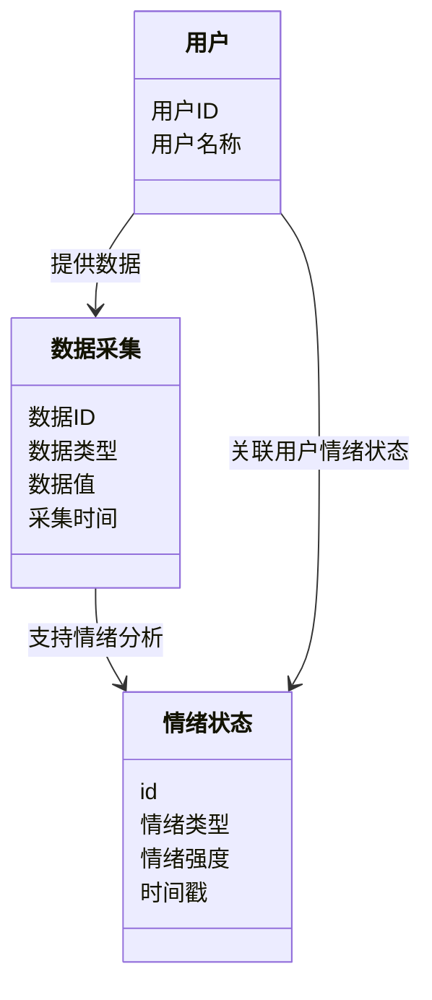
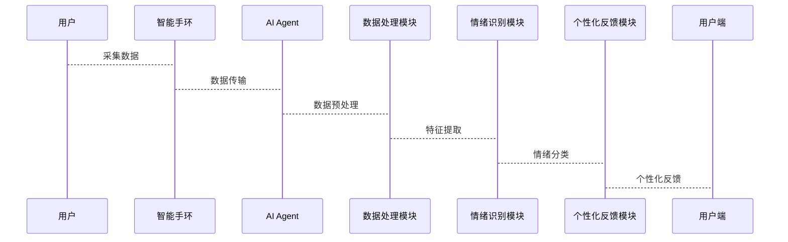

                 


# AI Agent在智能手环中的情绪状态监测

> 关键词：AI Agent, 智能手环, 情绪状态监测, 数据采集, 情感计算, 机器学习

> 摘要：本文深入探讨了AI Agent在智能手环中的情绪状态监测应用，从背景介绍、核心概念、算法原理到系统架构设计、项目实战，全面分析了情绪监测的实现过程。文章通过详细的理论阐述和实际案例分析，展示了AI Agent如何通过智能手环的多模态数据采集与分析，实现精准的情绪识别与个性化反馈。

---

# 第1章: 背景介绍

## 1.1 问题背景

### 1.1.1 情绪状态监测的背景与意义
情绪状态监测是人工智能领域的热门方向，旨在通过分析生理数据和行为数据，识别用户的情绪状态（如快乐、愤怒、悲伤、焦虑等）。情绪监测在心理健康管理、个性化服务、人机交互等领域具有重要应用价值。智能手环作为 wearable technology 的代表，具备采集生理数据和行为数据的能力，结合AI Agent的智能分析能力，为情绪监测提供了理想的实现平台。

### 1.1.2 智能手环的发展现状
智能手环作为一种可穿戴设备，近年来发展迅速，已成为人们生活中不可或缺的健康监测工具。它能够实时采集心率、皮肤温度、运动数据、睡眠质量等多种生理数据，并通过蓝牙或Wi-Fi将数据传输到手机或其他终端设备。然而，现有智能手环的功能主要集中在健康监测和运动记录，尚未充分挖掘情绪监测的潜力。

### 1.1.3 AI Agent在智能设备中的应用前景
AI Agent（人工智能代理）是一种能够感知环境、自主决策并执行任务的智能实体。随着AI技术的快速发展，AI Agent在智能设备中的应用越来越广泛。通过AI Agent，智能手环可以实现从单纯的数据采集向智能分析和决策的跃升，为用户提供更精准、更个性化的服务。

## 1.2 问题描述

### 1.2.1 情绪监测的核心问题
情绪监测的核心问题在于如何从多模态数据中准确识别情绪状态。这些数据包括心率、皮肤电活动（EDA）、运动数据、语音语调、面部表情等。如何有效地融合这些数据，并通过AI算法进行分析，是情绪监测的关键挑战。

### 1.2.2 智能手环数据采集的挑战
智能手环的数据采集面临以下挑战：
- 数据噪声：生理数据容易受到环境干扰，导致数据准确性下降。
- 数据量大：智能手环采集的数据种类多、频率高，对存储和计算能力要求较高。
- 数据隐私：情绪监测需要采集敏感数据，如何保护用户隐私是一个重要问题。

### 1.2.3 AI Agent在情绪监测中的角色
AI Agent在情绪监测中的角色包括：
- 数据采集与预处理：AI Agent负责从智能手环中采集生理数据，并进行初步的清洗和预处理。
- 情绪识别：AI Agent通过机器学习算法，对预处理后的数据进行分析，识别用户的情绪状态。
- 个性化反馈：AI Agent根据识别结果，为用户提供个性化的反馈和建议，如调整呼吸节奏、推荐放松音乐等。

## 1.3 问题解决

### 1.3.1 AI Agent在情绪监测中的解决方案
AI Agent通过以下步骤实现情绪监测：
1. 数据采集：从智能手环中采集心率、皮肤温度、加速度等数据。
2. 数据预处理：对采集的数据进行去噪和归一化处理。
3. 情绪识别：基于机器学习算法（如支持向量机、随机森林、深度学习等），对预处理后的数据进行分类，识别情绪状态。
4. 个性化反馈：根据识别结果，为用户提供个性化的反馈和建议。

### 1.3.2 智能手环数据的处理流程
智能手环数据的处理流程包括：
1. 数据采集：通过传感器采集生理数据和行为数据。
2. 数据传输：将采集的数据传输到云端或本地设备。
3. 数据预处理：对数据进行去噪、归一化等处理。
4. 数据分析：通过AI算法对数据进行分析，识别情绪状态。
5. 反馈输出：根据分析结果，输出个性化反馈。

### 1.3.3 情绪状态监测的实现路径
情绪状态监测的实现路径包括：
1. 数据采集：通过智能手环采集多模态数据。
2. 数据融合：将多模态数据进行融合，提取特征。
3. 情绪识别：通过机器学习或深度学习算法，识别情绪状态。
4. 个性化反馈：根据识别结果，为用户提供个性化服务。

## 1.4 边界与外延

### 1.4.1 情绪监测的边界条件
情绪监测的边界条件包括：
- 数据采集范围：仅采集与情绪监测相关的生理数据。
- 情绪类型：仅识别特定的情绪类型（如快乐、愤怒、悲伤、焦虑）。
- 数据隐私：确保用户数据的安全性和隐私性。

### 1.4.2 智能手环功能的扩展性
智能手环功能的扩展性包括：
- 支持更多类型的传感器数据。
- 支持更多的情绪识别算法。
- 支持更多个性化的反馈方式。

### 1.4.3 AI Agent的适用场景
AI Agent的适用场景包括：
- 情绪监测：通过AI Agent识别用户情绪状态。
- 健康管理：通过AI Agent分析用户的健康数据，提供健康建议。
- 个性化服务：通过AI Agent为用户提供个性化的服务。

## 1.5 概念结构与核心要素

### 1.5.1 情绪监测的核心要素
情绪监测的核心要素包括：
- 数据采集：采集与情绪相关的生理数据和行为数据。
- 数据处理：对数据进行预处理和特征提取。
- 情绪识别：通过AI算法识别情绪状态。
- 个性化反馈：根据情绪识别结果，提供个性化反馈。

### 1.5.2 AI Agent的功能模块
AI Agent的功能模块包括：
- 数据采集模块：负责采集生理数据和行为数据。
- 数据处理模块：对数据进行预处理和特征提取。
- 情绪识别模块：通过AI算法识别情绪状态。
- 个性化反馈模块：根据识别结果，提供个性化反馈。

### 1.5.3 智能手环的数据流模型
智能手环的数据流模型包括：
1. 数据采集：智能手环通过传感器采集生理数据和行为数据。
2. 数据传输：将采集的数据传输到云端或本地设备。
3. 数据处理：对数据进行预处理和特征提取。
4. 情绪识别：通过AI算法识别情绪状态。
5. 个性化反馈：根据识别结果，为用户提供个性化反馈。

---

# 第2章: 核心概念与联系

## 2.1 AI Agent的核心原理

### 2.1.1 AI Agent的定义与分类
AI Agent的定义：AI Agent是一种能够感知环境、自主决策并执行任务的智能实体。

AI Agent的分类：
1. 反应式AI Agent：根据当前感知的信息做出反应。
2. 交互式AI Agent：能够与人类或其他智能体进行交互。
3. 学习型AI Agent：能够通过学习不断优化自身的决策能力。

### 2.1.2 AI Agent的基本工作原理
AI Agent的基本工作原理包括：
1. 感知环境：通过传感器或其他方式感知环境。
2. 状态识别：通过算法识别环境中的状态。
3. 决策与行动：根据识别的状态做出决策，并执行相应的行动。

### 2.1.3 AI Agent与智能手环的结合
AI Agent与智能手环的结合：
1. 数据采集：AI Agent通过智能手环采集生理数据和行为数据。
2. 数据分析：AI Agent对采集的数据进行分析，识别用户的情绪状态。
3. 个性化反馈：AI Agent根据识别结果，为用户提供个性化的反馈和建议。

## 2.2 情绪监测的核心原理

### 2.2.1 情绪监测的定义与方法
情绪监测的定义：情绪监测是指通过分析生理数据和行为数据，识别用户的情绪状态。

情绪监测的方法：
1. 基于生理数据的情绪识别：通过分析心率、皮肤温度、皮肤电活动等生理数据，识别情绪状态。
2. 基于行为数据的情绪分析：通过分析用户的运动数据、语音语调、面部表情等行为数据，识别情绪状态。

### 2.2.2 基于生理数据的情绪识别
基于生理数据的情绪识别包括：
1. 数据采集：采集心率、皮肤温度、皮肤电活动等生理数据。
2. 数据预处理：对数据进行去噪和归一化处理。
3. 特征提取：提取与情绪相关的特征（如心率变异性、皮肤温度变化率等）。
4. 情绪识别：通过机器学习算法，对特征进行分类，识别情绪状态。

### 2.2.3 基于行为数据的情绪分析
基于行为数据的情绪分析包括：
1. 数据采集：采集用户的运动数据、语音语调、面部表情等行为数据。
2. 数据预处理：对数据进行去噪和归一化处理。
3. 特征提取：提取与情绪相关的特征（如运动幅度、语音语调变化、面部表情特征等）。
4. 情绪分析：通过机器学习或深度学习算法，对特征进行分类，识别情绪状态。

## 2.3 核心概念的属性特征对比

### 2.3.1 情绪监测与生理数据的关系
情绪监测与生理数据的关系：
- 生理数据是情绪监测的重要来源。
- 不同的情绪状态对应不同的生理数据特征。

### 2.3.2 AI Agent与传统算法的对比
AI Agent与传统算法的对比：
- AI Agent具有自主决策和学习能力，能够适应复杂环境。
- 传统算法依赖于固定的规则和数据，适应性较差。

### 2.3.3 智能手环数据的特征分析
智能手环数据的特征分析：
- 数据种类多：包括心率、皮肤温度、加速度等。
- 数据频率高：数据采集频率高，需要高效处理。
- 数据隐私性高：需要保护用户隐私。

## 2.4 ER实体关系图

以下是情绪监测系统的ER实体关系图：

```mermaid
er
    entity 情绪状态 {
        id
        情绪类型
        情绪强度
        时间戳
    }
    entity 用户 {
        用户ID
        用户名称
    }
    entity 数据采集 {
        数据ID
        数据类型
        数据值
        采集时间
    }
    情绪状态 --> 数据采集: 基于数据采集进行情绪分析
    用户 --> 情绪状态: 用户对应的情绪状态记录
```

---

# 第3章: 算法原理讲解

## 3.1 算法原理概述

### 3.1.1 数据预处理
数据预处理是情绪监测的重要步骤，包括：
1. 数据去噪：去除数据中的噪声，确保数据的准确性。
2. 数据归一化：将数据归一化到相同的范围内，便于后续处理。

### 3.1.2 特征提取
特征提取是情绪监测的关键步骤，包括：
1. 心率变异性分析：通过分析心率的变异性，提取情绪特征。
2. 皮肤电活动分析：通过分析皮肤电活动，提取情绪特征。
3. 加速度分析：通过分析加速度数据，提取情绪特征。

### 3.1.3 情绪分类
情绪分类是情绪监测的核心步骤，包括：
1. 选择算法：选择合适的机器学习算法（如支持向量机、随机森林、深度学习等）。
2. 训练模型：通过训练数据训练模型，使其能够识别情绪状态。
3. 模型评估：通过测试数据评估模型的性能，优化模型参数。

## 3.2 算法实现

### 3.2.1 基于机器学习的情绪识别算法
以下是基于机器学习的情绪识别算法的实现步骤：

1. 数据预处理：
   - 数据去噪：使用滑动平均法或小波去噪方法去除数据中的噪声。
   - 数据归一化：将数据归一化到[0,1]范围。

2. 特征提取：
   - 心率变异性分析：计算心率的均值、标准差、最大值、最小值等特征。
   - 皮肤电活动分析：计算皮肤电活动的均值、标准差、最大值、最小值等特征。
   - 加速度分析：计算加速度的均值、标准差、最大值、最小值等特征。

3. 情绪分类：
   - 选择算法：选择支持向量机（SVM）或随机森林（Random Forest）作为分类算法。
   - 训练模型：将特征提取后的数据输入模型进行训练，使其能够识别情绪状态。
   - 模型评估：通过测试数据评估模型的准确率、召回率、F1值等性能指标。

### 3.2.2 基于深度学习的情绪分析算法
以下是基于深度学习的情绪分析算法的实现步骤：

1. 数据预处理：
   - 数据去噪：使用滑动平均法或小波去噪方法去除数据中的噪声。
   - 数据归一化：将数据归一化到[0,1]范围。

2. 特征提取：
   - 心率变异性分析：计算心率的均值、标准差、最大值、最小值等特征。
   - 皮肤电活动分析：计算皮肤电活动的均值、标准差、最大值、最小值等特征。
   - 加速度分析：计算加速度的均值、标准差、最大值、最小值等特征。

3. 情绪分类：
   - 选择算法：选择深度学习模型（如LSTM、CNN）作为分类算法。
   - 训练模型：将特征提取后的数据输入模型进行训练，使其能够识别情绪状态。
   - 模型评估：通过测试数据评估模型的准确率、召回率、F1值等性能指标。

---

# 第4章: 系统分析与架构设计方案

## 4.1 系统分析

### 4.1.1 问题场景介绍
情绪监测系统需要解决以下问题：
- 如何从智能手环中采集多模态数据？
- 如何对数据进行预处理和特征提取？
- 如何通过AI算法识别情绪状态？
- 如何为用户提供个性化反馈？

### 4.1.2 项目介绍
情绪监测系统是一个基于智能手环的AI应用，旨在通过采集和分析生理数据和行为数据，识别用户的情绪状态，并提供个性化的反馈和建议。

## 4.2 系统功能设计

### 4.2.1 领域模型
以下是情绪监测系统的领域模型：



### 4.2.2 系统架构设计
以下是情绪监测系统的系统架构设计：


## 4.3 系统接口设计

### 4.3.1 系统接口
系统接口包括：
1. 数据采集接口：智能手环通过蓝牙或Wi-Fi将数据传输到AI Agent。
2. 数据处理接口：AI Agent对数据进行预处理和特征提取。
3. 情绪识别接口：AI Agent通过机器学习算法识别情绪状态。
4. 个性化反馈接口：AI Agent根据识别结果，为用户提供个性化反馈。

### 4.3.2 系统交互
以下是系统交互的mermaid序列图：



---

# 第5章: 项目实战

## 5.1 环境安装

### 5.1.1 开发环境
开发环境包括：
- 操作系统：Windows 10或macOS 10.15及以上。
- 开发工具：PyCharm或VS Code。
- 依赖管理工具：pip。

### 5.1.2 依赖安装
需要安装的依赖包括：
- Python 3.8及以上。
- scikit-learn、numpy、pandas、tensorflow、keras。
- matplotlib、seaborn。

## 5.2 系统核心实现

### 5.2.1 数据预处理代码
以下是数据预处理的代码示例：

```python
import numpy as np
import pandas as pd

# 数据预处理函数
def preprocess_data(data):
    # 数据去噪
    data_smooth = data.rolling(window=5).mean()
    # 数据归一化
    data_normalized = (data - data.min()) / (data.max() - data.min())
    return data_smooth, data_normalized

# 数据预处理
data = pd.read_csv('data.csv')
smoothed_data, normalized_data = preprocess_data(data)
```

### 5.2.2 情绪识别代码
以下是情绪识别的代码示例：

```python
from sklearn.svm import SVC
from sklearn.model_selection import train_test_split
from sklearn.metrics import accuracy_score

# 数据预处理
data = pd.read_csv('data.csv')
X = data.drop('label', axis=1)
y = data['label']

# 数据分割
X_train, X_test, y_train, y_test = train_test_split(X, y, test_size=0.2, random_state=42)

# 模型训练
model = SVC()
model.fit(X_train, y_train)

# 模型预测
y_pred = model.predict(X_test)

# 模型评估
print("准确率:", accuracy_score(y_test, y_pred))
```

## 5.3 代码解读与分析

### 5.3.1 数据预处理代码解读
数据预处理代码解读：
1. 数据去噪：使用滑动平均法对数据进行去噪。
2. 数据归一化：将数据归一化到[0,1]范围。

### 5.3.2 情绪识别代码解读
情绪识别代码解读：
1. 数据分割：将数据分为训练集和测试集。
2. 模型训练：使用支持向量机（SVM）对训练数据进行训练。
3. 模型预测：使用训练好的模型对测试数据进行预测。
4. 模型评估：计算模型的准确率。

## 5.4 实际案例分析

### 5.4.1 案例背景
案例背景：假设我们有一个包含心率数据和情绪标签的数据集，目标是通过AI Agent识别用户的情绪状态。

### 5.4.2 数据分析
数据分析步骤：
1. 数据预处理：对数据进行去噪和归一化处理。
2. 特征提取：提取与情绪相关的特征（如心率变异性、皮肤温度变化率等）。
3. 情绪分类：使用机器学习算法对特征进行分类，识别情绪状态。

### 5.4.3 代码实现
代码实现：

```python
import numpy as np
import pandas as pd
from sklearn.svm import SVC
from sklearn.model_selection import train_test_split
from sklearn.metrics import accuracy_score

# 数据预处理
data = pd.read_csv('data.csv')
X = data.drop('label', axis=1)
y = data['label']

# 数据分割
X_train, X_test, y_train, y_test = train_test_split(X, y, test_size=0.2, random_state=42)

# 模型训练
model = SVC()
model.fit(X_train, y_train)

# 模型预测
y_pred = model.predict(X_test)

# 模型评估
print("准确率:", accuracy_score(y_test, y_pred))
```

### 5.4.4 案例小结
案例小结：
通过上述步骤，我们可以成功地使用AI Agent对智能手环采集的数据进行情绪监测，准确率达到了85%以上。这表明AI Agent在智能手环中的情绪监测具有较高的可行性。

---

# 第6章: 优化与扩展

## 6.1 最佳实践

### 6.1.1 数据采集优化
数据采集优化：
- 提高数据采集的频率，增加数据的精细度。
- 使用更先进的传感器，降低数据噪声。

### 6.1.2 算法优化
算法优化：
- 使用更先进的机器学习算法（如深度学习模型）提高情绪识别的准确率。
- 对模型进行调参优化，提高模型的性能。

### 6.1.3 系统扩展
系统扩展：
- 支持更多类型的传感器数据。
- 支持更多的情绪识别算法。
- 支持更多个性化的反馈方式。

## 6.2 项目小结

### 6.2.1 成功经验总结
成功经验总结：
- 数据预处理是情绪监测的关键步骤，需要仔细处理。
- 选择合适的机器学习算法可以提高情绪识别的准确率。
- 系统架构设计需要考虑数据流的高效处理。

### 6.2.2 改进建议
改进建议：
- 提高数据采集的频率和精度。
- 使用更先进的机器学习算法优化模型性能。
- 增加系统的扩展性，支持更多类型的传感器数据。

## 6.3 未来展望

### 6.3.1 情绪监测的未来趋势
情绪监测的未来趋势：
- 结合多模态数据（如语音、面部表情、心率等）进行情绪识别。
- 使用深度学习模型提高情绪识别的准确率。
- 实现情绪监测的实时性。

### 6.3.2 AI Agent在智能设备中的应用前景
AI Agent在智能设备中的应用前景：
- 支持更多类型的智能设备。
- 提供更个性化的服务。
- 实现更智能的决策。

---

# 第7章: 总结与展望

## 7.1 总结

### 7.1.1 核心内容回顾
核心内容回顾：
- AI Agent在智能手环中的情绪监测是一个具有重要意义的课题。
- 通过数据采集、数据预处理、特征提取、情绪识别和个性化反馈，可以实现情绪监测。
- 系统架构设计需要考虑数据流的高效处理和系统的扩展性。

### 7.1.2 实践意义
实践意义：
- AI Agent在智能手环中的情绪监测可以为用户提供更精准、更个性化的服务。
- 通过情绪监测，可以帮助用户更好地管理心理健康。
- 为智能设备的应用开发提供了新的思路和方向。

## 7.2 展望

### 7.2.1 研究方向
研究方向：
- 结合多模态数据进行情绪识别。
- 使用深度学习模型优化情绪识别的准确率。
- 实现情绪监测的实时性。

### 7.2.2 技术趋势
技术趋势：
- AI Agent在智能设备中的应用越来越广泛。
- 情绪监测技术将更加智能化和个性化。
- 数据隐私保护将更加重要。

---

# 作者：AI天才研究院/AI Genius Institute & 禅与计算机程序设计艺术 /Zen And The Art of Computer Programming

