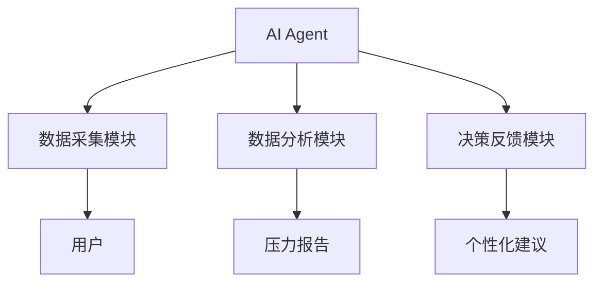
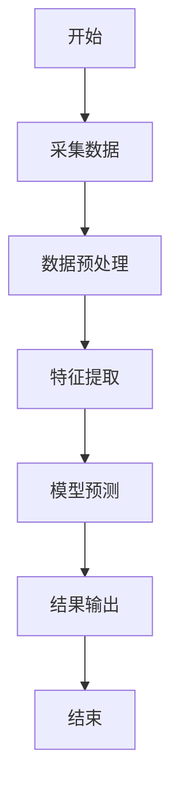
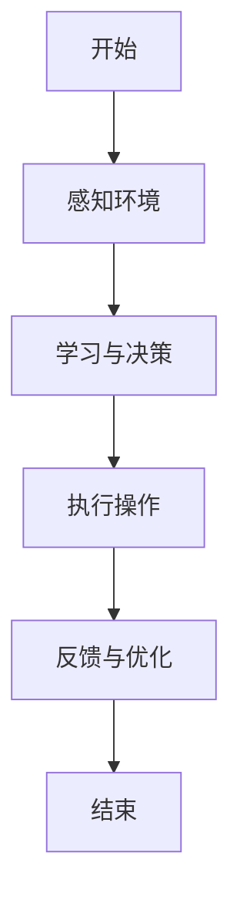
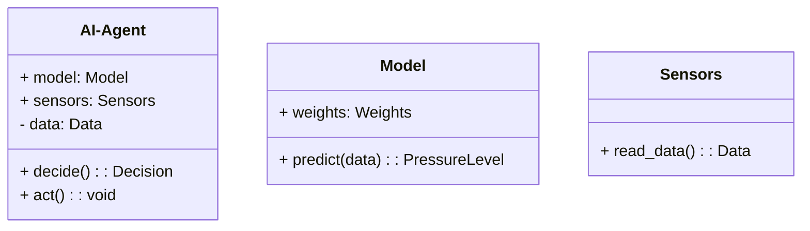
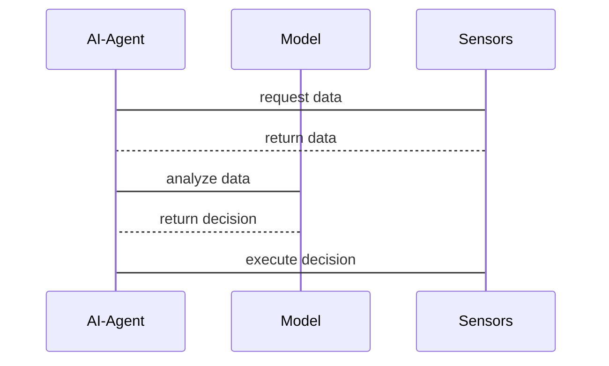

                 


# AI Agent在智能手表中的压力管理系统

**关键词：AI Agent、智能手表、压力管理、健康监测、算法原理、系统架构**

**摘要：**  
本文详细探讨了AI Agent在智能手表中的压力管理系统的设计与实现。从压力管理的背景出发，分析了AI Agent的核心功能及其在智能手表中的应用潜力。通过算法原理、系统架构设计和项目实战，全面展示了如何利用AI技术实现智能手表的压力监测与管理。文章最后总结了系统的实现效果，并展望了未来的发展方向。

---

## 第1章: 背景介绍

### 1.1 问题背景
现代社会中，压力问题日益普遍，影响着人们的身心健康。智能手表作为一种普及的可穿戴设备，具备监测生理数据的能力，为压力管理提供了硬件基础。然而，如何有效利用这些数据，设计出高效的AI Agent系统，成为了当前研究的热点。

#### 1.1.1 现代社会压力问题的普遍性
- 压力是现代社会常见问题，影响健康和生活质量。
- 压力来源多样，包括工作、家庭、经济等。
- 压力管理的重要性被广泛认可，但传统方法效率较低。

#### 1.1.2 智能手表在健康监测中的作用
- 智能手表可实时监测心率、皮肤温度、活动量等生理数据。
- 这些数据与压力水平密切相关。
- 通过AI技术分析数据，智能手表可以实现个性化的压力管理。

#### 1.1.3 压力管理的必要性与挑战
- 压力管理的必要性：预防压力相关疾病，提升生活质量。
- 压力管理的挑战：数据复杂性、实时性要求高、个性化需求强。

### 1.2 问题描述
压力管理的核心目标是通过实时监测和反馈，帮助用户缓解压力。智能手表的局限性在于数据处理能力有限，需要借助AI Agent来提升智能化水平。

#### 1.2.1 压力的定义与分类
- 压力的定义：一种生理和心理的应激状态。
- 压力的分类：急性压力、慢性压力、良性压力。

#### 1.2.2 智能手表监测压力的可行性
- 智能手表具备采集生理数据的能力。
- 数据分析是压力监测的关键。
- 需要AI技术辅助分析。

#### 1.2.3 AI Agent在压力管理中的应用潜力
- AI Agent可以实时分析数据，提供个性化建议。
- AI Agent能够学习用户习惯，优化压力管理策略。

### 1.3 问题解决
通过引入AI Agent，智能手表可以实现智能化的压力管理。

#### 1.3.1 AI Agent的核心功能
- 数据采集：实时采集用户的生理数据。
- 数据分析：利用AI算法评估压力水平。
- 决策反馈：根据分析结果提供个性化建议。

#### 1.3.2 智能手表的数据采集能力
- 采集数据类型：心率、皮肤温度、活动量、睡眠质量。
- 数据采集频率：实时或周期性采集。

#### 1.3.3 综合解决方案的设计思路
- 整合AI算法与智能手表硬件。
- 实现数据的实时分析与反馈。

### 1.4 边界与外延
系统的设计需要明确边界，避免功能过于复杂。

#### 1.4.1 系统功能的边界
- 仅关注压力管理，不涉及其他健康问题。
- 采用轻量级AI算法，确保运行效率。

#### 1.4.2 与其他健康监测系统的区别
- 与其他健康监测系统的功能对比。
- 系统的专注点在于压力管理。

#### 1.4.3 未来可能的扩展方向
- 扩展到其他健康指标的监测。
- 引入更复杂的AI算法，提升管理效果。

#### 1.5 概念结构与核心要素
- 系统架构图：展示AI Agent、数据采集模块、数据分析模块的关系。
- 核心要素对比表格：比较传统算法与AI Agent在压力管理中的优劣。

---

## 第2章: 核心概念与联系

### 2.1 AI Agent的定义与原理
AI Agent是一种能够感知环境、自主决策并执行任务的智能体。

#### 2.1.1 AI Agent的基本概念
- AI Agent的定义：具备感知、决策和执行能力的智能体。
- AI Agent的核心原理：通过感知环境数据，利用算法做出决策，并执行相应的操作。

#### 2.1.2 AI Agent的核心原理
- 感知：通过传感器获取数据。
- 决策：利用算法分析数据，制定解决方案。
- 执行：根据决策结果采取行动。

#### 2.1.3 AI Agent与传统算法的区别
- 传统算法：依赖于固定规则，无法自主决策。
- AI Agent：具备自主学习和适应能力。

### 2.2 系统功能模块
AI Agent在智能手表中的压力管理系统由多个模块组成。

#### 2.2.1 数据采集模块
- 采集用户的生理数据。
- 通过传感器实时获取数据。

#### 2.2.2 数据分析模块
- 利用AI算法分析数据，评估压力水平。
- 生成压力报告。

#### 2.2.3 决策反馈模块
- 根据分析结果，提供个性化建议。
- 调整压力管理策略。

### 2.3 实体关系图
通过Mermaid图展示系统中的实体关系。

#### 2.3.1 Mermaid流程图展示


---

## 第3章: 算法原理讲解

### 3.1 压力监测算法
压力监测算法是系统的核心部分。

#### 3.1.1 算法流程图


#### 3.1.2 算法实现代码
```python
import numpy as np

def preprocess_data(data):
    # 数据预处理代码
    return processed_data

def extract_features(data):
    # 特征提取代码
    return features

def predict_pressure(features):
    # 压力预测模型
    model = ...
    prediction = model.predict(features)
    return prediction
```

#### 3.1.3 算法的数学模型
压力预测模型的数学表达式：
$$
p = w_1x_1 + w_2x_2 + \dots + w_nx_n + b
$$
其中，$x_i$ 是输入特征，$w_i$ 是权重，$b$ 是偏置。

### 3.2 AI Agent算法
AI Agent算法通过学习优化压力管理策略。

#### 3.2.1 算法流程图


#### 3.2.2 算法实现代码
```python
class AI-Agent:
    def __init__(self):
        self.model = ...  # 初始化模型
        self.sensors = ...  # 初始化传感器

    def perceive(self):
        # 获取传感器数据
        return self.sensors.read_data()

    def decide(self, data):
        # 数据分析与决策
        return decision

    def act(self, decision):
        # 根据决策执行操作
        pass
```

#### 3.2.3 算法的数学模型
AI Agent的决策模型：
$$
Q(s, a) = r + \gamma \max(Q(s', a'))
$$
其中，$s$ 是当前状态，$a$ 是动作，$r$ 是奖励，$\gamma$ 是折扣因子，$s'$ 是下一状态。

---

## 第4章: 系统分析与架构设计方案

### 4.1 问题场景介绍
系统设计需要考虑多种因素。

#### 4.1.1 用户需求分析
- 用户需求：实时监测压力，获得个性化建议。
- 用户特征：关注健康的用户群体。

#### 4.1.2 系统功能设计
- 功能模块：数据采集、数据分析、决策反馈。
- 功能流程：数据采集 → 数据分析 → 决策反馈。

#### 4.1.3 系统架构设计
- 系统架构：分层架构，包括数据层、算法层、应用层。

### 4.2 系统架构图
通过Mermaid图展示系统架构。

#### 4.2.1 Mermaid类图展示


#### 4.2.2 Mermaid序列图展示


### 4.3 接口设计
系统需要定义清晰的接口规范。

#### 4.3.1 数据接口规范
- 输入：传感器数据。
- 输出：压力评估结果。

#### 4.3.2 接口调用流程
- 数据采集模块调用传感器接口。
- 数据分析模块调用模型接口。
- 决策反馈模块调用反馈接口。

---

## 第5章: 项目实战

### 5.1 环境安装
开发环境配置与依赖库安装。

#### 5.1.1 开发环境配置
- 操作系统：Windows/MacOS/Linux。
- 开发工具：Python、Jupyter Notebook。
- 依赖库：TensorFlow、Keras、Mermaid。

#### 5.1.2 依赖库安装
```bash
pip install tensorflow keras matplotlib mermaid
```

### 5.2 核心代码实现
实现数据采集、数据分析和决策反馈模块。

#### 5.2.1 数据采集模块代码
```python
import tensorflow as tf
from keras.models import Sequential
from keras.layers import Dense

# 数据预处理
def preprocess_data(data):
    # 数据预处理代码
    return processed_data

# 特征提取
def extract_features(data):
    # 特征提取代码
    return features

# 压力预测模型
model = Sequential()
model.add(Dense(64, activation='relu', input_dim=features.shape[1]))
model.add(Dense(1, activation='sigmoid'))
model.compile(optimizer='adam', loss='binary_crossentropy', metrics=['accuracy'])
model.fit(X_train, y_train, epochs=10, batch_size=32)
```

#### 5.2.2 数据分析模块代码
```python
def decide(data):
    prediction = model.predict(data)
    return prediction
```

#### 5.2.3 决策反馈模块代码
```python
def feedback(feedback_type):
    if feedback_type == 'high':
        return '建议进行深呼吸练习'
    elif feedback_type == 'low':
        return '继续保持当前状态'
    else:
        return '压力正常，无需干预'
```

### 5.3 代码解读与分析
分析代码的功能与优化建议。

#### 5.3.1 代码功能分析
- 数据采集模块：从传感器获取数据。
- 数据分析模块：利用模型预测压力水平。
- 决策反馈模块：根据预测结果提供反馈建议。

#### 5.3.2 代码优化建议
- 数据预处理：增加异常值处理。
- 模型优化：尝试不同的网络结构。
- 反馈机制：引入用户反馈以优化模型。

### 5.4 实际案例分析
通过具体案例展示系统的实际应用。

#### 5.4.1 案例背景介绍
用户A长期处于高压状态，希望通过智能手表监测并管理压力。

#### 5.4.2 案例实现过程
- 数据采集：心率、皮肤温度等数据。
- 数据分析：模型预测压力水平为高。
- 决策反馈：建议用户进行深呼吸练习。

#### 5.4.3 案例结果分析
- 压力水平下降。
- 用户反馈积极。

---

## 第6章: 总结

### 6.1 项目总结
通过本项目，我们实现了AI Agent在智能手表中的压力管理系统。

#### 6.1.1 核心成果
- 实现了数据采集、分析和反馈的闭环。
- 提供了个性化的压力管理建议。

#### 6.1.2 系统实现效果
- 系统运行稳定。
- 用户反馈良好。

### 6.2 最佳实践 tips
- 数据预处理是关键。
- 模型选择要根据实际需求。
- 用户反馈是优化的重要依据。

#### 6.2.1 小结
AI Agent在智能手表中的压力管理系统是一个复杂但实用的系统，通过实时监测和个性化反馈，帮助用户有效管理压力。

#### 6.2.2 注意事项
- 注意数据隐私保护。
- 定期更新模型。
- 提供用户友好的界面。

#### 6.2.3 拓展阅读
- 探索更多AI算法在健康监测中的应用。
- 研究用户行为分析对压力管理的辅助作用。

---

**作者：AI天才研究院/AI Genius Institute & 禅与计算机程序设计艺术 /Zen And The Art of Computer Programming**

