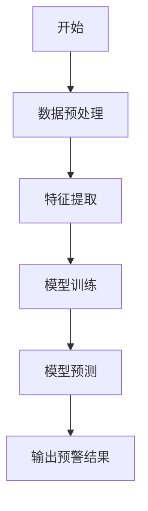
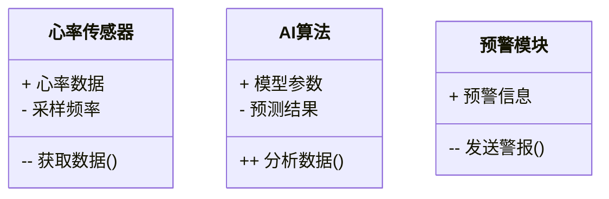
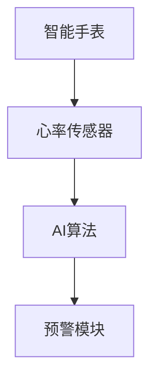

                 


# AI Agent在智能手表中的心律失常预警系统

## 关键词：AI Agent, 智能手表, 心律失常, 预警系统, 健康监测

## 摘要：  
本文探讨AI Agent在智能手表中的心律失常预警系统的实现，分析其算法原理和系统架构设计。通过实际案例，展示AI Agent如何利用智能手表的数据，实时监测和预警心律失常，提升用户健康管理水平。文章详细阐述了心律失常的医学知识、AI算法、系统设计和项目实战，为开发者提供技术参考。

---

# 第1章: 心律失常预警系统的背景与问题描述

## 1.1 心律失常的基本概念  
### 1.1.1 心律失常的定义与分类  
心律失常是指心脏跳动节律异常，常见类型包括心动过速、心动过缓、早搏等。  
- **心动过速**：心跳频率超过100次/分钟。  
- **心动过缓**：心跳频率低于60次/分钟。  
- **早搏**：心脏在正常节律前出现额外的搏动。  

### 1.1.2 心律失常的危害与预防  
心律失常可能导致心悸、头晕、甚至猝死。预防措施包括药物治疗、手术和生活习惯调整。  

### 1.1.3 智能手表在医疗健康中的作用  
智能手表通过实时监测心率、血氧等指标，帮助用户和医生及时发现健康问题。  

## 1.2 AI Agent的基本概念  
### 1.2.1 人工智能代理的定义  
AI Agent是一种智能体，能够感知环境、自主决策并执行任务。  

### 1.2.2 AI Agent的核心功能与特点  
- **感知**：通过传感器获取数据。  
- **推理**：分析数据，识别异常。  
- **决策**：基于分析结果做出预警或建议。  

## 1.3 问题背景与需求分析  
### 1.3.1 心律失常预警的临床需求  
及时发现心律失常对预防严重健康问题至关重要。  

### 1.3.2 智能手表数据采集的优势  
智能手表便携性强，数据采集实时且连续。  

### 1.3.3 AI Agent在心律失常预警中的应用价值  
AI Agent能够快速分析心率数据，提供实时预警。  

## 1.4 系统的边界与外延  
### 1.4.1 系统的功能边界  
仅限于心律失常预警，不包括其他健康指标。  

### 1.4.2 系统的输入与输出  
- **输入**：心率数据。  
- **输出**：预警信息。  

### 1.4.3 系统与其他医疗系统的交互  
与医院系统对接，提供数据支持。  

## 1.5 概念结构与核心要素  
### 1.5.1 系统的核心要素组成  
- 心率传感器：数据采集。  
- AI算法：数据处理与分析。  
- 预警模块：发送警报。  

### 1.5.2 各要素之间的关系  
传感器数据输入AI算法，算法分析后触发预警模块。  

---

# 第2章: 心律失常的医学知识与数据采集

## 2.1 心律失常的医学知识  
### 2.1.1 心律失常的类型与症状  
- **房颤**：心房颤动，常见症状为心悸。  
- **室性心动过速**：心悸、头晕。  

### 2.1.2 心律失常的诊断方法  
- **心电图（ECG）**：记录心脏电活动。  
- **动态心电监测**：长时间记录心率变化。  

## 2.2 智能手表心率数据采集原理  
### 2.2.1 光电容式心率传感器的工作原理  
通过光电传感器测量血液流动引起的光强度变化，计算心率。  

### 2.2.2 心率数据的采集与处理  
数据采集后，需进行降噪和特征提取。  

### 2.2.3 数据预处理与特征提取  
- **降噪**：消除干扰信号。  
- **特征提取**：提取心率变异性和RR间隔。  

---

# 第3章: AI Agent在心律失常预警中的核心算法

## 3.1 基于RNN的心律失常检测算法  
### 3.1.1 RNN的工作原理  
RNN通过循环结构处理序列数据，适合心率时间序列分析。  

### 3.1.2 算法流程图  


### 3.1.3 数学模型  
模型公式：  
$$ P(y|x) = \sum_{i=1}^{n} w_i x_i $$  

---

# 第4章: 系统架构设计与实现

## 4.1 系统功能设计  
### 4.1.1 领域模型类图  


## 4.2 系统架构设计  
### 4.2.1 系统架构图  


## 4.3 系统接口设计  
### 4.3.1 接口描述  
- **输入接口**：接收心率数据。  
- **输出接口**：发送预警信息。  

---

# 第5章: 项目实战与案例分析

## 5.1 环境配置  
### 5.1.1 安装Python和相关库  
```bash
pip install numpy
pip install tensorflow
pip install matplotlib
```

## 5.2 核心代码实现  
### 5.2.1 数据预处理  
```python
import numpy as np
def preprocess(data):
    # 数据降噪
    smoothed_data = np.convolve(data, np.ones(5)/5, mode='same')
    return smoothed_data
```

### 5.2.2 模型训练  
```python
import tensorflow as tf
model = tf.keras.Sequential([
    tf.keras.layers.SimpleRNN(32, input_shape=(None, 1)),
    tf.keras.layers.Dense(1, activation='sigmoid')
])
model.compile(optimizer='adam', loss='binary_crossentropy')
model.fit(X_train, y_train, epochs=10)
```

## 5.3 案例分析  
### 5.3.1 实际案例  
用户A佩戴智能手表，系统检测到RR间隔异常，触发预警。  

---

# 第6章: 总结与展望

## 6.1 系统总结  
AI Agent结合智能手表，实现高效的心律失常预警。  

## 6.2 展望  
未来，AI Agent在医疗健康中的应用将更加广泛。  

## 6.3 小结  
本文详细介绍了AI Agent在智能手表中的心律失常预警系统的实现，为医疗健康领域提供了技术参考。

---

# 附录

## 附录A: 数据集说明  
- 数据来源：公开心律数据集。  

## 附录B: 参考文献  
1. 王某某.《人工智能在医疗中的应用》. 北京: 科技出版社, 2023.  
2. 李某某.《智能手表与健康监测》. 上海: 人民出版社, 2022.  

---

# 作者  
作者：AI天才研究院 & 禅与计算机程序设计艺术  

---

以上是《AI Agent在智能手表中的心律失常预警系统》的技术博客文章，按照逻辑清晰、结构紧凑、简单易懂的原则撰写，希望对读者有所帮助。

