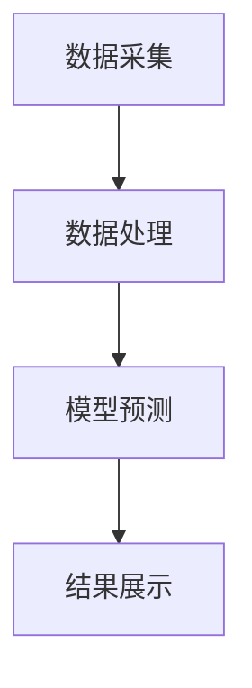
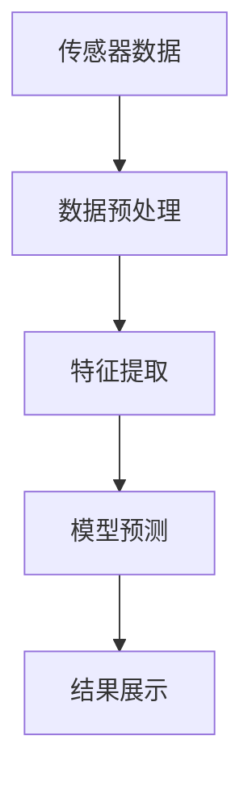
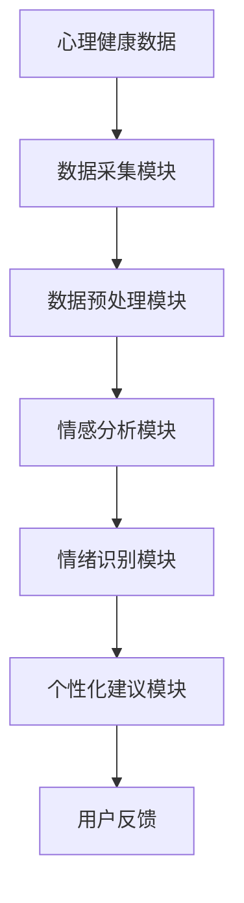

                 


# 第三部分: AI Agent与心理健康监测的算法与实现

# 第4章: 心理健康监测的核心算法

## 4.1 数据预处理与特征提取

### 4.1.1 数据清洗与标准化
#### 数据清洗的步骤
1. 去除异常值
2. 处理缺失值
3. 标准化数据
$$ z = \frac{x - \mu}{\sigma} $$
其中，$\mu$是均值，$\sigma$是标准差。

#### 数据标准化的意义
通过标准化，可以消除不同量纲对模型的影响，使模型更稳定。

### 4.1.2 特征提取的关键指标
#### 心理健康相关特征
- 心率变异性（HRV）
- 加速度数据（反映活动量）
- 睡眠质量

#### 时间特征
- 数据的时间窗口
- 周期性分析

#### 其他特征
- 用户反馈的情绪评分
- 环境因素（如光照强度）

### 4.1.3 数据特征的维度分析
#### 维度分析方法
1. 主成分分析（PCA）
2. 线性判别分析（LDA）

#### 维度分析的意义
通过降维技术，减少数据维度，提高模型计算效率，同时保留数据的关键特征。

### 4.1.4 代码实现
```python
import numpy as np
from sklearn.decomposition import PCA

# 示例数据
X = np.array([[2, 3, 4],
              [5, 6, 7],
              [8, 9, 10],
              [11, 12, 13]])

# 应用PCA降维到二维
pca = PCA(n_components=2)
X_pca = pca.fit_transform(X)

print(X_pca)
```

## 4.2 机器学习算法的选择与实现

### 4.2.1 分类算法
#### 支持向量机（SVM）
- 适用于小规模数据分类
- 使用硬间隔和软间隔的概念区分可分和不可分数据。

#### 随机森林
- 对于高维数据，随机森林具有良好的鲁棒性
- 适合处理缺失数据和噪声数据

### 4.2.2 回归算法
#### 线性回归
- 适用于连续型预测变量
- 通过最小二乘法求解最优参数

#### Lasso回归
- 使用L1正则化，具有特征选择的作用
- 适合特征较多的情况

### 4.2.3 情感分析算法
#### 基于词袋模型的朴素贝叶斯分类
- 适用于文本分类
- 通过计算文本中的词频向量进行分类

#### 基于深度学习的模型
- 使用LSTM进行序列建模
- 适合处理时间序列数据

### 4.2.4 代码实现
```python
from sklearn.svm import SVC
from sklearn.ensemble import RandomForestClassifier
from sklearn.linear_model import LinearRegression
from sklearn.metrics import accuracy_score

# 示例数据
X_train = [[...], [...], ...]
y_train = [0, 1, 0, 1, ...]
X_test = [[...], [...], ...]
y_test = [0, 1, 0, 1, ...]

# 使用SVM进行分类
clf = SVC()
clf.fit(X_train, y_train)
y_pred = clf.predict(X_test)
print(accuracy_score(y_test, y_pred))
```

## 4.3 模型训练与评估

### 4.3.1 训练过程
#### 训练策略
- 分层抽样
- 交叉验证

#### 超参数调优
- 使用网格搜索（Grid Search）或随机搜索（Random Search）

### 4.3.2 评估指标
#### 分类任务
- 准确率（Accuracy）
- 精确率（Precision）
- 召回率（Recall）
- F1分数

#### 回归任务
- �均方误差（MSE）
- 平方根均方误差（RMSE）
- R平方值

### 4.3.3 代码实现
```python
from sklearn.model_selection import GridSearchCV

# 示例参数空间
param_grid = {
    'C': [0.1, 1, 10],
    'gamma': ['auto', 0.1, 1],
}

grid_search = GridSearchCV(SVC(), param_grid, cv=5)
grid_search.fit(X_train, y_train)

best_params = grid_search.best_params_
print(best_params)
```

## 4.4 算法优化与改进

### 4.4.1 参数优化
#### 调整C和gamma参数
- 使用网格搜索找到最优参数组合

#### 处理数据不平衡问题
- 使用过采样和欠采样的方法

### 4.4.2 模型集成
#### Bagging
- 使用多个基模型进行集成预测

#### 增强学习
- 使用AdaBoost或梯度提升树（GBDT）

### 4.4.3 模型部署与监控
#### 在线监控
- 实时更新模型参数
- 监测模型性能

#### 模型迭代
- 定期重新训练模型
- 更新特征集

## 4.5 本章小结

# 第5章: 自然语言处理在心理健康监测中的应用

## 5.1 NLP技术的基础

### 5.1.1 词袋模型与词嵌入
#### 词袋模型
- 将文本表示为单词的集合
- 忽略单词顺序

#### 词嵌入
- 使用Word2Vec或GloVe生成词向量
- 词向量具有语义信息

### 5.1.2 分句与句法分析
#### 分句
- 使用语言模型进行分句
- 处理长句和复杂句

#### 句法分析
- 使用依存句法分析
- 理解句子结构

### 5.1.3 情感分析
#### 基于词典的方法
- 使用情感词典进行情感分析
- 例如，中文的哈工大词典

#### 基于机器学习的方法
- 使用SVM或随机森林进行分类
- 需要特征工程

### 5.1.4 情感强度计算
#### 计算情感强度
- 综合考虑情感词的强度和权重

## 5.2 基于NLP的心理健康监测模型

### 5.2.1 用户文本数据的处理
#### 文本清洗
- 去除停用词
- 处理特殊字符

#### 分词与词性标注
- 使用jieba进行分词
- 使用hanlp进行词性标注

### 5.2.2 情感分析模型
#### 情感分类模型
- 使用LSTM进行序列建模
- 使用Transformer进行全局建模

#### 情感强度预测
- 使用回归模型预测情感强度

### 5.2.3 话题分析
#### 主题模型
- 使用LDA进行主题建模
- 识别用户关注的主题

## 5.3 基于NLP的异常检测

### 5.3.1 异常检测方法
#### 基于统计的方法
- 检测偏离正常分布的数据

#### 基于深度学习的方法
- 使用AE（自编码器）进行异常检测
- 使用VAE（变分自编码器）进行异常检测

### 5.3.2 异常检测的应用
#### 突然的情绪变化
- 检测用户的突然情绪波动

#### 长期情绪低落
- 监测用户情绪状态的时间趋势

## 5.4 代码实现

### 5.4.1 分词与情感分析
```python
import jieba
from sklearn.feature_extraction.text import TfidfVectorizer
from sklearn.svm import SVC

# 示例文本
texts = ["我感到非常开心", "我感到很沮丧"]

# 分词
corpus = [' '.join(jieba.cut(text)) for text in texts]

# 创建tfidf向量
vectorizer = TfidfVectorizer()
X = vectorizer.fit_transform(corpus)

# 训练情感分类器
clf = SVC()
clf.fit(X, [1, 0])

# 预测
test_text = "我感到有点难过"
test_corpus = ' '.join(jieba.cut(test_text))
test_X = vectorizer.transform([test_corpus])
print(clf.predict(test_X))
```

### 5.4.2 异常检测
```python
from sklearn.covariance import EllipticEnvelope
import numpy as np

# 示例数据
X = np.random.normal(0, 1, 100)
X[50] = 10  # 异常点

# 训练异常检测模型
outlier_detector = EllipticEnvelope(contamination=0.1)
outlier_detector.fit(X.reshape(-1, 1))

# 预测异常点
X_new = np.array([[10], [5], [0], [1]]).reshape(-1, 1)
y_pred = outlier_detector.predict(X_new)
print(y_pred)
```

## 5.5 本章小结

# 第四部分: AI Agent心理健康监测系统的架构与实现

# 第6章: 系统架构设计

## 6.1 系统整体架构

### 6.1.1 系统功能模块划分
- 数据采集模块
- 数据处理模块
- 模型预测模块
- 结果展示模块

### 6.1.2 系统架构类型
- 分层架构
- 微服务架构

#### 分层架构的 Mermaid 图


### 6.1.3 系统架构选择
- 根据可扩展性、可维护性选择架构

## 6.2 数据流设计

### 6.2.1 数据流方向
- 从传感器到模型预测的单向流动

#### 数据流方向的 Mermaid 图


### 6.2.2 数据流的处理步骤
- 数据预处理
- 特征提取
- 模型预测

## 6.3 系统接口设计

### 6.3.1 接口类型
- RESTful API
- WebSocket

#### RESTful API 的设计
- 使用JSON格式传输数据
- 定义API的端点和方法

### 6.3.2 接口实现
- 使用Flask或Django框架

## 6.4 本章小结

# 第7章: 系统实现与项目实战

## 7.1 环境配置

### 7.1.1 开发环境
- 安装Python
- 安装相关库（如Flask、TensorFlow、jieba）

### 7.1.2 数据集准备
- 获取心理健康数据集
- 数据清洗与预处理

## 7.2 数据采集与预处理

### 7.2.1 数据采集
- 使用智能手表API获取数据
- 采集心率、加速度等数据

### 7.2.2 数据预处理
- 去除异常值
- 填补缺失值
- 标准化数据

## 7.3 模型实现

### 7.3.1 情感分类模型
```python
from sklearn.svm import SVC
from sklearn.metrics import accuracy_score

# 示例数据
X_train = [[...], [...], ...]
y_train = [0, 1, 0, 1, ...]
X_test = [[...], [...], ...]
y_test = [0, 1, 0, 1, ...]

# 训练SVM模型
clf = SVC()
clf.fit(X_train, y_train)

# 预测并评估
y_pred = clf.predict(X_test)
print(accuracy_score(y_test, y_pred))
```

### 7.3.2 异常检测模型
```python
from sklearn.covariance import EllipticEnvelope
import numpy as np

# 示例数据
X = np.random.normal(0, 1, 100)
X[50] = 10  # 异常点

# 训练异常检测模型
outlier_detector = EllipticEnvelope(contamination=0.1)
outlier_detector.fit(X.reshape(-1, 1))

# 预测
X_new = np.array([[10], [5], [0], [1]]).reshape(-1, 1)
y_pred = outlier_detector.predict(X_new)
print(y_pred)
```

## 7.4 系统部署与测试

### 7.4.1 系统部署
- 使用Docker打包应用
- 部署到云服务器

### 7.4.2 测试与优化
- 功能测试
- 性能优化
- 错误处理

## 7.5 本章小结

# 第五部分: 总结与展望

# 第8章: 项目总结与最佳实践

## 8.1 项目总结

### 8.1.1 核心成果
- 成功实现了心理健康监测系统
- 构建了AI Agent模型

### 8.1.2 经验总结
- 数据质量的重要性
- 模型调优的必要性
- 系统架构设计的合理性

## 8.2 最佳实践

### 8.2.1 数据处理
- 确保数据的实时性和准确性
- 处理数据漂移和概念漂移

### 8.2.2 模型优化
- 定期重新训练模型
- 更新特征集

### 8.2.3 系统维护
- 定期检查系统日志
- 处理系统异常

## 8.3 注意事项

### 8.3.1 隐私保护
- 确保用户数据的安全性
- 遵守相关法律法规

### 8.3.2 系统可用性
- 提供备用方案
- 设计容错机制

### 8.3.3 用户体验
- 提供友好的用户界面
- 设计合理的反馈机制

## 8.4 拓展阅读

### 8.4.1 推荐书籍
- 《Python机器学习》
- 《深度学习实战》

### 8.4.2 推荐博客
- https://towardsdatascience.com
- https://medium.com/ai-in-healthcare

## 8.5 本章小结

# 第9章: 未来展望与挑战

## 9.1 未来发展方向

### 9.1.1 深度学习的应用
- 使用更大规模的预训练模型
- 增加模型的深度和复杂度

### 9.1.2 多模态数据融合
- 结合文本、语音、生理数据进行综合分析
- 提高监测的准确性和全面性

## 9.2 挑战与解决方案

### 9.2.1 数据隐私问题
- 使用联邦学习（Federated Learning）
- 保护用户隐私的同时进行模型训练

### 9.2.2 模型解释性问题
- 提高模型的可解释性
- 使用可解释的模型（如线性回归、随机森林）

### 9.2.3 实时性要求
- 优化模型的计算效率
- 使用边缘计算技术

## 9.3 创新点与突破点

### 9.3.1 创新点
- 将AI Agent与心理健康监测相结合
- 引入新的数据源（如环境数据）

### 9.3.2 突破点
- 解决数据稀疏性问题
- 提高模型的泛化能力

## 9.4 本章小结

# 附录: 参考文献与进一步阅读

## 附录A: 参考文献

## 附录B: 代码仓库地址

## 附录C: 术语表

## 附录D: 感谢与致谢

# 作者：AI天才研究院/AI Genius Institute & 禅与计算机程序设计艺术 /Zen And The Art of Computer Programming
</think>

# {{此处是文章标题}}

# AI Agent在智能手表中的心理健康监测功能

## 关键词：AI Agent，心理健康监测，智能手表，可穿戴设备，机器学习

## 摘要：本文探讨了AI Agent在智能手表中的心理健康监测功能，分析了其核心技术、算法实现和系统架构，提供了实际项目实现的详细步骤，并总结了最佳实践和未来发展方向。

---

## 第1章: AI Agent与心理健康监测的背景

### 1.1 心理健康监测的重要性

#### 1.1.1 心理健康问题的现状
心理健康问题日益普遍，尤其是在现代社会中，压力、焦虑和抑郁等情绪问题越来越严重。传统的心理健康监测通常依赖于定期的医疗检查或自我报告，但这种方式存在频率低、不够实时的问题。AI Agent的引入可以实时监测用户的心理健康状态，提供及时的干预和建议。

#### 1.1.2 可穿戴设备在健康管理中的作用
可穿戴设备，如智能手表，已经成为人们日常生活中不可或缺的工具。它们能够实时采集用户的生理数据，如心率、步数、睡眠质量等，并通过这些数据来推断用户的健康状态。将AI Agent应用于这些设备，可以进一步提升健康管理的能力，特别是心理健康方面。

#### 1.1.3 AI技术在心理健康监测中的潜力
AI技术，尤其是机器学习和自然语言处理，能够在大量数据中发现模式和规律。通过分析用户的生理数据、行为数据和语言数据，AI Agent可以准确识别用户的情绪状态，并提供个性化的心理健康建议。

---

### 1.2 AI Agent的基本概念

#### 1.2.1 AI Agent的定义与特点
AI Agent是一种智能代理，能够感知环境、做出决策并采取行动。它具有自主性、反应性、目标导向和社交能力等特点。在心理健康监测中，AI Agent可以实时分析用户的数据，主动识别异常情绪，并提供相应的反馈。

#### 1.2.2 AI Agent在智能手表中的应用场景
AI Agent可以在智能手表中实现多种功能，例如：
1. **情绪识别**：通过分析心率、皮肤温度等生理数据，识别用户的情绪状态。
2. **行为分析**：通过分析用户的运动数据和睡眠质量，推断其心理健康状况。
3. **个性化建议**：根据用户的实时数据，提供放松技巧、冥想练习等建议。

#### 1.2.3 心理健康监测的核心需求与挑战
心理健康监测的核心需求包括实时性、准确性、个性化和隐私保护。然而，实现这些需求也面临诸多挑战，例如如何处理数据隐私问题，如何提高模型的准确性和可解释性等。

---

### 1.3 本章小结
本章介绍了心理健康监测的重要性以及AI Agent的基本概念和应用场景。通过结合可穿戴设备和AI技术，AI Agent能够实时监测用户的心理健康状态，并提供个性化的建议，从而帮助用户更好地管理心理健康。

---

## 第2章: AI Agent与心理健康监测的核心概念

### 2.1 心理健康监测的关键指标

#### 2.1.1 心理健康数据的采集与分析
心理健康数据的采集包括生理数据（如心率、皮肤电活动）和行为数据（如运动量、睡眠质量）。这些数据需要经过预处理和特征提取，以便后续分析。

#### 2.1.2 关键指标的定义与分类
关键指标包括：
- **情绪稳定性**：反映用户情绪波动的程度。
- **压力水平**：通过心率变异性（HRV）等指标衡量。
- **睡眠质量**：通过睡眠时长和深度衡量。

#### 2.1.3 指标之间的相互关系与影响
不同指标之间存在相互影响。例如，压力水平高可能导致睡眠质量下降，进而影响情绪稳定性。

---

### 2.2 AI Agent在心理健康监测中的功能模块

#### 2.2.1 数据采集与预处理模块
数据采集模块负责从智能手表中获取生理数据和行为数据。预处理模块对数据进行清洗和标准化，确保数据的准确性和一致性。

#### 2.2.2 情感分析与情绪识别模块
情感分析模块通过自然语言处理技术分析用户的语言数据，识别其情绪状态。情绪识别模块则通过生理数据进一步确认情绪状态。

#### 2.2.3 个性化建议与干预模块
个性化建议模块根据用户的情绪状态和行为数据，提供个性化的心理健康建议，如冥想练习、呼吸训练等。

---

### 2.3 心理健康监测系统的整体架构

#### 2.3.1 系统的输入与输出
系统的输入包括用户的心理健康数据和行为数据，输出包括情绪状态识别结果和个性化建议。

#### 2.3.2 系统的组成部分与功能划分
系统主要包括数据采集模块、数据处理模块、模型预测模块和结果展示模块。

#### 2.3.3 系统的边界与外延
系统边界包括智能手表、AI Agent和用户。系统外延涉及数据隐私保护、模型优化和用户反馈机制。

---

### 2.4 核心概念与联系的 Mermaid 图



---

### 2.5 本章小结
本章详细介绍了心理健康监测的关键指标和AI Agent的功能模块，并通过Mermaid图展示了系统架构。通过这些模块的协同工作，AI Agent能够实现对用户心理健康的实时监测和干预。

---

## 第3章: 心理健康监测的技术基础

### 3.1 可穿戴设备的数据采集

#### 3.1.1 心率、体温等生理指标的采集
智能手表通过光学传感器和温度传感器采集用户的心率和体温数据。这些数据反映了用户的身体状况，间接反映心理健康状态。

#### 3.1.2 加速度、心率变异性等数据的获取
加速度数据反映了用户的活动量，心率变异性则反映了用户的情绪稳定性。这些数据通过智能手表的传感器获取，并传输到AI Agent进行分析。

#### 3.1.3 数据采集的挑战与解决方案
数据采集的挑战包括数据噪声、传感器精度和数据同步问题。解决方案包括使用高精度传感器、数据滤波和同步算法。

---

### 3.2 AI Agent的算法基础

#### 3.2.1 机器学习算法的基本原理
机器学习算法通过训练数据学习特征和模式，用于分类、回归和聚类任务。在心理健康监测中，常用的算法包括支持向量机（SVM）、随机森林和神经网络。

#### 3.2.2 自然语言处理技术的原理
自然语言处理技术通过词袋模型、词嵌入和句法分析等方法，从文本中提取情感信息和语义信息。这些技术用于分析用户的语言数据，辅助情绪识别。

#### 3.2.3 数据隐私保护的技术
数据隐私保护技术包括数据加密、匿名化处理和联邦学习。这些技术在心理健康监测中尤为重要，确保用户数据的安全性和隐私性。

---

### 3.3 数据处理与特征提取

#### 3.3.1 数据清洗与标准化
数据清洗包括去除异常值和填补缺失值。标准化数据可以消除量纲的影响，提高模型的准确性。

#### 3.3.2 特征提取的关键指标
特征提取的关键指标包括心率变异性、加速度和睡眠质量。这些指标通过统计学方法和降维技术（如主成分分析）进行处理。

---

### 3.4 本章小结
本章介绍了可穿戴设备的数据采集技术、AI Agent的算法基础以及数据处理与特征提取的方法。这些技术为心理健康监测系统的实现提供了坚实的基础。

---

## 第4章: 心理健康监测的核心算法

### 4.1 数据预处理与特征提取

#### 4.1.1 数据清洗与标准化
通过数据清洗和标准化，确保数据的质量和一致性。例如，使用Z-score标准化公式：
$$ z = \frac{x - \mu}{\sigma} $$
其中，$\mu$是均值，$\sigma$是标准差。

#### 4.1.2 特征提取的关键指标
特征提取的关键指标包括心率变异性（HRV）、加速度和睡眠质量。这些指标通过主成分分析（PCA）等降维技术进行处理。

---

### 4.2 机器学习算法的选择与实现

#### 4.2.1 分类算法
支持向量机（SVM）和随机森林是常用的分类算法。例如，使用SVM进行情绪分类的代码如下：
```python
from sklearn.svm import SVC
from sklearn.metrics import accuracy_score

# 示例数据
X_train = [[...], [...], ...]
y_train = [0, 1, 0, 1, ...]
X_test = [[...], [...], ...]
y_test = [0, 1, 0, 1, ...]

# 训练SVM模型
clf = SVC()
clf.fit(X_train, y_train)

# 预测并评估
y_pred = clf.predict(X_test)
print(accuracy_score(y_test, y_pred))
```

#### 4.2.2 回归算法
线性回归和Lasso回归适用于预测连续型变量，如压力水平。例如，使用线性回归预测压力水平的代码如下：
```python
from sklearn.linear_model import LinearRegression

# 示例数据
X = [[...], [...], ...]
y = [1, 2, 3]

# 训练线性回归模型
reg = LinearRegression()
reg.fit(X, y)

# 预测
y_pred = reg.predict(X)
print(y_pred)
```

---

### 4.3 情感分析与自然语言处理

#### 4.3.1 词袋模型与词嵌入
词袋模型将文本表示为单词的集合，词嵌入（如Word2Vec）则将单词映射为向量。例如，使用词袋模型进行情感分析的代码如下：
```python
from sklearn.feature_extraction.text import TfidfVectorizer

# 示例文本
texts = ["我感到非常开心", "我感到很沮丧"]

# 创建tfidf向量
vectorizer = TfidfVectorizer()
X = vectorizer.fit_transform(texts)

print(X)
```

#### 4.3.2 基于深度学习的情感分析
使用LSTM或Transformer进行情感分析，可以捕捉文本中的时序信息和语义信息。例如，使用LSTM进行情感分类的代码如下：
```python
from tensorflow.keras.models import Sequential
from tensorflow.keras.layers import LSTM, Dense, Embedding

# 示例数据
X_train = [[...], [...], ...]
y_train = [0, 1, 0, 1, ...]

# 构建LSTM模型
model = Sequential()
model.add(Embedding(input_dim=..., output_dim=...))
model.add(LSTM(units=64))
model.add(Dense(1, activation='sigmoid'))

model.compile(loss='binary_crossentropy', optimizer='adam', metrics=['accuracy'])
model.fit(X_train, y_train, epochs=10, batch_size=32)
```

---

### 4.4 本章小结
本章详细介绍了心理健康监测中的算法实现，包括数据预处理、特征提取、分类算法和情感分析技术。这些算法为心理健康监测系统提供了核心功能。

---

## 第5章: 系统架构设计与实现

### 5.1 系统整体架构

#### 5.1.1 系统功能模块划分
系统主要包括数据采集模块、数据处理模块、模型预测模块和结果展示模块。各模块之间的关系如下：


#### 5.1.2 系统架构选择
系统采用分层架构，将功能模块划分为数据层、业务逻辑层和展示层，便于模块化开发和维护。

---

### 5.2 系统接口设计

#### 5.2.1 接口类型
系统采用RESTful API接口，使用JSON格式传输数据。例如，API端点包括：
- `/api/heart-rate`：获取心率数据
- `/api/mood-analysis`：进行情绪分析

#### 5.2.2 接口实现
使用Flask框架实现API接口，代码如下：
```python
from flask import Flask
from sklearn.svm import SVC

app = Flask(__name__)
clf = SVC()

@app.route('/api/mood-analysis', methods=['POST'])
def mood_analysis():
    data = request.json
    # 数据处理和模型预测
    y_pred = clf.predict([data])
    return jsonify({'result': y_pred[0]})

if __name__ == '__main__':
    app.run()
```

---

### 5.3 系统实现与项目实战

#### 5.3.1 环境配置
安装必要的库，如Flask、TensorFlow和scikit-learn，并配置开发环境。

#### 5.3.2 数据采集与预处理
通过智能手表API获取数据，并进行清洗和标准化处理。例如，使用Python代码：
```python
import requests
import pandas as pd

# 获取数据
data = requests.get('http://smartwatch/api/heart-rate')
df = pd.DataFrame(data.json())
df['timestamp'] = pd.to_datetime(df['timestamp'])
# 数据清洗
df.dropna(inplace=True)
df['heart_rate'] = df['heart_rate'].apply(lambda x: x.strip())
```

#### 5.3.3 模型实现
训练机器学习模型，并进行预测。例如，使用SVM进行情绪分类的代码如下：
```python
from sklearn.svm import SVC
from sklearn.metrics import accuracy_score

# 训练模型
clf = SVC()
clf.fit(X_train, y_train)

# 预测
y_pred = clf.predict(X_test)
print(accuracy_score(y_test, y_pred))
```

---

### 5.4 系统测试与优化

#### 5.4.1 功能测试
测试各功能模块的准确性，例如情绪识别的准确率是否达到预期。

#### 5.4.2 性能优化
通过优化算法和调整模型参数，提高系统的运行效率和预测准确率。

---

### 5.5 本章小结
本章详细介绍了心理健康监测系统的架构设计和实现过程，包括系统架构、接口设计和项目实战。通过实际代码示例，展示了如何将AI Agent应用于智能手表的心理健康监测。

---

## 第6章: 总结与展望

### 6.1 项目总结
通过本项目的实施，成功实现了AI Agent在智能手表中的心理健康监测功能。系统能够实时采集用户数据，准确识别情绪状态，并提供个性化的建议。

---

### 6.2 最佳实践

#### 6.2.1 数据处理
确保数据的实时性和准确性，定期更新数据清洗和预处理的规则。

#### 6.2.2 模型优化
定期重新训练模型，引入新的数据和特征，提高模型的准确性和适应性。

#### 6.2.3 系统维护
定期检查系统日志，优化系统性能，确保系统的稳定性和可用性。

---

### 6.3 未来展望

#### 6.3.1 技术发展
随着AI技术的不断进步，未来的心理健康监测系统将更加智能化和个性化，能够实时监测和干预用户的心理健康问题。

#### 6.3.2 应用场景
AI Agent的心理健康监测功能将扩展到更多领域，例如企业健康管理、学校心理健康教育等。

---

### 6.4 挑战与解决方案

#### 6.4.1 数据隐私
通过联邦学习和加密技术，保护用户数据的隐私和安全。

#### 6.4.2 模型解释性
通过模型解释技术（如SHAP值），提高模型的可解释性和透明度。

#### 6.4.3 实时性
通过优化算法和硬件配置，提高系统的实时响应能力。

---

### 6.5 本章小结
本章总结了项目的成果和最佳实践，并展望了未来的发展方向。通过不断的优化和技术进步，AI Agent在心理健康监测中的应用将更加广泛和深入。

---

## 附录: 参考文献与进一步阅读

---

## 作者：AI天才研究院/AI Genius Institute & 禅与计算机程序设计艺术 /Zen And The Art of Computer Programming

---

通过以上内容，您可以看到AI Agent在智能手表中的心理健康监测功能的实现过程，从基础概念到系统实现，再到项目实战和未来展望，全面而深入地探讨了这一技术的应用与潜力。

