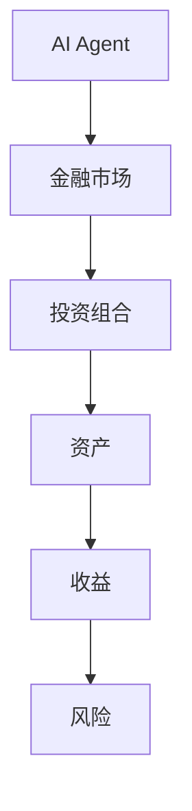
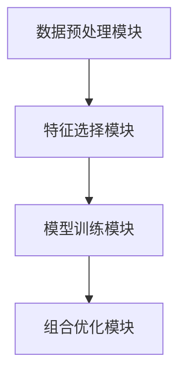
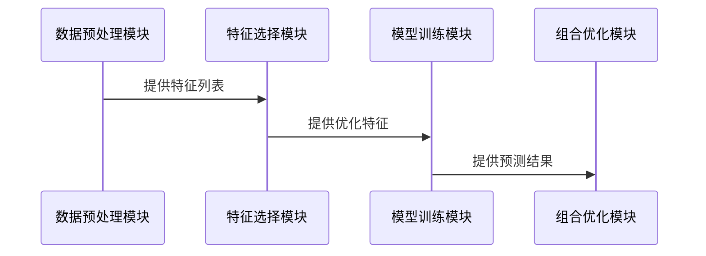

                 


# AI Agent在智能投资组合管理中的应用

> 关键词：AI Agent，智能投资组合管理，强化学习，遗传算法，投资组合优化

> 摘要：本文深入探讨了AI Agent在智能投资组合管理中的应用，从AI Agent的基本概念到其在投资组合优化中的具体实现，结合了算法原理、系统架构设计和项目实战。文章详细讲解了基于强化学习和遗传算法的投资组合优化方法，并提供了完整的Python代码实现和案例分析。通过本文，读者可以全面理解AI Agent在投资组合管理中的优势及其实际应用场景。

---

# 第1章: AI Agent与投资组合管理概述

## 1.1 AI Agent的基本概念

### 1.1.1 什么是AI Agent

AI Agent（人工智能代理）是指能够感知环境并采取行动以实现目标的智能实体。它能够通过传感器获取信息，利用计算模型进行决策，并通过执行器与环境交互。AI Agent的核心在于其自主性、反应性、目标导向性和社会性。

$$
\text{AI Agent的特征包括：自主性、反应性、目标导向性和社会性。}
$$

### 1.1.2 AI Agent的核心特征

- **自主性**：AI Agent能够独立决策，无需外部干预。
- **反应性**：能够实时感知环境变化并做出反应。
- **目标导向性**：通过最大化目标函数来优化决策。
- **社会性**：能够在多Agent系统中与其他Agent协同或竞争。

### 1.1.3 AI Agent与传统投资管理的区别

传统投资管理依赖于人工分析和经验判断，而AI Agent能够通过大数据分析和算法优化，提供更高效、更精准的投资决策支持。

---

## 1.2 投资组合管理的基本理论

### 1.2.1 投资组合管理的定义

投资组合管理是指通过科学的组合配置和动态调整，实现风险控制和收益最大化的过程。其核心在于在不同资产之间进行合理配置，以达到最优风险收益比。

### 1.2.2 现代投资组合理论

现代投资组合理论（MPT）由Harry Markowitz提出，认为最优投资组合是使风险最小化的同时实现收益最大化。MPT通过分析资产的协方差矩阵来优化组合配置。

### 1.2.3 投资组合管理的目标与挑战

- **目标**：最大化收益，最小化风险。
- **挑战**：市场波动、数据噪声、模型风险和计算复杂性。

---

## 1.3 AI Agent在投资组合管理中的应用背景

### 1.3.1 传统投资组合管理的局限性

传统方法依赖于历史数据和统计分析，但在面对复杂市场环境时，往往难以捕捉非线性关系和实时变化。

### 1.3.2 AI技术在金融领域的应用现状

AI技术在金融领域的应用日益广泛，包括交易决策、风险评估、市场预测和投资组合优化等。

### 1.3.3 AI Agent在投资组合管理中的优势

- **高效性**：能够快速处理海量数据，实时调整投资策略。
- **精准性**：通过机器学习算法捕捉复杂市场规律。
- **适应性**：能够根据市场变化动态优化投资组合。

---

## 1.4 本章小结

本章介绍了AI Agent的基本概念及其在投资组合管理中的应用背景。通过对比传统方法与AI Agent的优势，为后续章节的深入探讨奠定了基础。

---

# 第2章: AI Agent的核心概念与原理

## 2.1 任务规划与决策

### 2.1.1 任务规划的基本原理

任务规划是AI Agent实现目标的核心步骤，包括目标分解、动作选择和路径规划。

### 2.1.2 基于状态的决策机制

AI Agent通过感知当前状态，结合目标函数，选择最优动作。状态空间、动作空间和奖励函数构成了强化学习的基本框架。

### 2.1.3 多目标优化与权衡

在投资组合管理中，收益与风险是两个相互矛盾的目标。AI Agent需要在两者之间找到平衡点，实现帕累托最优。

---

## 2.2 知识表示与推理

### 2.2.1 知识表示的基本方法

知识表示方法包括符号逻辑、语义网络和知识图谱等。语义网络通过节点和边表示知识，适用于复杂关系的建模。

### 2.2.2 基于逻辑推理的决策过程

通过知识表示和逻辑推理，AI Agent能够从已有知识中推导出新的结论，辅助投资决策。

### 2.2.3 语义网络与知识图谱

语义网络和知识图谱是两种常用的知识表示方法。它们能够帮助AI Agent理解金融市场中的复杂关系。

---

## 2.3 学习与自适应

### 2.3.1 监督学习与无监督学习

- **监督学习**：基于标注数据进行训练，适用于分类和回归任务。
- **无监督学习**：通过发现数据中的隐含结构，适用于聚类和降维任务。

### 2.3.2 强化学习在AI Agent中的应用

强化学习通过与环境的交互，学习最优策略。在投资组合管理中，强化学习可以用于动态调整投资组合。

### 2.3.3 连续学习与在线适应

AI Agent需要不断学习和适应市场变化，实现在线更新和实时优化。

---

## 2.4 系统架构与交互

### 2.4.1 AI Agent的系统架构模型

AI Agent的系统架构包括感知层、决策层和执行层。感知层负责数据收集，决策层进行策略选择，执行层负责具体操作。

### 2.4.2 Agent与环境的交互机制

AI Agent通过与金融市场环境的交互，实现投资组合的动态优化。环境提供反馈，帮助Agent调整策略。

### 2.4.3 多Agent系统的协同与竞争

在多Agent系统中，多个AI Agent可以协同工作，共同优化投资组合。

---

## 2.5 核心概念与联系

### 2.5.1 AI Agent的核心概念原理

AI Agent通过感知、决策和行动实现目标，涉及学习、推理和优化等多个方面。

### 2.5.2 核心概念属性特征对比表格

| 概念         | 自主性 | 反应性 | 目标导向性 | 社会性 |
|--------------|--------|--------|------------|--------|
| AI Agent     | 高     | 高     | 高          | 高      |
| 传统投资管理 | 中     | 低     | 中          | 低      |

### 2.5.3 ER实体关系图架构的Mermaid流程图



---

## 2.6 本章小结

本章详细介绍了AI Agent的核心概念与原理，包括任务规划、知识表示、学习与自适应以及系统架构。这些内容为后续章节的应用奠定了理论基础。

---

# 第3章: AI Agent在投资组合管理中的应用

## 3.1 投资组合管理的AI Agent模型

### 3.1.1 基于AI Agent的投资组合管理模型

AI Agent通过感知市场数据，分析投资机会，优化投资组合。其模型包括数据预处理、特征选择、模型训练和组合优化四个步骤。

### 3.1.2 AI Agent在投资组合管理中的角色

AI Agent可以作为投资顾问，帮助投资者制定和优化投资策略。它能够实时监控市场变化，动态调整投资组合。

### 3.1.3 投资组合管理的AI Agent系统架构

AI Agent的系统架构包括数据层、计算层和应用层。数据层负责数据收集，计算层进行模型训练，应用层实现投资决策。

---

## 3.2 数据驱动的投资组合优化

### 3.2.1 数据收集与预处理

投资组合优化需要大量的市场数据，包括历史价格、财务指标和市场情绪等。数据预处理包括清洗、转换和特征提取。

### 3.2.2 特征工程与选择

特征工程是投资组合优化的关键步骤。通过选择相关特征，可以提高模型的准确性和鲁棒性。

### 3.2.3 基于AI Agent的模型训练

使用机器学习算法，如随机森林和梯度提升树，对特征进行训练，预测资产的收益和风险。

---

## 3.3 基于强化学习的投资组合优化

### 3.3.1 强化学习的基本原理

强化学习通过与环境的交互，学习最优策略。在投资组合管理中，强化学习可以用于动态调整投资组合。

### 3.3.2 基于强化学习的投资组合优化算法

使用Q-learning算法，定义状态、动作和奖励函数，训练AI Agent进行投资决策。

### 3.3.3 实例分析与实现

通过具体的实例，展示如何使用强化学习优化投资组合。例如，使用Python实现一个简单的Q-learning算法，训练AI Agent在股票投资中实现收益最大化。

---

## 3.4 基于遗传算法的投资组合优化

### 3.4.1 遗传算法的基本原理

遗传算法通过模拟生物进化，选择最优解。在投资组合管理中，遗传算法可以用于优化组合配置。

### 3.4.2 基于遗传算法的投资组合优化流程

包括编码、选择、交叉和变异四个步骤。编码将组合配置转化为基因序列，选择根据适应度进行筛选，交叉和变异产生新的基因组合。

### 3.4.3 实例分析与实现

通过具体的实例，展示如何使用遗传算法优化投资组合。例如，使用Python实现一个简单的遗传算法，优化股票组合的收益与风险。

---

## 3.5 本章小结

本章详细探讨了AI Agent在投资组合管理中的应用，介绍了数据驱动、强化学习和遗传算法等多种优化方法，并通过实例分析展示了它们的应用场景。

---

# 第4章: AI Agent的投资组合优化算法

## 4.1 基于强化学习的投资组合优化算法

### 4.1.1 动态规划与强化学习的关系

动态规划是强化学习的一种方法，通过分解问题，逐步优化子问题。

### 4.1.2 基于Q-learning的投资组合优化算法

通过定义状态、动作和奖励函数，训练AI Agent进行投资决策。例如，定义状态为当前市场状况，动作为买入或卖出，奖励为投资收益。

### 4.1.3 算法实现与优化

使用Python实现Q-learning算法，训练AI Agent在不同市场环境下做出最优决策。

---

## 4.2 基于遗传算法的投资组合优化算法

### 4.2.1 遗传算法的数学模型

通过编码、选择、交叉和变异四个步骤，优化投资组合的收益与风险。

### 4.2.2 基于遗传算法的优化流程

包括初始化种群、计算适应度、选择、交叉和变异，直到达到收敛条件。

### 4.2.3 算法实现与优化

使用Python实现遗传算法，优化投资组合的收益与风险。

---

## 4.3 本章小结

本章详细介绍了AI Agent的投资组合优化算法，包括强化学习和遗传算法，并通过Python代码实现了具体的优化流程。

---

# 第5章: 系统分析与架构设计

## 5.1 系统功能设计

### 5.1.1 数据预处理模块

负责数据清洗、转换和特征提取。

### 5.1.2 特征选择模块

通过特征工程，选择最优特征进行模型训练。

### 5.1.3 模型训练模块

使用机器学习算法，训练投资组合优化模型。

### 5.1.4 组合优化模块

根据模型预测结果，优化投资组合配置。

---

## 5.2 系统架构设计

### 5.2.1 系统架构的Mermaid图



### 5.2.2 系统接口设计

包括数据输入接口、模型训练接口和优化结果输出接口。

### 5.2.3 系统交互的Mermaid序列图



---

## 5.3 本章小结

本章详细介绍了系统的功能设计和架构设计，为后续的项目实现奠定了基础。

---

# 第6章: 项目实战

## 6.1 环境安装与配置

### 6.1.1 安装Python环境

使用Anaconda安装Python 3.8及以上版本。

### 6.1.2 安装必要的库

安装numpy、pandas、scikit-learn和tensorflow等库。

## 6.2 系统核心实现

### 6.2.1 数据预处理模块

```python
import pandas as pd
import numpy as np

def preprocess_data(data):
    # 数据清洗
    data = data.dropna()
    # 标准化
    from sklearn.preprocessing import StandardScaler
    scaler = StandardScaler()
    data_scaled = scaler.fit_transform(data)
    return data_scaled
```

### 6.2.2 特征选择模块

```python
from sklearn.feature_selection import SelectKBest, f_regression

def select_features(data, targets):
    selector = SelectKBest(f_regression, k=10)
    features_selected = selector.fit_transform(data, targets)
    return features_selected
```

### 6.2.3 模型训练模块

```python
from sklearn.ensemble import RandomForestRegressor

def train_model(features, targets):
    model = RandomForestRegressor(n_estimators=100, random_state=42)
    model.fit(features, targets)
    return model
```

### 6.2.4 组合优化模块

```python
import numpy as np

def optimize_portfolio(returns):
    n = returns.shape[1]
    # 初始化权重
    weights = np.ones(n) / n
    # 使用遗传算法优化权重
    # （此处省略详细遗传算法实现）
    return weights
```

---

## 6.3 项目小结

本章通过具体的项目实战，展示了AI Agent在投资组合管理中的应用。通过Python代码实现数据预处理、特征选择、模型训练和组合优化，帮助读者更好地理解AI Agent的投资组合优化过程。

---

# 第7章: 总结与展望

## 7.1 总结

本文深入探讨了AI Agent在智能投资组合管理中的应用，从理论到实践，详细介绍了AI Agent的核心概念、优化算法和系统设计。通过具体的项目实战，展示了如何使用Python代码实现投资组合优化。

## 7.2 最佳实践 tips

- **数据质量**：确保数据的准确性和完整性。
- **模型鲁棒性**：通过交叉验证和网格搜索优化模型。
- **可解释性**：选择易于解释的模型，便于投资者理解决策过程。
- **合规性**：遵守相关法律法规，确保投资行为的合法性。

## 7.3 未来研究方向

- **多模态数据处理**：结合文本、图像等多种数据源进行投资决策。
- **分布式协作**：在多Agent系统中实现分布式投资决策。
- **动态优化**：进一步提升模型的实时性和适应性。

---

# 作者：AI天才研究院/AI Genius Institute & 禅与计算机程序设计艺术 /Zen And The Art of Computer Programming

---

本文通过系统地介绍AI Agent在投资组合管理中的应用，从理论到实践，全面探讨了其核心概念、优化算法和系统设计。通过具体的项目实战，帮助读者掌握AI Agent的投资组合优化方法。希望本文能够为读者提供有价值的参考，推动AI技术在金融领域的进一步应用。

