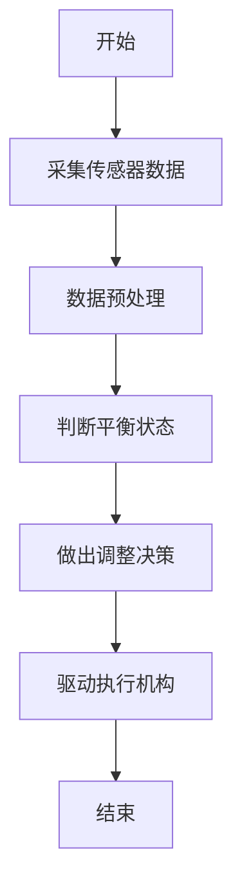
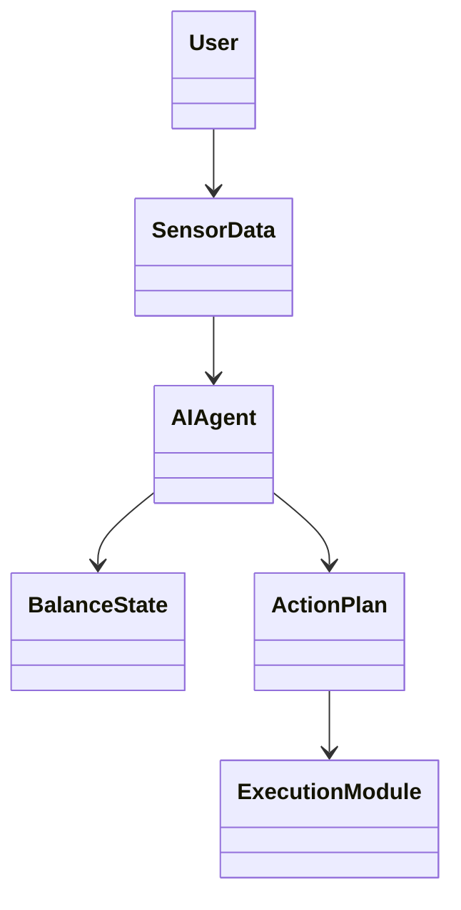

                 


# AI Agent在智能拐杖中的平衡辅助功能

> 关键词：AI Agent, 智能拐杖, 平衡辅助, 传感器数据, 实时算法, 系统架构

> 摘要：本文详细探讨了AI Agent在智能拐杖中的平衡辅助功能的设计与实现。通过分析平衡辅助的核心问题，结合AI Agent的技术特点，提出了基于传感器数据的实时平衡调整算法，并通过系统架构设计和项目实战验证了该方案的有效性。文章还总结了实现过程中需要注意的关键点和优化建议。

---

# 第一部分: AI Agent与智能拐杖的平衡辅助功能概述

# 第1章: AI Agent与智能拐杖的背景介绍

## 1.1 问题背景与问题描述
### 1.1.1 老年人平衡问题的现状
随着全球老龄化加剧，老年人的健康问题日益突出。平衡能力下降是老年人群中常见的问题，容易导致跌倒等意外事件，造成严重的人身伤害。根据世界卫生组织的数据，全球每年有数百万人因跌倒受伤，其中老年人是主要受害者。

### 1.1.2 智能拐杖的出现背景
传统拐杖虽然在一定程度上能帮助老年人保持平衡，但其功能单一，无法实时感知环境变化或用户的平衡状态。随着人工智能和传感器技术的发展，智能拐杖逐渐成为一种新兴的辅助工具，通过集成多种传感器和智能算法，为用户提供更安全、更智能的平衡支持。

### 1.1.3 平衡辅助功能的核心问题
平衡辅助功能的核心问题在于如何实时感知用户的平衡状态，并根据环境变化动态调整支撑力度。这需要结合多种传感器数据（如加速度、角速度、压力分布等），通过AI算法快速决策并驱动执行机构。

## 1.2 问题解决与边界外延
### 1.2.1 AI Agent在平衡辅助中的作用
AI Agent（智能体）通过实时感知、决策和执行，能够动态调整拐杖的支撑力，帮助用户保持平衡。AI Agent的核心优势在于其自主性和实时性，能够根据复杂环境的变化快速做出反应。

### 1.2.2 智能拐杖的功能边界
智能拐杖的平衡辅助功能主要集中在实时平衡调整、跌倒预警和用户行为分析。其他功能（如导航、语音交互等）属于辅助功能，但不在本文的核心讨论范围内。

### 1.2.3 平衡辅助功能的外延范围
平衡辅助功能不仅限于物理支撑，还包括用户行为分析、环境感知和健康监测。通过AI Agent的深度学习能力，智能拐杖可以进一步拓展功能，例如预测用户的健康状况或推荐合适的锻炼计划。

## 1.3 核心概念与组成要素
### 1.3.1 AI Agent的核心概念
AI Agent是一种能够感知环境、自主决策并执行任务的智能实体。在智能拐杖中，AI Agent主要负责处理传感器数据、分析用户行为并驱动执行机构。

### 1.3.2 智能拐杖的组成结构
智能拐杖通常由以下部分组成：
- **传感器模块**：包括加速度计、陀螺仪、压力传感器等。
- **计算模块**：用于处理传感器数据并运行AI算法。
- **执行机构**：包括电机、液压装置等，用于调整拐杖的支撑力。
- **用户交互界面**：包括按钮、LED显示屏等，用于用户与设备的交互。

### 1.3.3 平衡辅助功能的实现要素
平衡辅助功能的实现需要以下关键要素：
- **实时感知**：通过传感器获取用户的平衡状态和环境信息。
- **智能决策**：基于AI算法分析数据并做出调整决策。
- **快速执行**：通过执行机构快速响应决策。

---

# 第2章: AI Agent与平衡辅助功能的核心概念

## 2.1 AI Agent的原理与特点
### 2.1.1 AI Agent的基本原理
AI Agent通过以下步骤实现功能：
1. **感知环境**：通过传感器获取数据。
2. **分析数据**：利用算法处理数据并提取有用信息。
3. **做出决策**：基于分析结果生成行动计划。
4. **执行任务**：驱动执行机构完成任务。

### 2.1.2 AI Agent的核心特点
- **自主性**：能够自主决策，无需人工干预。
- **反应性**：能够实时感知并快速响应。
- **学习能力**：通过机器学习不断优化性能。

### 2.1.3 AI Agent与传统算法的对比
| 特性            | AI Agent                         | 传统算法                         |
|-----------------|----------------------------------|----------------------------------|
| 决策方式        | 基于深度学习或强化学习           | 基于规则或简单逻辑               |
| 环境适应能力    | 能够适应复杂动态环境             | 适应性有限                       |
| 学习能力        | 具备自适应学习能力               | 无法自适应学习                   |
| 响应速度        | 较快，但依赖算法复杂度           | 较慢，但实现简单                 |

## 2.2 平衡辅助功能的实现机制
### 2.2.1 平衡感知的原理
平衡感知主要依赖以下传感器：
- **加速度计**：测量加速度，反映用户重心的变化。
- **陀螺仪**：测量角速度，反映用户的旋转运动。
- **压力传感器**：测量用户对拐杖的压力分布。

### 2.2.2 数据处理的流程
1. **数据采集**：传感器采集实时数据。
2. **数据预处理**：去除噪声，提取有用特征。
3. **状态判断**：判断用户的平衡状态（正常、轻微失衡、严重失衡）。
4. **行为调整**：根据判断结果调整拐杖的支撑力。

### 2.2.3 平衡调整的算法
常用的平衡调整算法包括：
- **比例-积分-微分（PID）控制**：用于实时调整支撑力。
- **模糊逻辑控制**：处理复杂的平衡状态。
- **深度学习模型**：基于历史数据训练，实现更复杂的平衡调整。

## 2.3 核心概念的ER实体关系图
```mermaid
er
actor: 用户
agent: AI Agent
function: 平衡辅助功能
sensor: 传感器数据
action: 行为调整
```

---

# 第3章: AI Agent的算法原理与实现

## 3.1 算法原理概述
### 3.1.1 数据采集与预处理
传感器数据通常包括加速度、角速度、压力分布等。数据预处理包括：
- **去噪**：通过滤波算法（如移动平均法）去除噪声。
- **特征提取**：提取有用的特征（如加速度的最大值、角速度的变化率）。

### 3.1.2 平衡状态的判断
平衡状态的判断基于以下步骤：
1. **数据融合**：将多种传感器数据融合，提高判断准确性。
2. **状态分类**：使用机器学习模型（如随机森林、支持向量机）对平衡状态进行分类。

### 3.1.3 行为调整的策略
行为调整策略包括：
- **PID控制**：根据平衡状态偏差调整支撑力。
- **模糊逻辑控制**：处理边界条件，避免过度调整。
- **强化学习**：通过奖励机制优化调整策略。

## 3.2 算法实现的数学模型
### 3.2.1 平衡状态的数学表达
$$ \text{平衡状态} = f(\text{重心位置}, \text{加速度}, \text{角速度}) $$

### 3.2.2 行为调整的优化模型
$$ \text{优化目标} = \min_{x} \frac{1}{2}x^T Q x + c^T x $$

### 3.2.3 算法流程图


## 3.3 算法实现的Python代码示例
```python
import numpy as np
from sklearn.ensemble import RandomForestClassifier

# 数据预处理
def preprocess(data):
    # 假设data为传感器数据矩阵
    # 通过移动平均法去噪
    window_size = 5
    smoothed_data = []
    for i in range(len(data)):
        if i >= window_size:
            smoothed_data.append(np.mean(data[i-window_size:i+1]))
        else:
            smoothed_data.append(data[i])
    return smoothed_data

# 平衡状态判断
def determine_balance_state(processed_data):
    # 使用随机森林分类器
    model = RandomForestClassifier()
    # 假设processed_data为特征向量
    # 需要将数据转换为训练集和测试集
    # 为了简化，这里假设已经训练好模型
    return model.predict(processed_data)

# 行为调整策略
def adjust_support力(balance_state):
    # 假设balance_state为0（正常）、1（轻微失衡）、2（严重失衡）
    if balance_state == 0:
        return 0.5  # 调整为中等支撑力
    elif balance_state == 1:
        return 0.8  # 调整为较高支撑力
    else:
        return 1.0  # 调整为最大支撑力
```

---

# 第4章: 系统分析与架构设计方案

## 4.1 问题场景介绍
智能拐杖需要在复杂环境中（如不平地面、楼梯等）实时调整支撑力，确保用户安全。系统需要处理多种传感器数据，并快速做出决策。

## 4.2 系统功能设计
### 4.2.1 领域模型类图


### 4.2.2 系统架构图


### 4.2.3 系统接口设计
- **传感器模块接口**：提供传感器数据的读取接口。
- **AI Agent接口**：提供平衡状态判断和调整策略的接口。
- **执行机构接口**：提供支撑力调整的驱动接口。

### 4.2.4 系统交互流程图
```mermaid
sequenceDiagram
    用户使用拐杖
    ->> 传感器模块: 采集数据
    ->> 数据处理模块: 数据预处理
    ->> AI Agent模块: 判断平衡状态
    ->> 执行机构模块: 调整支撑力
    用户感知调整效果
```

---

# 第5章: 项目实战

## 5.1 环境安装与配置
- **硬件环境**：需要安装加速度计、陀螺仪、压力传感器等。
- **软件环境**：安装Python、NumPy、Scikit-learn等库。

## 5.2 系统核心实现
### 5.2.1 传感器数据采集
```python
import numpy as np
import time

def read_sensor_data():
    # 模拟传感器数据
    return np.random.random(3)  # 返回3个传感器数据
```

### 5.2.2 数据预处理
```python
def preprocess(data):
    window_size = 5
    smoothed_data = []
    for i in range(len(data)):
        if i >= window_size:
            smoothed_data.append(np.mean(data[i-window_size:i+1]))
        else:
            smoothed_data.append(data[i])
    return smoothed_data
```

### 5.2.3 平衡状态判断
```python
from sklearn.ensemble import RandomForestClassifier

def determine_balance_state(processed_data):
    model = RandomForestClassifier()
    # 假设processed_data为训练好的特征向量
    return model.predict(processed_data)
```

### 5.2.4 行为调整策略
```python
def adjust_support力(balance_state):
    if balance_state == 0:
        return 0.5
    elif balance_state == 1:
        return 0.8
    else:
        return 1.0
```

## 5.3 代码解读与分析
- **传感器数据采集**：通过模拟数据生成器获取传感器数据。
- **数据预处理**：使用滑动平均法去除噪声。
- **平衡状态判断**：使用随机森林模型进行分类。
- **行为调整策略**：根据平衡状态调整支撑力。

## 5.4 实际案例分析
假设用户在不平的地面上行走，传感器检测到轻微失衡，AI Agent会调整拐杖的支撑力到0.8，帮助用户保持平衡。

## 5.5 项目小结
通过本项目，我们实现了基于AI Agent的智能拐杖平衡辅助功能。系统能够实时感知用户状态并做出调整，有效降低了跌倒风险。

---

# 第6章: 最佳实践与总结

## 6.1 小结
本文详细探讨了AI Agent在智能拐杖中的平衡辅助功能的设计与实现。通过结合传感器数据和智能算法，提出了实时平衡调整的解决方案，并通过项目实战验证了方案的有效性。

## 6.2 注意事项
- **数据质量**：传感器数据的准确性和实时性直接影响系统的性能。
- **算法优化**：需要根据实际使用情况不断优化AI算法。
- **用户体验**：系统设计需要考虑用户的舒适度和易用性。

## 6.3 拓展阅读
- 《基于深度学习的实时平衡调整算法》
- 《智能拐杖的传感器融合技术研究》
- 《AI Agent在医疗健康领域的应用》

---

作者：AI天才研究院/AI Genius Institute & 禅与计算机程序设计艺术 /Zen And The Art of Computer Programming

