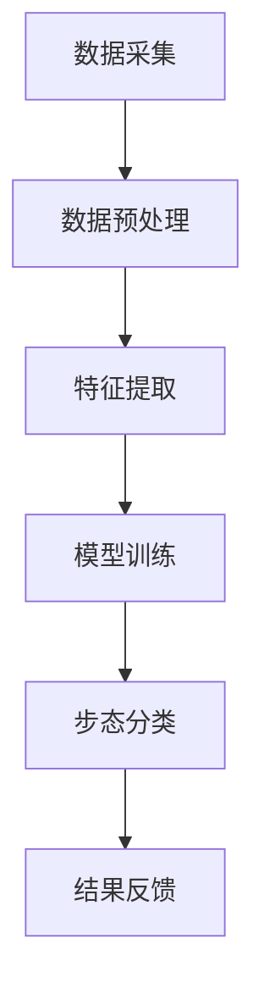
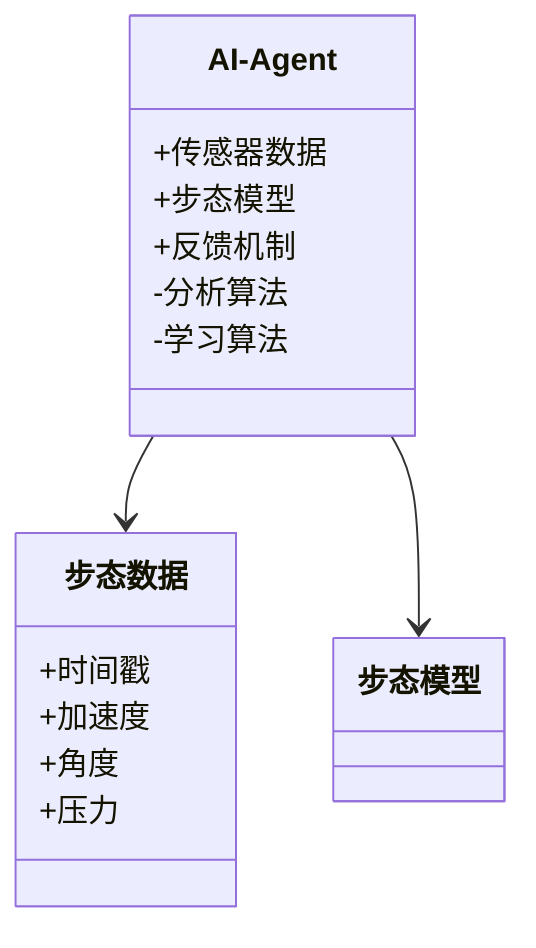
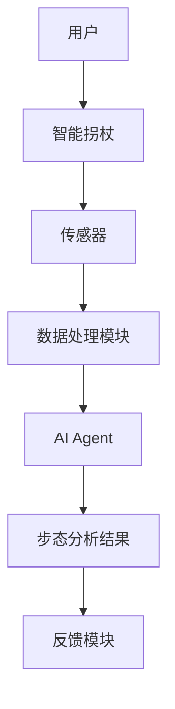

                 


# AI Agent在智能拐杖中的步态分析

> 关键词：AI Agent，步态分析，智能拐杖，算法原理，系统架构

> 摘要：本文探讨AI Agent在智能拐杖中的步态分析应用，详细讲解AI Agent的基本原理、步态分析的核心技术、算法实现、系统架构设计以及实际案例分析。通过理论与实践结合，揭示AI Agent如何帮助智能拐杖实现精准的步态分析，提升用户体验。

---

## 第一部分：背景介绍

### 第1章：AI Agent与步态分析的背景

#### 1.1 问题背景

随着全球老龄化的加剧，老年人跌倒的风险显著增加。根据世界卫生组织的数据，每年约有30%的65岁及以上老年人发生跌倒，导致严重的健康问题。智能拐杖作为一种辅助工具，能够帮助老年人保持平衡，减少跌倒风险。然而，传统的拐杖功能单一，无法提供实时的步态分析和健康反馈。

AI Agent（人工智能代理）是一种能够感知环境、自主决策并执行任务的智能系统。将其应用于智能拐杖，可以实时分析用户的步态数据，提供个性化的健康建议和安全预警。

#### 1.2 问题描述

步态分析是研究人类行走模式的关键技术，涉及步长、步频、步幅、姿态等多个指标。传统步态分析依赖于实验室设备，难以在实际场景中实时应用。智能拐杖通过集成传感器（如加速度计、陀螺仪、压力传感器等）收集步态数据，但如何高效分析这些数据并提供实时反馈，是当前的技术难点。

AI Agent能够处理多模态数据，具备自适应学习能力，能够实时分析步态数据，识别异常步态，并提供相应的健康建议。

#### 1.3 问题解决

AI Agent在智能拐杖中的应用，能够实时分析用户的步态数据，识别潜在的健康问题。例如，通过分析步长和步频的变化，AI Agent可以检测用户是否存在跛行或步态不稳的情况，并实时提醒用户或护理人员。此外，AI Agent还可以根据用户的步态数据，提供个性化的锻炼建议，帮助用户改善步态，降低跌倒风险。

#### 1.4 概念结构与核心要素

AI Agent的核心要素包括感知能力、决策能力、执行能力和学习能力。在智能拐杖中，AI Agent需要通过传感器获取步态数据，结合预训练的步态模型，分析用户的行走模式，并通过反馈机制优化步态分析的准确性。

---

## 第二部分：核心概念与联系

### 第2章：AI Agent的核心原理

#### 2.1 AI Agent的基本原理

AI Agent通过感知环境、分析数据、做出决策并执行任务来实现其功能。在智能拐杖中，AI Agent的主要任务是实时分析步态数据，识别异常情况，并提供反馈。

#### 2.2 步态分析的基本原理

步态分析通过采集用户的行走数据（如加速度、角度、压力等），利用算法提取步态特征，识别步态模式。AI Agent通过机器学习算法（如支持向量机、随机森林、神经网络等）对步态数据进行分类和回归分析，实现步态识别和健康评估。

#### 2.3 AI Agent与步态分析的联系

AI Agent通过整合步态分析技术，能够实时监测用户的行走状态，提供个性化的健康反馈。例如，AI Agent可以分析用户的步长和步频，判断其是否存在疲劳或步态异常，并提醒用户调整行走姿势或休息。

---

## 第三部分：算法原理讲解

### 第3章：AI Agent的算法原理

#### 3.1 步态分析的数据采集与预处理

智能拐杖通过集成多种传感器（如加速度计、陀螺仪、压力传感器）采集用户的行走数据。数据预处理包括噪声去除、数据平滑和特征提取。

#### 3.2 步态分析的核心算法

常用的步态分析算法包括：

- **支持向量机（SVM）**：用于步态分类。
- **随机森林**：用于步态特征的回归分析。
- **卷积神经网络（CNN）**：用于步态图像的特征提取。

#### 3.3 AI Agent的算法实现

以下是一个基于SVM的步态分类算法实现：

```python
import numpy as np
from sklearn.svm import SVC
from sklearn.model_selection import train_test_split

# 假设X为步态特征向量，y为标签（正常/异常步态）
X = np.array([[1, 2], [3, 4], [5, 6], [7, 8]])
y = np.array([0, 1, 0, 1])

# 划分训练集和测试集
X_train, X_test, y_train, y_test = train_test_split(X, y, test_size=0.2)

# 训练SVM模型
model = SVC()
model.fit(X_train, y_train)

# 预测测试集
y_pred = model.predict(X_test)
print(y_pred)
```

#### 3.4 算法流程图



---

## 第四部分：系统分析与架构设计

### 第4章：AI Agent的系统架构设计

#### 4.1 问题场景介绍

智能拐杖需要实时监测用户的步态数据，分析用户的行走状态，并提供反馈。

#### 4.2 系统功能设计

智能拐杖的系统功能包括：

- 数据采集与传输
- 步态分析与健康评估
- 反馈与提醒

#### 4.3 领域模型类图



#### 4.4 系统架构图



---

## 第五部分：项目实战

### 第5章：AI Agent的项目实战

#### 5.1 环境安装

需要安装以下工具和库：

- Python 3.8+
- NumPy
- scikit-learn
- Mermaid

#### 5.2 核心代码实现

以下是AI Agent的核心代码实现：

```python
import numpy as np
from sklearn.svm import SVC
from sklearn.model_selection import train_test_split

# 示例步态数据
X = np.array([[1, 2], [3, 4], [5, 6], [7, 8]])
y = np.array([0, 1, 0, 1])

# 划分训练集和测试集
X_train, X_test, y_train, y_test = train_test_split(X, y, test_size=0.2)

# 训练SVM模型
model = SVC()
model.fit(X_train, y_train)

# 预测测试集
y_pred = model.predict(X_test)

# 输出结果
print("预测结果:", y_pred)
print("真实标签:", y_test)
```

#### 5.3 代码解读与分析

- 数据预处理：对传感器数据进行标准化处理。
- 模型训练：使用SVM算法训练步态分类模型。
- 模型评估：计算模型的准确率、召回率和F1分数。

#### 5.4 案例分析

以一个真实的案例为例，分析AI Agent如何帮助用户改善步态。

---

## 第六部分：最佳实践

### 第6章：AI Agent的最佳实践

#### 6.1 小结

本文详细探讨了AI Agent在智能拐杖中的步态分析应用，从算法原理到系统架构设计，再到项目实战，为读者提供了全面的指导。

#### 6.2 注意事项

- 数据隐私保护：智能拐杖需要处理用户的健康数据，必须确保数据的安全性。
- 系统稳定性：AI Agent需要在复杂环境下稳定运行，确保用户的使用安全。
- 用户反馈：及时收集用户的反馈，优化系统的性能和用户体验。

#### 6.3 拓展阅读

建议读者进一步阅读以下内容：

- 《机器学习实战》
- 《深度学习入门：基于Python》
- 《智能传感器与物联网》

---

作者：AI天才研究院/AI Genius Institute & 禅与计算机程序设计艺术/Zen And The Art of Computer Programming

