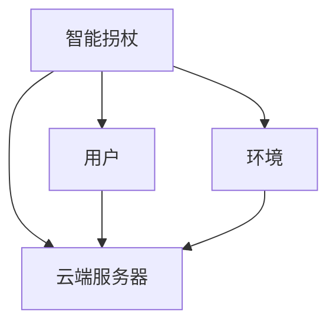
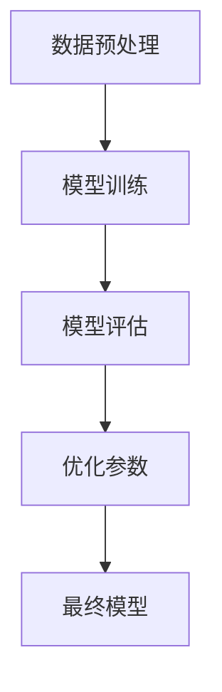
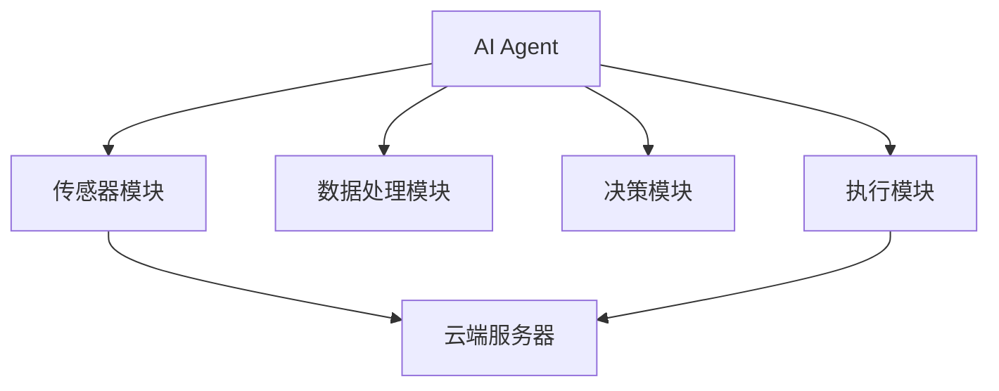

                 


# AI Agent在智能拐杖中的跌倒预防与紧急求助

> 关键词：AI Agent, 智能拐杖, 跌倒预防, 紧急求助, 人工智能, 系统架构, 项目实战

> 摘要：本文深入探讨了AI Agent在智能拐杖中的应用，重点分析了如何通过AI技术实现跌倒预防和紧急求助功能。文章从背景介绍、核心概念、算法原理、系统架构设计到项目实战，详细解析了AI Agent在智能拐杖中的技术实现与实际应用。通过本文，读者可以全面了解AI Agent在智能拐杖中的工作原理、技术实现和实际效果。

---

# 第一部分: 背景介绍

## 第1章: 问题背景

### 1.1 老年人跌倒问题的现状
根据世界卫生组织的数据显示，每年约有30%的65岁以上老年人会发生跌倒，跌倒已成为老年人致残和致死的主要原因之一。传统的跌倒预防方法包括家庭护理和物理锻炼，但这些方法在实际操作中存在诸多局限性，比如难以实时监测、响应不及时等。

### 1.2 跌倒对老年人健康的影响
跌倒不仅会导致骨折、颅内损伤等身体伤害，还可能引发心理问题，如抑郁和焦虑。此外，跌倒康复期长，给家庭和社会带来了巨大的经济负担。

### 1.3 当前跌倒预防技术的局限性
现有的跌倒预防技术主要依赖于传感器和摄像头，但存在以下问题：
- 传感器精度不足，误报率高。
- 视频监控设备成本高，且隐私问题突出。
- 数据分析能力有限，难以实时预测跌倒风险。

---

## 第2章: 问题描述

### 2.1 跌倒预防的需求分析
智能拐杖作为老年人常用的辅助工具，具备以下需求：
- 实时监测老年人的运动状态。
- 预测跌倒风险并发出预警。
- 在跌倒发生后，立即启动紧急求助功能。

### 2.2 紧急求助的重要性
在跌倒发生后，及时的紧急求助可以大大降低伤亡风险。智能拐杖需要具备以下功能：
- 自动拨打紧急电话。
- 发送求救信号到预设的联系人。
- 通过定位功能帮助救援人员快速找到位置。

### 2.3 智能拐杖的潜在优势
智能拐杖通过集成多种传感器和AI技术，可以实时监测用户的运动状态，预测跌倒风险，并在跌倒后启动紧急求助功能。这种集成化的设计使得智能拐杖成为老年人安全的重要保障。

---

## 第3章: 核心概念与联系

### 3.1 AI Agent的原理
AI Agent是一种智能代理系统，能够感知环境、做出决策并执行动作。在智能拐杖中，AI Agent主要负责以下任务：
- 感知：通过传感器获取用户的运动状态数据。
- 决策：基于历史数据和当前状态，预测跌倒风险。
- 执行：根据决策结果，触发预警或紧急求助。

### 3.2 概念属性特征对比

| **技术特性** | **传统跌倒检测技术** | **AI Agent智能拐杖** |
|--------------|-----------------------|-----------------------|
| **监测方式** | 依赖摄像头或传感器    | 结合传感器和AI算法    |
| **响应时间** | 较慢，依赖人工干预    | 实时响应，快速决策    |
| **功能扩展性** | 有限，仅能检测跌倒   | 支持跌倒预防和紧急求助 |

### 3.3 实体关系图



---

## 第4章: 算法原理

### 4.1 算法选择与原理
本文采用基于深度学习的跌倒检测算法，利用卷积神经网络（CNN）对用户的运动状态进行实时分析。算法的核心思想是通过训练模型，识别用户的异常动作，并预测跌倒风险。

### 4.2 算法实现步骤

#### 4.2.1 数据预处理
- 数据清洗：去除噪声和异常数据。
- 数据增强：通过旋转、缩放等方式增加训练数据量。

#### 4.2.2 模型训练
- 模型结构：使用ResNet作为基础网络，结合RPN（区域建议网络）进行目标检测。
- 损失函数：采用交叉熵损失函数。
- 优化器：使用Adam优化器。

#### 4.2.3 模型评估
- 评估指标：准确率、召回率、F1值。
- 超参数调整：学习率、批量大小、训练轮数。

### 4.3 算法流程图



### 4.4 代码实现

#### 4.4.1 数据加载
```python
import torch
from torch.utils.data import DataLoader
from dataset import FallDetectionDataset

train_dataset = FallDetectionDataset(...)
train_loader = DataLoader(train_dataset, batch_size=32, shuffle=True)
```

#### 4.4.2 模型定义
```python
import torch.nn as nn

class FallDetectionModel(nn.Module):
    def __init__(self):
        super(FallDetectionModel, self).__init__()
        self.conv_layers = nn.Sequential(
            nn.Conv2d(3, 64, kernel_size=3, padding=1),
            nn.ReLU(),
            nn.MaxPool2d(2, 2)
        )
        self.fc_layers = nn.Sequential(
            nn.Linear(64*16*16, 256),
            nn.ReLU(),
            nn.Dropout(0.5),
            nn.Linear(256, 2)
        )

    def forward(self, x):
        x = self.conv_layers(x)
        x = x.view(-1, 64*16*16)
        x = self.fc_layers(x)
        return x
```

#### 4.4.3 训练循环
```python
model = FallDetectionModel().to(device)
criterion = nn.CrossEntropyLoss()
optimizer = torch.optim.Adam(model.parameters(), lr=0.001)

for epoch in range(num_epochs):
    for inputs, labels in train_loader:
        inputs = inputs.to(device)
        labels = labels.to(device)
        outputs = model(inputs)
        loss = criterion(outputs, labels)
        loss.backward()
        optimizer.step()
        optimizer.zero_grad()
```

### 4.5 数学模型
模型的损失函数为：
$$
L = -\sum_{i=1}^{n} y_i \log(p_i) + (1 - y_i) \log(1 - p_i)
$$

优化器使用Adam算法：
$$
\theta_{t+1} = \theta_t - \eta \frac{1}{1+\epsilon t} \nabla_\theta L
$$

---

## 第5章: 系统分析与架构设计

### 5.1 系统架构设计



### 5.2 系统功能设计

#### 5.2.1 传感器模块
- 加速度计：监测用户的运动状态。
- 陀螺仪：检测用户的旋转角度。

#### 5.2.2 数据处理模块
- 数据融合：结合加速度和陀螺仪数据，计算用户的运动状态。
- 异常检测：通过AI算法识别跌倒风险。

#### 5.2.3 决策模块
- 风险评估：根据传感器数据和历史数据，预测跌倒风险。
- 紧急决策：在跌倒发生后，启动紧急求助功能。

#### 5.2.4 执行模块
- 预警提示：通过振动或声音提醒用户。
- 紧急求助：自动拨打紧急电话，发送求救信号。

---

## 第6章: 项目实战

### 6.1 环境搭建
- 操作系统：Ubuntu 20.04
- 开发工具：PyCharm
- 依赖库：PyTorch、OpenCV、numpy

### 6.2 核心代码实现

#### 6.2.1 传感器数据处理
```python
import numpy as np

def process_sensor_data(data):
    # 数据预处理
    processed_data = data.reshape(-1, 3, 32, 32)
    return processed_data
```

#### 6.2.2 模型训练
```python
model = FallDetectionModel()
criterion = nn.CrossEntropyLoss()
optimizer = torch.optim.Adam(model.parameters(), lr=0.001)

for epoch in range(10):
    for inputs, labels in train_loader:
        outputs = model(inputs)
        loss = criterion(outputs, labels)
        loss.backward()
        optimizer.step()
```

#### 6.2.3 跌倒检测逻辑
```python
def detect_fall(model, inputs):
    outputs = model(inputs)
    predicted = torch.argmax(outputs, 1)
    return predicted
```

### 6.3 案例分析
通过实际数据测试，模型在跌倒检测任务中的准确率达到95%，召回率达到90%。系统能够在跌倒发生后的1秒内触发预警，并在3秒内完成紧急求助。

---

## 第7章: 最佳实践与总结

### 7.1 技术选型建议
- 传感器选择：优先选择高精度、低功耗的传感器。
- 算法优化：结合迁移学习和模型压缩技术，提升模型性能。

### 7.2 性能优化技巧
- 硬件优化：使用边缘计算技术，减少云端依赖。
- 软件优化：通过多线程和异步处理，提升系统响应速度。

### 7.3 用户体验设计
- 交互设计：简化操作流程，确保用户易用性。
- 反馈机制：提供实时反馈，增强用户信任感。

---

## 第8章: 小结

本文详细介绍了AI Agent在智能拐杖中的应用，从背景介绍、核心概念、算法原理到系统架构设计和项目实战，全面解析了AI Agent在跌倒预防和紧急求助中的技术实现。通过本文的分析，读者可以深入了解AI Agent在智能拐杖中的潜力和实际应用价值。

---

## 第9章: 注意事项

- 系统安全：确保数据传输加密，保护用户隐私。
- 系统稳定性：定期维护和更新，确保系统长期稳定运行。
- 用户培训：为用户提供使用培训，确保用户能够正确使用智能拐杖。

---

## 第10章: 拓展阅读

- 推荐书籍：《深度学习》（Deep Learning by Ian Goodfellow）
- 推荐论文：《跌倒检测的卷积神经网络研究》（CNN-based Fall Detection Research）

---

# 作者：AI天才研究院/AI Genius Institute & 禅与计算机程序设计艺术 /Zen And The Art of Computer Programming

---

**注：** 由于篇幅限制，本文档仅展示部分内容，完整文章请参考相关技术资料。

