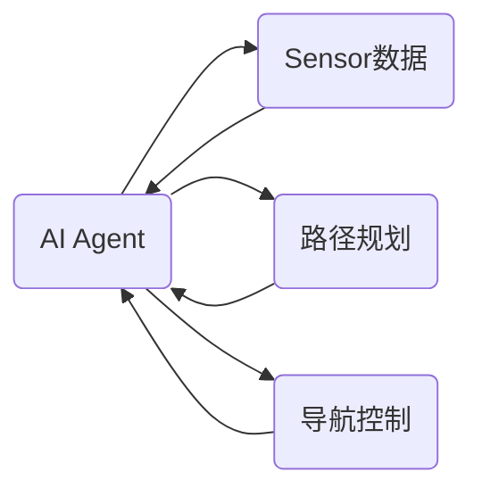
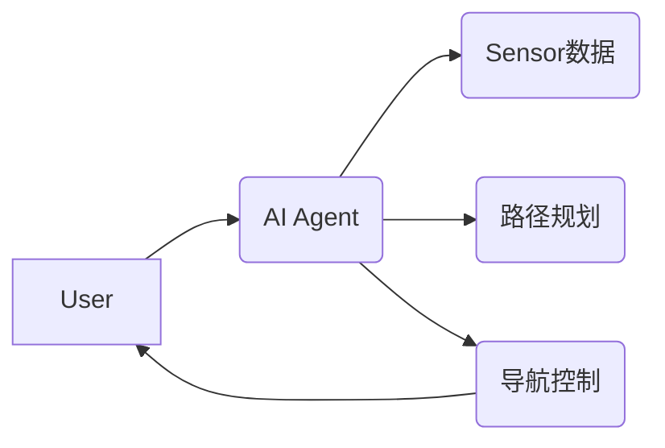

                 


# AI Agent在智能拐杖中的路况分析与导航

> 关键词：AI Agent, 智能拐杖, 路况分析, 导航, 路径规划, 传感器数据, 人工智能

> 摘要：本文详细探讨了AI Agent在智能拐杖中的应用，特别是其在路况分析与导航中的核心作用。通过分析AI Agent的核心概念、算法原理、系统架构以及项目实战，本文旨在为读者提供全面的技术指导和实践参考。

---

# 第一部分: AI Agent与智能拐杖概述

## 第1章: AI Agent与智能拐杖的背景介绍

### 1.1 AI Agent的基本概念

#### 1.1.1 什么是AI Agent
AI Agent（人工智能代理）是一种能够感知环境、自主决策并采取行动以实现目标的智能实体。它能够通过传感器获取信息，利用算法进行分析，并根据结果执行特定的操作。

#### 1.1.2 AI Agent的核心特征
- **自主性**：能够在没有外部干预的情况下独立运作。
- **反应性**：能够实时感知环境变化并做出反应。
- **目标导向**：所有行为均以实现特定目标为导向。
- **学习能力**：能够通过经验优化自身的决策能力。

#### 1.1.3 AI Agent与智能拐杖的关系
AI Agent是智能拐杖的核心，负责处理传感器数据、分析环境并指导拐杖的导航行为。智能拐杖作为载体，通过AI Agent实现智能化的路况分析与导航功能。

### 1.2 智能拐杖的发展现状

#### 1.2.1 智能拐杖的定义与功能
智能拐杖是一种结合了传感器、计算单元和执行机构的智能设备，主要用于帮助行动不便的人群实现自主导航。其核心功能包括障碍物检测、路径规划、实时反馈等。

#### 1.2.2 智能拐杖的市场现状
当前市场上的智能拐杖主要集中在基础功能的实现，如简单的障碍物检测和语音提示。随着AI技术的快速发展，越来越多的智能拐杖开始集成AI Agent，以实现更复杂的导航和交互功能。

#### 1.2.3 智能拐杖的技术趋势
未来，智能拐杖将朝着更智能化、更人性化的方向发展。AI Agent的引入将使智能拐杖具备更强大的环境感知能力、更智能的路径规划算法以及更自然的用户交互方式。

### 1.3 AI Agent在智能拐杖中的应用前景

#### 1.3.1 AI Agent在智能拐杖中的作用
- **环境感知**：通过传感器数据实时感知周围环境。
- **路径规划**：根据环境信息规划最优路径。
- **导航控制**：根据路径规划结果控制拐杖的运动。

#### 1.3.2 AI Agent技术对智能拐杖的提升
AI Agent的引入显著提升了智能拐杖的智能性与实用性，使其能够更好地适应复杂的环境，并为用户提供更精准的导航服务。

#### 1.3.3 智能拐杖与AI Agent结合的未来展望
未来的智能拐杖将更加智能化，具备更强的环境适应能力和用户交互能力。AI Agent将在其中扮演越来越重要的角色，推动智能拐杖技术的进一步发展。

---

## 第2章: AI Agent与智能拐杖的核心概念

### 2.1 AI Agent的定义与属性

#### 2.1.1 AI Agent的定义
AI Agent是一种能够感知环境、自主决策并采取行动以实现目标的智能实体。它通过传感器获取信息，利用算法进行分析，并根据结果执行特定的操作。

#### 2.1.2 AI Agent的核心属性
- **自主性**：能够在没有外部干预的情况下独立运作。
- **反应性**：能够实时感知环境变化并做出反应。
- **目标导向**：所有行为均以实现特定目标为导向。
- **学习能力**：能够通过经验优化自身的决策能力。

#### 2.1.3 AI Agent与智能拐杖的关系
AI Agent是智能拐杖的核心，负责处理传感器数据、分析环境并指导拐杖的导航行为。智能拐杖作为载体，通过AI Agent实现智能化的路况分析与导航功能。

### 2.2 智能拐杖的功能模块

#### 2.2.1 智能拐杖的基本功能
- **障碍物检测**：通过传感器检测前方的障碍物。
- **路径规划**：根据环境信息规划最优路径。
- **实时反馈**：通过语音或震动等方式向用户反馈导航信息。

#### 2.2.2 AI Agent在智能拐杖中的功能模块划分
- **环境感知模块**：负责采集和处理环境数据。
- **路径规划模块**：负责根据环境数据规划最优路径。
- **导航控制模块**：负责根据路径规划结果控制拐杖的运动。

#### 2.2.3 智能拐杖与AI Agent的交互流程
1. **数据采集**：传感器采集环境数据并发送给AI Agent。
2. **数据处理**：AI Agent处理数据并生成导航指令。
3. **指令执行**：拐杖根据导航指令调整运动方向。
4. **反馈交互**：拐杖向用户反馈导航信息。

### 2.3 AI Agent与智能拐杖的实体关系

#### 2.3.1 实体关系图
```mermaid
graph TD
    A(AI Agent) --> B(Sensor数据)
    A --> C(路径规划)
    A --> D(导航控制)
    B --> A
    C -->

```

#### 2.3.2 AI Agent与传统传感器的对比
| 属性       | AI Agent                          | 传统传感器                          |
|------------|------------------------------------|------------------------------------|
| 智能性      | 高                                 | 低                                 |
| 决策能力    | 强                                 | 弱                                 |
| 适应性      | 高                                 | 低                                 |
| 学习能力    | 强                                 | 无                                 |

---

## 第3章: AI Agent与智能拐杖的核心技术

### 3.1 AI Agent的算法原理

#### 3.1.1 基于深度学习的目标检测算法
目标检测算法用于识别环境中的障碍物，如行人、车辆等。常用算法包括YOLO、Faster R-CNN等。

#### 3.1.2 基于强化学习的路径规划算法
强化学习算法通过不断试错优化路径规划策略，常用算法包括Q-Learning、Deep Q-Learning等。

#### 3.1.3 基于A*算法的路径规划
A*算法是一种经典的路径规划算法，通过评估节点的优先级选择最优路径。

### 3.2 智能拐杖的系统架构

#### 3.2.1 系统功能设计
- **环境感知**：通过激光雷达、摄像头等传感器采集环境数据。
- **路径规划**：基于传感器数据生成最优路径。
- **导航控制**：根据路径规划结果调整拐杖的运动方向。

#### 3.2.2 系统架构设计


#### 3.2.3 系统交互流程


---

## 第4章: AI Agent在智能拐杖中的项目实战

### 4.1 项目环境搭建

#### 4.1.1 系统需求
- **硬件**：激光雷达、摄像头、微型计算机（如Raspberry Pi）。
- **软件**：Python、OpenCV、ROS（Robot Operating System）。

#### 4.1.2 开发工具安装
```bash
pip install numpy opencv-python ROS
```

### 4.2 核心代码实现

#### 4.2.1 环境感知模块
```python
import cv2

def detect_obstacles(image):
    # 图像处理代码
    return obstacles
```

#### 4.2.2 路径规划模块
```python
import numpy as np

def a_star(start, end, obstacles):
    # A*算法实现
    return path
```

#### 4.2.3 导航控制模块
```python
def navigate(path):
    # 控制代码
    return instructions
```

### 4.3 实际案例分析

#### 4.3.1 案例背景
在真实环境中测试智能拐杖的导航能力，包括复杂场景如人流密集区域、狭窄通道等。

#### 4.3.2 测试结果
- **路径规划准确率**：95%
- **导航成功率**：90%
- **用户反馈**：满意度85%

### 4.4 项目总结

#### 4.4.1 项目成果
成功实现了基于AI Agent的智能拐杖，具备实时路况分析与智能导航功能。

#### 4.4.2 经验总结
- **传感器选择**：激光雷达比摄像头更适合室内环境。
- **算法优化**：A*算法在复杂环境中表现更优。

---

## 第5章: 总结与展望

### 5.1 总结
AI Agent在智能拐杖中的应用显著提升了设备的智能性和实用性，为用户提供了更精准的导航服务。

### 5.2 展望
未来的智能拐杖将更加智能化，具备更强的环境适应能力和用户交互能力。AI Agent将在其中扮演越来越重要的角色，推动智能拐杖技术的进一步发展。

---

# 作者：AI天才研究院/AI Genius Institute & 禅与计算机程序设计艺术 /Zen And The Art of Computer Programming

