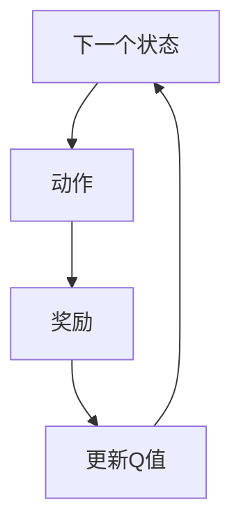
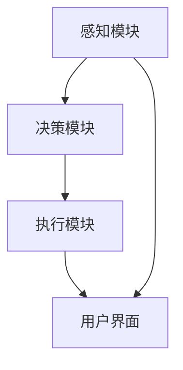

                 


# AI Agent在智能拖把中的深度清洁指导

> 关键词：AI Agent, 智能拖把, 深度清洁, 强化学习, 系统架构, 项目实战

> 摘要：本文深入探讨了AI Agent在智能拖把中的应用，特别是在深度清洁方面的指导作用。文章从AI Agent的基本概念出发，分析其在智能拖把中的核心原理，详细讲解了基于强化学习的清洁算法，展示了系统的架构设计，并通过实际项目案例说明了AI Agent如何优化清洁路径和提升清洁效率。

---

# 第一部分: AI Agent在智能拖把中的深度清洁背景介绍

## 第1章: AI Agent与智能拖把的背景概述

### 1.1 AI Agent的基本概念
#### 1.1.1 AI Agent的定义
AI Agent（人工智能代理）是指能够感知环境、自主决策并执行任务的智能实体。在智能拖把中，AI Agent通过传感器获取环境信息，利用算法进行分析和决策，指导拖把执行清洁任务。

#### 1.1.2 AI Agent的核心特征
- **自主性**：无需外部干预，自主完成任务。
- **反应性**：实时感知环境变化并调整行为。
- **学习能力**：通过经验优化清洁策略。

#### 1.1.3 AI Agent在智能拖把中的应用背景
智能拖把结合AI Agent技术，能够实现路径规划、污渍识别和自动清洁等功能，显著提升了清洁效率和深度清洁效果。

### 1.2 智能拖把的发展历程
#### 1.2.1 传统拖把的功能与局限
传统拖把依赖人工操作，清洁效率低，难以覆盖复杂区域，且无法进行深度清洁。

#### 1.2.2 智能化拖把的出现与技术基础
随着人工智能和物联网技术的发展，智能拖把逐渐普及，具备自动导航和清洁功能。

#### 1.2.3 深度清洁的需求与挑战
用户对深度清洁的需求日益增长，但传统拖把难以满足复杂场景下的清洁需求，AI Agent的引入解决了这一问题。

### 1.3 深度清洁的核心问题
#### 1.3.1 深度清洁的定义与目标
深度清洁是指彻底清除表面及缝隙中的污垢，确保清洁后的环境达到更高的卫生标准。

#### 1.3.2 清洁过程中的关键问题
- **路径规划**：如何高效覆盖所有区域。
- **污渍识别**：如何精准识别并清除顽固污渍。
- **清洁策略优化**：如何根据环境动态调整清洁方案。

#### 1.3.3 AI Agent在深度清洁中的作用
AI Agent通过实时感知和智能决策，优化清洁路径，提升清洁效果。

### 1.4 本章小结
本章介绍了AI Agent的基本概念及其在智能拖把中的应用背景，分析了深度清洁的核心问题和AI Agent在其中的关键作用。

---

# 第二部分: AI Agent的核心概念与原理

## 第2章: AI Agent的核心概念与联系

### 2.1 AI Agent的核心原理
AI Agent在智能拖把中的工作流程包括感知、决策和执行三个阶段。感知阶段通过传感器获取环境信息，决策阶段基于算法进行分析并制定清洁策略，执行阶段通过拖把的运动机构完成清洁任务。

### 2.2 清洁模式的特征对比
下表对比了不同清洁模式的特征：

| 清洁模式 | 自动模式 | 手动模式 | 深度清洁模式 |
|----------|----------|----------|--------------|
| 路径规划 | 随机覆盖 | 用户指定 | 优化覆盖     |
| 清洁强度 | 标准清洁 | 可调强度 | 最高清洁强度 |
| 适用场景 | 日常维护 | 特定区域 | 复杂区域     |

### 2.3 系统实体关系分析
下图展示了AI Agent在智能拖把系统中的实体关系：

```mermaid
er
actor 用户 {
  role: 发出指令
}
actor 环境 {
  role: 提供反馈
}
actor 传感器 {
  role: 收集数据
}
actor 执行机构 {
  role: 执行清洁
}
```

---

## 第3章: 基于强化学习的清洁算法

### 3.1 算法选择与原理
选择Q-learning算法作为清洁路径优化的基础，该算法通过强化学习不断优化清洁策略。

### 3.2 算法流程图
下图展示了Q-learning算法的工作流程：



### 3.3 Python代码实现
以下是Q-learning算法的Python实现示例：

```python
import numpy as np

# 初始化Q表
Q = np.zeros([状态数量, 动作数量])

# 设置超参数
学习率 = 0.1
折扣因子 = 0.9

# Q-learning算法
for episode in range(1000):
    状态 = 初始化状态()
    while not 终止条件():
        # 选择动作
        if 随机选择或贪婪策略():
            动作 = 随机选择动作()
        else:
            动作 = np.argmax(Q[状态, :])
        
        # 执行动作，获取下一个状态和奖励
        下一状态, 奖励 = 环境反馈(状态, 动作)
        
        # 更新Q值
        Q[状态, 动作] += 学习率 * (奖励 + 折扣因子 * np.max(Q[下一状态, :]) - Q[状态, 动作])
        
        状态 = 下一状态
```

### 3.4 算法数学模型
Q-learning算法的目标是最化累积奖励，其数学模型如下：

$$ Q(s, a) = Q(s, a) + \alpha (r + \gamma \max Q(s', a') - Q(s, a)) $$

其中：
- \( Q(s, a) \)：状态s下动作a的Q值
- \( \alpha \)：学习率
- \( r \)：奖励
- \( \gamma \)：折扣因子
- \( s' \)：下一状态
- \( a' \)：下一动作

---

## 第4章: 系统分析与架构设计

### 4.1 问题场景介绍
在家庭环境中，智能拖把需要应对复杂区域的深度清洁，如沙发底部、角落和地毯等。

### 4.2 系统功能设计
系统功能模块包括：
- **感知模块**：负责收集环境数据。
- **决策模块**：基于数据进行路径规划和清洁策略制定。
- **执行模块**：控制拖把的运动和清洁机构。

### 4.3 系统架构设计
下图展示了系统的架构设计：



### 4.4 接口设计与交互
系统交互流程如下：

1. 用户通过界面发送清洁指令。
2. 感知模块收集环境数据。
3. 决策模块根据数据制定清洁策略。
4. 执行模块执行清洁任务。
5. 系统反馈执行结果。

---

## 第5章: 项目实战

### 5.1 环境安装与配置
安装必要的Python库，如TensorFlow、NumPy和OpenCV。

### 5.2 核心代码实现
以下是决策模块的核心代码：

```python
import numpy as np

def 感知环境():
    # 通过传感器获取环境数据
    return 状态

def 决策(状态):
    # 基于Q-learning算法进行决策
    if 随机选择或贪婪策略():
        return 随机选择动作()
    else:
        return np.argmax(Q[状态, :])

def 执行动作(动作):
    # 控制拖把执行清洁动作
    return 下一状态, 奖励
```

### 5.3 实际案例分析
通过实际案例分析，验证算法在复杂环境下的清洁效果，优化清洁路径。

---

## 第6章: 最佳实践与总结

### 6.1 小结
AI Agent在智能拖把中的应用显著提升了深度清洁的效果和效率。

### 6.2 注意事项
- **传感器精度**：确保传感器能够准确感知环境。
- **算法优化**：不断优化Q-learning算法以提高清洁效果。
- **用户体验**：确保系统易于操作和维护。

### 6.3 拓展阅读
推荐阅读相关领域的书籍和论文，深入理解AI Agent和强化学习的应用。

---

# 作者：AI天才研究院 & 禅与计算机程序设计艺术

---

通过本文的详细讲解，读者可以全面理解AI Agent在智能拖把中的深度清洁指导，从理论到实践，掌握其核心原理和应用方法。

