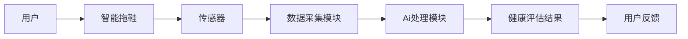
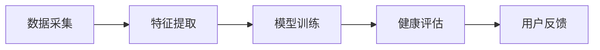
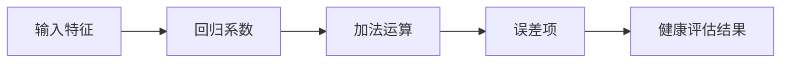
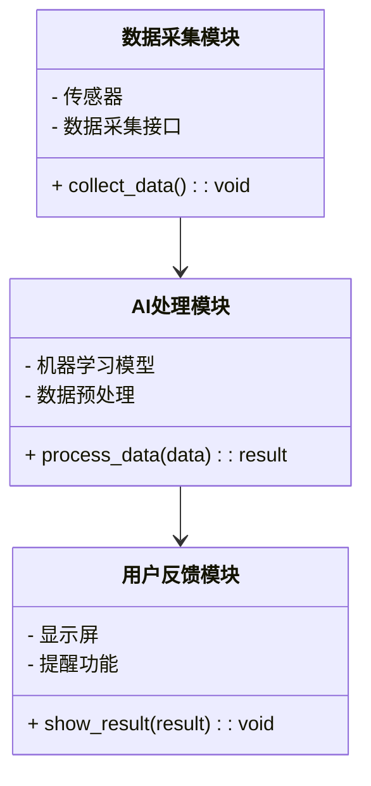
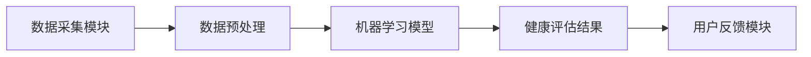

                 


# 目录大纲：《AI Agent在智能拖鞋中的足部健康监测》

---

## 第一部分：背景介绍

### 第1章：AI Agent与足部健康监测的背景

#### 1.1 问题背景
- **1.1.1 足部健康的重要性**：足部健康直接影响人体姿态和运动能力，长期忽视可能导致足部疾病。
- **1.1.2 传统足部健康监测的局限性**：传统方法依赖手动检查，缺乏实时性和准确性。

#### 1.2 问题描述
- **1.2.1 足部健康监测的需求**：随着健康意识的提升，人们对足部健康的实时监测需求增加。
- **1.2.2 智能拖鞋的市场现状**：智能设备市场的快速发展，推动了智能拖鞋的普及。

#### 1.3 解决方案
- **1.3.1 AI Agent在智能拖鞋中的应用**：利用AI技术实时分析足部数据，提供健康反馈。
- **1.3.2 技术实现的基本思路**：通过传感器采集数据，AI算法处理分析，提供健康建议。

#### 1.4 边界与外延
- **1.4.1 系统的边界**：仅关注足部健康，不涉及其他健康指标。
- **1.4.2 相关领域的外延**：与物联网、可穿戴设备等领域相关。

#### 1.5 概念结构与核心要素
- **1.5.1 核心概念的组成**：AI Agent、传感器、足部健康数据。
- **1.5.2 核心要素的分析**：数据采集、AI处理、用户反馈。

---

## 第二部分：核心概念与联系

### 第2章：AI Agent与足部健康监测的核心原理

#### 2.1 AI Agent的基本原理
- **2.1.1 AI Agent的定义**：AI Agent是一种能够感知环境并采取行动以实现目标的智能体。
- **2.1.2 AI Agent的核心功能**：数据处理、决策制定、反馈生成。

#### 2.2 足部健康监测的基本原理
- **2.2.1 传感器的作用**：采集足部压力、温度、湿度等数据。
- **2.2.2 数据采集与处理**：通过传感器获取数据，进行预处理和特征提取。

#### 2.3 AI Agent与足部健康监测的关系
- **2.3.1 数据流分析**：传感器数据 → AI处理 → 健康反馈。
- **2.3.2 交互机制**：实时数据传输和用户反馈循环。

---

### 图2.1：AI Agent与足部健康监测的交互机制



---

## 第三部分：算法原理

### 第3章：AI Agent的算法实现

#### 3.1 算法原理概述
- **3.1.1 算法选择**：基于机器学习的分类算法（如随机森林）进行健康评估。
- **3.1.2 数据预处理**：去除噪声，归一化处理。

#### 3.2 算法实现流程
- **数据采集**：传感器采集足部数据。
- **特征提取**：提取关键特征（如压力分布、温度变化）。
- **模型训练**：使用训练数据训练机器学习模型。
- **健康评估**：输入实时数据，模型输出健康评估结果。

---

### 图3.1：AI Agent算法实现流程



#### 3.3 核心代码实现

```python
import numpy as np
from sklearn.ensemble import RandomForestClassifier

# 数据预处理
def preprocess(data):
    # 假设data是传感器数据
    # 这里进行归一化处理
    normalized_data = (data - np.mean(data)) / np.std(data)
    return normalized_data

# 特征提取
def extract_features(data):
    # 提取压力分布特征
    pressure_features = data[:, :5]  # 假设前5个特征是压力分布
    return pressure_features

# 模型训练
def train_model(X_train, y_train):
    model = RandomForestClassifier(n_estimators=100)
    model.fit(X_train, y_train)
    return model

# 健康评估
def evaluate_health(model, X_test):
    predictions = model.predict(X_test)
    return predictions
```

---

## 第四部分：数学模型和公式

### 第4章：足部健康评估的数学模型

#### 4.1 数学模型概述
- **模型目标**：根据传感器数据，预测足部健康状况（如健康、亚健康、不健康）。
- **输入变量**：压力、温度、湿度等。
- **输出变量**：健康评估结果。

#### 4.2 假设和约束
- **假设**：传感器数据准确，模型训练充分。
- **约束**：模型仅适用于特定人群。

#### 4.3 数学模型公式
- **线性回归模型**：
  $$ y = \beta_0 + \beta_1x_1 + \beta_2x_2 + \dots + \beta_nx_n + \epsilon $$
  其中，$y$ 是健康评估结果，$x_i$ 是输入特征，$\beta_i$ 是回归系数，$\epsilon$ 是误差项。

---

### 图4.1：线性回归模型的结构



---

## 第五部分：系统分析与架构设计

### 第5章：智能拖鞋系统的架构设计

#### 5.1 问题场景介绍
- **目标用户**：需要足部健康监测的用户。
- **使用场景**：日常穿着，实时监测。

#### 5.2 系统功能设计
- **数据采集模块**：采集足部压力、温度等数据。
- **AI处理模块**：分析数据，生成健康评估结果。
- **用户反馈模块**：显示健康结果，提供改进建议。

---

### 图5.1：系统功能设计的类图



---

### 图5.2：系统架构设计



---

## 第六部分：项目实战

### 第6章：AI Agent在智能拖鞋中的实现

#### 6.1 环境搭建
- **硬件**：智能拖鞋、传感器模块。
- **软件**：Python开发环境，机器学习库（如scikit-learn）。

#### 6.2 核心代码实现

```python
# 数据采集模块
import serial

ser = serial.Serial('COM3', 9600)
data = ser.readline().decode().strip()
ser.close()

# 数据处理模块
def process_data(data):
    features = [int(x) for x in data.split(',')]
    return features

processed_data = process_data(data)

# AI处理模块
model = RandomForestClassifier(n_estimators=100)
model.fit(X_train, y_train)
prediction = model.predict([processed_data])

# 用户反馈模块
print("足部健康评估结果:", prediction)
```

#### 6.3 代码解读与分析
- **数据采集模块**：通过串口读取传感器数据。
- **数据处理模块**：对数据进行预处理，提取特征。
- **AI处理模块**：使用训练好的模型进行预测。
- **用户反馈模块**：输出健康评估结果。

---

## 第七部分：最佳实践与小结

### 第7章：总结与展望

#### 7.1 最佳实践
- **数据隐私保护**：确保用户数据的安全。
- **传感器选择**：选择高精度、低功耗的传感器。
- **用户体验优化**：设计直观的反馈界面。

#### 7.2 小结
- **核心内容回顾**：AI Agent在足部健康监测中的应用，算法实现，系统架构。
- **未来展望**：结合更多传感器数据，提供更精准的健康评估。

---

## 作者：AI天才研究院 & 禅与计算机程序设计艺术

---

**注意**：以上目录大纲和内容设计为示例，实际编写时需要根据具体技术细节进行调整和补充。

