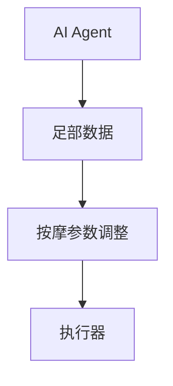
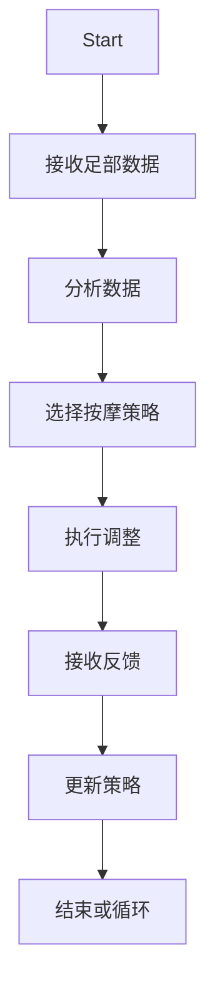
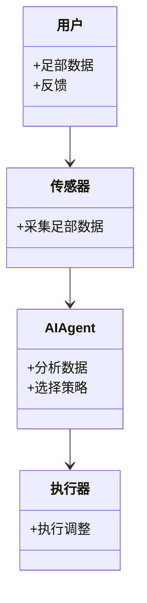
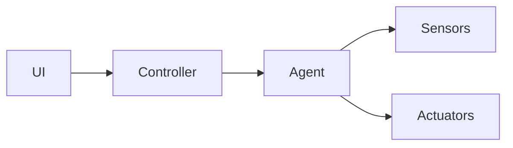

                 


# AI Agent在智能拖鞋中的足部按摩控制

**关键词**：AI Agent，智能拖鞋，足部按摩，传感器，算法

**摘要**：本文详细探讨了AI Agent在智能拖鞋足部按摩控制中的应用，分析了其核心概念、算法原理、系统架构，并通过实际案例展示了其在智能足部按摩系统中的实现过程。

---

# 第1章: 背景介绍

## 1.1 问题背景

### 1.1.1 足部按摩的健康价值
足部按摩是一种传统的健康养生方式，能够促进血液循环、缓解疲劳和改善身体状况。通过智能设备实现足部按摩的自动化和个性化，可以为用户带来更舒适的体验。

### 1.1.2 智能设备在足部按摩中的应用现状
当前市场上的足部按摩设备多为手动或固定模式，缺乏智能化和个性化。引入AI技术可以提升设备的智能化水平，使其能够根据用户的反馈实时调整按摩强度和模式。

### 1.1.3 AI Agent在足部按摩控制中的潜力
AI Agent具备自主决策和学习能力，能够根据用户的足部数据和反馈优化按摩策略，提供个性化的按摩服务。

## 1.2 问题描述

### 1.2.1 足部按摩控制的核心问题
如何实现足部按摩的智能化控制，满足不同用户的个性化需求。

### 1.2.2 智能拖鞋的痛点分析
传统足部按摩设备缺乏智能化，无法根据用户反馈实时调整；用户体验单一，缺乏个性化。

### 1.2.3 AI Agent在足部按摩控制中的目标
通过AI Agent实现足部按摩的智能化、个性化和自适应控制。

## 1.3 问题解决

### 1.3.1 AI Agent在足部按摩控制中的解决方案
通过AI Agent实时分析用户的足部数据和反馈，动态调整按摩模式和强度。

### 1.3.2 技术实现路径
传感器采集足部数据 → AI Agent分析数据 → 调整按摩参数 → 执行器执行调整。

### 1.3.3 应用场景与用户需求
用户可以根据个人需求选择不同的按摩模式，AI Agent实时优化按摩体验。

## 1.4 边界与外延

### 1.4.1 系统边界
系统仅关注足部按摩控制，不涉及其他功能如清洁或加热。

### 1.4.2 功能边界
AI Agent仅负责按摩参数调整，不处理其他外部指令。

### 1.4.3 与其他系统的接口关系
通过蓝牙或Wi-Fi与手机APP或其他设备交互。

## 1.5 概念结构与核心要素

### 1.5.1 核心概念图


## 1.6 本章小结
本章介绍了AI Agent在足部按摩控制中的背景、问题、解决方案和系统边界，为后续章节奠定基础。

---

# 第2章: AI Agent的核心概念与联系

## 2.1 核心概念原理

### 2.1.1 AI Agent的基本原理
AI Agent通过感知环境、分析数据并做出决策，驱动执行器进行调整。

### 2.1.2 AI Agent在足部按摩控制中的应用
AI Agent分析足部传感器数据，动态调整按摩模式和强度。

### 2.1.3 AI Agent与智能拖鞋的交互机制
通过传感器数据输入和执行器输出进行实时交互。

## 2.2 概念属性特征对比

| 比较项 | AI Agent | 传统控制算法 |
|--------|----------|--------------|
| 学习能力 | 强 | 无或弱 |
| 适应性 | 高 | 低 |
| 智能性 | 高 | 无 |

### 2.2.3 足部按摩控制中的关键属性分析
实时性、准确性、个性化。

## 2.3 ER实体关系图

```mermaid
er
actor: 用户
agent: AI Agent
sensor: 传感器
actuator: 执行器
goal: 目标
rule: 规则
```

## 2.4 本章小结
本章详细介绍了AI Agent的核心概念和其在足部按摩控制中的应用，为后续章节提供理论基础。

---

# 第3章: AI Agent的算法原理讲解

## 3.1 算法原理概述

### 3.1.1 算法原理简要说明
基于强化学习的AI Agent，通过奖励机制优化按摩策略。

### 3.1.2 算法流程图


## 3.2 算法数学模型

### 3.2.1 状态空间定义
$$ S = \{s_1, s_2, ..., s_n\} $$
其中，\( s_i \) 表示足部某个状态参数。

### 3.2.2 动作空间定义
$$ A = \{a_1, a_2, ..., a_m\} $$
其中，\( a_j \) 表示某个按摩动作。

### 3.2.3 奖励函数定义
$$ R(s_t, a_t) = r_{t+1} $$
奖励函数根据当前状态和动作计算奖励值。

### 3.2.4 策略函数定义
$$ \pi(a|s) = P(a|s) $$
策略函数定义在给定状态下的动作概率分布。

### 3.2.5 模型训练过程
通过强化学习训练策略函数，以最大化期望奖励。

## 3.3 算法实现代码

### 3.3.1 环境数据接口
```python
class FootSensor:
    def get_data(self):
        # 返回足部传感器数据
        pass
```

### 3.3.2 AI Agent实现
```python
class AIAgent:
    def __init__(self):
        self.model = self._build_model()

    def _build_model(self):
        # 构建AI Agent模型
        pass

    def act(self, state):
        # 根据状态选择动作
        pass

    def update(self, feedback):
        # 更新模型参数
        pass
```

## 3.4 本章小结
本章详细讲解了AI Agent的算法原理，包括流程图、数学模型和代码实现，为后续系统设计提供支持。

---

# 第4章: 系统分析与架构设计

## 4.1 问题场景介绍
AI Agent控制的智能拖鞋系统，通过传感器采集数据，实时调整按摩模式。

## 4.2 系统功能设计

### 4.2.1 领域模型


## 4.3 系统架构设计

### 4.3.1 系统架构图


## 4.4 接口与交互设计

### 4.4.1 系统接口
- 传感器接口：提供足部数据
- 执行器接口：接收控制指令

### 4.4.2 交互流程
```mermaid
sequenceDiagram
    用户 -> 传感器: 获取足部数据
    传感器 -> AI Agent: 传递数据
    AI Agent -> 执行器: 发出调整指令
    执行器 -> 用户: 执行按摩
    用户 -> AI Agent: 提供反馈
    AI Agent -> 更新策略
```

## 4.5 本章小结
本章详细设计了系统的架构和交互流程，确保AI Agent能够高效地控制足部按摩过程。

---

# 第5章: 项目实战

## 5.1 环境安装

### 5.1.1 系统要求
Python 3.8以上，安装TensorFlow、Keras等库。

### 5.1.2 环境配置
```bash
pip install tensorflow keras numpy
```

## 5.2 核心代码实现

### 5.2.1 数据预处理
```python
def preprocess(data):
    # 数据预处理代码
    return processed_data
```

### 5.2.2 AI Agent实现
```python
class AIAgent:
    def __init__(self):
        self.model = self._build_model()

    def _build_model(self):
        # 网络模型构建代码
        pass

    def train(self, state, action, reward):
        # 训练模型代码
        pass

    def predict(self, state):
        # 预测动作代码
        pass
```

## 5.3 案例分析与实现解读

### 5.3.1 案例分析
通过实际数据训练AI Agent，验证其在足部按摩控制中的效果。

### 5.3.2 实现解读
AI Agent能够根据传感器数据实时调整按摩模式，提供个性化服务。

## 5.4 项目总结

### 5.4.1 项目成果
成功实现AI Agent在足部按摩控制中的应用，提升了用户体验。

### 5.4.2 经验总结
传感器数据的准确性对系统性能影响较大，算法训练需要大量数据支持。

## 5.5 本章小结
本章通过实际项目展示了AI Agent在足部按摩控制中的应用，总结了实践经验。

---

# 第6章: 总结

## 6.1 最佳实践 tips
- 确保传感器数据的准确性
- 定期更新AI Agent的策略模型

## 6.2 小结
本文详细探讨了AI Agent在智能拖鞋足部按摩控制中的应用，展示了其在提高用户体验方面的潜力。

## 6.3 注意事项
- 系统安全性需重视
- 数据隐私保护

## 6.4 拓展阅读
推荐阅读《强化学习入门》和《传感器网络与物联网》。

---

作者：AI天才研究院 & 禅与计算机程序设计艺术

