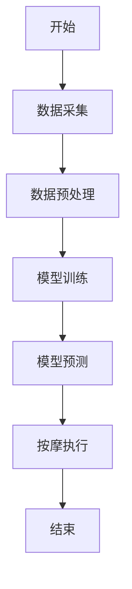
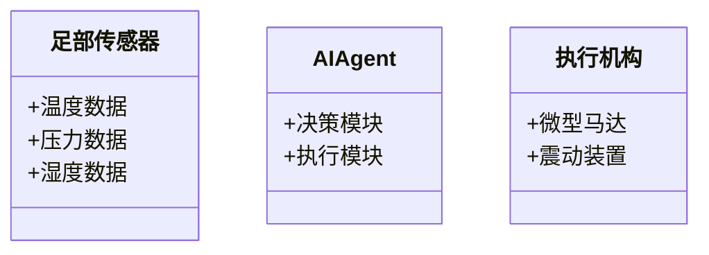
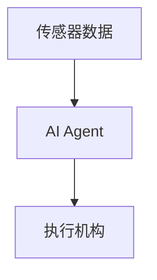
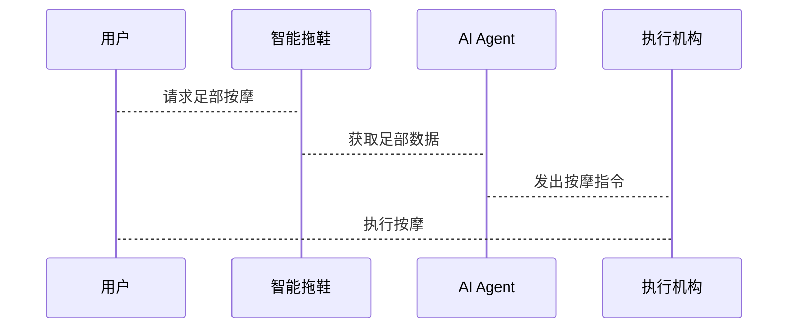

                 


# AI Agent在智能拖鞋中的足部按摩程序设计

> 关键词：AI Agent, 智能拖鞋, 足部按摩, 程序设计, 传感器, 算法, 用户体验

> 摘要：本文详细探讨了AI Agent在智能拖鞋足部按摩程序设计中的应用。通过分析足部按摩的核心问题，结合AI Agent的感知、决策与执行能力，设计了一套智能化的足部按摩程序。文章从背景介绍、核心概念、算法原理、系统架构到项目实战，全面解析了该技术的实现过程，为智能硬件领域的研究提供了新的思路。

---

# 第一部分: 背景介绍

## 第1章: 背景介绍

### 1.1 问题背景

#### 1.1.1 足部按摩的历史与现状
足部按摩是一种通过刺激足部穴位来促进身体健康的方法，其历史可以追溯到古代。现代足部按摩技术结合了中医理论和现代医学知识，成为一种受欢迎的健康方式。然而，传统足部按摩依赖人工操作，难以实现标准化和个性化。

#### 1.1.2 AI技术在足部按摩中的应用潜力
随着AI技术的发展，AI Agent（智能代理）能够通过传感器实时感知用户足部的生理数据，结合算法进行个性化按摩方案的设计。这种智能化的足部按摩方式可以提升用户体验，同时降低人工成本。

#### 1.1.3 智能拖鞋的发展趋势
智能拖鞋作为一种穿戴设备，逐渐融入传感器、AI和物联网技术。通过AI Agent实现足部按摩功能，智能拖鞋不仅提升了舒适性，还为用户提供了智能化的健康管理工具。

### 1.2 问题描述

#### 1.2.1 足部按摩程序的核心问题
足部按摩程序需要解决如何根据用户的生理数据（如压力、温度、湿度）和健康状况，动态调整按摩力度、频率和时间。

#### 1.2.2 智能拖鞋的硬件与软件结合难点
智能拖鞋需要集成多种传感器（如压力传感器、温度传感器）和AI算法，同时保证硬件的轻便性和舒适性。

#### 1.2.3 用户需求与痛点分析
用户对足部按摩的需求包括个性化、舒适性、便捷性和健康效果。传统足部按摩方式难以满足这些需求。

### 1.3 问题解决

#### 1.3.1 AI Agent在足部按摩中的作用
AI Agent通过实时感知足部数据，动态调整按摩方案，提供个性化服务。

#### 1.3.2 智能拖鞋的设计目标与实现路径
设计目标包括实现智能化足部按摩、提升用户体验、降低使用成本。实现路径包括传感器数据采集、AI算法设计、硬件集成与测试。

#### 1.3.3 技术实现的可行性分析
通过现有传感器技术和AI算法，AI Agent在足部按摩中的应用是可行的。

### 1.4 边界与外延

#### 1.4.1 智能拖鞋的功能边界
智能拖鞋的足部按摩功能仅限于足底部分，不涉及足部以外的区域。

#### 1.4.2 AI Agent的适用范围与限制
AI Agent适用于足部按摩程序的优化，但目前难以实现复杂的医疗级诊断。

#### 1.4.3 与传统足部按摩设备的区别
智能拖鞋结合了穿戴设备的便捷性和AI技术的智能化，而传统设备依赖人工操作。

### 1.5 核心概念与组成

#### 1.5.1 AI Agent的核心要素
AI Agent由感知模块、决策模块和执行模块组成，分别负责数据采集、算法处理和硬件执行。

#### 1.5.2 足部按摩程序的关键组成部分
包括传感器、AI算法、硬件执行机构和用户界面。

#### 1.5.3 智能拖鞋的系统架构
智能拖鞋的系统架构包括传感器层、AI算法层和硬件执行层。

---

# 第二部分: 核心概念与联系

## 第2章: AI Agent的核心原理

### 2.1 AI Agent的基本原理

#### 2.1.1 AI Agent的定义与分类
AI Agent是一种能够感知环境并采取行动以实现目标的智能系统。根据应用场景的不同，可以分为简单反射型AI Agent和复杂决策型AI Agent。

#### 2.1.2 AI Agent在足部按摩中的应用
AI Agent通过传感器采集足部数据，结合预设算法生成按摩方案。

#### 2.1.3 AI Agent的感知、决策与执行

#### 2.1.4 AI Agent的感知模块

##### 2.1.4.1 传感器类型
压力传感器、温度传感器和加速度传感器。

##### 2.1.4.2 数据采集与处理
通过传感器采集足部数据，并进行预处理。

#### 2.1.5 AI Agent的决策模块

##### 2.1.5.1 算法选择
基于机器学习的回归算法。

##### 2.1.5.2 决策逻辑
根据足部压力分布调整按摩力度。

#### 2.1.6 AI Agent的执行模块

##### 2.1.6.1 执行机构
微型马达和震动装置。

##### 2.1.6.2 执行策略
根据决策结果启动执行机构。

### 2.2 AI Agent的核心概念

#### 2.2.1 AI Agent的感知能力
AI Agent能够通过传感器实时感知足部的压力、温度等数据。

#### 2.2.2 AI Agent的决策能力
AI Agent根据感知数据和预设算法，生成按摩方案。

#### 2.2.3 AI Agent的执行能力
AI Agent通过执行机构实现按摩动作。

### 2.3 AI Agent与传统控制方式的对比

#### 2.3.1 传统控制方式的特征
传统足部按摩设备依赖人工操作，缺乏智能化。

#### 2.3.2 AI Agent控制方式的特征
AI Agent能够实时感知、动态调整，提供个性化服务。

#### 2.3.3 对比表格
| 特征       | 传统控制方式 | AI Agent控制方式 |
|------------|--------------|------------------|
| 实时性      | 低           | 高               |
| 适应性      | 低           | 高               |
| 舒适性      | 低           | 高               |

---

# 第三部分: 算法原理讲解

## 第3章: 算法原理

### 3.1 算法原理

#### 3.1.1 算法选择
基于机器学习的回归算法，用于预测最佳按摩力度。

#### 3.1.2 算法流程
数据采集 → 数据预处理 → 模型训练 → 模型预测 → 按摩执行。

#### 3.1.3 算法实现

##### 3.1.3.1 数据预处理
去除噪声，提取有效特征。

##### 3.1.3.2 模型训练
使用机器学习算法训练模型。

##### 3.1.3.3 模型预测
根据实时数据预测按摩力度。

#### 3.1.4 算法优化
通过反馈机制不断优化模型参数。

### 3.2 算法流程图


### 3.3 算法代码实现

#### 3.3.1 环境安装
需要安装Python、NumPy、Scikit-learn。

#### 3.3.2 核心代码
```python
import numpy as np
from sklearn.linear_model import LinearRegression

# 数据预处理
X = np.array([...])  # 特征数据
y = np.array([...])  # 标签数据

# 模型训练
model = LinearRegression()
model.fit(X, y)

# 模型预测
predicted = model.predict(new_X)
```

### 3.4 数学模型与公式

#### 3.4.1 感知模型
$$ \text{压力分布} = f(\text{传感器数据}) $$

#### 3.4.2 决策模型
$$ \text{按摩力度} = \alpha \times \text{压力分布} + \beta $$

---

# 第四部分: 系统分析与架构设计方案

## 第4章: 系统分析与架构设计

### 4.1 项目背景

#### 4.1.1 项目介绍
本项目旨在设计一款结合AI Agent的智能拖鞋，实现智能化足部按摩功能。

### 4.2 系统功能设计

#### 4.2.1 领域模型


#### 4.2.2 系统架构


### 4.3 系统接口设计

#### 4.3.1 系统接口
传感器数据接口、AI Agent控制接口、执行机构接口。

#### 4.3.2 系统交互


---

# 第五部分: 项目实战

## 第5章: 项目实战

### 5.1 环境安装

#### 5.1.1 环境要求
安装Python 3.8以上版本，安装NumPy和Scikit-learn库。

### 5.2 系统核心实现

#### 5.2.1 核心代码
```python
import numpy as np
from sklearn.linear_model import LinearRegression

# 数据预处理
X = np.array([...])  # 特征数据
y = np.array([...])  # 标签数据

# 模型训练
model = LinearRegression()
model.fit(X, y)

# 模型预测
predicted = model.predict(new_X)
```

#### 5.2.2 代码解读
传感器数据被预处理后，用于训练回归模型。模型预测按摩力度并控制执行机构。

### 5.3 实际案例分析

#### 5.3.1 案例分析
通过实际数据验证模型的准确性。

#### 5.3.2 案例小结
模型在实际应用中表现出良好的准确性和适应性。

### 5.4 项目小结

#### 5.4.1 项目成果
成功设计并实现了AI Agent在智能拖鞋中的足部按摩程序。

#### 5.4.2 项目经验
AI技术的应用需要硬件和算法的协同优化。

---

# 第六部分: 总结与展望

## 第6章: 总结与展望

### 6.1 项目总结

#### 6.1.1 核心成果
成功实现了AI Agent在智能拖鞋中的足部按摩程序。

#### 6.1.2 经验总结
硬件与算法的协同优化是项目成功的关键。

### 6.2 项目展望

#### 6.2.1 技术改进
优化算法，提升按摩效果。

#### 6.2.2 产品优化
增加更多传感器，提升用户体验。

#### 6.2.3 市场应用
拓展市场，推广智能拖鞋产品。

### 6.3 项目注意事项

#### 6.3.1 数据隐私
保护用户数据隐私。

#### 6.3.2 传感器精度
定期校准传感器以保证准确性。

### 6.4 拓展阅读

#### 6.4.1 推荐书籍
《人工智能：一种现代方法》、《机器学习实战》。

#### 6.4.2 相关技术
深度学习、强化学习、传感器技术。

---

# 作者：AI天才研究院/AI Genius Institute & 禅与计算机程序设计艺术 /Zen And The Art of Computer Programming

