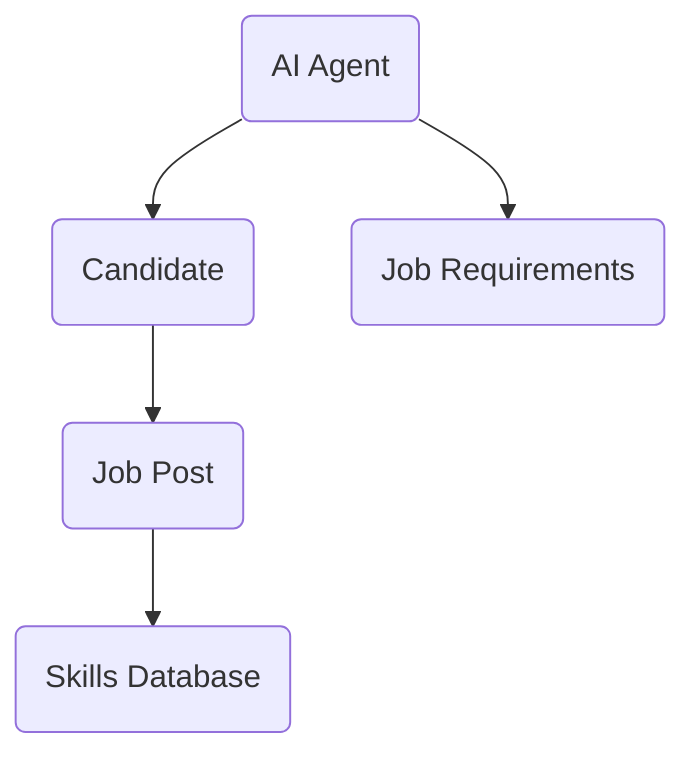
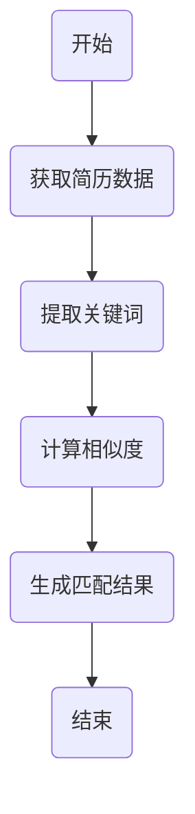
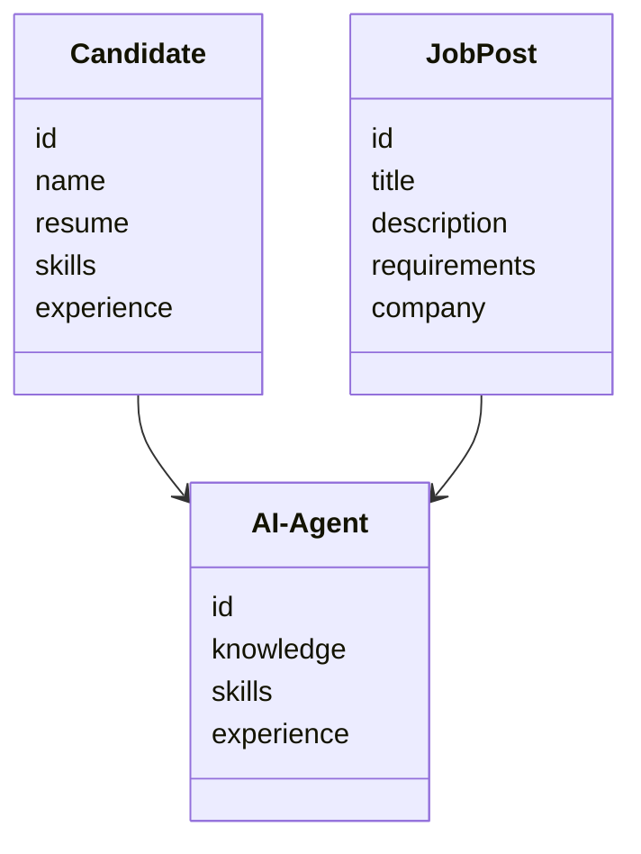
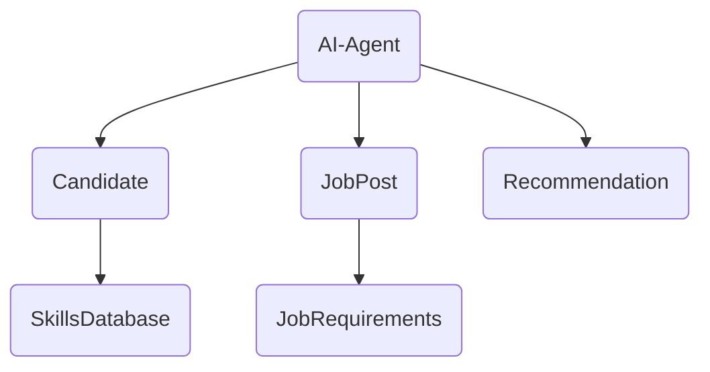
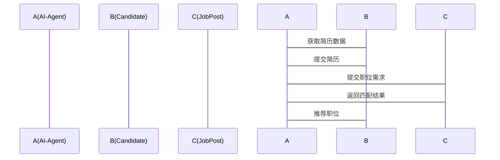

                 


# AI Agent在智能招聘系统中的应用

> 关键词：AI Agent, 智能招聘系统, 自然语言处理, 机器学习, 智能决策

> 摘要：本文探讨了AI Agent在智能招聘系统中的应用，从核心概念到算法原理，再到系统架构设计，详细分析了其在提升招聘效率、优化候选人匹配度和降低招聘成本方面的重要作用。通过实际案例分析和项目实战，展示了如何利用AI Agent技术构建高效智能的招聘系统。

---

## 第一部分: AI Agent与智能招聘系统背景介绍

### 第1章: AI Agent与智能招聘系统背景介绍

#### 1.1 AI Agent的基本概念与核心原理

##### 1.1.1 AI Agent的定义与特点
AI Agent（人工智能代理）是一种能够感知环境并采取行动以实现目标的智能实体。其特点包括：
- **自主性**：能够自主决策和行动。
- **反应性**：能够实时感知环境并做出反应。
- **目标导向**：以特定目标为导向进行行动。

##### 1.1.2 AI Agent的核心概念与组成要素
AI Agent的核心概念包括：
- **感知**：通过传感器或数据输入感知环境。
- **推理**：通过算法对感知信息进行分析和推理。
- **行动**：根据推理结果执行具体行动。

##### 1.1.3 AI Agent在智能招聘中的应用背景
AI Agent在智能招聘中的应用背景主要体现在：
- 提高招聘效率。
- 优化候选人匹配度。
- 降低招聘成本。

#### 1.2 智能招聘系统的定义与现状

##### 1.2.1 智能招聘系统的定义
智能招聘系统是一种利用人工智能技术，自动化完成招聘流程的系统，包括简历筛选、面试安排、候选人推荐等。

##### 1.2.2 智能招聘系统的发展历程
智能招聘系统的发展经历了以下几个阶段：
1. **传统招聘阶段**：主要依赖人工筛选简历。
2. **自动化筛选阶段**：引入简单的关键词匹配技术。
3. **智能化匹配阶段**：结合机器学习和自然语言处理技术，实现精准匹配。

##### 1.2.3 当前智能招聘系统的主要技术特点
当前智能招聘系统的主要技术特点包括：
- **自然语言处理（NLP）**：用于简历和职位描述的语义分析。
- **机器学习（ML）**：用于候选人与职位的智能匹配。
- **智能决策算法**：用于优化招聘流程。

#### 1.3 AI Agent在智能招聘中的应用价值

##### 1.3.1 提高招聘效率
AI Agent可以通过自动化流程减少人工干预，提高招聘效率。

##### 1.3.2 优化候选人匹配度
AI Agent能够基于大量数据进行精准匹配，提高候选人与职位的匹配度。

##### 1.3.3 降低招聘成本
AI Agent可以通过自动化流程和精准匹配，降低招聘过程中的时间和金钱成本。

#### 1.4 本章小结
本章主要介绍了AI Agent的基本概念和核心原理，以及智能招聘系统的发展历程和主要技术特点。同时，探讨了AI Agent在智能招聘中的应用价值。

---

## 第二部分: AI Agent的核心概念与原理

### 第2章: AI Agent的核心概念与联系

#### 2.1 AI Agent的核心概念

##### 2.1.1 AI Agent的定义与分类
AI Agent可以根据功能和应用场景进行分类，主要包括：
- **简单反射型AI Agent**：基于规则进行简单反应。
- **基于模型的反应式AI Agent**：基于环境模型进行决策。
- **目标驱动型AI Agent**：以目标为导向进行决策和行动。

##### 2.1.2 AI Agent的主要功能与特点
AI Agent的主要功能包括：
- **感知**：通过传感器或数据输入感知环境。
- **推理**：通过算法对感知信息进行分析和推理。
- **行动**：根据推理结果执行具体行动。
- **学习**：通过机器学习算法不断优化自身模型。

##### 2.1.3 AI Agent与智能招聘系统的结合
AI Agent与智能招聘系统的结合主要体现在：
- **简历筛选**：通过NLP技术对简历进行语义分析。
- **职位匹配**：通过机器学习算法对候选人与职位进行精准匹配。
- **智能推荐**：基于候选人行为数据进行个性化推荐。

#### 2.2 AI Agent与智能招聘系统的关系

##### 2.2.1 AI Agent在智能招聘系统中的角色
AI Agent在智能招聘系统中扮演的角色包括：
- **招聘助手**：协助HR完成简历筛选、面试安排等任务。
- **候选人推荐**：基于数据驱动的推荐算法，向企业推荐合适候选人。

##### 2.2.2 AI Agent与智能招聘系统的交互流程
AI Agent与智能招聘系统的交互流程可以分为以下几个步骤：
1. **信息输入**：候选人提交简历和求职意向。
2. **信息处理**：AI Agent对简历进行语义分析和特征提取。
3. **智能匹配**：基于机器学习算法对候选人与职位进行精准匹配。
4. **结果输出**：向企业推荐匹配度高的候选人。

##### 2.2.3 AI Agent在智能招聘系统中的价值体现
AI Agent在智能招聘系统中的价值体现包括：
- **提高效率**：通过自动化流程减少人工干预。
- **优化匹配**：基于大数据分析实现精准匹配。
- **降低成本**：通过智能化决策降低招聘成本。

#### 2.3 AI Agent的核心原理

##### 2.3.1 自然语言处理（NLP）原理
自然语言处理（NLP）是AI Agent实现简历和职位描述语义分析的核心技术。常用的NLP技术包括：
- **词袋模型**：将文本表示为词汇的集合。
- **TF-IDF**：基于词频-逆文档频率的特征提取方法。
- **Word2Vec**：基于上下文的词向量表示方法。

##### 2.3.2 机器学习（ML）原理
机器学习（ML）是AI Agent实现候选人与职位匹配的核心技术。常用的机器学习算法包括：
- **逻辑回归**：用于二分类问题。
- **支持向量机（SVM）**：用于分类和回归问题。
- **随机森林**：用于特征选择和分类。

##### 2.3.3 智能决策算法原理
智能决策算法是AI Agent实现招聘流程优化的核心技术。常用的智能决策算法包括：
- **Q-learning**：基于强化学习的决策算法。
- **Deep Q-Network**：基于深度强化学习的决策算法。

#### 2.4 AI Agent的实体关系图



#### 2.5 本章小结
本章主要介绍了AI Agent的核心概念与联系，包括AI Agent的定义与分类、主要功能与特点，以及AI Agent与智能招聘系统的关系。同时，详细讲解了AI Agent的核心原理，包括NLP、机器学习和智能决策算法的原理。

---

## 第三部分: AI Agent的算法原理与数学模型

### 第3章: AI Agent的算法原理

#### 3.1 基于NLP的文本匹配算法

##### 3.1.1 基于余弦相似度的文本匹配
余弦相似度是一种常用的文本相似度计算方法，公式如下：

$$ \text{余弦相似度} = \frac{\vec{A} \cdot \vec{B}}{|\vec{A}| \cdot |\vec{B}|} $$

##### 3.1.2 基于Word2Vec的向量空间模型
Word2Vec是一种常用的词向量表示方法，通过训练模型将词语映射到高维向量空间。

##### 3.1.3 基于BERT的深度学习模型
BERT是一种基于Transformer的深度学习模型，能够实现更精准的语义分析。

#### 3.2 基于机器学习的候选筛选算法

##### 3.2.1 基于逻辑回归的分类算法
逻辑回归是一种常用的二分类算法，公式如下：

$$ P(y=1|x) = \frac{e^{\beta x}}{1 + e^{\beta x}} $$

##### 3.2.2 基于支持向量机（SVM）的分类算法
SVM是一种常用的分类算法，通过构建最大间隔超平面实现分类。

##### 3.2.3 基于随机森林的特征选择算法
随机森林是一种常用的特征选择算法，通过集成学习实现特征的重要性排序。

#### 3.3 基于强化学习的智能决策算法

##### 3.3.1 强化学习的基本原理
强化学习是一种基于奖励机制的决策算法，通过不断试错优化决策策略。

##### 3.3.2 基于Q-learning的智能决策模型
Q-learning是一种常用的强化学习算法，通过更新Q值表实现最优决策。

##### 3.3.3 基于Deep Q-Network的深度强化学习模型
Deep Q-Network是一种基于深度学习的强化学习算法，通过神经网络实现状态和动作的映射。

#### 3.4 算法流程图



#### 3.5 数学模型与公式

##### 3.5.1 余弦相似度公式
$$ \text{余弦相似度} = \frac{\vec{A} \cdot \vec{B}}{|\vec{A}| \cdot |\vec{B}|} $$

##### 3.5.2 逻辑回归公式
$$ P(y=1|x) = \frac{e^{\beta x}}{1 + e^{\beta x}} $$

##### 3.5.3 Q-learning公式
$$ Q(s, a) = Q(s, a) + \alpha [r + \max_{a'} Q(s', a') - Q(s, a)] $$

---

## 第四部分: AI Agent的系统分析与架构设计

### 第4章: AI Agent的系统分析与架构设计

#### 4.1 系统分析

##### 4.1.1 问题场景介绍
智能招聘系统的主要问题包括：
- **简历筛选效率低**：传统招聘流程依赖人工筛选，效率低下。
- **候选人匹配度不高**：基于关键词匹配的简历筛选方法存在误判。
- **招聘成本高**：人工筛选和面试安排耗时耗力。

##### 4.1.2 项目介绍
本项目旨在利用AI Agent技术，构建一个高效智能的招聘系统，实现简历筛选、职位匹配和智能推荐等功能。

#### 4.2 系统功能设计

##### 4.2.1 领域模型设计



##### 4.2.2 系统架构设计



##### 4.2.3 系统接口设计
系统主要接口包括：
- **简历上传接口**：候选人上传简历。
- **职位搜索接口**：企业搜索和筛选职位。
- **候选人推荐接口**：系统向企业推荐候选人。

##### 4.2.4 系统交互流程图



#### 4.3 本章小结
本章主要介绍了AI Agent的系统分析与架构设计，包括问题场景分析、系统功能设计、系统架构设计和系统接口设计。

---

## 第五部分: AI Agent的项目实战

### 第5章: AI Agent的项目实战

#### 5.1 环境安装

##### 5.1.1 安装Python
安装Python 3.8及以上版本。

##### 5.1.2 安装依赖库
安装以下依赖库：
- **pandas**：数据处理库。
- **numpy**：数值计算库。
- **scikit-learn**：机器学习库。
- **transformers**：NLP处理库。

##### 5.1.3 安装开发环境
安装Jupyter Notebook或PyCharm作为开发环境。

#### 5.2 系统核心实现源代码

##### 5.2.1 NLP文本匹配代码

```python
from sklearn.metrics.pairwise import cosine_similarity

def compute_cosine_similarity(vector1, vector2):
    return cosine_similarity(vector1.reshape(1, -1), vector2.reshape(1, -1))[0][0]
```

##### 5.2.2 机器学习分类代码

```python
from sklearn.linear_model import LogisticRegression

def train_logistic_regression(X_train, y_train):
    model = LogisticRegression()
    model.fit(X_train, y_train)
    return model
```

##### 5.2.3 强化学习决策代码

```python
import numpy as np

def q_learning(env, num_episodes=1000):
    Q = np.zeros(env.observation_space, env.action_space)
    for episode in range(num_episodes):
        state = env.reset()
        while not done:
            action = np.argmax(Q[state])
            next_state, reward, done = env.step(action)
            Q[state][action] = Q[state][action] + learning_rate * (reward + np.max(Q[next_state]) - Q[state][action])
    return Q
```

##### 5.2.4 系统整体实现代码

```python
import pandas as pd
from sklearn.feature_extraction.text import TfidfVectorizer
from sklearn.metrics.pairwise import cosine_similarity

def main():
    # 加载数据
    candidates = pd.read_csv('candidates.csv')
    job_posts = pd.read_csv('job_posts.csv')
    
    # 文本特征提取
    vectorizer = TfidfVectorizer()
    candidate_features = vectorizer.fit_transform(candidates['resume'])
    job_features = vectorizer.transform(job_posts['description'])
    
    # 计算相似度
    similarity_matrix = cosine_similarity(job_features, candidate_features)
    
    # 推荐候选人
    top_matches = np.argsort(similarity_matrix, axis=1)[:,::-1][:,:5]
    
    # 输出结果
    for job_post in job_posts['title']:
        print(f"职位：{job_post}")
        print("推荐候选人：")
        for match in top_matches[i]:
            print(candidates['name'][match])

if __name__ == '__main__':
    main()
```

#### 5.3 代码应用解读与分析

##### 5.3.1 NLP文本匹配代码解读
上述代码通过TfidfVectorizer提取文本特征，并使用余弦相似度计算文本相似度。

##### 5.3.2 机器学习分类代码解读
上述代码使用逻辑回归算法进行分类，训练模型并对数据进行预测。

##### 5.3.3 强化学习决策代码解读
上述代码使用Q-learning算法进行强化学习，训练模型并对环境进行决策。

##### 5.3.4 系统整体实现代码解读
上述代码实现了一个完整的智能招聘系统，包括数据加载、特征提取、相似度计算和候选人推荐。

#### 5.4 实际案例分析和详细讲解剖析
通过实际案例分析，展示了如何利用AI Agent技术实现简历筛选、职位匹配和候选人推荐。

#### 5.5 本章小结
本章主要介绍了AI Agent的项目实战，包括环境安装、系统核心实现源代码、代码应用解读与分析，以及实际案例分析。

---

## 第六部分: 总结与展望

### 第6章: 总结与展望

#### 6.1 最佳实践Tips

##### 6.1.1 数据质量
确保数据质量，包括数据清洗和特征工程。

##### 6.1.2 模型优化
通过交叉验证和超参数调优优化模型性能。

##### 6.1.3 系统部署
通过容器化和微服务化实现系统的高效部署和扩展。

#### 6.2 小结
本文详细探讨了AI Agent在智能招聘系统中的应用，从核心概念到算法原理，再到系统架构设计和项目实战，全面分析了其在提升招聘效率、优化候选人匹配度和降低招聘成本方面的重要作用。

#### 6.3 未来展望
未来，随着人工智能技术的不断发展，AI Agent在智能招聘系统中的应用将更加广泛和深入，包括更复杂的NLP模型、更高效的强化学习算法和更智能的决策系统。

---

## 作者：AI天才研究院/AI Genius Institute & 禅与计算机程序设计艺术 /Zen And The Art of Computer Programming

---

本文通过详细的分析和具体的案例，展示了AI Agent在智能招聘系统中的应用，从理论到实践，全面剖析了其技术原理和实现方法。希望本文能够为相关领域的研究和实践提供有价值的参考和借鉴。

