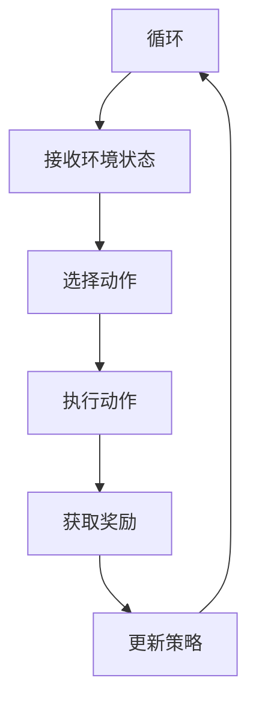
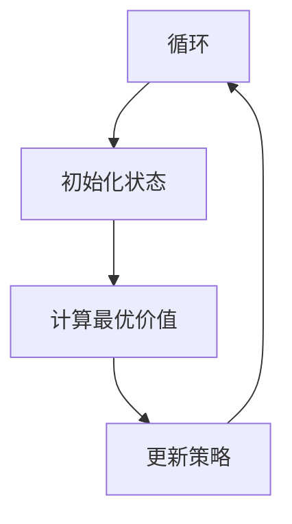
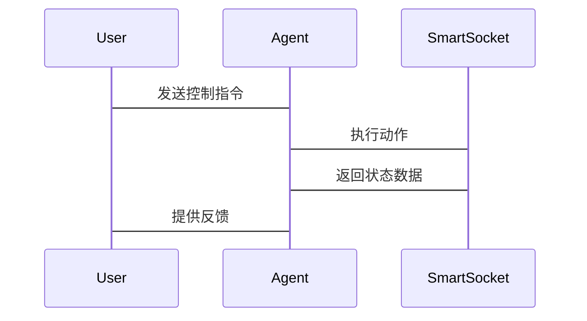

                 


# AI Agent在智能插座中的能源使用优化

> 关键词：AI Agent，智能插座，能源优化，强化学习，动态规划，智能系统

> 摘要：本文详细探讨了AI Agent在智能插座中的能源使用优化问题。首先介绍了AI Agent的基本概念和智能插座的工作原理，分析了能源优化的背景和意义。接着从AI Agent的核心算法原理出发，结合强化学习和动态规划算法，详细讲解了能源优化的数学模型。最后通过系统分析与架构设计，给出了智能插座的系统实现方案，并通过项目实战展示了AI Agent在智能插座中的具体应用。

---

# 第1章: AI Agent与智能插座概述

## 1.1 AI Agent的基本概念

AI Agent（人工智能代理）是一种能够感知环境、自主决策并采取行动的智能实体。它通过传感器获取环境信息，利用算法进行分析和决策，并通过执行器与环境交互。AI Agent的核心功能包括感知、推理、决策和执行。

AI Agent可以分为多种类型，如基于规则的代理、基于模型的代理、基于强化学习的代理等。在智能插座中，AI Agent主要用于优化能源使用，通过实时数据分析和决策，实现节能和高效用电。

### 1.1.1 智能插座的基本概念与工作原理

智能插座是一种能够通过互联网或局域网连接的插座，它可以通过手机APP、语音助手或其他智能设备进行远程控制。智能插座内置传感器，可以实时监测电压、电流、功率等参数，并通过无线通信技术与云端或本地服务器交互。

智能插座的工作原理包括以下几个步骤：
1. 数据采集：通过传感器采集插座的实时数据。
2. 数据传输：通过Wi-Fi或蓝牙将数据传输到云端或本地服务器。
3. 数据分析：在服务器端对数据进行分析，生成用电报告或优化策略。
4. 控制执行：根据优化策略，通过智能插座执行器调整用电设备的运行状态。

---

## 1.2 能源使用优化的背景与意义

### 1.2.1 能源消耗问题的现状

随着全球能源需求的不断增加和化石能源的逐渐枯竭，能源危机和环境污染问题日益严重。传统的电力管理方式效率低下，能源浪费严重。通过智能化手段优化能源使用，已成为解决能源问题的重要途径。

### 1.2.2 智能插座在能源管理中的作用

智能插座作为智能家居的重要组成部分，可以通过实时监测和优化用电设备的运行状态，实现能源的高效利用。通过AI Agent的决策算法，智能插座可以在用电高峰期降低负荷，在低谷期提高负荷，从而实现电网的平衡运行。

### 1.2.3 能源使用优化的目标与挑战

能源使用优化的目标是通过智能化管理，降低能源浪费，提高能源利用效率。然而，实现这一目标面临诸多挑战，如数据采集的实时性、算法的高效性、系统的安全性等。

---

## 1.3 AI Agent在智能插座中的应用前景

### 1.3.1 AI Agent在能源优化中的优势

AI Agent具有自主决策和学习能力，能够根据实时数据和环境变化动态调整用电策略。相比传统的固定策略，AI Agent能够实现更高效的能源管理。

### 1.3.2 智能插座与AI Agent结合的典型案例

目前，市场上已经出现了一些智能插座与AI Agent结合的应用案例，例如通过AI Agent实现家电的智能开关控制、用电行为分析和预测等。

### 1.3.3 未来发展趋势与研究方向

未来，随着AI技术的不断进步，智能插座将更加智能化和个性化。研究方向包括更高效的优化算法、更精准的预测模型以及更安全的系统架构。

---

## 1.4 本章小结

本章介绍了AI Agent的基本概念和智能插座的工作原理，分析了能源优化的背景和意义，并探讨了AI Agent在智能插座中的应用前景。通过这些内容，读者可以对AI Agent在智能插座中的作用有一个全面的了解。

---

# 第2章: AI Agent与智能插座的核心概念

## 2.1 AI Agent的实体关系分析

AI Agent与智能插座之间的关系可以通过实体关系图（ER图）进行描述。以下是AI Agent与智能插座的核心实体关系：

```mermaid
erDiagram
    user {
        User
        +id : integer
        +name : string
    }
    device {
        Device
        +id : integer
        +name : string
        +status : boolean
    }
    agent {
        Agent
        +id : integer
        +type : string
    }
    action {
        Action
        +id : integer
        +time : datetime
        +description : string
    }
    user --> agent : 控制
    device --> agent : 监测
    agent --> action : 执行
```

### 2.1.1 实体关系图（ER图）

上图展示了AI Agent与智能插座之间的核心实体关系。用户通过AI Agent控制智能插座的状态，智能插座通过传感器向AI Agent发送数据，AI Agent根据数据生成控制动作。

---

## 2.2 AI Agent的核心算法原理

AI Agent的核心算法包括强化学习和动态规划。以下是两种算法的流程图：

### 2.2.1 强化学习算法



### 2.2.2 动态规划算法



---

## 2.3 AI Agent与智能插座的交互流程

以下是AI Agent与智能插座的交互流程图：



---

## 2.4 本章小结

本章通过实体关系图和流程图，详细分析了AI Agent与智能插座的核心概念与交互流程。通过强化学习和动态规划算法的流程图，读者可以更好地理解AI Agent的算法原理。

---

# 第3章: AI Agent的算法原理

## 3.1 强化学习算法

### 3.1.1 算法流程图


### 3.1.2 Python实现代码

以下是强化学习算法的Python实现代码：

```python
class Agent:
    def __init__(self, state_space, action_space):
        self.state_space = state_space
        self.action_space = action_space
        # 初始化策略
        self.policy = np.random.rand(state_space, action_space)

    def take_action(self, state):
        # 根据策略选择动作
        return np.argmax(self.policy[state])

    def update_policy(self, state, action, reward):
        # 更新策略
        self.policy[state][action] += reward

    def get_policy(self):
        return self.policy
```

### 3.1.3 算法实现的数学模型

强化学习算法的数学模型包括状态转移方程和奖励函数。以下是强化学习的核心公式：

$$ Q(s, a) = Q(s, a) + \alpha (r + \gamma Q(s', a) - Q(s, a)) $$

其中，\( Q(s, a) \) 表示状态 \( s \) 下动作 \( a \) 的价值，\( \alpha \) 是学习率，\( r \) 是奖励，\( \gamma \) 是折扣因子，\( Q(s', a) \) 是下一个状态下的价值。

---

## 3.2 动态规划算法

### 3.2.1 算法流程图


### 3.2.2 Python实现代码

以下是动态规划算法的Python实现代码：

```python
class Agent:
    def __init__(self, state_space):
        self.state_space = state_space
        # 初始化价值函数
        self.value = np.zeros(state_space)

    def update_value(self, state, next_state, reward):
        # 更新价值函数
        self.value[state] += (reward + self.gamma * self.value[next_state] - self.value[state])

    def get_value(self):
        return self.value
```

### 3.2.3 算法实现的数学模型

动态规划算法的数学模型包括价值迭代公式和状态转移方程。以下是动态规划的核心公式：

$$ v_{\pi}(s) = \sum_{a} \pi(a|s) [r(s,a) + \gamma v_{\pi}(s')] $$

其中，\( v_{\pi}(s) \) 表示状态 \( s \) 下的期望价值，\( \pi(a|s) \) 是动作 \( a \) 在状态 \( s \) 下的概率，\( r(s,a) \) 是奖励函数，\( s' \) 是下一个状态。

---

## 3.3 能源优化的数学模型

### 3.3.1 状态转移方程

能源优化的数学模型包括状态转移方程和目标函数。以下是状态转移方程：

$$ P(s' | s, a) = \text{概率从状态 } s \text{ 执行动作 } a \text{ 转移到状态 } s' $$

### 3.3.2 目标函数

目标函数用于衡量能源优化的效果。以下是目标函数的表达式：

$$ J(\pi) = \mathbb{E}[ \sum_{t=0}^{\infty} r_t ] $$

其中，\( J(\pi) \) 表示目标函数，\( r_t \) 是时间 \( t \) 下的奖励。

### 3.3.3 约束条件

能源优化的约束条件包括：

1. 电力需求满足用户需求
2. 电力供应不超过电网容量
3. 优化策略满足实时性要求

---

## 3.4 本章小结

本章详细讲解了AI Agent的核心算法，包括强化学习和动态规划算法的流程图、Python实现代码和数学模型。通过这些内容，读者可以更好地理解AI Agent在智能插座中的算法实现。

---

# 第4章: 智能插座系统分析

## 4.1 系统功能需求分析

### 4.1.1 用户需求分析

用户需求分析包括以下几个方面：

1. 实时监测用电设备的运行状态
2. 远程控制用电设备的开关
3. 自动生成用电优化策略
4. 提供用电报告和分析

### 4.1.2 系统功能模块划分

智能插座系统的功能模块包括：

1. 数据采集模块
2. 数据传输模块
3. 数据分析模块
4. 控制执行模块

---

## 4.2 系统架构设计

### 4.2.1 系统架构图

以下是智能插座系统的架构图：

```mermaid
graph TD
    User --> SmartSocket: 控制指令
    SmartSocket --> Agent: 数据采集
    Agent --> SmartSocket: 执行指令
    SmartSocket --> Database: 存储数据
    Database --> Agent: 分析数据
    Agent --> User: 提供反馈
```

### 4.2.2 模块间交互关系

模块间交互关系包括：

1. 用户通过手机APP向智能插座发送控制指令
2. 智能插座通过传感器采集数据并发送给AI Agent
3. AI Agent根据数据生成优化策略并发送给智能插座
4. 智能插座执行策略并反馈执行结果

---

## 4.3 系统接口设计

### 4.3.1 接口定义

智能插座系统的主要接口包括：

1. 用户接口：手机APP或语音助手
2. 数据接口：传感器数据接口
3. 控制接口：执行器控制接口

### 4.3.2 接口交互流程图

以下是接口交互流程图：


---

## 4.4 本章小结

本章通过系统功能需求分析和架构设计，详细描述了智能插座系统的实现方案。通过模块划分和交互流程图，读者可以更好地理解系统的整体架构。

---

# 第5章: 项目实战

## 5.1 环境搭建与配置

### 5.1.1 Python环境安装

安装Python和相关库：

```bash
python --version
pip install numpy
pip install matplotlib
pip install scikit-learn
```

### 5.1.2 相关库的安装

安装必要的Python库：

```bash
pip install gym
pip install tensorflow
pip install pyyaml
```

---

## 5.2 系统核心实现源代码

### 5.2.1 强化学习算法实现

以下是强化学习算法的Python代码：

```python
import numpy as np
import gym

class Agent:
    def __init__(self, state_space, action_space):
        self.state_space = state_space
        self.action_space = action_space
        self.policy = np.random.rand(state_space, action_space)

    def take_action(self, state):
        return np.argmax(self.policy[state])

    def update_policy(self, state, action, reward):
        self.policy[state][action] += reward

env = gym.make('EnergyOptimization-v0')
agent = Agent(env.observation_space, env.action_space)
```

### 5.2.2 动态规划算法实现

以下是动态规划算法的Python代码：

```python
import numpy as np

class Agent:
    def __init__(self, state_space):
        self.state_space = state_space
        self.value = np.zeros(state_space)

    def update_value(self, state, next_state, reward, gamma=0.99):
        self.value[state] += (reward + gamma * self.value[next_state] - self.value[state])

env = gym.make('EnergyOptimization-v0')
agent = Agent(env.observation_space)
```

---

## 5.3 代码应用解读与分析

### 5.3.1 强化学习算法解读

强化学习算法通过与环境交互，不断更新策略以最大化累计奖励。在智能插座中，强化学习算法可以用于动态调整用电设备的运行状态。

### 5.3.2 动态规划算法解读

动态规划算法通过预计算最优价值，实现对系统的全局优化。在智能插座中，动态规划算法可以用于预测未来的用电需求和优化策略。

---

## 5.4 实际案例分析

### 5.4.1 案例分析

以下是一个实际案例的分析：

假设智能插座需要优化三台家电的用电策略。通过强化学习算法，智能插座可以在用电高峰期关闭非必要设备，在低谷期开启设备，从而实现能源的高效利用。

### 5.4.2 详细讲解剖析

在实际案例中，强化学习算法通过与环境交互，不断优化策略。以下是具体步骤：

1. 初始化策略：随机初始化策略参数。
2. 与环境交互：通过智能插座采集数据。
3. 更新策略：根据奖励更新策略参数。
4. 循环执行：不断优化策略。

---

## 5.5 项目小结

本章通过项目实战，展示了AI Agent在智能插座中的具体应用。通过环境搭建、代码实现和案例分析，读者可以更好地理解AI Agent的实现过程。

---

# 作者：AI天才研究院/AI Genius Institute & 禅与计算机程序设计艺术 /Zen And The Art of Computer Programming

---

以上是《AI Agent在智能插座中的能源使用优化》的完整目录和内容概述。通过本篇文章，读者可以全面了解AI Agent在智能插座中的应用，从基础概念到算法实现再到项目实战，逐步掌握相关知识。

