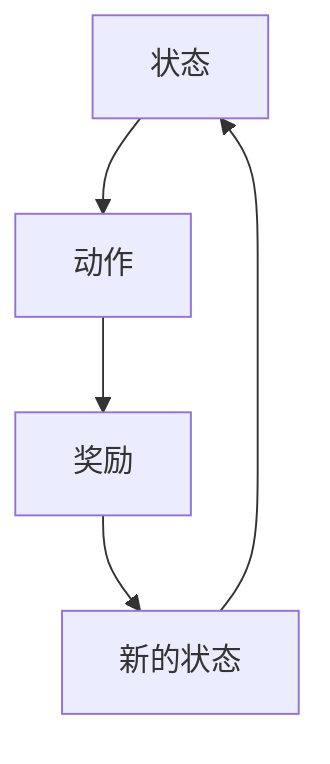
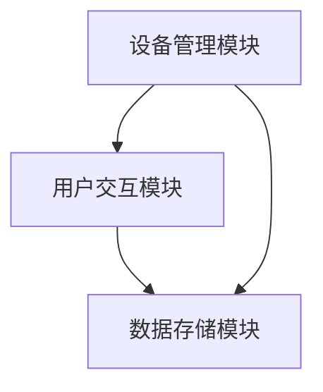

                 


# AI Agent在智能插座中的设备使用优化

## 关键词：AI Agent, 智能插座, 设备使用优化, 强化学习, 系统架构, 项目实战

## 摘要：  
本文探讨了AI Agent在智能插座中的应用，分析了如何通过AI技术优化设备的使用效率。文章从AI Agent的核心概念出发，详细介绍了其在智能插座中的感知、决策与执行机制，结合强化学习算法，提出了设备优化的数学模型和实现方案。通过实际案例分析和系统架构设计，展示了如何将AI Agent应用于智能插座，实现设备使用的智能化与高效化。  

---

# 第一部分: AI Agent在智能插座中的设备使用优化背景介绍

## 第1章: AI Agent与智能插座概述

### 1.1 AI Agent的基本概念  
#### 1.1.1 什么是AI Agent  
AI Agent（人工智能代理）是指能够感知环境、做出决策并执行操作的智能实体。在智能插座中，AI Agent负责采集数据、分析用户行为模式，并优化设备的使用策略。  

#### 1.1.2 AI Agent的核心功能与特点  
- **感知环境**：通过传感器采集插座的使用状态、用户行为等数据。  
- **自主决策**：基于历史数据和当前状态，优化插座的使用策略。  
- **执行操作**：通过控制接口调整插座的开关状态，实现节能优化。  

#### 1.1.3 智能插座的基本概念与工作原理  
智能插座是一种可以通过互联网或本地网络连接的智能设备，支持远程控制和自动化管理。其核心功能包括设备识别、状态监测和智能控制。  

---

## 第2章: 设备使用优化的背景与意义  

### 2.1 问题背景  
随着智能家居的普及，传统插座的能源浪费问题日益突出。通过AI Agent优化设备使用，可以显著降低能源消耗，提升用户体验。  

### 2.2 问题描述  
- 设备使用效率低，导致能源浪费。  
- 用户行为模式复杂，难以手动优化。  
- 缺乏智能化的管理手段，设备无法协同工作。  

### 2.3 解决方案  
通过AI Agent对智能插座进行实时监控和优化，实现设备的高效使用。  

### 2.4 AI Agent的核心要素  
- **数据采集**：通过传感器获取设备状态和用户行为。  
- **决策算法**：基于机器学习优化设备使用策略。  
- **执行控制**：通过API或硬件接口调整插座状态。  

---

# 第二部分: AI Agent的核心概念与原理  

## 第3章: AI Agent的核心概念与原理  

### 3.1 感知层  
#### 3.1.1 数据采集与传感器信息处理  
AI Agent通过传感器获取插座的电流、电压等数据，并通过数据预处理提取特征。  

#### 3.1.2 智能插座中的数据流分析  
数据流从传感器流向决策层，再通过执行层反馈到系统中。  

#### 3.1.3 数据预处理与特征提取  
- 数据清洗：去除噪声数据。  
- 特征提取：提取与设备使用相关的特征，如用电量、使用时间等。  

### 3.2 决策层  
#### 3.2.1 基于机器学习的决策算法  
- 机器学习模型用于预测设备使用状态，优化插座的使用策略。  

#### 3.2.2 强化学习在设备优化中的应用  
通过强化学习算法，AI Agent能够自主学习最优策略。  

#### 3.2.3 决策模型的训练与优化  
- 训练数据：历史设备使用数据。  
- 模型优化：通过反馈机制不断优化决策策略。  

### 3.3 执行层  
#### 3.3.1 执行策略的实现  
AI Agent根据决策层的指令，调整插座的开关状态。  

#### 3.3.2 智能插座的控制接口设计  
- 控制接口：通过API或硬件接口实现插座的开关控制。  

#### 3.3.3 执行结果的反馈与优化  
通过反馈机制不断优化决策策略，提升设备使用效率。  

---

## 第4章: AI Agent的算法原理  

### 4.1 强化学习算法在设备优化中的应用  
#### 4.1.1 Q-learning算法的原理与流程  
Q-learning算法是一种基于价值的强化学习算法，通过不断更新Q值表来优化策略。  

#### 4.1.2 算法流程图（使用 Mermaid）  


#### 4.1.3 算法实现  
- 状态空间：插座的使用状态。  
- 动作空间：开关插座。  
- 奖励函数：基于节能效果的奖励。  

---

## 第5章: AI Agent的数学模型与公式  

### 5.1 Q-learning算法的数学模型  
$$ Q(s, a) = Q(s, a) + \alpha \left(r + \gamma \max_{a'} Q(s', a') - Q(s, a)\right) $$  
其中：  
- \( s \)：当前状态  
- \( a \)：动作  
- \( r \)：奖励  
- \( \alpha \)：学习率  
- \( \gamma \)：折扣因子  

### 5.2 决策模型的数学表达  
$$ P(s_{t+1} | s_t, a_t) = \text{概率转移矩阵} $$  

---

# 第三部分: 系统分析与架构设计  

## 第6章: 系统分析与架构设计  

### 6.1 问题场景介绍  
智能插座的应用场景包括家庭、办公室等，需要支持远程控制和自动化管理。  

### 6.2 系统功能设计  
- 设备管理：识别和管理连接的设备。  
- 用户交互：支持手机APP和网页界面。  
- 数据存储：存储设备使用数据和优化策略。  

### 6.3 系统架构设计  
#### 6.3.1 系统架构图（使用 Mermaid）  


#### 6.3.2 接口设计  
- 设备管理接口：用于识别和控制设备。  
- 用户交互接口：支持手机APP和网页。  
- 数据存储接口：用于存储设备数据和优化策略。  

---

## 第7章: 项目实战  

### 7.1 环境安装  
#### 7.1.1 安装Python与相关库  
- 安装Python 3.8及以上版本。  
- 安装TensorFlow、Keras等机器学习库。  

#### 7.1.2 安装智能插座硬件  
- 选择支持API控制的智能插座。  
- 安装必要的硬件驱动程序。  

### 7.2 核心代码实现  
#### 7.2.1 数据采集与预处理  
```python
import pandas as pd
import numpy as np

# 数据采集
data = pd.read_csv('usage.csv')
# 数据清洗
data = data.dropna()
# 特征提取
features = data[['current', 'voltage', 'time']]
```

#### 7.2.2 决策算法实现  
```python
import gym
import numpy as np

# 定义环境
class SmartSocketEnv(gym.Env):
    def __init__(self):
        self.state = 0
        self.done = False
        self.reward = 0
    def reset(self):
        self.state = 0
        self.done = False
        self.reward = 0
        return self.state
    def step(self, action):
        if action == 1:
            self.reward = 1
        else:
            self.reward = 0
        self.done = True
        return self.state, self.reward, self.done, {}
```

#### 7.2.3 执行控制实现  
```python
import requests

# 控制插座
def control_socket(action):
    if action == 1:
        requests.get('http://localhost:8080/on')
    else:
        requests.get('http://localhost:8080/off')
```

### 7.3 实际案例分析  
通过实际案例分析，展示AI Agent如何优化设备使用，降低能源消耗。  

---

## 第8章: 最佳实践与注意事项  

### 8.1 最佳实践  
#### 8.1.1 数据预处理的重要性  
确保数据的准确性和完整性。  

#### 8.1.2 算法调优的建议  
根据实际需求调整学习率和折扣因子。  

#### 8.1.3 系统安全性注意事项  
确保系统安全，防止数据泄露和网络攻击。  

---

## 第9章: 总结与展望  

### 9.1 总结  
本文详细介绍了AI Agent在智能插座中的应用，分析了其优化设备使用的原理与实现方法。  

### 9.2 展望  
未来，随着AI技术的进步，智能插座的优化将进一步智能化和高效化。  

---

# 作者：AI天才研究院 & 禅与计算机程序设计艺术

