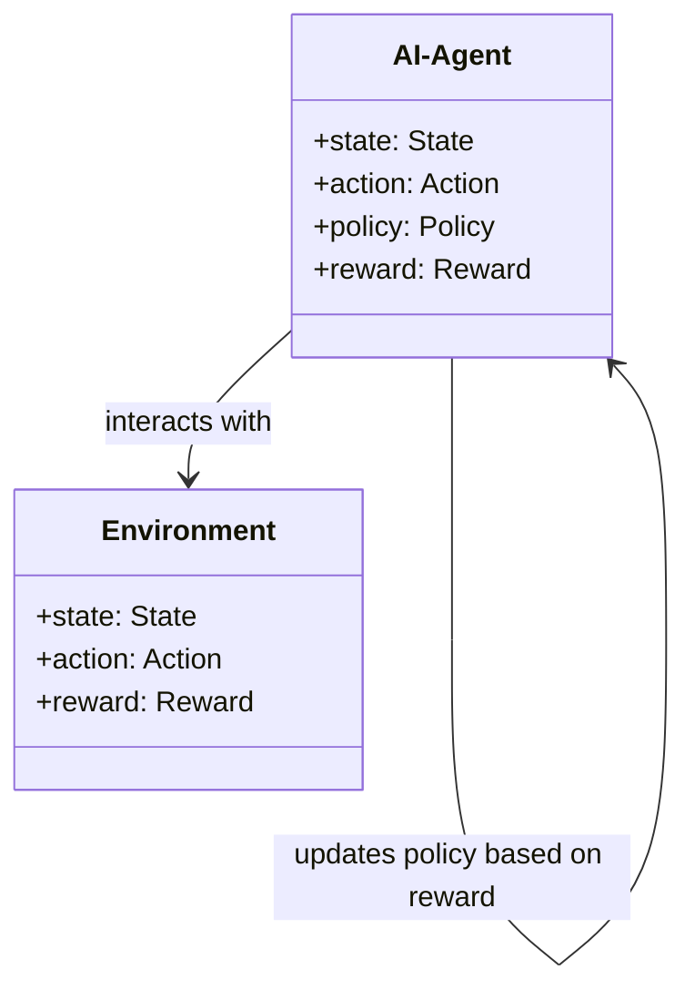
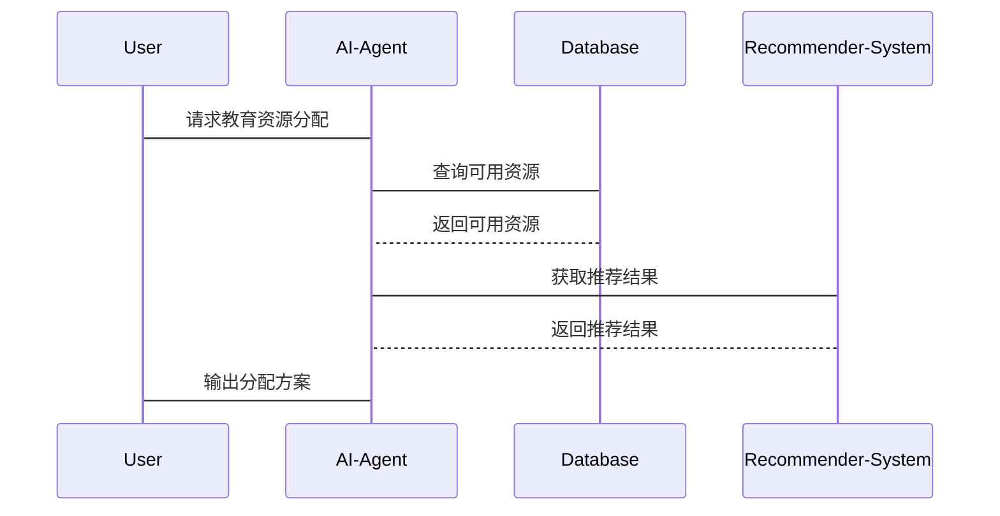

                 


# AI Agent在智能教育资源优化分配中的应用

> 关键词：AI Agent, 智能教育, 教育资源优化, 分配算法, 机器学习  
> 摘要：本文探讨了AI Agent在智能教育资源优化分配中的应用，从背景、理论基础到算法实现，再到系统设计和实战项目，详细分析了AI Agent如何通过强化学习、推荐系统和聚类算法等技术手段，解决教育资源分配中的公平性与效率性问题，并提供了具体的案例分析和代码实现。

---

## 第1章：AI Agent与智能教育的背景与概念

### 1.1 AI Agent的定义与特点

AI Agent（人工智能代理）是指能够感知环境并采取行动以实现目标的智能体。它具备以下特点：
- **自主性**：能够在没有外部干预的情况下自主决策。
- **反应性**：能够实时感知环境变化并做出响应。
- **目标导向**：所有行为都以实现特定目标为导向。
- **学习能力**：通过与环境的交互不断优化自身行为。

AI Agent与传统教育技术的主要区别在于其智能化和自主性。传统教育技术更多依赖于预设规则，而AI Agent能够动态调整策略，适应环境变化。

### 1.2 智能教育的背景与挑战

#### 1.2.1 教育资源分配的现状与问题
教育资源分配中存在的主要问题包括：
- **资源分配不均**：优质教育资源集中在发达地区，偏远地区难以获取。
- **效率低下**：传统分配方式依赖人工操作，效率低且容易出错。
- **个性化不足**：难以满足学生的个性化学习需求。

#### 1.2.2 智能教育的发展趋势
随着人工智能技术的快速发展，智能教育正逐步成为教育领域的重要方向。AI Agent在教育资源优化分配中的应用，为解决上述问题提供了新的可能性。

#### 1.2.3 教育资源优化分配的目标与意义
- **目标**：实现教育资源的公平分配和高效利用。
- **意义**：通过AI Agent技术，可以显著提升教育资源分配的效率和公平性，为学生提供个性化的学习支持。

---

## 第2章：教育资源优化分配的理论基础

### 2.1 数据挖掘与机器学习在教育中的应用

#### 2.1.1 数据挖掘在教育中的应用
数据挖掘技术可以帮助发现教育资源分配中的模式和趋势，例如：
- 分析学生的学习行为数据，发现学习效果不佳的学生群体。
- 识别教师的工作负荷分布，优化教师资源分配。

#### 2.1.2 机器学习在教育中的应用
机器学习算法可以用于预测学生的学习效果、推荐适合的教学资源等。例如：
- 使用回归算法预测学生的学习成绩。
- 使用分类算法识别学习困难的学生。

#### 2.1.3 数据驱动的教育资源分配
通过收集和分析大量数据，AI Agent可以实现数据驱动的教育资源分配，例如：
- 根据学生的学习需求推荐课程。
- 根据学校的资源情况动态调整分配策略。

### 2.2 教育资源分配的公平性与效率性

#### 2.2.1 教育资源分配的公平性
公平性是指教育资源在不同学生或学校之间的分配应尽量均衡。AI Agent可以通过算法优化，确保每个学生都能获得与其需求相匹配的资源。

#### 2.2.2 教育资源分配的效率性
效率性是指在有限的资源条件下，最大化教育资源的利用效果。AI Agent可以通过优化算法，提高资源分配的效率。

#### 2.2.3 公平性与效率性的平衡
AI Agent在教育资源分配中需要在公平性和效率性之间找到平衡点。例如，在分配教师资源时，既要考虑教师的工作负荷，也要确保每个学生都能获得足够的关注。

---

## 第3章：AI Agent的核心算法与数学模型

### 3.1 强化学习算法

#### 3.1.1 强化学习的基本概念
强化学习是一种通过试错机制来优化决策的算法。AI Agent通过与环境的交互，不断优化其策略，以获得最大化的累计奖励。

#### 3.1.2 Q-learning算法
Q-learning是一种常用的强化学习算法，其核心思想是通过更新Q值表来优化决策。Q值表示从当前状态采取某个动作后的预期奖励。

#### 3.1.3 Deep Q-Networks (DQN) 算法
DQN算法通过深度神经网络来近似Q值函数，从而避免了Q值表的维度问题。其数学模型如下：

$$ Q(s, a) = \arg\max_a Q(s, a) $$

其中，\( s \) 表示状态，\( a \) 表示动作。

#### 3.1.4 算法实现的Python代码示例
以下是一个简单的DQN算法实现示例：

```python
import numpy as np
import gym

env = gym.make('CartPole-v0')
state_space = env.observation_space.shape[0]
action_space = env.action_space.n

# 初始化神经网络模型
model = tf.keras.Sequential([
    tf.keras.layers.Dense(24, input_dim=state_space, activation='relu'),
    tf.keras.layers.Dense(action_space, activation='linear')
])

# 定义损失函数和优化器
optimizer = tf.keras.optimizers.Adam(learning_rate=0.001)
loss_fn = tf.keras.losses.MeanSquaredError()

# 训练过程
for episode in range(1000):
    state = env.reset()
    while True:
        # 预测动作
        prediction = model.predict(np.array([state]))
        action = np.argmax(prediction)
        # 执行动作并获取新的状态和奖励
        new_state, reward, done, info = env.step(action)
        # 计算目标值
        target = reward + 0.99 * np.max(model.predict(np.array([new_state])))
        # 更新Q值
        target = np.array([target])
        history = model.fit(np.array([state]), target, epochs=1, verbose=0)
        state = new_state
        if done:
            break
```

### 3.2 聚类算法

#### 3.2.1 K-means算法
K-means算法是一种常用的无监督聚类算法，适用于将学生按照学习需求进行分组。其步骤如下：
1. 随机选择K个初始质心。
2. 计算每个数据点到质心的距离，将其分配到最近的质心所在的簇。
3. 重新计算每个簇的质心。
4. 重复步骤2和3，直到质心不再变化。

#### 3.2.2 层次聚类算法
层次聚类是一种基于树状结构的聚类方法，适用于教育资源分配中的多层次需求分析。

#### 3.2.3 聚类算法在教育资源分配中的应用
例如，可以根据学生的兴趣爱好将他们分成不同的学习小组，从而实现个性化教学。

### 3.3 推荐系统算法

#### 3.3.1 基于协同过滤的推荐算法
协同过滤算法通过分析用户的行为数据，找到相似用户的偏好，进而推荐教育资源。

#### 3.3.2 基于内容的推荐算法
基于内容的推荐算法通过分析教育资源的内容特征，推荐与当前资源相似的资源。

#### 3.3.3 基于深度学习的推荐算法
深度学习推荐算法通过构建神经网络模型，自动提取教育资源的特征并进行推荐。

---

## 第4章：教育资源优化分配的数学模型

### 4.1 资源分配的线性规划模型

#### 4.1.1 线性规划的基本概念
线性规划是一种优化技术，适用于在约束条件下最大化或最小化目标函数。

#### 4.1.2 教育资源分配的线性规划模型
目标函数：最大化教育资源的利用效率。

约束条件：
- 每个学生的教育资源需求必须满足。
- 教育资源的总量有限。

数学模型如下：
$$ \text{最大化} \sum_{i=1}^{n} w_i x_i $$
$$ \text{满足} \sum_{i=1}^{n} x_i \leq R $$

其中，\( w_i \) 是资源 \( i \) 的权重，\( x_i \) 是分配给资源 \( i \) 的数量，\( R \) 是总资源量。

### 4.2 资源分配的多目标优化模型

#### 4.2.1 多目标优化的基本概念
多目标优化是指在多个目标之间找到折中的解决方案。

#### 4.2.2 教育资源分配的多目标优化模型
目标函数：
- 最大化教育资源的公平分配。
- 最大化教育资源的利用效率。

约束条件：
- 资源总量有限。

数学模型如下：
$$ \text{最大化} \sum_{i=1}^{n} \frac{x_i}{\sum_{i=1}^{n} x_i} $$
$$ \text{满足} \sum_{i=1}^{n} x_i \leq R $$

### 4.3 资源分配的动态规划模型

#### 4.3.1 动态规划的基本概念
动态规划是一种通过分解问题来寻找最优解的优化技术。

#### 4.3.2 教育资源分配的动态规划模型
状态定义：每个阶段的资源分配状态。

转移方程：根据当前状态分配资源，转移到下一个状态。

数学模型如下：
$$ \text{状态转移方程} $$

---

## 第5章：系统分析与架构设计方案

### 5.1 问题场景介绍

教育资源分配系统需要解决的问题包括：
- 如何高效分配教师资源。
- 如何个性化分配课程资源。
- 如何动态调整教育资源分配策略。

### 5.2 系统功能设计

#### 5.2.1 领域模型（Mermaid类图）



#### 5.2.2 系统架构设计（Mermaid架构图）


#### 5.2.3 系统接口设计
- AI-Agent接口：接收输入，输出决策。
- 数据库接口：存储和检索数据。
- 推荐系统接口：提供教育资源推荐。

#### 5.2.4 系统交互（Mermaid序列图）



---

## 第6章：项目实战

### 6.1 环境安装

```bash
pip install numpy
pip install gym
pip install tensorflow
```

### 6.2 核心代码实现

```python
import gym
import numpy as np
import tensorflow as tf

# 定义AI Agent模型
class AI-Agent:
    def __init__(self, state_space, action_space):
        self.state_space = state_space
        self.action_space = action_space
        self.model = self._build_model()

    def _build_model(self):
        model = tf.keras.Sequential([
            tf.keras.layers.Dense(24, activation='relu', input_dim=self.state_space),
            tf.keras.layers.Dense(self.action_space, activation='linear')
        ])
        return model

    def act(self, state):
        prediction = self.model.predict(np.array([state]))
        action = np.argmax(prediction)
        return action

    def train(self, state, action, reward, next_state):
        target = reward + 0.99 * np.max(self.model.predict(np.array([next_state])))
        target = np.array([target])
        history = self.model.fit(np.array([state]), target, epochs=1, verbose=0)
```

### 6.3 案例分析与详细讲解

假设我们有一个简单的教育资源分配问题：将有限的教师资源分配给多个学生，确保每个学生都能获得足够的关注。

使用AI Agent算法，我们可以通过强化学习来优化教师的分配策略。例如：

1. 初始化AI Agent模型。
2. 状态定义为当前学生的数量和教师的工作负荷。
3. 动作定义为分配多少教师资源给某个学生。
4. 奖励定义为教师资源分配的公平性和效率性的综合指标。

通过不断训练，AI Agent能够找到最优的教师资源分配策略。

### 6.4 项目总结

通过实际案例分析，我们可以看到AI Agent在教育资源优化分配中的巨大潜力。它不仅可以提高资源分配的效率，还可以实现个性化的教育资源分配。

---

## 第7章：最佳实践与注意事项

### 7.1 最佳实践 tips

- **数据质量**：确保数据的准确性和完整性。
- **算法选择**：根据具体问题选择合适的算法。
- **模型维护**：定期更新模型，以适应环境的变化。

### 7.2 小结

AI Agent通过强化学习、推荐系统和聚类算法等技术手段，显著提升了教育资源分配的效率和公平性。

### 7.3 注意事项

- **数据隐私**：在处理学生数据时，需要注意隐私保护。
- **模型鲁棒性**：确保模型在面对异常情况时仍能正常运行。

### 7.4 拓展阅读

- 推荐阅读《强化学习实战》。
- 参考OpenAI Gym的官方文档。

---

## 结论

AI Agent在智能教育资源优化分配中的应用前景广阔。通过强化学习、推荐系统和聚类算法等技术手段，AI Agent能够显著提升教育资源分配的效率和公平性。未来，随着技术的不断发展，AI Agent将在教育领域发挥更大的作用。

---

## 作者信息

作者：AI天才研究院/AI Genius Institute & 禅与计算机程序设计艺术 /Zen And The Art of Computer Programming

---

希望这篇文章能够为读者提供关于AI Agent在教育资源优化分配中的深入理解，并为实际应用提供有价值的参考。

