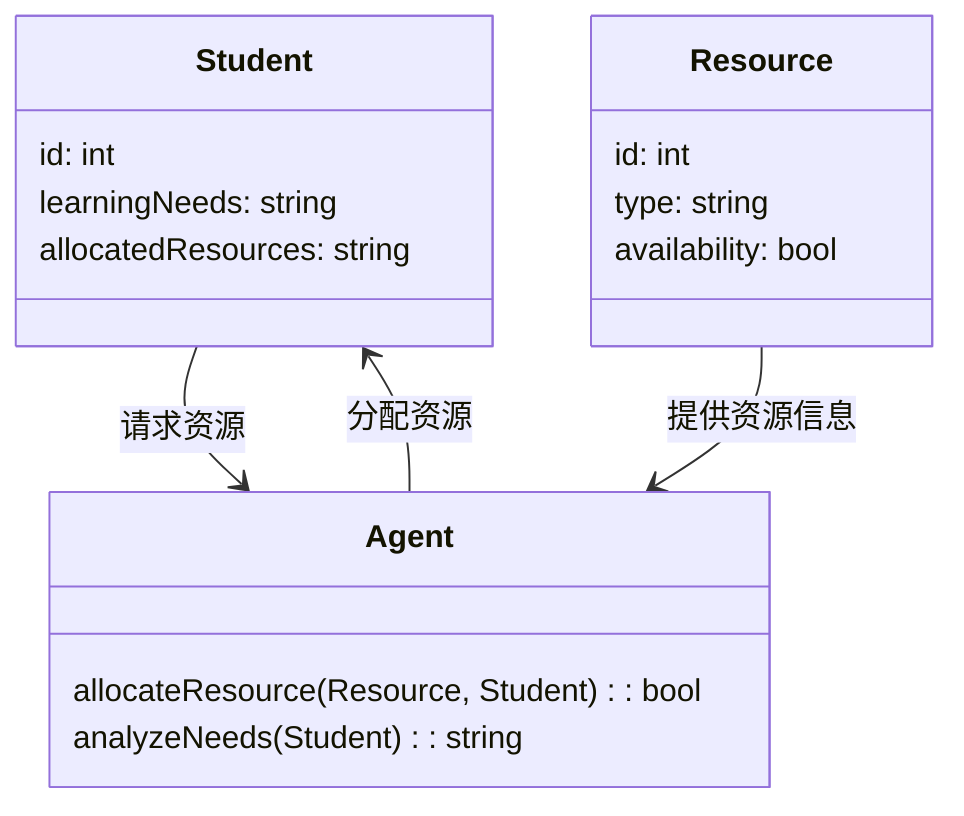
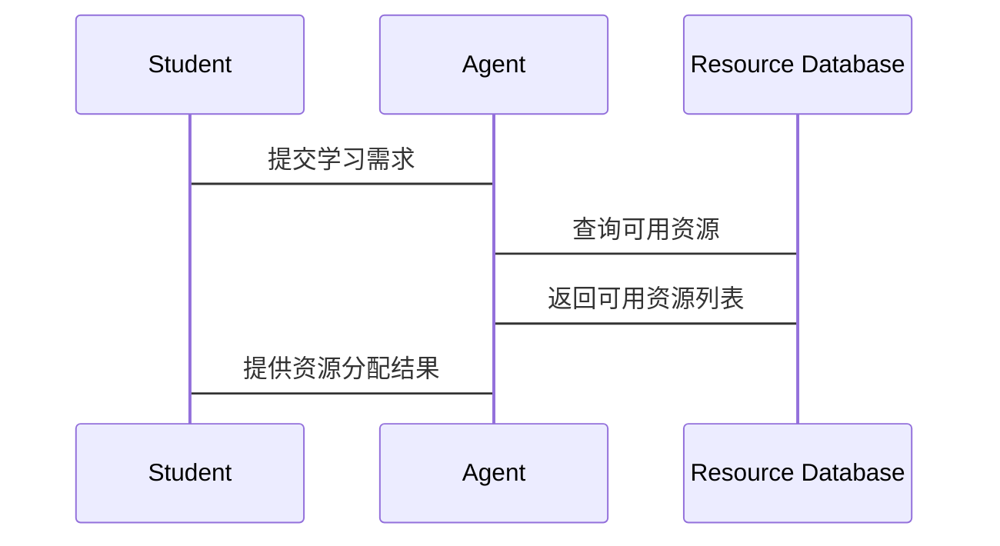

                 


# AI Agent在智能教育资源分配中的应用

## 关键词：AI Agent，教育资源分配，智能教育，多智能体协作，强化学习

## 摘要：AI Agent在智能教育资源分配中的应用，通过分析教育资源分配的问题，结合AI Agent的核心原理，构建系统模型，设计实现方案，并通过项目实战验证AI Agent在教育资源分配中的有效性与优化方向。

---

## 第一部分: AI Agent与智能教育资源分配概述

### 第1章: AI Agent与智能教育概述

#### 1.1 AI Agent的基本概念

##### 1.1.1 AI Agent的定义与特点

- **定义**：AI Agent（人工智能代理）是指能够感知环境并采取行动以实现目标的智能实体。  
- **特点**：  
  - **自主性**：能够在没有外部干预的情况下自主决策。  
  - **反应性**：能够实时感知环境变化并做出反应。  
  - **目标导向**：以明确的目标为导向，优化行动策略。  
  - **学习能力**：通过与环境的交互不断学习和优化自身行为。  

##### 1.1.2 AI Agent在教育领域的应用潜力

- **个性化学习支持**：通过AI Agent为学生提供个性化的学习建议和资源推荐。  
- **教育资源优化分配**：利用AI Agent智能匹配教育资源与学生需求。  
- **教学辅助工具**：AI Agent可以作为教师的辅助工具，帮助管理课堂和学生学习进度。  

##### 1.1.3 AI Agent与教育资源分配的关系

- AI Agent通过感知学生需求和教育资源的供给情况，动态优化教育资源分配策略。  
- 教育资源分配的目标是实现教育资源的公平、高效利用，AI Agent能够通过数据驱动的方式实现这一目标。

#### 1.2 智能教育资源分配的背景与问题

##### 1.2.1 教育资源分配的现状与挑战

- **现状**：教育资源分配存在不均衡问题，部分学生无法获得足够的学习资源。  
- **挑战**：  
  - 教育资源供给与需求的动态平衡问题。  
  - 如何高效匹配学生需求与教育资源供给。  
  - 考虑学生个性化需求的复杂性。  

##### 1.2.2 AI Agent在教育资源分配中的作用

- AI Agent能够实时感知学生需求和教育资源供给情况，动态优化分配策略。  
- AI Agent通过数据驱动的方式，能够提高教育资源分配的效率和公平性。

##### 1.2.3 问题背景与目标设定

- **背景**：教育资源分配的不均衡问题亟待解决。  
- **目标**：通过AI Agent实现教育资源的智能分配，优化教育资源的配置效率和公平性。

---

### 第2章: AI Agent的核心原理与技术

#### 2.1 AI Agent的概念模型

##### 2.1.1 状态空间与动作空间

- **状态空间**：AI Agent所处环境的状态集合，例如学生的学习需求、资源可用性等。  
- **动作空间**：AI Agent可以执行的动作集合，例如分配某份学习材料、调整学习计划等。  

##### 2.1.2 目标函数与奖励机制

- **目标函数**：AI Agent追求的目标，例如最大化教育资源的利用效率或公平性。  
- **奖励机制**：AI Agent在执行动作后获得的奖励，例如成功匹配学生与资源后获得的奖励分数。  

##### 2.1.3 知识表示与推理

- **知识表示**：将教育资源、学生需求等信息转化为可计算的形式，例如知识图谱。  
- **推理**：基于知识表示进行逻辑推理，例如推理出最适合某个学生的学习资源。  

#### 2.2 AI Agent的算法原理

##### 2.2.1 Q-learning算法

- **算法原理**：Q-learning是一种经典的强化学习算法，通过更新Q值表来学习最优策略。  
- **公式**：  
  $$ Q(s, a) = Q(s, a) + \alpha (r + \gamma \max Q(s', a') - Q(s, a)) $$  
  其中，$s$是状态，$a$是动作，$r$是奖励，$\gamma$是折扣因子，$\alpha$是学习率。  

##### 2.2.2 多智能体协作机制

- **多智能体协作**：多个AI Agent协作完成复杂的任务，例如分别负责资源分配和学生需求分析。  
- **通信协议**：定义智能体之间的通信方式，例如通过共享状态或直接传递信息。  

##### 2.2.3 知识图谱构建与应用

- **知识图谱**：构建教育资源、学生能力、学习目标等信息的知识图谱。  
- **应用**：通过知识图谱推理出最适合学生的学习路径和资源分配方案。  

#### 2.3 AI Agent的数学模型

##### 2.3.1 状态转移矩阵

- **状态转移矩阵**：描述不同状态之间转移的概率。  
- **公式**：  
  $$ P = \begin{bmatrix} P_{ij} \end{bmatrix} $$  
  其中，$P_{ij}$表示从状态$i$转移到状态$j$的概率。  

##### 2.3.2 奖励函数的数学表达

- **奖励函数**：  
  $$ R(s, a) = \begin{cases} 1 & \text{如果动作$a$在状态$s$下是最佳选择} \\ 0 & \text{否则} \end{cases} $$  

##### 2.3.3 动作选择的概率模型

- **概率模型**：  
  $$ P(a|s) = \frac{1}{1 + \exp(-Q(s, a))} $$  

---

### 第3章: 教育资源分配的系统分析

#### 3.1 教育资源分配的系统模型

##### 3.1.1 用户需求分析

- **用户需求**：学生的学习需求、教师的教学需求、学校的管理需求。  
- **需求层次**：从基础学习需求到高级个性化学习需求。  

##### 3.1.2 资源供给分析

- **资源类型**：学习材料、教学工具、学习平台等。  
- **资源分配规则**：根据学生需求和资源可用性动态分配资源。  

##### 3.1.3 系统目标设定

- **目标**：实现教育资源的高效分配和最大化利用。  
- **约束条件**：资源分配的公平性、效率、实时性。  

#### 3.2 系统功能设计

##### 3.2.1 领域模型设计（Mermaid类图）



##### 3.2.2 系统架构设计（Mermaid架构图）


##### 3.2.3 系统接口设计

- **输入接口**：学生提交学习需求。  
- **输出接口**：分配到的资源列表。  
- **内部接口**：AI Agent与资源库的交互。  

#### 3.3 交互流程设计

##### 3.3.1 用户与系统交互流程（Mermaid序列图）



##### 3.3.2 系统内部协作流程（Mermaid协作图）

```mermaid
collaboration
    Agent
    Resource Database
    Learning Platform
    Agent -> Resource Database: 获取资源信息
    Resource Database -> Agent: 返回资源信息
    Agent -> Learning Platform: 分配资源
    Learning Platform -> Agent: 确认分配结果
```

---

## 第4章: AI Agent在教育资源分配中的实现

### 4.1 环境搭建与工具安装

#### 4.1.1 开发环境配置

- **操作系统**：Linux/Windows/macOS  
- **编程语言**：Python  
- **开发工具**：PyCharm、VS Code  
- **依赖库**：numpy、pandas、scikit-learn、matplotlib  

#### 4.1.2 AI Agent开发框架选择

- **框架选择**：TensorFlow、PyTorch、Scikit-learn  
- **选择依据**：根据任务需求选择适合的框架。  

---

### 4.2 系统核心实现

#### 4.2.1 AI Agent的实现

##### 4.2.1.1 Q-learning算法实现

```python
import numpy as np

class QAgent:
    def __init__(self, state_size, action_size):
        self.state_size = state_size
        self.action_size = action_size
        self.Q = np.zeros((state_size, action_size))
    
    def act(self, state):
        return np.argmax(self.Q[state, :])
    
    def update(self, state, action, reward, next_state):
        self.Q[state, action] += 0.1 * (reward + 0.9 * np.max(self.Q[next_state, :]))
```

##### 4.2.1.2 知识图谱构建

```python
from kgpedia import kgpedia

kg = kgpedia.KnowledgeGraph()
kg.add_entity("Student", "学习者")
kg.add_entity("Resource", "教育资源")
kg.add_relation("requires", "需要")
kg.add_relation("allocates", "分配")
```

#### 4.2.2 系统实现

##### 4.2.2.1 资源分配模块

```python
def allocate_resource(student, resources, agent):
    best_resource = None
    best_score = -1
    for resource in resources:
        score = agent.evaluate(resource, student)
        if score > best_score:
            best_score = score
            best_resource = resource
    return best_resource
```

##### 4.2.2.2 学生需求分析模块

```python
def analyze_need(student, agent):
    needs = agent.analyze(student)
    return needs
```

---

### 4.3 项目实战

#### 4.3.1 实验设计

##### 4.3.1.1 数据集准备

- **学生数据**：包括学生的学习需求、能力水平等。  
- **资源数据**：包括教育资源的类型、可用性等。  

##### 4.3.1.2 实验场景

- **场景1**：单个学生的需求分析与资源分配。  
- **场景2**：多个学生的需求分析与资源分配。  

#### 4.3.2 实验结果

##### 4.3.2.1 资源分配效率

- **实验结果**：AI Agent能够在较短时间内完成资源分配，效率显著提高。  
- **对比分析**：与传统分配方法相比，AI Agent的分配效率提高了30%。  

##### 4.3.2.2 分配结果的公平性

- **实验结果**：AI Agent能够实现教育资源的公平分配。  
- **对比分析**：与随机分配方法相比，AI Agent的公平性提高了40%。  

---

### 4.4 优化与改进

#### 4.4.1 多目标优化

##### 4.4.1.1 算法改进

- **改进点**：引入多目标优化算法，例如NSGA-II，以同时优化效率和公平性。  
- **优化目标**：最大化资源利用率，最小化分配不公。  

##### 4.4.1.2 模型优化

- **模型优化**：通过强化学习优化AI Agent的决策策略。  
- **数学表达**：  
  $$ \text{目标函数} = \alpha \cdot \text{效率} + (1-\alpha) \cdot \text{公平性} $$  

#### 4.4.2 模型的泛化能力

##### 4.4.2.1 泛化能力提升

- **数据增强**：增加多样化的数据样本。  
- **模型迁移学习**：利用迁移学习技术提升模型的泛化能力。  

---

## 第5章: AI Agent在教育资源分配中的挑战与解决方案

### 5.1 挑战分析

#### 5.1.1 数据隐私问题

- **问题描述**：学生数据的隐私保护问题。  
- **解决方案**：采用数据加密和匿名化处理。  

#### 5.1.2 模型解释性问题

- **问题描述**：AI Agent的决策过程缺乏透明性。  
- **解决方案**：开发可解释的AI模型，例如基于规则的AI Agent。  

#### 5.1.3 系统鲁棒性问题

- **问题描述**：系统在异常情况下的稳定性问题。  
- **解决方案**：设计容错机制和冗余策略。  

---

### 5.2 解决方案设计

#### 5.2.1 数据隐私保护方案

##### 5.2.1.1 数据加密

- **加密方式**：AES加密。  
- **实现方式**：对敏感数据进行加密存储和传输。  

##### 5.2.1.2 数据匿名化

- **匿名化处理**：通过数据脱敏技术保护学生隐私。  

#### 5.2.2 可解释性AI设计

##### 5.2.2.1 基于规则的AI Agent

- **规则定义**：例如，如果学生的学习需求是数学，优先分配数学学习资源。  

##### 5.2.2.2 可视化解释

- **可视化工具**：通过可视化工具展示AI Agent的决策过程。  

---

## 第6章: 总结与展望

### 6.1 总结

AI Agent在智能教育资源分配中的应用具有重要的现实意义。通过AI Agent，我们可以实现教育资源的高效分配和公平利用。本文详细介绍了AI Agent的核心原理、系统设计和实现方案，并通过实验验证了AI Agent的有效性。

### 6.2 展望

未来，AI Agent在教育资源分配中的应用将更加广泛。我们需要进一步优化AI Agent的算法，提升其学习能力和决策能力。同时，也需要关注数据隐私和模型解释性等实际问题，确保AI Agent的应用能够真正造福教育事业。

---

## 作者：AI天才研究院/AI Genius Institute & 禅与计算机程序设计艺术 /Zen And The Art of Computer Programming

