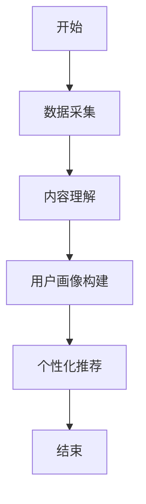
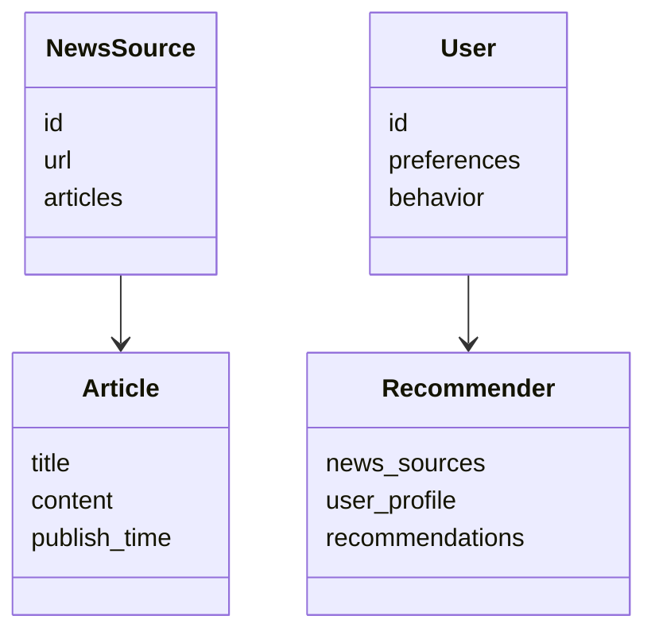
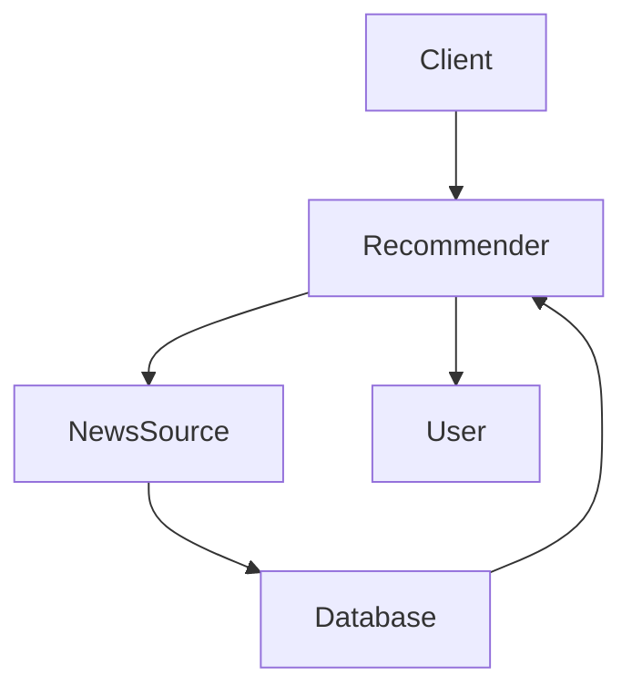
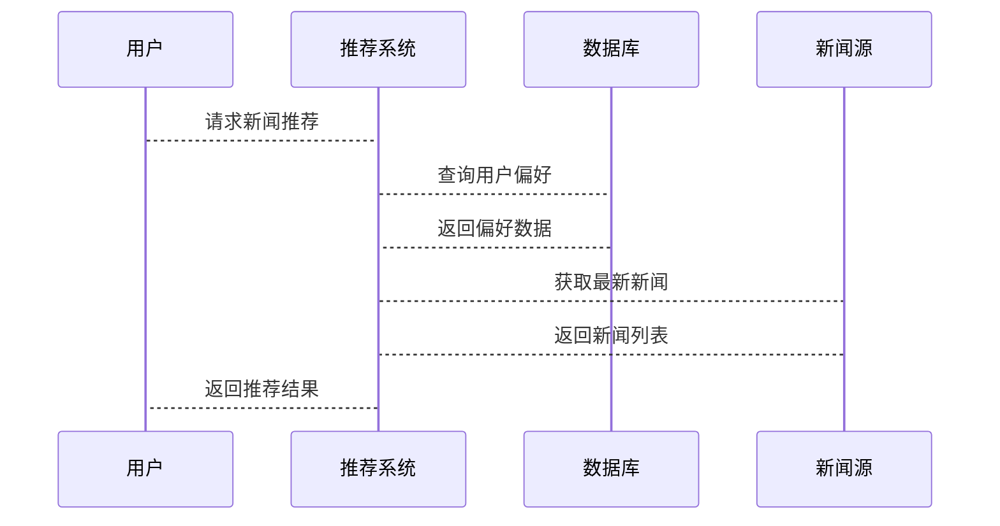

                 


# AI Agent在智能新闻聚合中的角色

> 关键词：AI Agent, 智能新闻聚合, 新闻推荐系统, 自然语言处理, 机器学习

> 摘要：本文探讨AI Agent在智能新闻聚合中的角色与应用，分析其如何通过自然语言处理和机器学习提升新闻推荐的精准度和用户体验。通过详细的技术分析和实际案例，揭示AI Agent在新闻聚合中的核心作用及其未来发展方向。

---

# 第1章: AI Agent与智能新闻聚合的背景介绍

## 1.1 问题背景

### 1.1.1 传统新闻聚合的局限性
传统新闻聚合平台主要依赖人工编辑和简单的关键词匹配技术，难以满足用户个性化需求。用户获取新闻的效率低，且推荐内容缺乏深度和相关性。

### 1.1.2 AI技术在新闻聚合中的应用前景
AI技术，特别是自然语言处理和机器学习，为新闻聚合带来了新的可能性。AI Agent可以通过分析用户行为和内容语义，提供更精准的新闻推荐。

### 1.1.3 智能新闻聚合的定义与目标
智能新闻聚合是指利用AI技术对新闻内容和用户需求进行深度分析，自动筛选、排序和推荐新闻内容，旨在提升用户体验和聚合效率。

---

## 1.2 问题描述

### 1.2.1 新闻聚合的核心问题
- 用户需求多样，难以通过简单的关键词匹配覆盖。
- 新闻内容繁杂，如何快速提取有价值的信息是关键。

### 1.2.2 AI Agent在新闻聚合中的角色定位
AI Agent作为智能新闻聚合的核心，负责内容理解、用户画像构建和个性化推荐。

### 1.2.3 当前新闻聚合中的主要挑战
- 数据量大，计算资源需求高。
- 用户需求动态变化，推荐算法需要实时更新。

---

## 1.3 问题解决

### 1.3.1 AI Agent如何优化新闻聚合
- 通过自然语言处理技术分析新闻内容，提取关键词和语义信息。
- 利用用户行为数据构建用户画像，实现个性化推荐。

### 1.3.2 智能新闻聚合的实现路径
1. 数据采集与预处理。
2. 内容理解和语义分析。
3. 用户画像构建。
4. 个性化推荐算法设计。

### 1.3.3 AI Agent在新闻聚合中的具体应用
- 内容分类与聚类。
- 实时新闻推荐。
- 用户行为预测与反馈优化。

---

## 1.4 边界与外延

### 1.4.1 AI Agent在新闻聚合中的边界
- 仅限于新闻内容的分析和推荐，不涉及新闻生成。
- 依赖于高质量的数据和算法模型。

### 1.4.2 智能新闻聚合的外延与扩展
- 与其他AI应用场景（如社交媒体、电子商务）共享技术。
- 拓展至多模态数据（视频、图像）的新闻聚合。

### 1.4.3 相关领域的区别与联系
- 与传统新闻推荐的区别在于智能化和个性化。
- 与搜索引擎的区别在于目标是聚合而非检索。

---

## 1.5 核心概念与组成

### 1.5.1 AI Agent的基本构成
- **感知层**：数据采集与处理。
- **理解层**：内容语义分析。
- **决策层**：推荐策略制定。
- **执行层**：推荐结果输出。

### 1.5.2 智能新闻聚合的核心要素
- **数据源**：多渠道新闻数据。
- **处理引擎**：AI算法模型。
- **用户画像**：个性化需求。
- **推荐系统**：动态调整推荐策略。

### 1.5.3 AI Agent与新闻聚合的结合点
- AI Agent作为桥梁，连接新闻内容和用户需求。
- 通过语义理解和行为分析，实现精准推荐。

---

## 1.6 本章小结

本章介绍了AI Agent在智能新闻聚合中的背景和概念，分析了传统新闻聚合的局限性和AI技术的应用前景。通过定义和问题描述，明确了AI Agent在新闻聚合中的角色和目标。最后，探讨了智能新闻聚合的边界和外延，为后续章节的深入分析奠定了基础。

---

# 第2章: AI Agent的核心概念与原理

## 2.1 AI Agent的定义与特征

### 2.1.1 AI Agent的定义
AI Agent是一种智能体，能够通过感知环境、分析数据并采取行动，以实现特定目标。

### 2.1.2 核心特征对比

| 特性       | AI Agent       | 传统算法         |
|------------|----------------|-----------------|
| 智能性     | 高             | 低             |
| 自适应性   | 强             | 弱             |
| 学习能力   | 强             | 无             |
| 实时性     | 高             | 低             |

### 2.1.3 ER实体关系图

```mermaid
erd
  股东
  组织架构
  员工
  股东 --> 组织架构: 1..n
  组织架构 --> 员工: 1..n
```

---

## 2.2 AI Agent的原理

### 2.2.1 AI Agent的基本原理

AI Agent通过以下步骤实现智能新闻聚合：
1. 数据采集：从多渠道获取新闻内容。
2. 内容理解：利用NLP技术提取关键词和语义信息。
3. 用户画像：基于行为数据构建用户偏好模型。
4. 推荐生成：结合内容和用户画像，生成个性化推荐列表。

### 2.2.2 自然语言处理的作用

自然语言处理（NLP）在新闻聚合中的作用包括：
- **内容分类**：将新闻分为不同类别。
- **语义分析**：理解新闻内容的深层含义。
- **实体识别**：提取新闻中的关键实体。

### 2.2.3 机器学习的应用

机器学习在新闻聚合中的应用包括：
- **训练模型**：利用历史数据训练推荐模型。
- **实时预测**：根据用户行为实时调整推荐策略。
- **反馈优化**：通过用户反馈优化模型参数。

---

## 2.3 AI Agent的实现步骤

### 2.3.1 算法流程图



### 2.3.2 Python代码实现

```python
import numpy as np
from sklearn.feature_extraction.text import TfidfVectorizer
from sklearn.metrics.pairwise import cosine_similarity

def compute_similarity(texts):
    vectorizer = TfidfVectorizer()
    tfidf_matrix = vectorizer.fit_transform(texts)
    similarity_matrix = cosine_similarity(tfidf_matrix_dense)
    return similarity_matrix

texts = ["Breaking news: AI technology advances in news aggregation.",
         "New study reveals AI's role in personalized news recommendations."]
result = compute_similarity(texts)
print(result)
```

### 2.3.3 数学模型与公式

余弦相似度计算公式：
$$ \text{similarity}(x, y) = \frac{\sum x_i y_i}{\sqrt{\sum x_i^2} \cdot \sqrt{\sum y_i^2}} $$

---

## 2.4 本章小结

本章详细介绍了AI Agent的核心概念和原理，重点分析了自然语言处理和机器学习在智能新闻聚合中的作用。通过流程图和代码示例，展示了AI Agent的实现步骤和数学模型，为后续章节的系统设计和项目实现奠定了基础。

---

# 第3章: AI Agent在智能新闻聚合中的系统分析与架构设计

## 3.1 系统功能设计

### 3.1.1 领域模型类图



### 3.1.2 系统架构图



---

## 3.2 接口与交互设计

### 3.2.1 接口设计



---

## 3.3 系统实现细节

### 3.3.1 系统实现流程

1. 用户请求新闻推荐。
2. 推荐系统查询用户偏好。
3. 获取最新新闻数据。
4. 根据用户偏好生成推荐列表。
5. 返回推荐结果。

### 3.3.2 系统优化

- **分布式计算**：提高数据处理效率。
- **缓存机制**：减少重复计算，提升性能。

---

## 3.4 本章小结

本章从系统分析的角度，详细设计了AI Agent在智能新闻聚合中的系统架构和功能模块。通过类图和序列图，展示了系统的整体结构和交互流程，为后续章节的项目实现提供了指导。

---

# 第4章: AI Agent在智能新闻聚合中的项目实战

## 4.1 环境安装与配置

### 4.1.1 安装Python和相关库
```bash
pip install numpy scikit-learn nltk
```

### 4.1.2 安装新闻数据源
- 数据源：使用免费API获取新闻数据。

---

## 4.2 核心功能实现

### 4.2.1 数据预处理

```python
import nltk
from nltk.corpus import stopwords

def preprocess(text):
    words = nltk.word_tokenize(text.lower())
    words = [word for word in words if word not in stopwords.words('english')]
    return ' '.join(words)
```

### 4.2.2 内容理解和推荐

```python
from sklearn.decomposition import PCA

def generate_recommendations(user_input, articles):
    processed_texts = [preprocess(text) for text in articles]
    vectorizer = TfidfVectorizer()
    tfidf_matrix = vectorizer.fit_transform(processed_texts)
    user_vector = vectorizer.transform([preprocess(user_input)])
    similarity = cosine_similarity(user_vector, tfidf_matrix)
    top_n = np.argsort(similarity, axis=1)[:, ::-1]
    return [articles[i] for i in top_n[0]]
```

---

## 4.3 代码应用与分析

### 4.3.1 代码实现案例

```python
articles = [
    "Breaking news: AI technology advances in news aggregation.",
    "New study reveals AI's role in personalized news recommendations.",
    "AI algorithms improve news recommendation accuracy."
]

user_input = "latest AI news"
recommendations = generate_recommendations(user_input, articles)
print(recommendations)
```

### 4.3.2 案例分析

通过案例分析，展示了AI Agent如何根据用户输入生成个性化推荐列表。

---

## 4.4 本章小结

本章通过项目实战，详细讲解了AI Agent在智能新闻聚合中的环境配置和核心功能实现。通过代码示例和案例分析，帮助读者理解AI Agent的实际应用。

---

# 第5章: AI Agent在智能新闻聚合中的最佳实践

## 5.1 小结

AI Agent通过自然语言处理和机器学习，显著提升了新闻聚合的精准度和用户体验。

---

## 5.2 注意事项

- 数据隐私保护。
- 模型实时更新。
- 用户反馈机制。

---

## 5.3 扩展阅读

- 推荐系统优化：基于协同过滤的新闻推荐。
- 多模态数据处理：结合视频和图像的新闻聚合。

---

## 5.4 本章小结

本章总结了AI Agent在智能新闻聚合中的最佳实践，提出了优化建议和未来发展方向。

---

# 作者：AI天才研究院 & 禅与计算机程序设计艺术

---

通过以上内容，我们系统地探讨了AI Agent在智能新闻聚合中的角色与应用，从背景介绍到系统设计，再到项目实战，全面展示了AI技术在新闻聚合中的潜力和价值。

