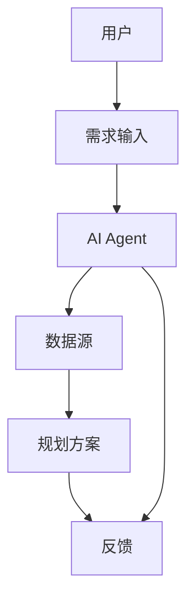
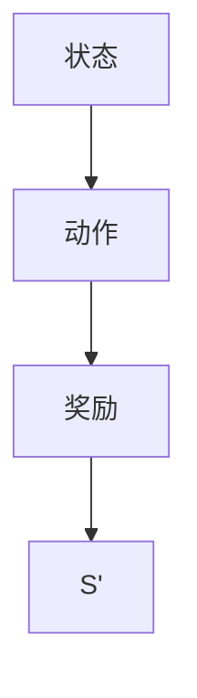
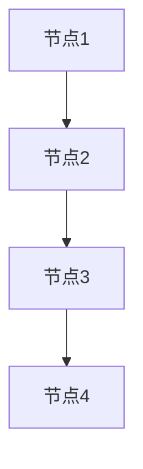
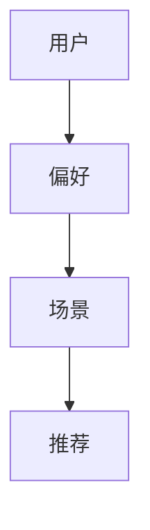
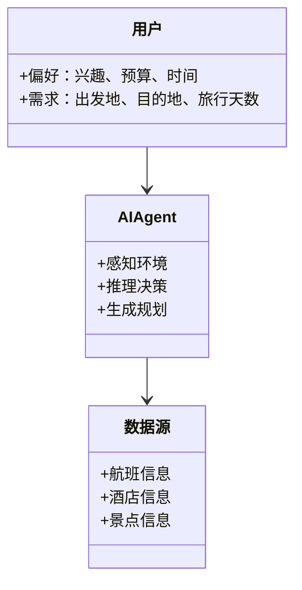

                 


# AI Agent在智能旅游规划中的应用

> 关键词：AI Agent，智能旅游规划，强化学习，图神经网络，联合概率图模型

> 摘要：本文深入探讨了AI Agent在智能旅游规划中的应用，从问题背景、核心概念、算法原理到系统架构设计，再到项目实战，全面分析了AI Agent如何提升旅游规划的智能化水平。通过具体案例分析和代码实现，展示了AI Agent在实际应用中的优势和潜力。

---

# 第一部分: AI Agent与智能旅游规划的背景

## 第1章: 问题背景与问题描述

### 1.1 问题背景
在传统旅游规划中，用户需要手动筛选大量的旅行信息，包括航班、酒店、景点、餐饮等。这种方式效率低下，且难以满足个性化需求。随着人工智能技术的发展，AI Agent（智能代理）被引入旅游规划领域，通过自动化学习和推理，为用户提供智能化、个性化的旅游规划服务。

### 1.2 问题描述
传统的旅游规划过程涉及大量的信息检索和决策，用户需要花费大量时间筛选和比较不同选项。此外，不同用户的需求可能差异很大，例如有的用户喜欢冒险，有的则喜欢安静的度假。传统的旅游平台难以满足个性化需求，且缺乏动态调整的能力。

### 1.3 问题解决与边界定义
AI Agent通过自动化学习和推理，能够根据用户的需求和偏好，实时调整旅游规划方案。其边界包括用户需求的输入、实时数据的获取以及系统输出的规划方案。

## 第2章: AI Agent的核心概念与联系

### 2.1 AI Agent的基本原理
AI Agent是一种能够感知环境并采取行动以实现目标的智能实体。在旅游规划中，AI Agent可以通过收集用户需求、分析数据、生成规划方案，并根据反馈进行优化。

### 2.2 实体关系与架构设计
以下是AI Agent在旅游规划中的实体关系图：



---

# 第二部分: AI Agent的算法原理

## 第3章: 强化学习算法

### 3.1 算法原理
强化学习是一种通过试错机制来优化决策的算法。在旅游规划中，AI Agent可以通过强化学习来优化行程安排，例如选择最优的航班和酒店组合。

#### 强化学习流程图



### 3.2 图神经网络

#### 图神经网络流程图



### 3.3 联合概率图模型

#### 联合概率图模型流程图



---

# 第三部分: 系统分析与架构设计

## 第4章: 项目场景介绍

### 4.1 项目介绍
本项目旨在开发一个基于AI Agent的智能旅游规划系统，能够根据用户的偏好生成个性化的行程安排。

### 4.2 系统功能设计

#### 4.2.1 领域模型设计



---

# 第四部分: 项目实战与实现

## 第5章: 项目实战

### 5.1 环境安装与配置
以下是开发环境搭建的步骤：

1. 安装Python和相关库（如TensorFlow、Keras）。
2. 安装Jupyter Notebook用于开发和测试。
3. 准备旅游数据集，包括航班、酒店、景点等信息。

### 5.2 核心算法实现

#### 5.2.1 强化学习代码实现

```python
import numpy as np

# 定义状态空间和动作空间
state_space = 10
action_space = 5

# 初始化Q表
Q = np.zeros((state_space, action_space))

# 探索率
epsilon = 0.1

# 学习率
alpha = 0.1

# 奖励衰减率
gamma = 0.99

# 策略函数
def epsilon_greedy_policy(state):
    if np.random.random() < epsilon:
        return np.random.randint(action_space)
    else:
        return np.argmax(Q[state])

# 算法实现
for episode in range(1000):
    state = 0
    total_reward = 0
    while True:
        action = epsilon_greedy_policy(state)
        next_state = action
        reward = get_reward(state, action)
        Q[state, action] = Q[state, action] + alpha * (reward + gamma * np.max(Q[next_state]) - Q[state, action])
        state = next_state
        total_reward += reward
```

### 5.2.2 图神经网络代码实现

```python
import tensorflow as tf
from tensorflow.keras import layers

# 定义图神经网络模型
class GraphNeuralNetwork(tf.keras.Model):
    def __init__(self):
        super(GraphNeuralNetwork, self).__init__()
        self.graph_layer = layers.Dense(32, activation='relu')
        self.dense_layer = layers.Dense(1, activation='sigmoid')

    def call(self, inputs):
        x = self.graph_layer(inputs)
        x = self.dense_layer(x)
        return x

# 编译模型
model = GraphNeuralNetwork()
model.compile(optimizer='adam', loss='binary_crossentropy', metrics=['accuracy'])
```

### 5.2.3 联合概率图模型代码实现

```python
from sklearn.naive_bayes import GaussianNB

# 初始化模型
model = GaussianNB()

# 训练模型
model.fit(X_train, y_train)

# 预测
y_pred = model.predict(X_test)
```

### 5.3 系统功能实现

#### 5.3.1 用户界面设计
以下是用户界面的草图：

```mermaid
ui
    input_field 用户输入偏好
    button 提交
    output_field 显示规划方案
```

---

# 第五部分: 最佳实践与注意事项

## 第6章: 最佳实践

### 6.1 最佳实践
1. 在开发过程中，建议使用版本控制工具（如Git）来管理代码。
2. 数据预处理是关键，确保数据的准确性和完整性。
3. 在部署系统时，考虑性能优化，例如使用云服务和分布式架构。

## 6.2 小结
本文详细介绍了AI Agent在智能旅游规划中的应用，从理论到实践，为读者提供了全面的指导。

## 6.3 注意事项
1. 确保数据的安全性和隐私保护。
2. 在实际应用中，考虑系统的可扩展性和可维护性。
3. 定期更新模型，以适应用户需求的变化。

## 6.4 拓展阅读
1. 《强化学习：算法与应用》
2. 《图神经网络：理论与实践》
3. 《联合概率图模型：原理与应用》

---

作者：AI天才研究院

