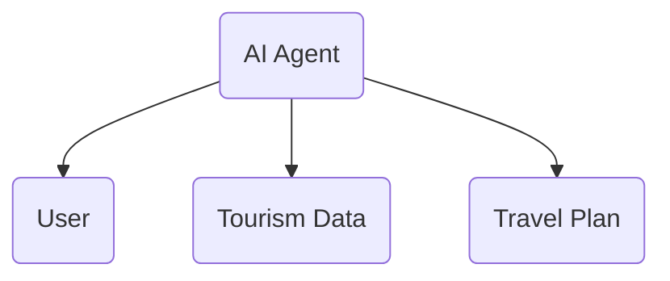

                 


# AI Agent在智能旅游规划中的应用

> 关键词：AI Agent，智能旅游规划，强化学习，推荐系统，行程优化，个性化服务

> 摘要：  
本文深入探讨了AI Agent在智能旅游规划中的应用，从核心概念、算法原理到系统架构，再到实际案例，全面分析了AI Agent如何提升旅游规划的效率与用户体验。文章首先介绍了AI Agent的基本概念及其在旅游规划中的重要性，随后详细讲解了AI Agent的算法原理和推荐系统，接着分析了系统架构和项目实现，最后通过实际案例展示了AI Agent在旅游规划中的应用价值。本文旨在为读者提供一个全面的技术视角，帮助他们理解并应用AI Agent技术解决复杂的旅游规划问题。

---

# 第一部分: 引言

# 第1章: AI Agent与智能旅游规划概述

## 1.1 AI Agent的基本概念
### 1.1.1 AI Agent的定义
AI Agent（人工智能代理）是一种能够感知环境、自主决策并执行任务的智能实体。它通过传感器获取信息，利用计算模型进行推理，并通过执行器与环境交互。AI Agent的核心在于其智能性：它能够理解任务需求、优化决策过程，并动态调整行为以适应变化。

### 1.1.2 AI Agent的核心特征
AI Agent具有以下核心特征：
- **自主性**：能够自主决策，无需外部干预。
- **反应性**：能够实时感知环境并做出反应。
- **目标导向**：以目标为导向，优化决策过程。
- **学习能力**：通过经验不断优化性能。

### 1.1.3 AI Agent与传统旅游规划的区别
传统的旅游规划依赖人工经验和规则，效率低且难以个性化。而AI Agent能够通过大数据分析、机器学习和强化学习等技术，动态优化旅游计划，提供个性化的服务。

## 1.2 智能旅游规划的背景与需求
### 1.2.1 旅游行业的数字化转型
随着互联网和移动设备的普及，旅游行业正在经历数字化转型，用户需求日益多样化，传统的旅游服务模式已无法满足需求。

### 1.2.2 用户对个性化旅游体验的需求
现代用户追求个性化、智能化的旅游体验，希望通过智能系统获得个性化的行程建议、景点推荐和实时反馈。

### 1.2.3 智能旅游规划的市场潜力
智能旅游规划能够显著提升用户体验，降低运营成本，同时创造新的商业价值，具有巨大的市场潜力。

## 1.3 AI Agent在旅游规划中的应用价值
### 1.3.1 提高用户体验
AI Agent能够根据用户偏好动态调整行程，提供个性化服务，显著提升用户体验。

### 1.3.2 提升运营效率
AI Agent能够快速处理海量数据，优化资源分配，提高旅游服务的运营效率。

### 1.3.3 降低成本
通过AI Agent的自动化决策，企业可以减少人工成本，同时降低资源浪费。

## 1.4 本章小结
本章介绍了AI Agent的基本概念和核心特征，分析了智能旅游规划的背景与需求，并阐述了AI Agent在旅游规划中的应用价值。通过这些内容，读者可以理解AI Agent在旅游规划中的重要性。

---

# 第二部分: AI Agent的核心概念与原理

# 第2章: AI Agent的核心概念与联系

## 2.1 AI Agent的原理
### 2.1.1 知识表示
知识表示是AI Agent的核心，通常采用符号逻辑、概率模型或神经网络等方法。例如，旅游景点可以表示为图结构，其中节点表示景点，边表示距离或相似度。

### 2.1.2 问题求解
AI Agent通过搜索算法（如A*算法）或机器学习模型（如深度学习）解决问题。在旅游规划中，问题求解通常涉及路径优化或资源分配。

### 2.1.3 行为选择
行为选择是AI Agent的决策过程，通常基于效用函数或奖励机制。例如，在旅游推荐中，AI Agent会根据用户偏好选择推荐景点。

## 2.2 AI Agent与智能旅游规划的关系
### 2.2.1 AI Agent在旅游规划中的角色
AI Agent在旅游规划中扮演“智能助手”的角色，能够根据用户需求动态优化行程，提供个性化服务。

### 2.2.2 智能旅游规划的核心要素
智能旅游规划的核心要素包括用户偏好、旅游资源、行程约束和实时数据。这些要素通过AI Agent进行整合和优化。

### 2.2.3 AI Agent与旅游规划系统的交互流程
1. 用户输入需求（如预算、时间、偏好）。
2. AI Agent分析数据，生成初步计划。
3. 用户反馈意见。
4. AI Agent优化计划，输出最终行程。

## 2.3 核心概念对比表格
| 概念 | 描述 | 示例 |
|------|------|------|
| AI Agent | 具有感知和决策能力的智能体 | 个性化旅游推荐系统 |
| 智能旅游规划 | 利用AI技术优化旅游行程 | 自动生成旅游路线 |

## 2.4 ER实体关系图


## 2.5 本章小结
本章详细介绍了AI Agent的核心概念与原理，并分析了其在智能旅游规划中的角色和应用流程。通过对比和ER图，读者可以清晰理解AI Agent与智能旅游规划的关系。

---

# 第三部分: AI Agent的算法原理

# 第3章: AI Agent的核心算法

## 3.1 强化学习算法
### 3.1.1 Q-learning算法
Q-learning是一种经典的强化学习算法，适用于离散动作空间的环境。其核心公式为：
$$ Q(s, a) = r + \gamma \max_{a'} Q(s', a') $$
其中，$s$是当前状态，$a$是当前动作，$r$是奖励，$\gamma$是折扣因子。

### 3.1.2 算法流程
1. 初始化Q表。
2. 选择动作（探索或利用）。
3. 执行动作，观察新状态和奖励。
4. 更新Q值：$ Q(s, a) = Q(s, a) + \alpha (r + \gamma \max Q(s', a') - Q(s, a)) $。

### 3.1.3 应用案例
在旅游推荐中，Q-learning可以用于优化景点推荐顺序，通过不断试错提高推荐的满意度。

## 3.2 推荐系统算法
### 3.2.1 基于协同过滤的推荐
协同过滤通过分析用户行为相似性，推荐相似用户的偏好内容。公式为：
$$ \hat{r}_{u,i} = \frac{\sum_{j \in N(u)} w(u,j) \cdot r(j,i)}{\sum_{j \in N(u)} w(u,j)} $$
其中，$w(u,j)$是用户$u$和$j$的相似度，$r(j,i)$是用户$j$对物品$i$的评分。

### 3.2.2 基于内容的推荐
基于内容的推荐通过分析物品属性（如景点描述）进行推荐。例如，使用TF-IDF提取景点关键词，并计算相似性。

### 3.2.3 深度学习推荐模型
深度学习模型（如神经网络协同过滤）能够处理高维数据，提升推荐精度。

## 3.3 算法比较与选择
不同算法适用于不同场景：
- Q-learning适用于动态优化问题。
- 协同过滤适用于用户行为数据丰富的场景。
- 深度学习适用于复杂场景，但需要大量数据和计算资源。

## 3.4 本章小结
本章介绍了AI Agent中常用的强化学习和推荐系统算法，并分析了它们在旅游规划中的应用场景和优缺点。

---

# 第四部分: 系统分析与架构设计

# 第4章: AI Agent的系统架构

## 4.1 系统功能设计
AI Agent旅游规划系统的核心功能包括：
- 用户需求分析：解析用户的预算、时间、偏好。
- 数据采集：获取景点、交通、住宿等数据。
- 行程优化：基于算法生成最优行程。
- 交互反馈：与用户实时互动，调整计划。

## 4.2 系统架构设计
系统架构采用模块化设计，包括：
- 数据层：存储用户数据和旅游资源。
- 业务层：处理用户请求，调用算法生成行程。
- 表示层：展示结果，与用户交互。

```mermaid
graph LR
    S[State] --> A[Action]
    A --> R[Reward]
    S --> Q(Q-value)
    Q --> next S
```

## 4.3 接口设计
系统接口包括：
- 用户接口：API或图形界面。
- 数据接口：与第三方数据源对接。
- 第三方服务接口：如地图服务、天气预报。

## 4.4 交互设计
交互流程：
1. 用户输入需求。
2. 系统解析需求。
3. AI Agent生成初步计划。
4. 用户反馈意见。
5. 系统优化并输出最终计划。

## 4.5 本章小结
本章详细分析了AI Agent旅游规划系统的功能设计、架构设计和交互流程，为后续实现奠定了基础。

---

# 第五部分: 项目实战

# 第5章: AI Agent的项目实现

## 5.1 环境安装
- Python 3.8+
- Python库：numpy, pandas, scikit-learn, keras
- IDE：PyCharm或VS Code

## 5.2 核心代码实现
### 5.2.1 Q-learning实现
```python
class QLearning:
    def __init__(self, state_size, action_size):
        self.q_table = np.zeros((state_size, action_size))
        
    def choose_action(self, state, epsilon):
        if np.random.random() < epsilon:
            return np.random.randint(action_size)
        else:
            return np.argmax(self.q_table[state])
    
    def update_q(self, state, action, reward, next_state, alpha, gamma):
        self.q_table[state, action] += alpha * (reward + gamma * max(self.q_table[next_state]) - self.q_table[state, action])
```

### 5.2.2 协同过滤实现
```python
def collaborative_filtering(user_matrix):
    # 数据归一化
    user_matrix = (user_matrix - user_matrix.mean(axis=1).reshape(-1,1)) / user_matrix.std(axis=1).reshape(-1,1)
    # 计算相似度
    similarity = np.dot(user_matrix, user_matrix.T)
    return similarity
```

## 5.3 案例分析
### 案例1：个性化景点推荐
- 数据来源：用户行为日志、景点属性。
- 实现步骤：
  1. 数据清洗与预处理。
  2. 训练推荐模型。
  3. 生成推荐列表。
  4. 用户反馈优化。

### 案例2：行程优化
- 数据来源：交通时间、景点距离、用户偏好。
- 实现步骤：
  1. 建立图模型。
  2. 应用强化学习优化路径。
  3. 输出最优行程。

## 5.4 本章小结
本章通过实际项目展示了AI Agent在旅游规划中的实现过程，包括环境配置、算法实现和案例分析。读者可以通过这些代码和案例理解AI Agent的实际应用。

---

# 第六部分: 总结与展望

# 第6章: 总结与展望

## 6.1 核心内容回顾
本文系统介绍了AI Agent在智能旅游规划中的应用，包括核心概念、算法原理、系统架构和项目实现。

## 6.2 未来发展方向
- 更复杂的算法：如多智能体协同、强化学习与深度学习结合。
- 更多场景应用：如多语言支持、实时天气应对。
- 更高效的数据处理：利用边缘计算和分布式系统优化性能。

## 6.3 注意事项
- 数据隐私保护：旅游数据涉及用户隐私，需严格加密处理。
- 算法可解释性：优化算法的透明性，便于用户理解。
- 系统稳定性：确保系统在高负载下的稳定运行。

## 6.4 拓展阅读
- 推荐书籍：《强化学习入门》、《机器学习实战》。
- 开源项目：TensorFlow、PyTorch。

## 6.5 本章小结
本文总结了AI Agent在旅游规划中的应用，并展望了未来的发展方向。通过本文，读者可以深入了解AI Agent的核心价值，并为实际应用提供参考。

---

# 附录

## 附录A: 参考文献
1. Russell, S., & Norvig, P. (2010). Artificial Intelligence: A Modern Approach.
2. Goodfellow, I., Bengio, Y., & Courville, A. (2016). Deep Learning.

## 附录B: 工具与库
- Python
- NumPy, Pandas
- Scikit-learn, Keras
- Mermaid, LaTeX

---

# 作者：AI天才研究院 & 禅与计算机程序设计艺术

通过本文的系统分析与详细讲解，读者可以全面理解AI Agent在智能旅游规划中的应用，并将其应用于实际项目中。

