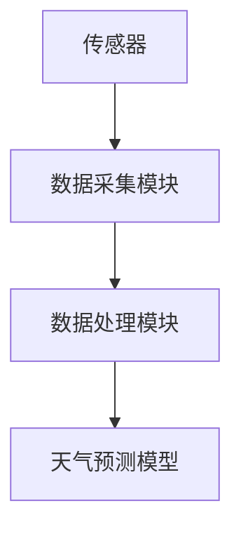
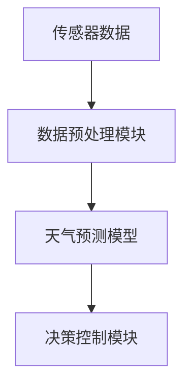
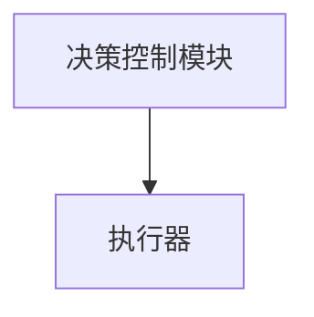
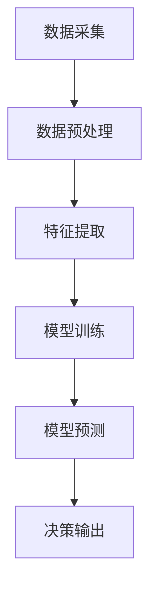
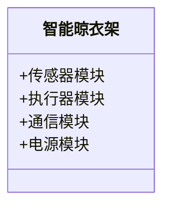
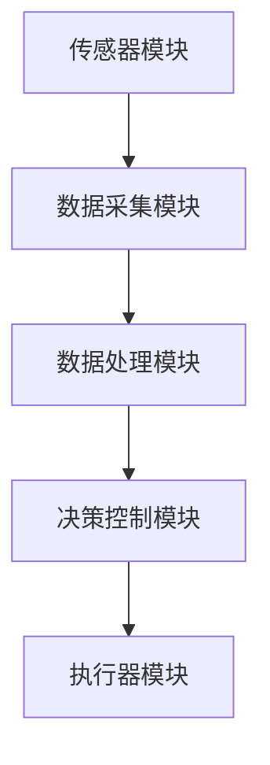

                 


# AI Agent在智能晾衣架中的天气感知

## 关键词：AI Agent, 智能晾衣架, 天气感知, 传感器, 数据分析

## 摘要：本文将探讨AI Agent在智能晾衣架中的天气感知应用。通过分析天气感知的核心概念、算法原理、数学模型以及系统架构，揭示AI Agent如何通过传感器数据和机器学习模型实现精准的天气预测和智能控制。本文将结合实际案例，深入解读AI Agent在智能晾衣架中的应用价值和未来发展方向。

---

# 第一部分: AI Agent与智能晾衣架的背景介绍

## 第1章: AI Agent与智能晾衣架概述

### 1.1 AI Agent的基本概念

#### 1.1.1 AI Agent的定义
AI Agent（人工智能代理）是指能够感知环境、做出决策并采取行动的智能实体。它通过传感器获取信息，利用算法处理数据，并通过执行器与环境交互。AI Agent的核心目标是帮助用户完成特定任务，提升效率和体验。

#### 1.1.2 AI Agent的核心特征
- **自主性**：AI Agent能够在没有外部干预的情况下独立运行。
- **反应性**：能够实时感知环境变化并做出反应。
- **目标导向**：基于预设目标或用户需求进行决策。
- **学习能力**：通过数据反馈不断优化自身的算法和行为。

#### 1.1.3 AI Agent与传统自动控制系统的区别
- **传统控制系统**：基于预设规则和逻辑进行操作，无法适应环境变化。
- **AI Agent**：能够学习和适应环境，具有更强的灵活性和智能性。

### 1.2 智能晾衣架的基本原理

#### 1.2.1 晾衣架的功能与应用场景
智能晾衣架是一种结合了物联网和人工智能技术的智能家居设备。它能够通过传感器感知环境，自动调整晾衣模式，优化晾衣体验。应用场景包括家庭、办公室、酒店等场所。

#### 1.2.2 智能晾衣架的硬件组成
- **传感器模块**：用于采集环境数据，如温湿度、光照强度、空气质量等。
- **执行器模块**：用于控制晾衣架的运动，如升降、展开和收回。
- **通信模块**：用于与手机或其他智能设备进行数据交互。
- **电源模块**：为整个系统提供电力支持。

#### 1.2.3 智能晾衣架的软件架构
智能晾衣架的软件架构通常包括数据采集、数据处理、决策控制和用户交互四个部分。数据采集模块负责获取传感器数据；数据处理模块对数据进行分析和预测；决策控制模块根据预测结果控制执行器；用户交互模块提供友好的操作界面。

### 1.3 天气感知在智能晾衣架中的重要性

#### 1.3.1 天气对晾衣的影响
天气状况直接影响晾衣的效果和安全性。例如：
- **湿度**：高湿度可能导致衣物不干，引发霉菌滋生。
- **温度**：低温可能延长晾衣时间，高温可能导致衣物损坏。
- **光照**：充足的光照有助于快速晾干衣物，但强光可能对某些材质造成损害。

#### 1.3.2 天气感知的必要性
通过感知天气，智能晾衣架能够根据环境条件自动调整晾衣模式，确保衣物快速干燥，避免损坏。例如，在雨天或高湿度天气，智能晾衣架可以自动收回衣物或启动除湿功能。

#### 1.3.3 AI Agent在天气感知中的作用
AI Agent通过整合多种传感器数据和天气预报信息，能够更准确地预测天气变化，并根据预测结果优化晾衣策略。例如，当预测到即将下雨时，AI Agent会立即通知用户并启动收衣程序。

### 1.4 本章小结
本章介绍了AI Agent的基本概念和智能晾衣架的硬件组成及软件架构，重点阐述了天气感知在智能晾衣架中的重要性。AI Agent通过感知和分析环境数据，能够显著提升晾衣的智能化水平和用户体验。

---

# 第二部分: AI Agent的天气感知核心概念与原理

## 第2章: 天气感知的核心概念

### 2.1 天气感知的主要方法

#### 2.1.1 基于传感器的数据采集
智能晾衣架通过内置的传感器采集环境数据，如温湿度、光照强度、空气质量等。这些传感器通常包括：
- **温湿度传感器**：用于测量环境的温度和湿度。
- **光照传感器**：用于测量光照强度。
- **空气质量传感器**：用于测量PM2.5、甲醛等污染物浓度。

#### 2.1.2 基于AI模型的数据分析
AI Agent通过机器学习模型对传感器数据进行分析和预测。例如：
- **回归模型**：用于预测未来的温湿度变化。
- **分类模型**：用于判断天气状况（晴天、雨天等）。

#### 2.1.3 基于天气预报API的数据融合
AI Agent还可以通过调用天气预报API获取实时天气数据，结合传感器数据进行综合分析。例如：
- **天气预报API**：提供未来24小时的天气预测数据。
- **位置数据**：结合用户的地理位置，提供更精准的天气信息。

### 2.2 天气感知的关键技术

#### 2.2.1 数据采集技术
数据采集是天气感知的基础。传感器需要实时采集环境数据，并将数据传输到AI Agent进行处理。例如：


#### 2.2.2 数据预处理技术
数据预处理是确保数据质量的重要步骤，包括数据清洗、标准化和特征提取。例如：
- **数据清洗**：去除异常值和噪声数据。
- **数据标准化**：将数据转换到相同的尺度。
- **特征提取**：从原始数据中提取有用的特征。

#### 2.2.3 数据分析与预测技术
通过机器学习算法对数据进行分析和预测，例如：
- **时间序列预测**：用于预测未来天气变化。
- **分类算法**：用于判断天气状况。

### 2.3 天气感知的特征对比

| 特征          | 基于传感器的数据采集 | 基于AI模型的数据分析 | 基于天气预报API的数据融合 |
|---------------|----------------------|----------------------|--------------------------|
| 数据来源      | 环境传感器           | 机器学习模型         | 天气预报API             |
| 数据类型      | 温湿度、光照强度     | 分类、回归结果       | 实时天气数据             |
| 优点          | 实时性强             | 预测准确性高           | 数据精准度高             |
| 缺点          | 数据可能受环境干扰   | 需要大量训练数据       | 受API限制                |

### 2.4 天气感知的实体关系图

```mermaid
er
actor: 用户
actor: 天气传感器
actor: 天气API
```

### 2.5 本章小结
本章详细介绍了天气感知的主要方法和技术，对比了不同方法的优缺点，并通过实体关系图展示了天气感知的核心要素。AI Agent通过多种数据来源的融合，能够更准确地感知天气变化。

---

# 第三部分: AI Agent天气感知的算法原理

## 第3章: 天气感知算法的实现

### 3.1 数据采集与预处理

#### 3.1.1 数据采集流程
数据采集流程包括传感器数据的获取、数据传输和数据存储。例如：
1. 传感器采集环境数据。
2. 数据通过通信模块传输到AI Agent。
3. 数据存储在本地数据库中。

#### 3.1.2 数据清洗与标准化
数据清洗是去除异常值和噪声数据的过程。例如：
```python
import numpy as np

# 假设data是传感器采集的原始数据
# 去除异常值
data_clean = data[~np.isin(data, [np.nan, np.inf, -np.inf])]

# 数据标准化
from sklearn.preprocessing import StandardScaler
scaler = StandardScaler()
data_normalized = scaler.fit_transform(data_clean)
```

#### 3.1.3 数据特征提取
特征提取是从原始数据中提取有用特征的过程。例如：
```python
# 提取温度和湿度作为特征
features = data_normalized[:, [0, 1]]
```

### 3.2 天气预测模型的构建

#### 3.2.1 模型选择与训练
选择合适的机器学习模型进行训练。例如，使用回归模型预测温度：
```python
from sklearn.linear_model import LinearRegression

# 训练回归模型
model = LinearRegression()
model.fit(features, target)
```

#### 3.2.2 模型评估与优化
通过交叉验证评估模型性能，并进行优化。例如：
```python
from sklearn.metrics import mean_squared_error

# 预测目标值
y_pred = model.predict(new_features)
# 计算均方误差
mse = mean_squared_error(y_true, y_pred)
print(f"均方误差：{mse}")
```

#### 3.2.3 模型部署与应用
将训练好的模型部署到智能晾衣架中，实时进行天气预测。例如：


### 3.3 AI Agent的决策推理

#### 3.3.1 决策逻辑设计
AI Agent根据天气预测结果和用户需求做出决策。例如：
- 如果预测到下雨，AI Agent启动收衣程序。
- 如果预测到晴天，AI Agent启动晾衣程序。

#### 3.3.2 决策规则实现
决策规则可以通过条件语句实现。例如：
```python
# 根据预测结果做出决策
if prediction == 'rain':
    # 收回衣物
    retract_rods()
elif prediction == 'sunny':
    # 展开晾衣架
    extend_rods()
```

#### 3.3.3 决策结果输出
AI Agent将决策结果输出到执行器，控制晾衣架的动作。例如：


### 3.4 算法实现的流程图



### 3.5 本章小结
本章详细介绍了AI Agent天气感知的算法实现，包括数据采集与预处理、模型训练与优化、决策推理与输出。通过流程图和代码示例，展示了AI Agent如何通过传感器数据和机器学习模型实现天气预测和智能控制。

---

# 第四部分: 天气感知的数学模型与公式

## 第4章: 天气感知的数学模型

### 4.1 数据预处理的数学方法

#### 4.1.1 数据标准化公式
数据标准化公式如下：
$$ x' = \frac{x - \mu}{\sigma} $$
其中，$\mu$是数据的均值，$\sigma$是数据的标准差。

#### 4.1.2 数据归一化公式
数据归一化公式如下：
$$ x' = \frac{x - \min(x)}{\max(x) - \min(x)} $$

### 4.2 天气预测的数学模型

#### 4.2.1 回归模型
回归模型用于预测连续型变量，例如温度和湿度。线性回归模型的数学表达式为：
$$ y = \beta_0 + \beta_1 x_1 + \beta_2 x_2 + \ldots + \beta_n x_n + \epsilon $$
其中，$y$是目标变量，$x_i$是特征变量，$\beta_i$是模型系数，$\epsilon$是误差项。

#### 4.2.2 分类模型
分类模型用于预测分类变量，例如天气状况（晴天、雨天等）。逻辑回归模型的数学表达式为：
$$ P(y=1|x) = \frac{e^{\beta_0 + \beta_1 x_1 + \beta_2 x_2 + \ldots + \beta_n x_n}}{1 + e^{\beta_0 + \beta_1 x_1 + \beta_2 x_2 + \ldots + \beta_n x_n}} $$

### 4.3 决策模型的数学表达

#### 4.3.1 决策树模型
决策树模型通过构建树状结构进行决策。例如：
- 如果温度 > 25°C 且湿度 > 60%，则预测为雨天。
- 否则，预测为晴天。

#### 4.3.2 支持向量机模型
支持向量机模型用于分类和回归。例如：
$$ y = \text{sign}(w \cdot x + b) $$
其中，$w$是权重向量，$x$是输入向量，$b$是偏置项。

### 4.4 本章小结
本章介绍了天气感知的数学模型，包括数据预处理方法、回归模型、分类模型和决策树模型。通过数学公式和实际案例，展示了AI Agent如何通过机器学习模型实现天气预测和智能控制。

---

# 第五部分: 系统分析与架构设计方案

## 第5章: 系统分析与架构设计

### 5.1 问题场景介绍

#### 5.1.1 问题背景
智能晾衣架需要在不同天气条件下自动调整晾衣模式，确保衣物快速干燥并避免损坏。

#### 5.1.2 问题描述
用户希望智能晾衣架能够根据天气状况自动控制晾衣架的运行，减少用户手动操作的麻烦。

### 5.2 项目介绍

#### 5.2.1 项目目标
- 实现基于AI Agent的天气感知功能。
- 提供智能晾衣架的自动控制功能。
- 提供用户友好的操作界面。

#### 5.2.2 项目范围
- 硬件部分：传感器、执行器、通信模块。
- 软件部分：数据采集、数据处理、决策控制、用户交互。

### 5.3 系统功能设计

#### 5.3.1 领域模型


#### 5.3.2 功能模块
- **数据采集模块**：负责采集环境数据。
- **数据处理模块**：负责数据预处理和分析。
- **决策控制模块**：负责根据预测结果控制执行器。
- **用户交互模块**：负责与用户进行交互。

### 5.4 系统架构设计

#### 5.4.1 系统架构图


#### 5.4.2 系统接口设计
- **传感器接口**：与温湿度传感器、光照传感器等连接。
- **通信接口**：与手机或其他智能设备进行数据交互。
- **用户接口**：提供图形化界面或命令行操作。

### 5.5 本章小结
本章通过系统分析与架构设计，展示了智能晾衣架的整体结构和功能模块。AI Agent通过与传感器、执行器和通信模块的协同工作，实现天气感知和智能控制。

---

# 第六部分: 项目实战

## 第6章: 项目实战

### 6.1 环境安装

#### 6.1.1 硬件安装
- 安装传感器模块、执行器模块和通信模块。
- 确保硬件连接正确，通信模块与AI Agent正常通信。

#### 6.1.2 软件安装
- 安装Python编程环境。
- 安装必要的库，例如：scikit-learn、numpy、pandas、mermaid、matplotlib。

### 6.2 系统核心实现

#### 6.2.1 数据采集与预处理
```python
import numpy as np
import pandas as pd
from sklearn.preprocessing import StandardScaler

# 读取传感器数据
data = pd.read_csv('sensor_data.csv')

# 数据清洗
data_clean = data.dropna()

# 数据标准化
scaler = StandardScaler()
data_normalized = scaler.fit_transform(data_clean[['temperature', 'humidity']])
```

#### 6.2.2 模型训练与预测
```python
from sklearn.linear_model import LinearRegression
from sklearn.metrics import mean_squared_error

# 训练回归模型
model = LinearRegression()
model.fit(data_normalized, data_clean['temperature'])

# 预测温度
new_data = pd.read_csv('new_sensor_data.csv')
new_data_clean = new_data.dropna()
new_data_normalized = scaler.transform(new_data_clean[['temperature', 'humidity']])
y_pred = model.predict(new_data_normalized)
mse = mean_squared_error(new_data_clean['temperature'], y_pred)
print(f"均方误差：{mse}")
```

#### 6.2.3 决策控制
```python
def decision_rule(predicted_weather):
    if predicted_weather == 'rain':
        retract_rods()
    elif predicted_weather == 'sunny':
        extend_rods()
```

### 6.3 实际案例分析

#### 6.3.1 案例背景
假设某天天气预报为晴天，传感器数据显示温度为25°C，湿度为60%。

#### 6.3.2 数据处理
```python
data_clean = pd.DataFrame({
    'temperature': [25],
    'humidity': [60]
})
data_normalized = scaler.transform(data_clean[['temperature', 'humidity']])
```

#### 6.3.3 模型预测
```python
y_pred = model.predict(data_normalized)
print(f"预测温度：{y_pred[0]}")
```

#### 6.3.4 决策输出
```python
predicted_weather = 'sunny'
decision_rule(predicted_weather)
```

### 6.4 本章小结
本章通过实际案例展示了AI Agent在智能晾衣架中的天气感知应用。通过代码实现和数据处理，验证了AI Agent的智能控制能力。

---

# 第七部分: 最佳实践与未来展望

## 第7章: 最佳实践与未来展望

### 7.1 最佳实践

#### 7.1.1 数据质量管理
- 定期校准传感器，确保数据准确性。
- 建立数据备份机制，防止数据丢失。

#### 7.1.2 模型优化
- 定期更新模型，提升预测精度。
- 引入更多的天气数据源，如卫星图像、气象站数据。

#### 7.1.3 系统维护
- 定期检查硬件设备，确保正常运行。
- 更新软件版本，修复潜在漏洞。

### 7.2 小结

#### 7.2.1 总结
AI Agent通过天气感知技术，显著提升了智能晾衣架的智能化水平和用户体验。

#### 7.2.2 注意事项
- 确保数据安全，防止数据泄露。
- 定期进行系统维护，确保设备正常运行。

### 7.3 未来展望

#### 7.3.1 技术发展
- 引入更先进的AI算法，如深度学习和强化学习。
- 结合物联网技术，实现更高效的设备协同。

#### 7.3.2 应用场景扩展
- 智能晾衣架在家庭、酒店、办公室等场景中的广泛应用。
- 结合智能家居系统，实现更智能的家居控制。

### 7.4 拓展阅读

#### 7.4.1 推荐书籍
- 《机器学习实战》
- 《深度学习入门：基于Python的理论与实现》

#### 7.4.2 推荐博客
- https://www.kaggle.com/ （数据科学平台）
- https://towardsdatascience.com/ （数据科学博客）

### 7.5 本章小结
本章总结了AI Agent在智能晾衣架中的应用价值，提出了最佳实践建议，并展望了未来的发展方向。AI Agent技术的不断进步将为智能晾衣架带来更多创新和可能性。

---

# 作者：AI天才研究院/AI Genius Institute & 禅与计算机程序设计艺术 /Zen And The Art of Computer Programming

---

以上是《AI Agent在智能晾衣架中的天气感知》的完整目录和内容概览。希望这篇技术博客能够为读者提供清晰的思路和丰富的知识。

