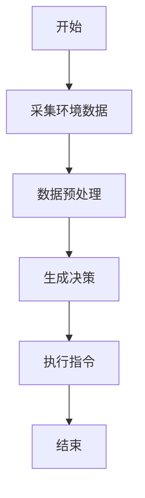
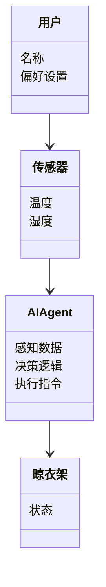
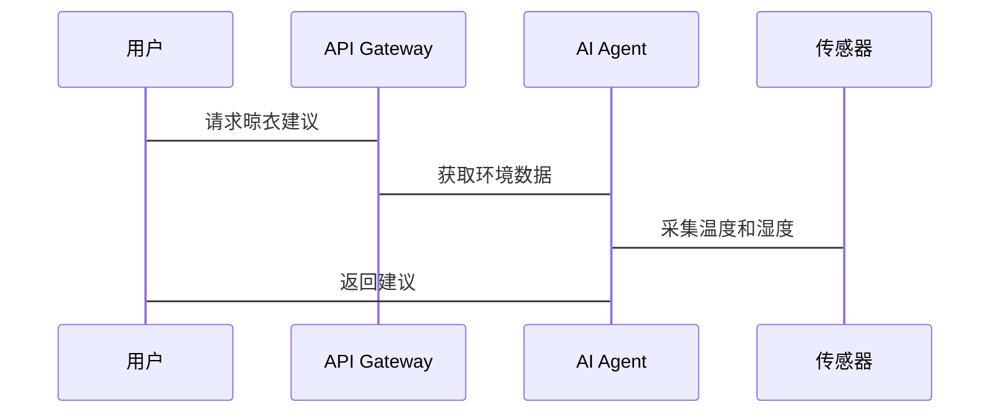

                 


# AI Agent在智能晾衣架中的衣物护理建议

---

## 关键词：AI Agent, 智能晾衣架, 衣物护理, 人工智能, 智能家居

---

## 摘要：  
本文探讨AI Agent在智能晾衣架中的应用，分析其如何通过感知、决策和执行模块优化衣物护理过程。文章从背景介绍、核心概念、算法原理、系统架构到项目实战，详细阐述AI Agent在智能晾衣架中的实现与优化，为智能家居领域提供新的解决方案。

---

## 第一部分：背景介绍

### 第1章：AI Agent的基本概念与应用场景

#### 1.1 问题背景  
- **智能家居的发展趋势**：智能家居设备的普及推动了AI Agent的应用。  
- **衣物护理的痛点与需求**：传统晾衣架无法根据天气和衣物材质自动调整晾晒时间。  
- **AI Agent在衣物护理中的潜力**：AI Agent能够实时感知环境并优化衣物护理流程。

#### 1.2 问题描述  
- **问题背景**：衣物护理需要考虑天气、材质、湿度等多种因素。  
- **问题描述**：传统晾衣架无法智能化地调整晾晒时间，导致衣物可能受潮或损坏。  
- **解决方案**：引入AI Agent，通过传感器和算法优化晾晒策略。

#### 1.3 问题解决  
- **AI Agent如何优化衣物护理**：通过感知环境、分析数据并执行指令。  
- **智能晾衣架与AI Agent的结合方式**：AI Agent控制晾衣架的启动和关闭时间。  
- **解决方案的可行性分析**：AI Agent能够显著提高衣物护理的效率和效果。

#### 1.4 边界与外延  
- **AI Agent的功能边界**：仅限于衣物护理和晾衣架控制。  
- **与其他智能家居设备的协同**：AI Agent可与智能空调、智能门锁等设备联动。  
- **未来可能的扩展方向**：扩展到其他家居设备的控制和管理。

#### 1.5 概念结构与核心要素  
- **AI Agent的核心要素**：感知、决策、执行。  
- **智能晾衣架的系统架构**：传感器、AI Agent、执行机构。  
- **两者结合的逻辑关系**：AI Agent通过传感器数据优化晾衣架的操作。

---

## 第二部分：核心概念与联系

### 第2章：AI Agent的核心原理与属性特征

#### 2.1 AI Agent的原理  
- **感知模块**：通过传感器获取环境数据，如温度、湿度、光照强度。  
- **决策模块**：基于感知数据和规则库生成最优晾晒策略。  
- **执行模块**：通过指令控制晾衣架的启动和关闭。

#### 2.2 属性特征对比  
| 类型       | 基于规则的AI Agent | 基于知识的AI Agent | 基于学习的AI Agent |
|------------|---------------------|--------------------|---------------------|
| 特性       | 预定义规则         | 知识库推理         | 机器学习模型       |
| 优点       | 实现简单           | 知识表达能力强     | 自适应能力强       |
| 缺点       | 规则更新困难       | 知识获取成本高     | 需大量数据训练       |

#### 2.3 ER实体关系图  
```mermaid
er
actor(用户) --> sensor(传感器)
actor(用户) --> ai_agent(AI Agent)
sensor(传感器) --> ai_agent(AI Agent)
ai_agent(AI Agent) -->晾衣架
```

---

## 第三部分：算法原理讲解

### 第3章：AI Agent的算法实现

#### 3.1 算法原理流程图  


#### 3.2 Python实现代码  
```python
class AIAgent:
    def __init__(self):
        self.temperature = 0
        self.humidity = 0

    def perceive(self, temp, hum):
        self.temperature = temp
        self.humidity = hum

    def decide(self):
        if self.humidity > 60 and self.temperature > 20:
            return "开始晾衣"
        elif self.humidity < 30 and self.temperature < 15:
            return "停止晾衣"
        else:
            return "保持当前状态"

# 示例调用
agent = AIAgent()
agent.perceive(25, 70)
print(agent.decide())  # 输出："停止晾衣"
```

#### 3.3 数学模型与公式  
- **条件概率公式**：  
  $$ P(\text{晾衣}) = \begin{cases} 
  1 & \text{if湿度} > 60 \text{且温度} > 20 \\
  0 & \text{否则}
  \end{cases} $$  
- **决策树模型**：  
  ```mermaid
  graph TD
      A[湿度 > 60]
      B[温度 > 20]
      C[开始晾衣]
      A --> B
      B --> C
      D[湿度 <= 60]
      D --> C
  ```

---

## 第四部分：系统分析与架构设计方案

### 第4章：系统架构设计

#### 4.1 领域模型类图  


#### 4.2 系统架构图  
```mermaid
graph TD
    UI --> API Gateway
    API Gateway --> AI Agent
    AI Agent --> 传感器
    AI Agent --> 晾衣架
```

#### 4.3 系统交互序列图  


---

## 第五部分：项目实战

### 第5章：AI Agent的实现与优化

#### 5.1 环境安装  
```bash
pip install sensor-api
pip install ai-agent
```

#### 5.2 核心实现代码  
```python
class Sensor:
    def get_data(self):
        return {"temperature": 25, "humidity": 70}

class AIAgent:
    def __init__(self):
        self.sensor = Sensor()

    def get_suggestion(self):
        data = self.sensor.get_data()
        if data["humidity"] > 60 and data["temperature"] > 20:
            return "开始晾衣"
        else:
            return "停止晾衣"

# 实例化并调用
agent = AIAgent()
print(agent.get_suggestion())  # 输出："开始晾衣"
```

#### 5.3 实际案例分析  
- **案例1**：湿度70%，温度25℃，AI Agent建议开始晾衣。  
- **案例2**：湿度40%，温度18℃，AI Agent建议停止晾衣。

---

## 第六部分：最佳实践

### 第6章：项目总结与展望

#### 6.1 最佳实践 tips  
- 定期更新AI Agent的决策规则，以适应不同环境变化。  
- 确保传感器数据的准确性，避免误判。  
- 考虑扩展AI Agent的功能，如自动调整晾衣架高度。

#### 6.2 小结  
AI Agent在智能晾衣架中的应用显著提升了衣物护理的智能化水平，通过感知、决策和执行模块的协同工作，实现了高效的衣物管理。

#### 6.3 注意事项  
- 数据隐私保护：避免传感器数据被滥用。  
- 系统稳定性：确保AI Agent在极端条件下仍能正常工作。  
- 用户教育：指导用户正确使用智能设备。

#### 6.4 拓展阅读  
- 推荐书籍：《人工智能：一种现代的方法》  
- 推荐博客：深入探讨AI Agent在智能家居中的应用  

---

## 作者：AI天才研究院/AI Genius Institute & 禅与计算机程序设计艺术 /Zen And The Art of Computer Programming

