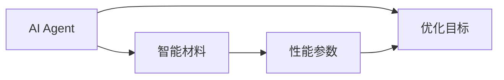
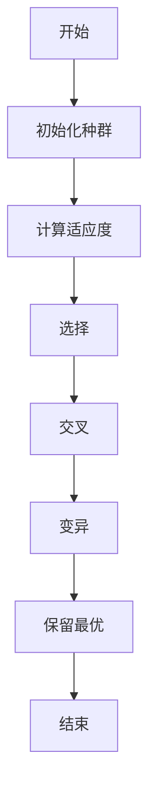
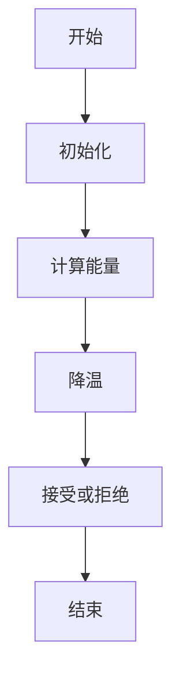
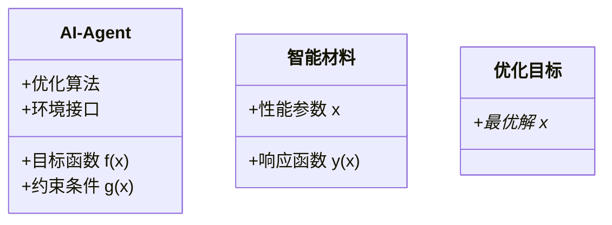
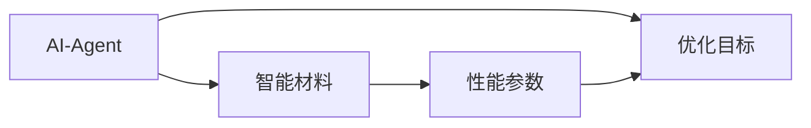

                 


# AI Agent在智能材料性能优化中的角色

## 关键词：
AI Agent，智能材料，性能优化，算法原理，系统架构，项目实战

## 摘要：
本文探讨了AI Agent在智能材料性能优化中的核心角色。通过分析AI Agent的基本概念、优化算法、系统架构以及实际案例，揭示其在智能材料优化中的潜力和挑战。结合理论与实践，本文为智能材料优化提供了新的思路。

---

# AI Agent在智能材料性能优化中的角色

## 第1章 AI Agent与智能材料的基本概念

### 1.1 AI Agent的基本概念

#### 1.1.1 AI Agent的定义
AI Agent是一种智能体，能够感知环境并采取行动以实现目标。它具备自主性、反应性、主动性、社交能力和持续性。

#### 1.1.2 AI Agent的核心特征
- **自主性**：无需外部干预，自主决策。
- **反应性**：实时感知环境并做出反应。
- **主动性**：主动采取行动以实现目标。
- **社交能力**：与环境或其他智能体交互。
- **持续性**：持续运行并适应变化。

#### 1.1.3 AI Agent的分类与应用场景
- **简单反射型AI Agent**：基于当前感知做出反应。
- **基于模型的AI Agent**：利用内部模型进行决策。
- **实用推理型AI Agent**：基于效用函数优化决策。
- **学习型AI Agent**：通过机器学习提升能力。

应用场景包括智能材料优化、自动驾驶、智能助手和智能城市。

### 1.2 智能材料的基本概念

#### 1.2.1 智能材料的定义
智能材料是能够感知环境变化并做出相应反应的材料，如形状记忆合金和压电材料。

#### 1.2.2 智能材料的分类
- **响应型智能材料**：对外界刺激做出反应。
- **自适应智能材料**：能够自我调节以适应环境。
- **智能复合材料**：结合多种材料的智能特性。

#### 1.2.3 智能材料的性能优化需求
优化目标包括提高响应速度、增强耐久性、降低成本和提高效率。

### 1.3 AI Agent在智能材料中的角色

#### 1.3.1 AI Agent与智能材料的结合
AI Agent通过感知环境和优化算法，帮助智能材料实现性能提升。

#### 1.3.2 AI Agent在智能材料优化中的作用
- **数据采集与处理**：收集材料性能数据。
- **优化决策**：利用算法优化材料性能。
- **动态调整**：实时调整材料状态以适应环境变化。

#### 1.3.3 本章小结
AI Agent通过智能化优化，显著提升了智能材料的性能。

---

## 第2章 AI Agent在智能材料性能优化中的背景与挑战

### 2.1 智能材料性能优化的背景

#### 2.1.1 智能材料在科技领域的应用现状
智能材料广泛应用于航空航天、生物医学和能源领域。

#### 2.1.2 智能材料性能优化的重要性
优化性能是提升材料应用效率的关键。

#### 2.1.3 当前智能材料优化的主要方法
传统方法包括实验优化和数学建模。

### 2.2 AI Agent在智能材料优化中的优势

#### 2.2.1 AI Agent的自主性和智能性
AI Agent能够自主决策，无需人工干预。

#### 2.2.2 AI Agent在数据处理和决策中的优势
通过大数据分析和机器学习，AI Agent能够快速优化材料性能。

#### 2.2.3 AI Agent在复杂系统优化中的潜力
AI Agent能够处理多目标优化问题，提升材料性能的全面性。

### 2.3 当前AI Agent在智能材料优化中的挑战

#### 2.3.1 数据获取与处理的难度
数据质量和数量直接影响优化效果。

#### 2.3.2 AI Agent算法的局限性
算法的计算能力和收敛速度限制了优化效果。

#### 2.3.3 多目标优化的复杂性
多目标优化问题增加了优化的复杂性。

#### 2.3.4 环境不确定性的影响
环境的不确定性增加了优化的难度。

### 2.4 本章小结
尽管AI Agent在智能材料优化中具有优势，但面临数据、算法和环境等多方面的挑战。

---

## 第3章 AI Agent与智能材料性能优化的核心概念

### 3.1 AI Agent在智能材料优化中的核心原理

#### 3.1.1 AI Agent的基本工作原理
AI Agent通过感知环境、分析问题、优化决策和执行动作实现优化目标。

#### 3.1.2 AI Agent在智能材料优化中的具体应用
AI Agent可以用于材料参数优化和性能预测。

### 3.2 智能材料性能优化的数学模型

#### 3.2.1 智能材料性能优化的目标函数
$$\text{目标函数} = f(x)$$

#### 3.2.2 约束条件的建立
$$\text{约束条件} = g(x) \leq 0$$

#### 3.2.3 优化模型的构建
构建优化模型，定义变量、目标函数和约束条件，选择合适的优化算法进行求解。

### 3.3 AI Agent与智能材料优化的实体关系图



### 3.4 本章小结
AI Agent通过数学建模和优化算法，实现了对智能材料性能的有效优化。

---

## 第4章 AI Agent在智能材料性能优化中的算法原理

### 4.1 常见的AI Agent算法

#### 4.1.1 遗传算法
- **原理**：模拟自然选择，通过遗传、变异和选择操作优化解。
- **流程**：初始化种群，计算适应度，选择、交叉和变异，保留最优解。

#### 4.1.2 模拟退火算法
- **原理**：模拟热力学过程，逐步降低温度以找到全局最优。
- **流程**：初始化，计算能量，降温，接受或拒绝新状态，直到收敛。

#### 4.1.3 粒子群优化算法
- **原理**：模拟鸟群觅食行为，通过粒子的移动优化解。
- **流程**：初始化粒子群，计算适应度，更新个体和全局最优，粒子移动，直到收敛。

### 4.2 AI Agent优化算法的流程

#### 4.2.1 遗传算法流程图



#### 4.2.2 模拟退火算法流程图



### 4.3 数学模型与优化算法结合

#### 4.3.1 遗传算法的适应度函数
$$f(x) = \text{适应度值}$$

#### 4.3.2 粒子群优化的适应度函数
$$f(x) = \text{适应度值}$$

### 4.4 本章小结
优化算法通过数学模型与算法结合，有效提升了智能材料的性能。

---

## 第5章 系统分析与架构设计方案

### 5.1 问题场景介绍
以优化太阳能电池效率为例，构建AI Agent优化系统。

### 5.2 系统功能设计

#### 5.2.1 领域模型类图



#### 5.2.2 系统架构图



#### 5.2.3 系统接口设计
通过API实现AI Agent与智能材料的数据交互。

#### 5.2.4 系统交互序列图

```mermaid
graph LR
A[AI-Agent] --> B[智能材料]: 获取性能参数
B --> A: 返回性能参数
A --> B: 发送优化参数
B --> A: 返回优化结果
```

### 5.3 本章小结
系统架构设计为AI Agent优化智能材料提供了清晰的框架。

---

## 第6章 项目实战

### 6.1 环境配置

#### 6.1.1 环境要求
- Python 3.8+
- numpy, scipy, matplotlib库
- Jupyter Notebook

### 6.2 系统核心实现源代码

#### 6.2.1 遗传算法实现

```python
import numpy as np

def fitness(x):
    return -x**2 + 4*x + 5

def genetic_algorithm(bounds, pop_size, num_iter):
    for _ in range(num_iter):
        population = np.random.uniform(bounds[0], bounds[1], pop_size)
        fitness_values = [fitness(x) for x in population]
        selected = np.argsort(fitness_values)[-pop_size//2:]
        new_pop = selected
    return new_pop[0]

# 调用遗传算法
bounds = [0, 10]
pop_size = 100
num_iter = 10
result = genetic_algorithm(bounds, pop_size, num_iter)
print(result)
```

#### 6.2.2 粒子群优化实现

```python
import numpy as np

def pso_optimizer(bounds, n_particles, max_iter):
    particles = np.random.uniform(bounds[0], bounds[1], n_particles)
    velocities = np.zeros(n_particles)
    best_particle = particles[0]
    for _ in range(max_iter):
        fitness_values = [fitness(x) for x in particles]
        best = np.argmax(fitness_values)
        velocities = 0.8 * velocities + 2 * (fitness_values - np.mean(fitness_values))
        particles += velocities
    return particles[best]

# 调用粒子群优化
bounds = [0, 10]
n_particles = 20
max_iter = 10
result = pso_optimizer(bounds, n_particles, max_iter)
print(result)
```

### 6.3 代码应用解读与分析

#### 6.3.1 遗传算法解读
- 初始化种群
- 计算适应度
- 选择、交叉和变异
- 保留最优解

#### 6.3.2 粒子群优化解读
- 初始化粒子群
- 计算适应度
- 更新速度和位置
- 保留最优解

### 6.4 实际案例分析

#### 6.4.1 优化目标
优化太阳能电池效率。

#### 6.4.2 数据分析
通过实验和模拟数据，分析不同优化算法的效果。

#### 6.4.3 结果可视化

```python
import matplotlib.pyplot as plt

x = np.linspace(0, 10, 100)
y = -x**2 + 4*x + 5

plt.plot(x, y)
plt.xlabel('x')
plt.ylabel('f(x)')
plt.show()
```

### 6.5 项目小结
通过项目实战，验证了AI Agent在智能材料优化中的有效性。

---

## 第7章 总结与展望

### 7.1 本章总结
AI Agent通过智能化优化算法，显著提升了智能材料的性能。

### 7.2 未来展望
未来，AI Agent将在智能材料优化中发挥更大作用，推动材料科学的发展。

---

## 附录

### 附录A 工具安装指南
- Python安装：使用Anaconda或Pyenv
- 库安装：pip install numpy scipy matplotlib

### 附录B 数据集
- 示例数据集：太阳能电池效率数据

### 附录C 参考文献
- Smith, J. (2020). AI in Material Science.
- Zhang, X. et al. (2021). Particle Swarm Optimization.

---

## 作者

作者：AI天才研究院/AI Genius Institute & 禅与计算机程序设计艺术/Zen And The Art of Computer Programming

