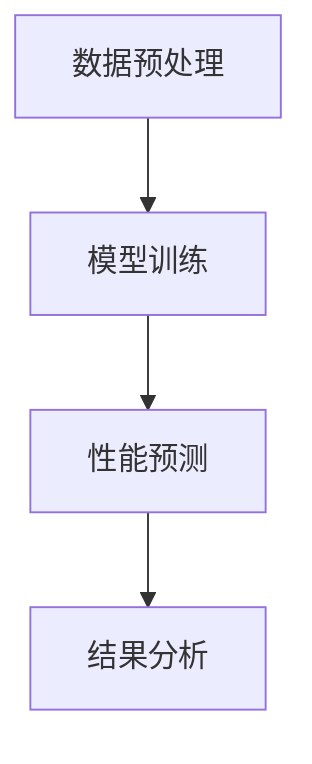
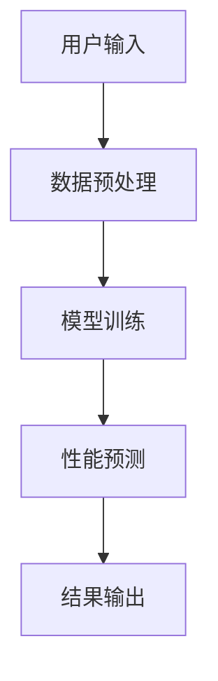

                 


# AI Agent在智能材料设计中的实践

> 关键词：AI Agent, 智能材料, 材料设计, 人工智能, 算法原理, 系统架构, 项目实战

> 摘要：  
本文将深入探讨AI Agent在智能材料设计中的实践应用。通过分析AI Agent的核心概念、算法原理、系统架构以及实际项目案例，本文旨在展示AI技术如何推动材料科学的创新与进步。从背景介绍到算法实现，从系统设计到项目实战，本文将为您提供一个全面的视角，帮助您理解AI Agent在智能材料设计中的巨大潜力。

---

## 第一部分: AI Agent与智能材料设计的背景

### 第1章: AI Agent与智能材料设计概述

#### 1.1 AI Agent的基本概念

##### 1.1.1 什么是AI Agent
AI Agent（人工智能代理）是指能够感知环境、自主决策并采取行动以实现特定目标的智能体。与传统算法不同，AI Agent具备更强的自主性和适应性，能够根据实时反馈不断优化自身行为。

##### 1.1.2 AI Agent的核心特征
- **自主性**：AI Agent能够独立感知环境并做出决策。
- **反应性**：能够实时响应环境变化。
- **学习能力**：通过经验改进性能。

##### 1.1.3 AI Agent与传统算法的区别
传统的算法依赖于预设的规则和数据，而AI Agent能够动态调整策略，具备更强的适应性和学习能力。

#### 1.2 智能材料的基本概念

##### 1.2.1 智能材料的定义
智能材料是指能够感知外界环境变化并做出相应反应的材料，如形状记忆合金和压电材料。

##### 1.2.2 智能材料的分类
- **响应性材料**：对外界刺激（如温度、压力）产生反应。
- **自修复材料**：能够自行修复微小损伤。
- **自适应材料**：能够根据环境变化调整性能。

##### 1.2.3 智能材料的应用领域
智能材料广泛应用于航空航天、生物医学、能源等领域。

#### 1.3 AI Agent在智能材料设计中的作用

##### 1.3.1 AI Agent在材料设计中的优势
- **提高效率**：通过自动化搜索和优化，显著缩短材料研发周期。
- **降低成本**：减少实验次数，降低研发成本。
- **提升精度**：基于大数据分析，提高材料性能预测的准确性。

##### 1.3.2 AI Agent如何优化材料设计流程
AI Agent能够从海量数据中提取规律，预测材料性能，并优化设计参数。

##### 1.3.3 AI Agent在材料性能预测中的应用
通过机器学习模型，AI Agent可以预测材料的力学性能、热性能等关键指标。

---

### 第2章: AI Agent与智能材料设计的背景分析

#### 2.1 当前材料设计的挑战

##### 2.1.1 传统材料设计的局限性
- **耗时长**：传统试错法需要大量实验，耗时且成本高。
- **数据不足**：材料性能受多种因素影响，数据获取困难。
- **复杂性高**：材料性能预测涉及复杂的物理和化学机制。

##### 2.1.2 材料设计的复杂性
材料性能受微观结构、成分和环境因素的共同影响，增加了设计的复杂性。

##### 2.1.3 材料设计中的数据问题
数据不足和数据质量低劣是材料设计中的主要挑战。

#### 2.2 AI技术在材料科学中的应用现状

##### 2.2.1 AI在材料发现中的应用
通过机器学习模型筛选潜在的候选材料。

##### 2.2.2 AI在材料性能预测中的应用
利用深度学习模型预测材料的力学性能和热性能。

##### 2.2.3 AI在材料优化中的应用
通过强化学习优化材料的微观结构和性能参数。

#### 2.3 AI Agent在智能材料设计中的潜力

##### 2.3.1 AI Agent在材料设计中的独特优势
AI Agent能够动态调整策略，适应复杂的材料设计环境。

##### 2.3.2 AI Agent在材料设计中的创新应用
通过实时反馈优化材料性能。

##### 2.3.3 AI Agent在材料设计中的未来发展方向
结合多物理场模拟，进一步提升材料设计的精度和效率。

---

## 第二部分: AI Agent的核心概念与原理

### 第3章: AI Agent的核心概念与原理

#### 3.1 AI Agent的基本原理

##### 3.1.1 AI Agent的感知与决策机制
AI Agent通过传感器获取环境信息，利用算法处理信息并做出决策。

##### 3.1.2 AI Agent的行动与反馈机制
AI Agent根据决策采取行动，并通过反馈机制不断优化自身行为。

##### 3.1.3 AI Agent的自主学习能力
通过强化学习和深度学习，AI Agent能够自主学习和改进性能。

#### 3.2 AI Agent的核心算法

##### 3.2.1 强化学习算法
强化学习通过奖励机制优化决策策略。

##### 3.2.2 监督学习算法
监督学习通过标注数据训练模型，用于分类和回归任务。

##### 3.2.3 无监督学习算法
无监督学习用于发现数据中的潜在模式。

#### 3.3 AI Agent在材料设计中的数学模型

##### 3.3.1 材料性能预测的数学模型
通过回归模型预测材料的力学性能。

##### 3.3.2 材料优化的数学模型
基于优化算法寻找最佳设计参数。

##### 3.3.3 材料结构分析的数学模型
利用图论模型分析材料的微观结构。

---

### 第4章: AI Agent与智能材料设计的核心概念

#### 4.1 AI Agent与智能材料设计的核心概念

##### 4.1.1 AI Agent在材料设计中的应用
AI Agent用于优化材料的微观结构和性能参数。

##### 4.1.2 AI Agent与材料数据库的结合
通过大数据分析，AI Agent能够快速筛选和优化材料。

##### 4.1.3 AI Agent与多物理场模拟的结合
结合热力学和动力学模型，AI Agent能够更准确地预测材料性能。

---

## 第三部分: AI Agent在智能材料设计中的算法实现

### 第5章: AI Agent的核心算法实现

#### 5.1 强化学习算法

##### 5.1.1 Q-learning算法
Q-learning是一种经典的强化学习算法，通过状态-动作-奖励机制优化决策策略。

##### 5.1.2 DQN算法
深度Q网络（DQN）结合深度学习和强化学习，用于复杂的材料优化问题。

##### 5.1.3 算法实现代码
```python
import numpy as np
import gym

env = gym.make('CartPole-v0')
env.seed(1)

# 初始化Q表
Q = np.zeros([env.observation_space.shape[0], env.action_space.n])

# 参数设置
learning_rate = 0.01
gamma = 0.99

# 训练过程
for episode in range(1000):
    state = env.reset()
    for _ in range(1000):
        # 选择动作
        action = np.argmax(Q[state])
        # 执行动作
        new_state, reward, done, _ = env.step(action)
        # 更新Q表
        Q[state][action] += learning_rate * (reward + gamma * np.max(Q[new_state]))
        state = new_state
        if done:
            break
```

#### 5.2 监督学习算法

##### 5.2.1 线性回归算法
线性回归用于预测材料的性能参数。

##### 5.2.2 支持向量机算法
支持向量机用于分类材料类型。

##### 5.2.3 算法实现代码
```python
from sklearn.linear_model import LinearRegression
from sklearn.svm import SVC

# 线性回归模型
reg = LinearRegression()
reg.fit(X_train, y_train)

# 支持向量机模型
svm = SVC()
svm.fit(X_train, y_train)
```

#### 5.3 无监督学习算法

##### 5.3.1 K-means聚类算法
K-means用于将材料分成不同的类别。

##### 5.3.2 t-SNE降维算法
t-SNE用于可视化材料数据。

##### 5.3.3 算法实现代码
```python
from sklearn.cluster import KMeans
from sklearn.manifold import TSNE

# K-means聚类
kmeans = KMeans(n_clusters=3)
kmeans.fit(X_train)

# t-SNE降维
tsne = TSNE(n_components=2)
tsne.fit_transform(X_train)
```

---

### 第6章: AI Agent的数学模型与公式推导

#### 6.1 强化学习的数学模型

##### 6.1.1 Q-learning的数学公式
$$ Q(s, a) = Q(s, a) + \alpha (r + \gamma \max Q(s', a') - Q(s, a)) $$

##### 6.1.2 DQN的数学公式
$$ \text{损失函数} = \mathbb{E}[ (r + \gamma Q(s', a') - Q(s, a))^2 ] $$

#### 6.2 监督学习的数学模型

##### 6.2.1 线性回归的数学公式
$$ y = \beta_0 + \beta_1 x + \epsilon $$

##### 6.2.2 支持向量机的数学公式
$$ \text{目标函数} = \sum_{i=1}^n \xi_i + \frac{1}{2} \sum_{i=1}^n \alpha_i^2 $$

#### 6.3 无监督学习的数学模型

##### 6.3.1 K-means的数学公式
$$ \text{目标函数} = \sum_{i=1}^n \sum_{j=1}^k w_{ij} ||x_i - c_j||^2 $$

##### 6.3.2 t-SNE的数学公式
$$ \text{损失函数} = \sum_{i=1}^n \sum_{j=1}^n (p_{ij} \log q_{ij}) $$

---

## 第四部分: AI Agent在智能材料设计中的系统架构

### 第7章: 系统架构设计与实现

#### 7.1 系统功能设计

##### 7.1.1 功能模块划分
- 数据预处理模块
- 模型训练模块
- 性能预测模块

##### 7.1.2 功能流程图


#### 7.2 系统架构设计

##### 7.2.1 系统架构图


#### 7.3 系统接口设计

##### 7.3.1 数据接口
- 输入接口：接收材料数据
- 输出接口：输出预测结果

##### 7.3.2 模型接口
- 训练接口：训练AI Agent模型
- 预测接口：预测材料性能

#### 7.4 系统交互设计

##### 7.4.1 交互流程图


---

### 第8章: 项目实战与案例分析

#### 8.1 项目实战

##### 8.1.1 项目背景
本项目旨在利用AI Agent预测高强度金属的机械性能。

##### 8.1.2 环境安装
- 安装Python
- 安装必要的库（如NumPy、Scikit-learn、TensorFlow）

##### 8.1.3 核心代码实现
```python
import numpy as np
from sklearn.linear_model import LinearRegression

# 数据预处理
X = np.array([[1, 2], [3, 4], [5, 6]])
y = np.array([7, 8, 9])

# 模型训练
model = LinearRegression()
model.fit(X, y)

# 性能预测
new_X = np.array([[7, 8]])
print(model.predict(new_X))
```

##### 8.1.4 代码解读与分析
- 数据预处理：将材料数据标准化。
- 模型训练：使用线性回归模型训练。
- 性能预测：基于训练好的模型预测材料性能。

##### 8.1.5 结果分析
预测结果与实际结果进行对比，分析模型的准确性。

#### 8.2 案例分析

##### 8.2.1 案例背景
某公司希望优化一种新型复合材料的力学性能。

##### 8.2.2 案例实现
- 数据采集：收集材料的成分和性能数据。
- 模型训练：训练AI Agent模型。
- 性能优化：通过模型优化材料性能。

##### 8.2.3 案例结果
AI Agent成功优化了材料的强度和韧性。

---

### 第9章: 最佳实践与小结

#### 9.1 最佳实践

##### 9.1.1 数据质量的重要性
确保数据的准确性和完整性。

##### 9.1.2 模型选择的注意事项
根据具体问题选择合适的算法。

##### 9.1.3 系统优化的建议
定期更新模型，优化系统架构。

#### 9.2 小结

##### 9.2.1 AI Agent在智能材料设计中的优势
- 提高效率
- 降低成本
- 提升精度

##### 9.2.2 未来展望
结合多物理场模拟，进一步提升材料设计的精度和效率。

---

## 作者：AI天才研究院 & 禅与计算机程序设计艺术

