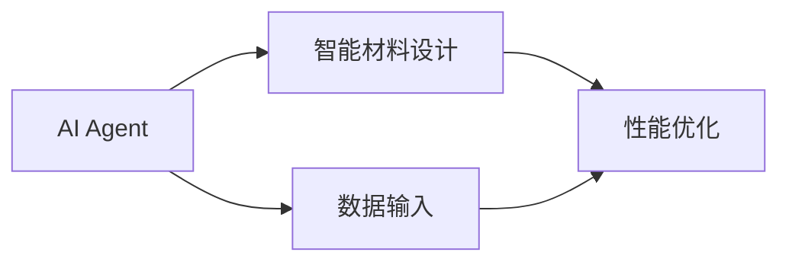
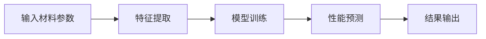
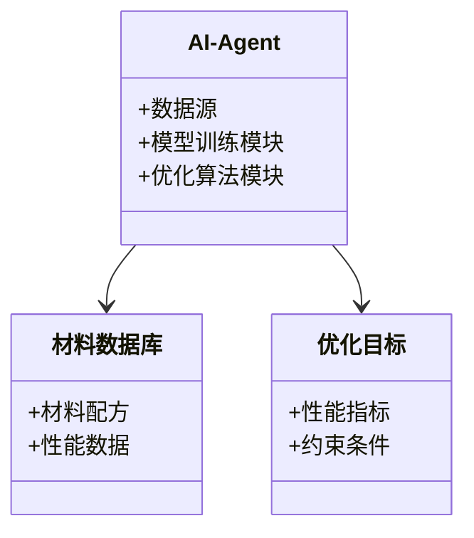
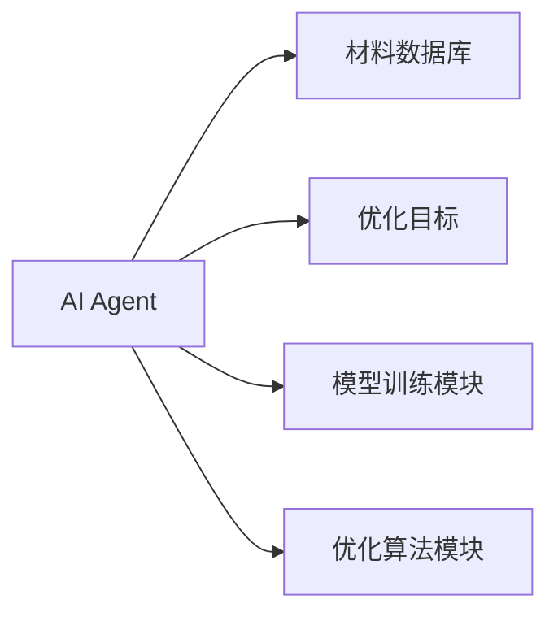

                 


# AI Agent在智能材料设计中的角色

> **关键词**：AI Agent, 智能材料, 材料科学, 人工智能, 设计优化

> **摘要**：  
本文探讨AI Agent在智能材料设计中的核心作用，从背景、概念、算法原理到系统架构、项目实战，全面分析AI Agent如何通过感知、推理和行动优化材料设计流程。文章结合具体案例，展示了AI Agent在材料性能预测、结构优化和创新设计中的潜力，为材料科学家和AI开发者提供了理论与实践相结合的参考。

---

# 第1章: AI Agent与智能材料设计的背景介绍

## 1.1 问题背景与问题描述

### 1.1.1 材料科学与工程的挑战

材料科学是现代科技的核心领域之一，广泛应用于航空航天、能源、医疗、电子等领域。然而，传统材料设计依赖经验试错，效率低下，且难以应对复杂性能的优化需求。材料的性能通常涉及多物理场耦合（如热、力、电、磁等），导致设计过程复杂且耗时。

### 1.1.2 AI技术在材料科学中的应用潜力

人工智能（AI）技术的快速发展为材料科学带来了新的机遇。AI能够处理海量数据，发现隐藏的模式，并预测材料的性能。AI Agent作为一种智能体，能够通过数据驱动的方法，自动优化材料设计流程。

### 1.1.3 AI Agent在智能材料设计中的角色定位

AI Agent在智能材料设计中的角色是通过感知环境、推理和行动，帮助设计人员优化材料性能。它能够处理复杂的多目标优化问题，例如在满足强度、耐腐蚀性、导电性等多约束条件下，寻找最优材料配方。

---

## 1.2 问题解决与边界定义

### 1.2.1 AI Agent在材料设计中的问题解决路径

AI Agent通过以下步骤解决材料设计问题：
1. **数据收集**：整合实验数据、文献数据和计算模拟数据。
2. **特征提取**：识别影响材料性能的关键因素。
3. **模型训练**：构建机器学习模型，预测材料性能。
4. **优化设计**：通过强化学习或遗传算法优化材料配方。

### 1.2.2 智能材料设计的边界与外延

智能材料设计的边界包括材料的物理化学性质、设计目标和约束条件。其外延则涉及材料的制造过程、性能测试和实际应用。

### 1.2.3 AI Agent与智能材料设计的核心要素组成

| 核心要素 | 描述 |
|----------|------|
| 数据源   | 实验数据、文献数据、计算模拟数据 |
| 模型     | 机器学习模型（如神经网络、支持向量机） |
| 优化算法 | 强化学习、遗传算法 |
| 知识库   | 材料科学知识库 |

---

## 1.3 本章小结

本章介绍了AI Agent在智能材料设计中的背景和角色，明确了问题解决路径和核心要素。通过AI Agent，材料设计可以实现从经验试错向数据驱动优化的转变。

---

# 第2章: AI Agent的核心概念与原理

## 2.1 AI Agent的定义与特点

### 2.1.1 AI Agent的定义

AI Agent是一种智能体，能够感知环境并采取行动以实现目标。在智能材料设计中，AI Agent通常通过数据驱动的方法优化材料性能。

### 2.1.2 AI Agent的核心特点

- **自主性**：无需人工干预，自动执行任务。
- **反应性**：能够实时感知环境变化并调整行动。
- **学习能力**：通过经验改进性能。

### 2.1.3 AI Agent与传统计算工具的区别

| 特性 | AI Agent | 传统工具 |
|------|----------|----------|
| 自主性 | 高       | 低       |
| 学习能力 | 高      | 低       |
| 适应性 | 高       | 低       |

---

## 2.2 AI Agent在智能材料设计中的核心概念

### 2.2.1 智能材料的基本属性

智能材料具有响应环境变化的能力，例如形状记忆合金（SMA）在外力作用下可恢复原始形状。

### 2.2.2 AI Agent在材料设计中的作用机制

AI Agent通过以下步骤优化材料性能：
1. **数据输入**：接收材料配方和性能数据。
2. **模型训练**：构建性能预测模型。
3. **优化设计**：通过强化学习优化配方。
4. **结果输出**：输出优化后的材料配方。

### 2.2.3 AI Agent与智能材料设计的关系图



---

## 2.3 本章小结

本章详细介绍了AI Agent的核心概念和其在智能材料设计中的作用机制，通过关系图展示了AI Agent与智能材料设计的关系。

---

# 第3章: AI Agent在智能材料设计中的核心算法原理

## 3.1 算法原理概述

### 3.1.1 基于机器学习的材料性能预测

机器学习模型（如神经网络）可以预测材料的性能，例如强度或导电性。

### 3.1.2 基于强化学习的材料优化

强化学习通过试错优化材料配方，例如使用Q-learning算法。

### 3.1.3 基于生成模型的材料创新设计

生成模型（如GAN）可以生成新的材料结构，例如二维材料的晶体结构。

---

## 3.2 算法流程图



---

## 3.3 算法实现代码示例

### 示例代码：基于机器学习的材料性能预测

```python
# 示例代码：基于机器学习的材料性能预测
import numpy as np
from sklearn.linear_model import LinearRegression

# 假设X为材料参数，y为性能指标
X = np.array([[1, 2, 3], [4, 5, 6]])
y = np.array([7, 8])

# 训练模型
model = LinearRegression()
model.fit(X, y)

# 预测性能
new_X = np.array([[7, 8, 9]])
predicted_y = model.predict(new_X)
print(predicted_y)
```

---

## 3.4 本章小结

本章介绍了AI Agent在智能材料设计中的核心算法原理，包括机器学习、强化学习和生成模型的应用，并通过代码示例展示了算法的实现。

---

# 第4章: 系统架构设计与实现

## 4.1 系统功能设计

### 4.1.1 领域模型



### 4.1.2 系统架构设计



---

## 4.2 系统实现

### 4.2.1 环境安装

```bash
pip install numpy scikit-learn
```

### 4.2.2 核心实现代码

```python
# 示例代码：AI Agent的核心实现
class AI-Agent:
    def __init__(self, data_source, model_type):
        self.data_source = data_source
        self.model_type = model_type
        self.models = {}

    def train_model(self, data):
        # 训练模型
        pass

    def optimize(self, target):
        # 优化设计
        pass

    def predict(self, input):
        # 预测性能
        pass
```

---

## 4.3 本章小结

本章介绍了AI Agent系统的功能设计和架构设计，并展示了核心代码的实现。

---

# 第5章: 项目实战与案例分析

## 5.1 项目背景

以优化一种高温陶瓷材料为例，目标是提高其耐高温性能。

## 5.2 项目实现

### 5.2.1 数据收集与预处理

```python
# 数据预处理示例
import pandas as pd

data = pd.read_csv('materials.csv')
data.dropna(inplace=True)
```

### 5.2.2 模型训练与优化

```python
# 示例代码：训练模型
from sklearn.ensemble import RandomForestRegressor

model = RandomForestRegressor()
model.fit(X_train, y_train)
```

### 5.2.3 结果分析

预测结果与实际数据对比，评估模型的准确度。

---

## 5.3 案例分析

通过优化高温陶瓷材料的配方，AI Agent成功提高了材料的耐高温性能，减少了实验次数。

---

## 5.4 本章小结

本章通过具体案例展示了AI Agent在智能材料设计中的应用，验证了其在实际项目中的价值。

---

# 第6章: 总结与展望

## 6.1 本章总结

AI Agent通过数据驱动的方法优化材料设计，显著提高了设计效率和性能。

## 6.2 未来展望

随着AI技术的进步，AI Agent在智能材料设计中的应用将更加广泛，例如在自适应材料和智能复合材料领域。

## 6.3 最佳实践 Tips

- **数据质量**：确保数据的完整性和准确性。
- **模型选择**：根据具体问题选择合适的算法。
- **持续优化**：定期更新模型以适应新的数据。

---

# 作者：AI天才研究院（AI Genius Institute） & 禅与计算机程序设计艺术（Zen And The Art of Computer Programming）

---

这篇文章全面探讨了AI Agent在智能材料设计中的角色，从理论到实践，为材料科学家和AI开发者提供了深刻的见解和实用指导。

