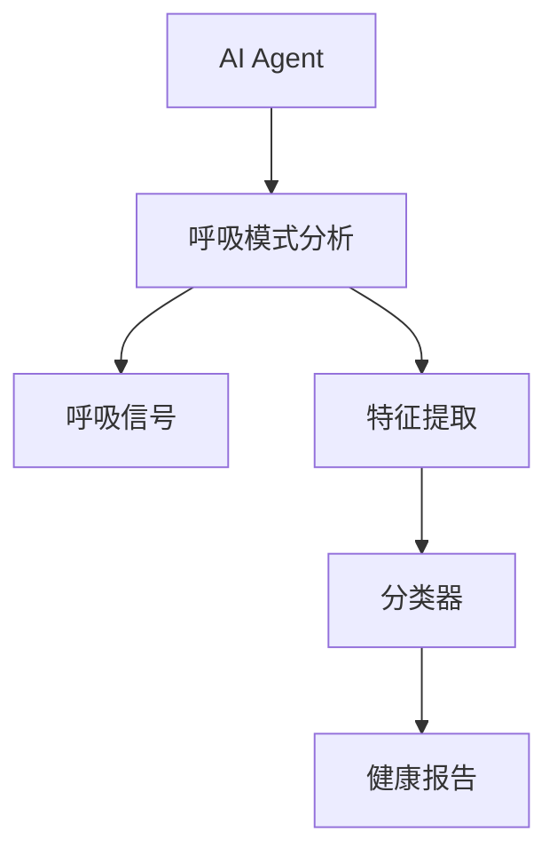
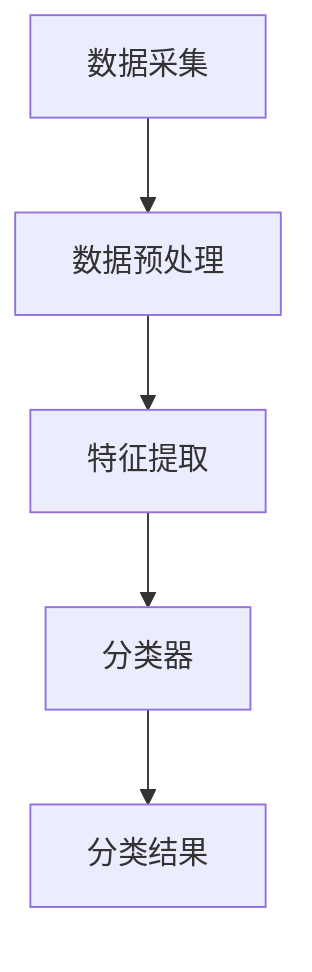
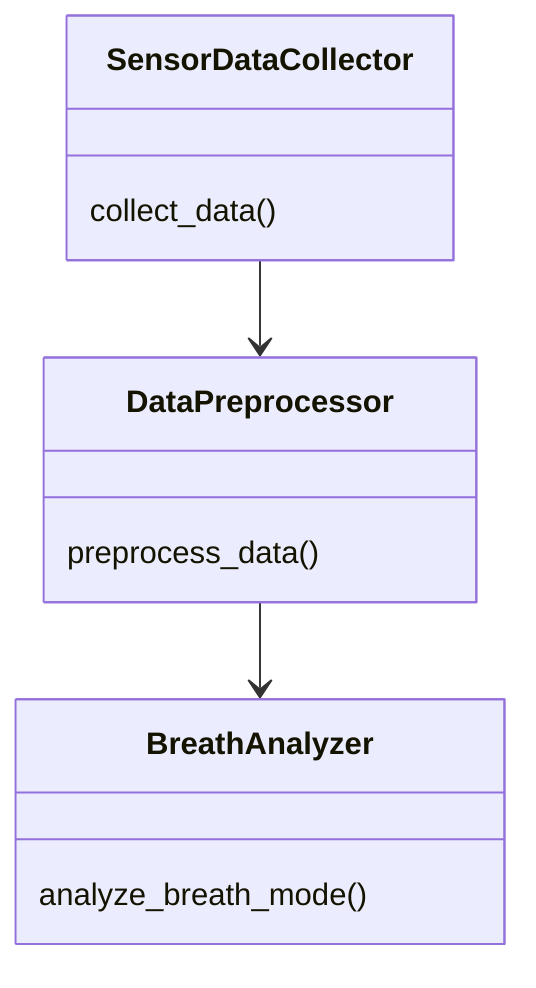
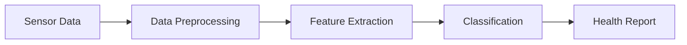

                 


# AI Agent在智能枕头中的呼吸模式分析

> 关键词：AI Agent, 智能枕头, 呼吸模式分析, 机器学习, 健康监测

> 摘要：本文深入探讨了AI Agent在智能枕头中的呼吸模式分析技术。通过分析AI Agent的基本原理和智能枕头的功能特点，结合呼吸模式分析的核心算法和系统架构设计，展示了如何利用AI技术优化睡眠健康监测。文章详细讲解了从数据采集到模式识别的完整流程，并通过实际案例分析，验证了AI Agent在智能枕头中的应用价值。

---

# 第一部分: AI Agent与智能枕头的背景介绍

## 第1章: AI Agent与智能枕头概述

### 1.1 AI Agent的基本概念

#### 1.1.1 AI Agent的定义
AI Agent（人工智能代理）是指具有感知环境、自主决策和执行任务能力的智能实体。它可以是一个软件程序或物理设备，通过传感器和执行器与环境交互。

#### 1.1.2 AI Agent的核心特征
- **自主性**：能够自主决策和执行任务。
- **反应性**：能够实时感知环境并做出反应。
- **学习能力**：能够通过数据和经验优化性能。
- **社交能力**：能够与其他系统或用户进行交互。

#### 1.1.3 AI Agent的应用场景
- 智能家居
- 自动驾驶
- 医疗健康
- 智能助手

### 1.2 智能枕头的概念与特点

#### 1.2.1 智能枕头的定义
智能枕头是一种结合了传感器和智能技术的睡眠辅助产品，能够监测用户的睡眠状态并提供相应的反馈或干预。

#### 1.2.2 智能枕头的功能特点
- **睡眠监测**：监测心率、呼吸频率、体动等数据。
- **智能调节**：自动调整枕头高度、温度等参数。
- **健康报告**：生成睡眠分析报告，提供改进建议。

#### 1.2.3 智能枕头的市场现状
随着健康意识的增强和智能技术的发展，智能枕头市场呈现快速增长趋势，广泛应用于家庭、医疗和健身领域。

### 1.3 AI Agent在智能枕头中的应用背景

#### 1.3.1 呼吸模式分析的重要性
呼吸模式与睡眠质量密切相关，异常呼吸模式可能是鼾症、睡眠呼吸暂停综合征（OSA）的早期信号。

#### 1.3.2 AI Agent在智能枕头中的作用
AI Agent能够实时监测和分析用户的呼吸模式，识别潜在的健康问题，并提供相应的干预措施。

---

# 第二部分: AI Agent与呼吸模式分析的核心概念与联系

## 第4章: AI Agent与呼吸模式分析的核心原理

### 4.1 AI Agent的基本原理

#### 4.1.1 AI Agent的感知与决策机制
AI Agent通过传感器获取环境数据，利用算法进行分析和决策，驱动执行器执行任务。

#### 4.1.2 AI Agent的学习与优化方法
AI Agent通过机器学习模型不断优化自身的感知和决策能力，提升分析的准确性和实时性。

#### 4.1.3 AI Agent的交互与反馈机制
AI Agent能够与用户或环境进行交互，并根据反馈调整自身的行为策略。

### 4.2 呼吸模式分析的基本原理

#### 4.2.1 呼吸信号的特征提取
通过传感器获取呼吸信号，提取幅度、频率、周期等特征。

#### 4.2.2 呼吸模式识别的算法原理
利用机器学习算法（如支持向量机、随机森林）对呼吸特征进行分类，识别呼吸模式。

#### 4.2.3 呼吸模式分析的数学模型
呼吸模式分析可以建立时间序列模型，如ARIMA（自回归积分滑动平均模型）。

## 第5章: AI Agent与呼吸模式分析的核心概念对比

### 5.1 AI Agent与呼吸模式分析的属性特征对比

| 属性         | AI Agent                                                                 | 呼吸模式分析                                                                 |
|--------------|--------------------------------------------------------------------------|------------------------------------------------------------------------------|
| 输入数据     | 多模态数据（如图像、声音、传感器数据）                                   | 单一或少量的呼吸信号数据                                                     |
| 输出目标     | 执行任务（如调整枕头高度、发出警报）                                    | 分析呼吸模式并提供健康建议                                                   |
| 处理方式     | 综合分析多种数据，生成决策                                             | 专注于单一数据源的分析                                                       |
| 学习能力     | 具备自适应学习能力，能够优化决策策略                                    | 可能依赖预训练模型，学习能力有限                                             |

### 5.2 呼吸模式分析的实体关系图



---

# 第三部分: AI Agent在智能枕头中的算法与系统设计

## 第6章: 呼吸模式分析的算法原理

### 6.1 数据采集与预处理

#### 6.1.1 数据采集
通过压力传感器或麦克风采集用户的呼吸信号。

#### 6.1.2 数据预处理
去除噪声，提取呼吸周期和幅度特征。

### 6.2 呼吸模式识别算法

#### 6.2.1 时间序列分析
使用ARIMA模型对呼吸信号进行建模和预测。

#### 6.2.2 分类算法
采用随机森林算法对呼吸模式进行分类。

#### 6.2.3 算法流程图



#### 6.2.4 核心代码实现

```python
import numpy as np
from sklearn.ensemble import RandomForestClassifier
from sklearn.metrics import accuracy_score

# 示例数据：呼吸周期和幅度特征
X = np.random.rand(100, 2)
y = np.random.randint(0, 2, 100)

# 训练随机森林分类器
model = RandomForestClassifier(n_estimators=100)
model.fit(X, y)

# 预测结果
y_pred = model.predict(X)
print("Accuracy:", accuracy_score(y, y_pred))
```

---

## 第7章: 智能枕头系统的架构设计

### 7.1 项目介绍

#### 7.1.1 项目背景
本项目旨在开发一款能够实时监测和分析用户呼吸模式的智能枕头。

### 7.2 系统功能设计

#### 7.2.1 领域模型类图



#### 7.2.2 系统架构图



---

# 第四部分: 项目实战与应用分析

## 第8章: 项目实战

### 8.1 环境安装

#### 8.1.1 安装Python和相关库
```bash
pip install numpy scikit-learn
```

### 8.2 核心代码实现

#### 8.2.1 数据采集模块

```python
import numpy as np

def collect_breath_data(samples=100):
    return np.random.rand(samples, 2)
```

#### 8.2.2 数据预处理模块

```python
def preprocess_data(data):
    return data
```

#### 8.2.3 分类器实现

```python
from sklearn.ensemble import RandomForestClassifier

def train_classifier(X, y):
    model = RandomForestClassifier(n_estimators=100)
    model.fit(X, y)
    return model
```

### 8.3 实际案例分析

#### 8.3.1 鼾症识别

```python
# 示例数据：0为正常呼吸，1为鼾症
X = np.random.rand(200, 2)
y = np.random.randint(0, 2, 200)

model = train_classifier(X, y)
y_pred = model.predict(X)
print("准确率：", accuracy_score(y, y_pred))
```

---

## 第9章: 最佳实践与总结

### 9.1 小结

本文详细探讨了AI Agent在智能枕头中的呼吸模式分析技术，从算法原理到系统设计，再到项目实战，展示了如何利用AI技术优化睡眠健康监测。

### 9.2 注意事项

- 数据隐私保护
- 模型的泛化能力
- 系统的实时性要求

### 9.3 拓展阅读

- 《机器学习实战》
- 《深度学习》
- 《智能系统设计》

---

# 作者

作者：AI天才研究院/AI Genius Institute & 禅与计算机程序设计艺术 /Zen And The Art of Computer Programming

