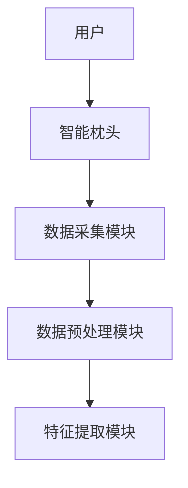
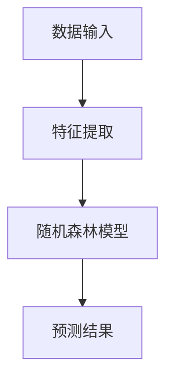
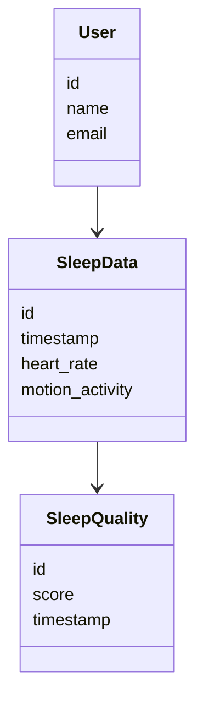

                 


# AI Agent在智能枕头中的睡眠质量分析

## 关键词
AI Agent, 智能枕头, 睡眠质量, 数据分析, 机器学习, 健康监测

## 摘要
本文深入探讨AI Agent在智能枕头中的应用，分析其如何通过数据采集、特征提取、模型训练等技术手段，评估和改善用户的睡眠质量。文章从睡眠分析的核心概念、算法原理、系统架构到实际项目实现，全面解析AI Agent在智能枕头中的技术细节与应用场景。

---

# 第三章: 睡眠质量分析的核心要素

## 3.1 睡眠周期与指标

### 3.1.1 睡眠周期的定义
睡眠周期由多个阶段组成，包括非快速眼动睡眠（NREM）和快速眼动睡眠（REM）。每个阶段对身体和大脑的恢复都有不同的作用。

| 阶段 | 特征 | 对睡眠质量的影响 |
|------|------|------------------|
| N1   | 轻微睡眠 | 提供浅层休息       |
| N2   | 深度睡眠 | 促进记忆巩固       |
| N3   | 深度睡眠 | 维护身体修复功能   |
| REM   | 梦态活跃 | 支持情绪调节和创造力 |

### 3.1.2 睡眠指标的分类
睡眠指标通常包括总睡眠时间、觉醒次数、REM时间等。

| 指标 | 定义 | 监测意义 |
|------|------|----------|
| 总睡眠时间 | 睡眠总时长 | 判断睡眠充足性 |
| 觉醒次数 | 睡眠中断次数 | 评估睡眠连续性 |
| REM时间 | REM阶段时长 | 评估深度睡眠质量 |

### 3.1.3 各指标对睡眠质量的影响
觉醒次数过多会导致睡眠碎片化，影响第二天的精神状态；REM时间不足可能影响情绪和创造力。

## 3.2 数据采集与特征提取

### 3.2.1 数据采集方法
智能枕头通过内置的加速度传感器、心率传感器等设备采集用户的生理数据。



### 3.2.2 特征提取技术
从原始数据中提取有用的特征，如心率变异性和呼吸频率。

### 3.2.3 数据预处理步骤
包括数据清洗、归一化处理和异常值剔除。

---

# 第四章: AI Agent与睡眠分析的关联

## 4.1 AI Agent在睡眠分析中的角色

### 4.1.1 数据处理与分析
AI Agent负责接收传感器数据，并进行清洗和特征提取。

### 4.1.2 模型训练与优化
使用机器学习算法（如随机森林）训练模型，预测睡眠质量。

### 4.1.3 结果反馈与建议
根据模型输出，提供改善睡眠的建议，如调整睡姿或作息时间。

## 4.2 核心概念的ER图架构

```mermaid
erDiagram
    user {
        id : int
        name : varchar
        email : varchar
    }

    sleep_data {
        id : int
        timestamp : datetime
        heart_rate : int
        motion_activity : int
    }

    sleep_quality {
        id : int
        score : float
        timestamp : datetime
    }

    user --> sleep_data
    sleep_data --> sleep_quality
```

---

# 第五章: 算法原理讲解

## 5.1 机器学习模型的选择

### 5.1.1 随机森林算法
随机森林是一种基于树的集成方法，适用于分类和回归问题。



### 5.1.2 算法实现步骤
1. 数据预处理：归一化和缺失值处理。
2. 特征选择：使用特征重要性筛选关键特征。
3. 模型训练：训练随机森林分类器。
4. 模型评估：计算准确率、召回率和F1分数。

### 5.1.3 数学模型
随机森林的决策树模型如下：

$$
\text{预测结果} = \text{多数投票}(\text{决策树预测结果})
$$

---

# 第六章: 系统分析与架构设计方案

## 6.1 问题场景介绍
用户希望通过智能枕头改善睡眠质量，实时监测和分析睡眠数据。

## 6.2 项目介绍
开发一个基于AI Agent的智能枕头睡眠质量分析系统。

## 6.3 系统功能设计

### 6.3.1 领域模型


### 6.3.2 系统架构设计


---

# 第七章: 项目实战

## 7.1 环境安装
安装必要的库，如Python的scikit-learn、pandas和numpy。

## 7.2 核心实现源代码

### 数据预处理
```python
import pandas as pd
from sklearn.preprocessing import StandardScaler

data = pd.read_csv('sleep_data.csv')
scaler = StandardScaler()
scaled_data = scaler.fit_transform(data)
```

### 模型训练
```python
from sklearn.ensemble import RandomForestClassifier

model = RandomForestClassifier(n_estimators=100)
model.fit(X_train, y_train)
```

### 模型评估
```python
from sklearn.metrics import accuracy_score

y_pred = model.predict(X_test)
print("准确率:", accuracy_score(y_test, y_pred))
```

## 7.3 案例分析
分析一位用户的睡眠数据，提供个性化的睡眠改善建议。

---

# 第八章: 优化与维护

## 8.1 性能优化
通过超参数调优和特征选择提升模型性能。

## 8.2 模型可解释性
使用SHAP值解释模型决策，提高用户信任度。

## 8.3 系统可扩展性
设计模块化的系统架构，便于未来功能扩展。

---

# 第九章: 总结与展望

## 9.1 总结
本文详细介绍了AI Agent在智能枕头中的应用，从数据采集到模型训练，再到结果反馈，构建了一个完整的睡眠质量分析系统。

## 9.2 未来展望
未来可以结合可穿戴设备和边缘计算，进一步提升睡眠监测的实时性和准确性。

---

# 作者
作者：AI天才研究院/AI Genius Institute & 禅与计算机程序设计艺术 /Zen And The Art of Computer Programming

