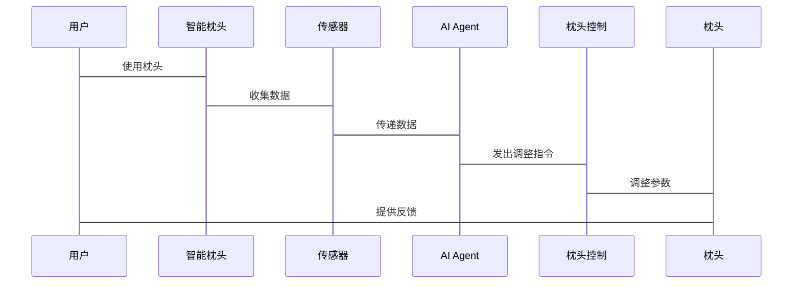

                 


# AI Agent在智能枕头中的颈椎保护

> 关键词：AI Agent, 智能枕头, 颈椎保护, 健康监测, 智能算法

> 摘要：本文探讨AI代理在智能枕头中的应用，重点分析其如何通过实时监测和调整枕头参数来保护用户的颈椎健康。文章详细介绍了AI代理的核心原理、算法实现、系统架构设计以及实际案例，展示了AI技术在健康领域的创新应用。

---

# 第1章: AI Agent在智能枕头中的应用背景

## 1.1 颈椎健康问题的现状

### 1.1.1 颈椎健康问题的普遍性

颈椎健康问题日益普遍，尤其是在现代社会，长时间的坐姿不正确、低头使用手机或电脑导致许多人出现颈椎病。据世界卫生组织统计，全球约有10亿人受到颈椎问题的影响。

### 1.1.2 颈椎问题对个人健康的影响

颈椎问题可能导致头痛、肩颈疼痛、手臂麻木甚至严重的健康问题，如椎间盘突出、神经损伤等。这些问题不仅影响生活质量，还可能引发更严重的健康问题。

### 1.1.3 现有颈椎保护方案的局限性

现有的颈椎保护方案主要依赖于枕头的高度和硬度调节，但这些调节通常是静态的，无法根据用户的动态需求进行实时调整。此外，缺乏个性化的解决方案，无法满足每个人的颈椎保护需求。

## 1.2 AI Agent的基本概念

### 1.2.1 AI Agent的定义与特点

AI Agent（人工智能代理）是一种能够感知环境、自主决策并执行任务的智能实体。它能够通过传感器获取信息，利用算法进行分析，并根据结果采取相应的行动。

### 1.2.2 AI Agent在健康领域的应用潜力

AI Agent在健康领域具有巨大的潜力，尤其是在实时监测和个性化健康解决方案方面。通过AI Agent，智能设备可以实时分析用户的健康数据，并提供个性化的建议和调整。

### 1.2.3 AI Agent与智能枕头的结合

智能枕头通过集成AI Agent，能够实时监测用户的睡眠姿势和颈椎压力，并根据数据动态调整枕头的硬度和高度，从而提供个性化的颈椎保护。

## 1.3 智能枕头的功能与技术基础

### 1.3.1 智能枕头的基本功能

智能枕头的基本功能包括实时监测用户的睡眠姿势、颈椎压力和头部位置，并根据数据动态调整枕头的硬度和高度。

### 1.3.2 智能枕头的技术实现基础

智能枕头的技术实现基础包括传感器（如压力传感器、角度传感器）、AI算法、无线通信模块和用户界面。

### 1.3.3 AI Agent在智能枕头中的作用

AI Agent在智能枕头中起到核心作用，它负责接收传感器数据，分析数据并生成调整指令，以优化用户的颈椎保护效果。

## 1.4 本章小结

本章介绍了颈椎健康问题的现状、AI Agent的基本概念以及其在智能枕头中的作用。AI Agent通过实时监测和动态调整，能够有效保护用户的颈椎健康。

---

# 第2章: AI Agent的核心原理与技术实现

## 2.1 AI Agent的核心概念

### 2.1.1 AI Agent的定义与分类

AI Agent可以根据任务类型和智能水平分为简单反应式代理、基于模型的反射式代理、目标驱动代理和效用驱动代理等。

### 2.1.2 AI Agent的决策机制

AI Agent的决策机制包括基于规则的决策和基于机器学习的决策。基于规则的决策通过预设规则进行判断，而基于机器学习的决策则通过学习数据进行预测和优化。

### 2.1.3 AI Agent的感知与交互能力

AI Agent通过传感器和用户输入感知环境，并通过执行动作与环境交互。感知能力包括数据采集和分析，交互能力包括输出调整指令和反馈信息。

## 2.2 AI Agent的算法原理

### 2.2.1 常见AI Agent算法概述

常见的AI Agent算法包括决策树、随机森林、支持向量机、神经网络和强化学习等。

### 2.2.2 基于规则的AI Agent

基于规则的AI Agent通过预设规则进行判断和决策。例如，当监测到用户的颈椎压力超过阈值时，触发调整枕头高度的动作。

### 2.2.3 基于机器学习的AI Agent

基于机器学习的AI Agent通过训练数据建立模型，能够根据输入数据预测最佳的调整方案。例如，使用决策树算法进行分类，或者使用强化学习算法进行优化。

## 2.3 AI Agent的实体关系图

```mermaid
er
    actor User
    actor System
    actor Data
    actor Feedback
    User --> System: Input
    System --> Data: Process
    Data --> System: Output
    System --> Feedback: Response
```

## 2.4 本章小结

本章详细介绍了AI Agent的核心概念、算法原理和实体关系图。AI Agent通过感知和交互能力，结合算法模型，能够实现智能枕头的动态调整。

---

# 第3章: AI Agent在颈椎保护中的算法实现

## 3.1 基于决策树的AI Agent算法

### 3.1.1 决策树的基本原理

决策树是一种常见的机器学习算法，通过构建树状结构对数据进行分类和回归。每个节点代表一个决策点，叶子节点代表最终的决策结果。

### 3.1.2 决策树在颈椎保护中的应用

在颈椎保护中，决策树可以用于根据用户的颈椎压力、头部位置等数据，预测最佳的枕头调整方案。

### 3.1.3 决策树算法的实现步骤

1. 数据采集：通过传感器获取用户的颈椎压力和头部位置数据。
2. 数据预处理：清洗和归一化数据。
3. 建立决策树模型：使用训练数据训练决策树模型。
4. 模型预测：根据实时数据，预测最佳的枕头调整方案。

## 3.2 基于强化学习的AI Agent算法

### 3.2.1 强化学习的基本原理

强化学习是一种通过试错机制学习策略的方法。AI Agent通过与环境交互，获得奖励或惩罚，逐步优化其行为策略。

### 3.2.2 强化学习在颈椎保护中的应用

在智能枕头中，强化学习可以用于优化枕头的调整策略，以最大化用户的颈椎保护效果。

### 3.2.3 强化学习算法的实现步骤

1. 状态定义：定义用户颈椎压力、头部位置等状态。
2. 动作定义：定义枕头的调整动作，如高度增加、高度减少、硬度变软等。
3. 奖励机制：定义奖励函数，根据用户的颈椎压力变化给予奖励或惩罚。
4. 策略优化：通过强化学习算法优化调整策略，以最大化奖励。

## 3.3 本章小结

本章详细介绍了基于决策树和强化学习的AI Agent算法在颈椎保护中的应用。通过这些算法，智能枕头能够实现动态调整，有效保护用户的颈椎健康。

---

# 第4章: 智能枕头的系统分析与架构设计

## 4.1 项目背景介绍

智能枕头项目旨在通过AI Agent实时监测用户的睡眠姿势和颈椎压力，并动态调整枕头参数，提供个性化的颈椎保护。

## 4.2 系统功能设计

### 4.2.1 颈椎健康监测模块

监测用户的颈椎压力、头部位置和睡眠姿势。

### 4.2.2 AI Agent决策模块

根据监测数据，决策最佳的枕头调整方案。

### 4.2.3 枕头调整模块

执行AI Agent的调整指令，动态调整枕头的硬度和高度。

## 4.3 系统架构设计

```mermaid
graph TD
    User --> Sensor: 用户输入
    Sensor --> AI_Agent: 传递数据
    AI_Agent --> Pillow_Control: 发出调整指令
    Pillow_Control --> Pillow: 调整参数
    Pillow --> User: 提供反馈
```

## 4.4 系统接口设计

系统接口包括传感器接口、AI Agent接口和用户反馈接口。

## 4.5 系统交互流程图



## 4.6 本章小结

本章详细介绍了智能枕头的系统架构设计和交互流程，展示了AI Agent在其中的核心作用。

---

# 第5章: 项目实战

## 5.1 环境安装与配置

### 5.1.1 安装Python环境

使用Anaconda或virtualenv安装Python 3.8及以上版本。

### 5.1.2 安装相关库

安装numpy、scikit-learn、tensorflow等机器学习库。

## 5.2 系统核心实现

### 5.2.1 数据预处理

```python
import numpy as np
from sklearn import preprocessing

# 假设data是传感器数据
data = np.array([[10, 20, 30], [40, 50, 60]])
# 标准化处理
data_normalized = preprocessing.normalize(data)
print(data_normalized)
```

### 5.2.2 AI Agent算法实现

```python
from sklearn.tree import DecisionTreeClassifier
from sklearn.model_selection import train_test_split

# 假设X是输入特征，y是目标标签
X = data_normalized
y = np.array([0, 1])
# 划分训练集和测试集
X_train, X_test, y_train, y_test = train_test_split(X, y, test_size=0.2)
# 训练决策树模型
model = DecisionTreeClassifier()
model.fit(X_train, y_train)
# 预测测试集
y_pred = model.predict(X_test)
print(y_pred)
```

### 5.2.3 系统交互实现

```python
import serial

# 与智能枕头通信
ser = serial.Serial('COM3', 9600)
ser.write(b'adjust_height\n')
response = ser.readline()
print(response.decode())
```

## 5.3 代码解读与分析

### 5.3.1 数据预处理

上述代码使用了数据标准化处理，确保不同传感器数据的可比性。

### 5.3.2 AI Agent算法实现

使用决策树算法训练模型，并对测试数据进行预测，输出调整指令。

### 5.3.3 系统交互实现

通过串口通信与智能枕头进行交互，发送调整指令并接收反馈。

## 5.4 实际案例分析

假设用户A的颈椎压力较高，AI Agent会触发调整枕头高度的动作，以减轻颈椎压力。

## 5.5 本章小结

本章通过实际项目实战，详细展示了智能枕头系统的实现过程，包括环境配置、算法实现和系统交互。

---

# 第6章: 总结与展望

## 6.1 本章总结

本文详细探讨了AI Agent在智能枕头中的应用，分析了其在颈椎保护中的核心作用。通过算法实现和系统设计，展示了AI技术在健康领域的创新应用。

## 6.2 注意事项

在实际应用中，需要注意数据隐私保护和算法的可解释性，确保系统的安全性和用户信任。

## 6.3 拓展阅读

建议进一步研究AI代理在其他健康领域的应用，如智能床垫、智能穿戴设备等。

---

# 作者

作者：AI天才研究院/AI Genius Institute & 禅与计算机程序设计艺术 /Zen And The Art of Computer Programming

