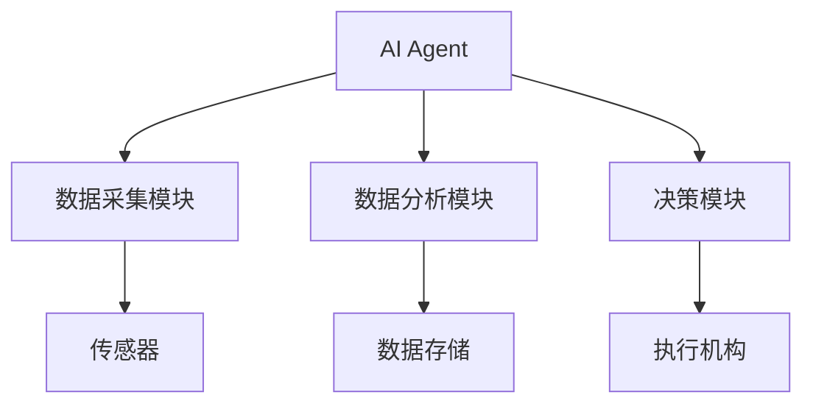
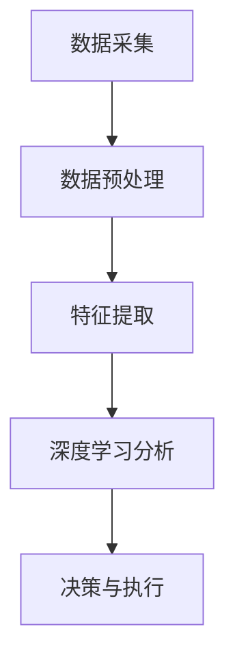
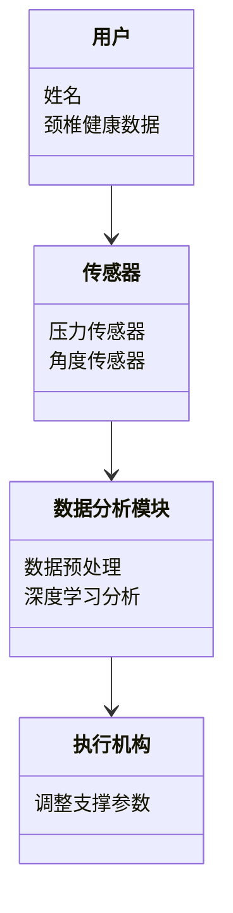
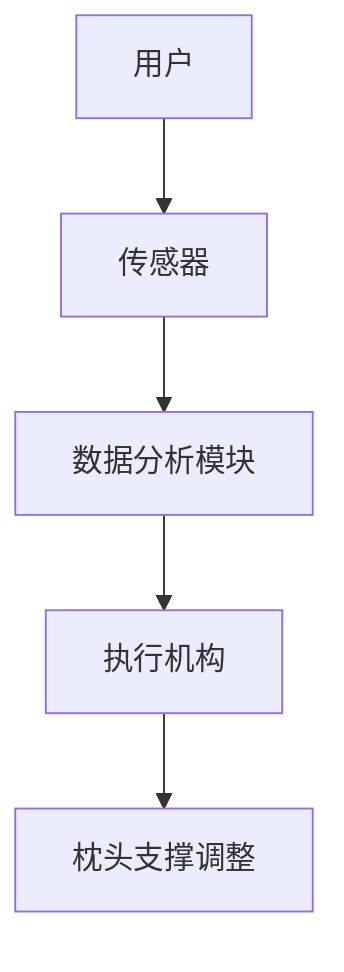

                 


# AI Agent在智能枕头中的颈椎保护系统

## 关键词：AI Agent, 智能枕头, 颈椎保护, 健康监测, 运动捕捉, 深度学习

## 摘要：  
随着人们对健康问题的关注度不断提高，颈椎健康问题日益凸显。传统的枕头产品难以提供个性化的颈椎保护方案。本文探讨了如何通过AI Agent技术在智能枕头中的应用，实现对颈椎健康的有效监测和保护。文章详细介绍了AI Agent的核心原理、颈椎保护系统的架构设计、基于运动捕捉的AI算法实现，以及实际项目中的系统实现和案例分析。通过本文的分析，读者可以深入了解AI Agent在智能枕头中的应用价值和技术实现细节。

---

# 第1章: 背景介绍

## 1.1 问题背景

### 1.1.1 颈椎健康问题的现状
随着现代生活方式的改变，长时间低头看手机、伏案工作等问题导致颈椎病的发病率逐年上升。颈椎健康问题已成为影响人们生活质量的重要因素。

### 1.1.2 智能枕头的发展趋势
传统枕头仅能提供基础的支撑功能，而智能枕头通过集成传感器和AI技术，能够实时监测用户的睡眠姿势和颈椎健康状况，提供个性化的保护方案。

### 1.1.3 AI Agent在健康监测中的作用
AI Agent（智能体）能够实时分析用户的颈椎健康数据，动态调整枕头的支撑力度和角度，从而提供智能化的颈椎保护。

## 1.2 问题描述

### 1.2.1 颈椎保护的定义与目标
颈椎保护的目标是通过科学的支撑和调整，预防颈椎病的发生，缓解颈椎不适。

### 1.2.2 智能枕头的功能需求
智能枕头需要具备以下功能：实时监测用户的睡眠姿势、分析颈椎健康状况、动态调整枕头支撑、提供健康建议。

### 1.2.3 现有解决方案的不足
现有枕头产品缺乏智能化的颈椎保护功能，无法根据用户的颈椎健康状况提供个性化的保护方案。

## 1.3 解决方案

### 1.3.1 AI Agent的核心作用
AI Agent通过实时监测用户的颈椎健康数据，动态调整枕头的支撑参数，实现智能化的颈椎保护。

### 1.3.2 智能枕头与AI Agent的结合
智能枕头集成了AI Agent技术，能够实时监测用户的颈椎健康状况，并通过传感器和执行机构调整枕头的支撑参数。

### 1.3.3 系统的边界与外延
系统边界包括智能枕头的硬件设备和AI Agent的软件模块。系统的外延包括与健康监测系统（如手机APP）的交互。

## 1.4 核心要素组成

### 1.4.1 AI Agent的组成模块
AI Agent主要包括数据采集模块、数据分析模块、决策模块和执行模块。

### 1.4.2 智能枕头的硬件与软件架构
硬件部分包括压力传感器、角度传感器、执行机构和无线通信模块；软件部分包括数据采集、数据分析和AI算法模块。

### 1.4.3 系统功能的模块化划分
系统功能划分为数据采集、数据分析、决策控制和用户交互四个模块。

## 1.5 本章小结  
本章详细介绍了AI Agent在智能枕头中的应用背景，分析了颈椎保护的必要性，提出了智能枕头的功能需求，并阐述了系统的组成模块和架构设计。

---

# 第2章: 核心概念与联系

## 2.1 AI Agent的核心原理

### 2.1.1 定义与功能
AI Agent是一种能够感知环境、做出决策并执行动作的智能体，能够在动态环境中为用户提供个性化服务。

### 2.1.2 AI Agent的分类
根据应用场景的不同，AI Agent可以分为基于规则的智能体和基于学习的智能体。

### 2.1.3 AI Agent的优势
AI Agent能够实时感知用户需求，动态调整系统参数，提供智能化的服务。

## 2.2 颈椎保护系统的原理

### 2.2.1 数据采集
通过传感器采集用户的睡眠姿势、颈椎压力等数据。

### 2.2.2 数据分析
利用AI算法分析数据，判断用户的颈椎健康状况。

### 2.2.3 决策与执行
根据分析结果，动态调整枕头的支撑参数，提供个性化的颈椎保护。

## 2.3 核心概念的对比分析

| **概念**       | **AI Agent**           | **颈椎保护系统**       |
|----------------|-----------------------|------------------------|
| 核心功能       | 实时感知与决策        | 实时监测与动态调整      |
| 应用场景       | 智能设备与服务        | 健康监测与保护          |
| 技术基础       | 人工智能与传感器技术  | 数据采集与智能分析      |

## 2.4 系统架构的Mermaid图



## 2.5 本章小结  
本章通过对比分析，详细介绍了AI Agent和颈椎保护系统的原理和核心概念，并通过Mermaid图展示了系统的整体架构。

---

# 第3章: 算法原理讲解

## 3.1 算法选择与流程设计

### 3.1.1 算法选择
选择基于运动捕捉的AI算法，用于实时监测用户的睡眠姿势。

### 3.1.2 算法流程
1. 数据采集：通过传感器获取用户的颈椎压力和角度数据。
2. 数据预处理：对采集的数据进行滤波和归一化处理。
3. 特征提取：提取与颈椎健康相关的特征参数。
4. 数据分析：利用深度学习模型分析数据，判断用户的颈椎健康状况。
5. 决策与执行：根据分析结果，动态调整枕头的支撑参数。

## 3.2 算法实现的Mermaid流程图



## 3.3 Python实现代码

```python
import numpy as np
import tensorflow as tf

# 数据预处理
def preprocess_data(data):
    # 数据归一化处理
    normalized_data = (data - np.mean(data)) / np.std(data)
    return normalized_data

# 深度学习模型
model = tf.keras.Sequential([
    tf.keras.layers.Dense(64, activation='relu'),
    tf.keras.layers.Dense(1, activation='sigmoid')
])
model.compile(optimizer='adam', loss='binary_crossentropy', metrics=['accuracy'])

# 数据训练
X = preprocess_data(sensor_data)
y = np.array(target_labels)
model.fit(X, y, epochs=100, batch_size=32)
```

## 3.4 数学模型与公式

### 3.4.1 数据预处理公式
$$ normalized\_data = \frac{data - \mu}{\sigma} $$

### 3.4.2 深度学习模型
$$ P(y|x) = \sigma(wx + b) $$

其中，$\sigma$为sigmoid函数，$w$为权重，$b$为偏置。

## 3.5 本章小结  
本章详细讲解了基于运动捕捉的AI算法的实现过程，通过Python代码和数学公式展示了算法的实现细节。

---

# 第4章: 系统分析与架构设计方案

## 4.1 问题场景介绍

### 4.1.1 项目背景
智能枕头项目旨在通过AI技术提供个性化的颈椎保护方案。

### 4.1.2 项目目标
实时监测用户的颈椎健康状况，动态调整枕头的支撑参数。

## 4.2 系统功能设计

### 4.2.1 领域模型
通过Mermaid类图展示系统的领域模型：



### 4.2.2 系统架构
通过Mermaid架构图展示系统的整体架构：



## 4.3 接口与交互设计

### 4.3.1 接口设计
传感器接口、数据分析模块接口、执行机构接口。

### 4.3.2 交互流程
1. 用户入睡时，传感器采集数据。
2. 数据分析模块处理数据并进行分析。
3. 执行机构根据分析结果调整枕头的支撑参数。

## 4.4 本章小结  
本章通过系统分析和架构设计，详细介绍了智能枕头项目的实现方案，包括领域模型、系统架构和接口设计。

---

# 第5章: 项目实战

## 5.1 环境安装

### 5.1.1 开发环境
Python 3.8及以上版本，TensorFlow 2.0及以上版本。

### 5.1.2 工具安装
安装必要的Python库，如numpy、tensorflow、mermaid。

## 5.2 核心功能实现

### 5.2.1 传感器数据采集
通过压力传感器和角度传感器采集用户的颈椎压力和姿势数据。

### 5.2.2 数据分析与处理
利用Python代码对数据进行预处理和分析。

### 5.2.3 算法实现
基于深度学习模型实现颈椎健康状况的分析和决策。

## 5.3 代码解读与分析

### 5.3.1 传感器数据采集代码
```python
import serial

ser = serial.Serial('COM3', 9600)
data = ser.readline().decode().strip()
print(data)
```

### 5.3.2 数据分析与处理代码
```python
import numpy as np

def analyze_data(data):
    # 数据分析逻辑
    normalized_data = (data - np.mean(data)) / np.std(data)
    return normalized_data
```

### 5.3.3 深度学习模型实现代码
```python
import tensorflow as tf

model = tf.keras.Sequential([
    tf.keras.layers.Dense(64, activation='relu'),
    tf.keras.layers.Dense(1, activation='sigmoid')
])
model.compile(optimizer='adam', loss='binary_crossentropy', metrics=['accuracy'])
```

## 5.4 实际案例分析

### 5.4.1 案例背景
某用户长期低头工作，颈椎健康状况较差。

### 5.4.2 数据采集与分析
通过传感器采集用户的颈椎压力和姿势数据，分析结果显示用户的颈椎压力过大。

### 5.4.3 系统调整与反馈
系统根据分析结果调整枕头的支撑参数，提供个性化的颈椎保护方案。

## 5.5 本章小结  
本章通过实际项目案例，详细讲解了智能枕头项目的实现过程，包括环境安装、核心功能实现和实际案例分析。

---

# 第6章: 最佳实践

## 6.1 小结

### 6.1.1 核心内容回顾
AI Agent在智能枕头中的应用，能够实时监测用户的颈椎健康状况，动态调整枕头的支撑参数。

### 6.1.2 关键技术总结
基于运动捕捉的AI算法、深度学习模型、传感器数据采集与分析。

## 6.2 注意事项

### 6.2.1 系统安全性
确保系统的安全性，防止数据泄露和系统故障。

### 6.2.2 用户隐私保护
保护用户的颈椎健康数据，确保用户隐私不被侵犯。

### 6.2.3 系统维护
定期更新系统软件，确保系统的稳定性和性能。

## 6.3 拓展阅读

### 6.3.1 深度学习与健康监测
推荐阅读相关书籍和论文，深入学习深度学习在健康监测中的应用。

### 6.3.2 AI Agent技术研究
研究AI Agent技术在其他领域的应用，拓展技术视野。

## 6.4 本章小结  
本章总结了AI Agent在智能枕头中的应用经验，提出了系统的注意事项和拓展阅读建议。

---

# 作者：AI天才研究院 & 禅与计算机程序设计艺术

通过本文的详细讲解，读者可以深入了解AI Agent在智能枕头中的应用价值和技术实现细节。AI Agent技术的应用不仅提升了智能枕头的功能，也为颈椎保护提供了智能化的解决方案。未来，随着技术的不断发展，AI Agent在健康监测领域的应用前景将更加广阔。

