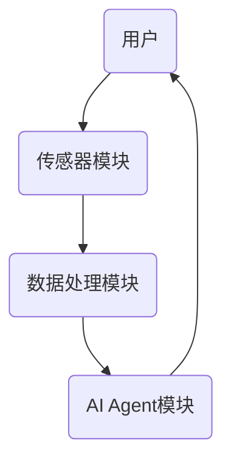
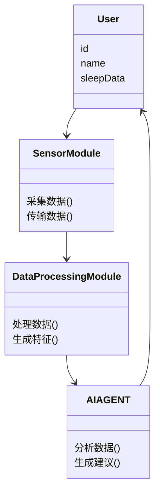

                 


# AI Agent在智能枕头中的颈椎健康监测

> 关键词：AI Agent, 智能枕头, 颈椎健康, 传感器技术, 数据分析

> 摘要：本文探讨了AI Agent在智能枕头中的应用，特别是在颈椎健康监测方面。通过分析AI Agent的核心原理、传感器技术、算法模型和系统架构，结合实际项目案例，展示了如何利用AI技术实现颈椎健康的有效监测和管理。

---

## 第一部分：背景介绍

### 第1章：颈椎健康问题与AI Agent概述

#### 1.1 颈椎健康问题的现状
- 颈椎健康问题的普遍性：现代人由于长时间低头使用手机、电脑，颈椎问题日益严重。
- 颈椎疾病的危害与影响：颈椎病可能导致头晕、肩颈疼痛、甚至瘫痪。
- 当前颈椎健康监测的痛点：传统监测手段不够便捷，缺乏实时性和个性化。

#### 1.2 AI Agent的基本概念
- AI Agent的定义：AI Agent是一种能够感知环境、自主决策并执行任务的智能体。
- AI Agent的核心功能：数据采集、特征提取、健康评估、智能反馈。
- AI Agent在健康监测中的应用潜力：实时监测、个性化建议、预防干预。

#### 1.3 智能枕头的发展与应用
- 智能枕头的定义：集成多种传感器和智能算法的枕头，用于监测用户的睡眠和健康状况。
- 智能枕头在健康监测中的优势：非侵入式监测、实时反馈、个性化调整。
- 智能枕头的市场现状与未来趋势：市场需求增长迅速，技术不断进步。

---

## 第二部分：核心概念与技术原理

### 第2章：AI Agent在颈椎健康监测中的核心原理

#### 2.1 AI Agent的工作原理
- AI Agent的基本工作流程：
  1. 数据采集：通过传感器获取用户的睡眠数据。
  2. 数据处理：对采集的数据进行清洗、特征提取。
  3. 健康评估：基于机器学习模型对数据进行分析，评估颈椎健康状况。
  4. 智能反馈：根据评估结果，给出个性化建议或调整枕头参数。

#### 2.2 传感器技术在智能枕头中的应用
- 常见的传感器类型：
  - 加速度传感器：监测枕头的倾斜角度和用户头部的运动。
  - 压力传感器：测量用户对枕头的压力分布。
  - 温度传感器：监测睡眠环境的温度变化。
  - 心率传感器：监测用户的睡眠质量。
- 传感器数据的采集与处理：传感器数据的采样频率、数据格式、数据传输。
- 传感器数据与颈椎健康的关系：通过分析传感器数据，判断用户的睡姿、颈椎压力等。

#### 2.3 数据预处理与特征提取
- 数据预处理的基本方法：
  - 数据清洗：去除噪声数据、异常值。
  - 数据归一化：将数据标准化，便于模型训练。
  - 数据分割：将时间序列数据分割为训练集和测试集。
- 特征提取的关键技术：
  - 时间序列特征：如均值、方差、最大值、最小值。
  - 频率域特征：如FFT频谱分析。
- 特征与颈椎健康的关系：不同特征对颈椎健康的影响权重。

---

### 第3章：AI Agent与智能枕头的系统架构

#### 3.1 系统整体架构
- 系统组成模块：
  - 传感器模块：负责采集用户的睡眠数据。
  - 数据处理模块：对传感器数据进行预处理和特征提取。
  - AI Agent模块：基于特征数据进行健康评估和智能反馈。
- 各模块之间的关系：
  - 传感器模块将数据传输给数据处理模块。
  - 数据处理模块将特征数据传输给AI Agent模块。
  - AI Agent模块根据评估结果，调整枕头参数或向用户发送反馈。

#### 3.2 系统功能设计
- 数据采集与传输功能：
  - 实时采集用户的睡眠数据。
  - 通过蓝牙或Wi-Fi传输数据到云端或本地设备。
- 数据分析与健康评估功能：
  - 使用机器学习模型分析数据，评估用户的颈椎健康状况。
  - 生成健康报告，提供个性化建议。
- AI Agent的智能反馈与建议功能：
  - 根据评估结果，调整枕头的硬度、高度等参数。
  - 向用户发送提醒，建议改善睡姿或锻炼。

#### 3.3 系统架构的ER实体关系图


---

## 第三部分：算法原理与实现

### 第4章：AI Agent的算法原理

#### 4.1 算法选择与原理
- 支持向量机（SVM）：用于分类和回归分析，适合处理小规模数据。
- 随机森林（Random Forest）：用于分类和回归，适合处理大规模数据。
- 算法流程：
  1. 数据预处理：清洗、归一化。
  2. 特征选择：提取关键特征。
  3. 模型训练：使用训练数据训练模型。
  4. 模型评估：使用测试数据评估模型性能。

#### 4.2 算法实现的Python代码示例
```python
import numpy as np
from sklearn.svm import SVC
from sklearn.ensemble import RandomForestClassifier
from sklearn.metrics import accuracy_score

# 示例数据
X_train = np.array([[1, 2], [3, 4], [5, 6], [7, 8]])
y_train = np.array([0, 1, 0, 1])
X_test = np.array([[2, 3], [4, 5], [6, 7], [8, 9]])

# 使用SVM模型
svm_model = SVC()
svm_model.fit(X_train, y_train)
y_pred_svm = svm_model.predict(X_test)
print("SVM准确率:", accuracy_score(y_test, y_pred_svm))

# 使用Random Forest模型
rf_model = RandomForestClassifier()
rf_model.fit(X_train, y_train)
y_pred_rf = rf_model.predict(X_test)
print("Random Forest准确率:", accuracy_score(y_test, y_pred_rf))
```

#### 4.3 算法的数学模型与公式
- SVM数学模型：
  $$ \text{目标函数：} \min_{w,b,\xi} \frac{1}{2}||w||^2 + C\sum_{i=1}^n \xi_i $$
  $$ \text{约束条件：} y_i(w \cdot x_i + b) \geq 1 - \xi_i $$
- 随机森林数学模型：
  $$ \text{预测概率：} P(y=k|x) = \frac{1}{N} \sum_{i=1}^N P(y=k|x_i) $$

---

## 第四部分：系统分析与架构设计

### 第5章：系统架构设计方案

#### 5.1 问题场景介绍
- 用户需求：实时监测颈椎健康，改善睡眠质量。
- 问题描述：如何通过智能枕头实现颈椎健康监测和个性化建议。

#### 5.2 项目介绍
- 项目目标：开发一个基于AI Agent的智能枕头，实现颈椎健康监测和管理。
- 项目范围：涵盖数据采集、处理、分析和反馈的全流程。

#### 5.3 系统功能设计
- 领域模型类图：


#### 5.4 系统架构设计
- 系统架构图：


#### 5.5 系统接口设计
- 数据接口：传感器模块与数据处理模块之间的接口。
- 用户接口：用户与智能枕头之间的交互界面。
- 后端接口：数据处理模块与AI Agent模块之间的接口。

#### 5.6 系统交互设计
- 交互流程：
  1. 用户睡觉时，传感器模块采集数据。
  2. 数据传输到数据处理模块，进行预处理和特征提取。
  3. AI Agent模块分析数据，生成健康评估报告。
  4. 系统根据评估结果，调整枕头参数或向用户发送反馈。

---

## 第五部分：项目实战

### 第6章：项目实现与案例分析

#### 6.1 环境搭建
- 开发工具：Python、Jupyter Notebook、TensorFlow、Keras。
- 传感器模块：购买智能枕头传感器套件，安装必要的库（如BlueTooth、Wi-Fi通信库）。

#### 6.2 系统核心实现
- 代码实现：数据采集、处理、分析和反馈。
  ```python
  import bluetooth

  # 数据采集部分
  def read_sensor_data():
      # 连接传感器模块
      pass
      # 读取数据并返回
      return data

  # 数据处理部分
  def preprocess_data(raw_data):
      # 数据清洗和归一化
      processed_data = raw_data / max(raw_data)
      return processed_data

  # AI Agent部分
  def analyze_data(processed_data):
      # 使用机器学习模型分析数据
      model.predict(processed_data)

  # 反馈部分
  def send_feedback(feedback):
      # 调整枕头参数或发送反馈给用户
      pass

  # 主函数
  def main():
      data = read_sensor_data()
      processed_data = preprocess_data(data)
      analyze_data(processed_data)
      send_feedback("调整枕头高度为适中")

  if __name__ == "__main__":
      main()
  ```

#### 6.3 案例分析
- 实际案例：用户A长期低头使用手机，颈椎问题严重。使用智能枕头后，系统实时监测用户的睡姿和颈椎压力，自动调整枕头高度，并建议用户改善睡姿。经过一段时间，用户A的颈椎健康状况明显改善。

---

## 第六部分：最佳实践与小结

### 第7章：总结与展望

#### 7.1 项目小结
- 项目成果：成功开发了一个基于AI Agent的智能枕头，实现了颈椎健康监测和个性化管理。
- 经验总结：传感器选择、数据处理、模型选择和系统设计是关键。
- 注意事项：数据隐私保护、传感器精度、模型泛化能力。

#### 7.2 未来展望
- 技术进步：AI Agent算法的优化、传感器技术的升级。
- 应用扩展：将AI Agent技术应用于更多健康监测领域。

#### 7.3 拓展阅读
- 推荐书籍：《机器学习实战》、《深度学习入门》。
- 推荐博客：AI与健康监测相关的技术博客。

---

## 作者

作者：AI天才研究院/AI Genius Institute & 禅与计算机程序设计艺术/Zen And The Art of Computer Programming

---

这篇文章通过系统化的结构，详细介绍了AI Agent在智能枕头中的应用，从背景到技术实现，再到实际案例分析，为读者提供了全面的视角。

