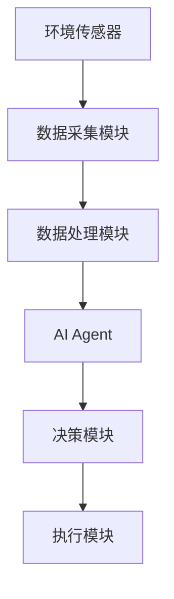
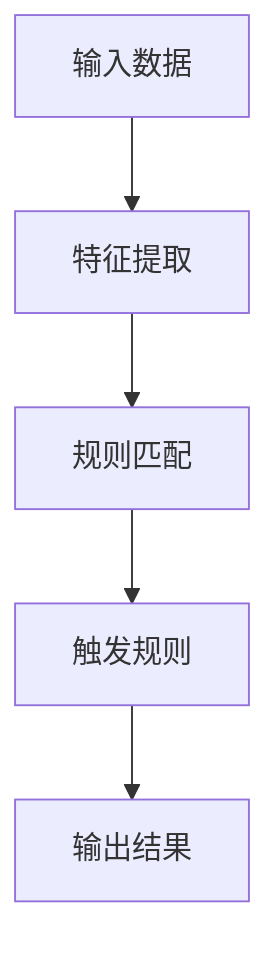
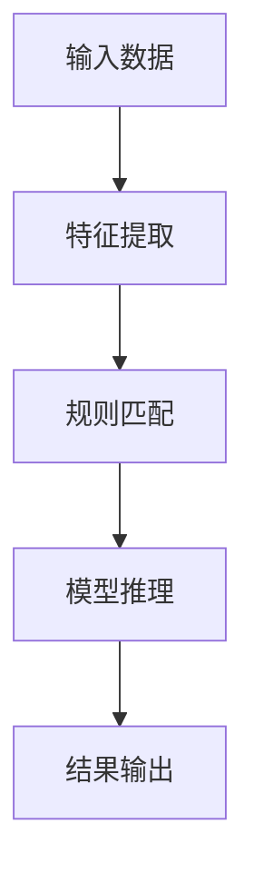
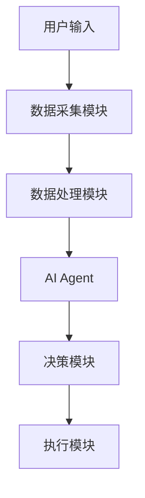

                 


# AI Agent在智能森林火灾预警中的实践

> 关键词：AI Agent，智能预警，森林火灾，算法原理，系统架构

> 摘要：本文详细探讨了AI Agent在智能森林火灾预警中的应用，从问题背景到系统设计，从算法原理到项目实战，全面解析了AI Agent如何助力实现高效的火灾预警系统。

---

## 第1章: 智能森林火灾预警的背景与问题描述

### 1.1 森林火灾的严重性与传统预警方法的局限性

#### 1.1.1 森林火灾的生态与经济影响
森林火灾是一种极具破坏性的自然灾害，不仅会烧毁大量树木，破坏生态环境，还可能造成人员伤亡和巨大的经济损失。每年，全球因森林火灾造成的损失高达数十亿美元，这使得火灾预警系统的开发显得尤为重要。

#### 1.1.2 传统火灾预警方法的局限性
传统的火灾预警方法主要依赖于人工巡查和简单的传感器检测。这种方法存在以下问题：
- **覆盖面有限**：人工巡查难以覆盖大面积的森林区域。
- **响应速度慢**：在火灾初期，人工巡查可能无法及时发现火源。
- **准确性低**：传感器数据受环境干扰较大，误报率和漏报率较高。

#### 1.1.3 智能化预警的必要性
为了克服传统方法的不足，智能化的火灾预警系统应运而生。AI Agent（人工智能代理）作为一种智能化的解决方案，能够实时分析海量数据，快速做出决策，从而显著提高火灾预警的准确性和响应速度。

---

### 1.2 AI Agent在智能预警中的应用前景

#### 1.2.1 AI Agent的基本概念
AI Agent是一种能够感知环境、自主决策并执行任务的智能体。它能够根据输入的数据，通过算法进行分析和推理，得出最优解决方案。

#### 1.2.2 AI Agent在火灾预警中的优势
AI Agent在火灾预警中的优势主要体现在以下几点：
- **实时性**：能够快速处理海量数据，实现实时预警。
- **准确性**：通过机器学习算法，提高火灾检测的准确性。
- **自适应性**：能够根据环境变化自动调整预警策略。

#### 1.2.3 智能森林火灾预警系统的整体架构
智能森林火灾预警系统通常由以下几个部分组成：
1. **环境传感器**：用于采集森林中的温度、湿度、风速等环境数据。
2. **数据采集模块**：负责将传感器数据传输到系统中。
3. **数据处理模块**：对采集到的数据进行预处理和分析。
4. **AI Agent**：负责根据处理后的数据，判断是否存在火灾风险。
5. **决策模块**：根据AI Agent的判断结果，发出预警信号或采取其他应对措施。

---

### 1.3 本章小结
本章主要介绍了森林火灾的严重性及其对生态和经济的影响，分析了传统火灾预警方法的局限性，并提出了智能化预警的必要性。同时，介绍了AI Agent的基本概念及其在火灾预警中的应用前景，为后续章节的展开奠定了基础。

---

## 第2章: AI Agent的核心概念与技术原理

### 2.1 AI Agent的定义与分类

#### 2.1.1 AI Agent的定义
AI Agent是一种能够感知环境、自主决策并执行任务的智能体。它能够通过传感器或其他输入方式获取环境信息，并通过算法进行分析和推理，从而实现特定目标。

#### 2.1.2 AI Agent的主要分类
AI Agent可以根据不同的标准进行分类，常见的分类方式包括：
1. **按智能水平分类**：
   - **反应式AI Agent**：仅根据当前感知的信息做出反应，不依赖历史数据。
   - **认知式AI Agent**：具备一定的推理和规划能力，能够根据历史数据和上下文做出决策。
2. **按应用领域分类**：
   - **监控型AI Agent**：用于实时监控环境并发出预警。
   - **控制型AI Agent**：用于控制设备或系统执行特定任务。

#### 2.1.3 AI Agent的核心属性对比表
以下表格对比了反应式AI Agent和认知式AI Agent的核心属性：

| 属性                | 反应式AI Agent          | 认知式AI Agent          |
|---------------------|-------------------------|-------------------------|
| 智能水平            | 较低                   | 较高                   |
| 数据依赖性          | 仅依赖当前数据         | 依赖当前和历史数据     |
| 应用场景            | 简单实时任务           | 复杂任务，需要推理和规划|

---

### 2.2 AI Agent与相关技术的联系

#### 2.2.1 AI Agent与机器学习的关系
AI Agent的核心技术之一是机器学习，通过监督学习、无监督学习和深度学习等方法，AI Agent能够从大量数据中学习 patterns，并做出预测和决策。

#### 2.2.2 AI Agent与物联网的结合
AI Agent可以与物联网（IoT）技术相结合，通过物联网设备采集环境数据，并通过AI算法进行分析和处理，从而实现智能化的火灾预警。

#### 2.2.3 AI Agent与大数据分析的协同
AI Agent能够处理和分析海量数据，通过大数据分析技术，AI Agent能够发现数据中的潜在规律，进一步提高火灾预警的准确性。

---

### 2.3 AI Agent的实体关系与系统架构

#### 2.3.1 实体关系图（ER图）
以下是AI Agent在智能森林火灾预警系统中的实体关系图：



---

### 2.4 本章小结
本章详细介绍了AI Agent的核心概念，包括其定义、分类以及与相关技术的联系。通过实体关系图展示了AI Agent在智能火灾预警系统中的架构，为后续章节的算法设计和系统实现奠定了基础。

---

## 第3章: AI Agent的算法原理

### 3.1 基于规则的AI Agent算法

#### 3.1.1 基于规则的推理过程
基于规则的AI Agent算法通过预定义的规则对数据进行分析和推理。例如，当温度超过一定阈值且湿度低于一定值时，系统会触发火灾预警。

#### 3.1.2 规则库的构建与管理
规则库的构建需要结合领域知识和历史数据，通过专家经验或数据挖掘技术提取规则。

#### 3.1.3 规则匹配与执行流程
以下是一个基于规则的推理流程图：



---

### 3.2 基于机器学习的AI Agent算法

#### 3.2.1 监督学习与无监督学习的应用
- **监督学习**：用于分类任务，例如将数据分为“火灾”和“无火灾”两类。
- **无监督学习**：用于聚类任务，例如将相似的环境数据归为一类。

#### 3.2.2 深度学习模型的使用
深度学习模型（如卷积神经网络CNN）可以用于图像识别任务，例如识别卫星图像中的火灾区域。

#### 3.2.3 模型训练与优化方法
模型训练需要使用大量的标注数据，并通过交叉验证等方法优化模型性能。

---

### 3.3 混合式AI Agent算法

#### 3.3.1 规则与机器学习的结合
混合式AI Agent算法结合了基于规则和基于机器学习的优点，能够在规则不足的情况下，通过机器学习模型进行补充。

#### 3.3.2 混合式算法的优势
- **鲁棒性**：能够同时利用规则和机器学习的优势。
- **适应性**：能够根据环境变化自动调整规则和模型。

#### 3.3.3 实际应用中的权衡策略
在实际应用中，需要根据具体场景权衡规则和机器学习的使用比例。

---

### 3.4 算法流程图

以下是一个混合式AI Agent算法的流程图：



---

### 3.5 数学模型与公式

#### 3.5.1 朴素贝叶斯分类公式
朴素贝叶斯分类是一种常用的监督学习算法，其公式为：
$$ P(y|x) = \frac{P(x|y)P(y)}{P(x)} $$

#### 3.5.2 决策树模型的构建公式
决策树模型的构建需要计算信息增益，公式为：
$$ Gini指数 = \sum_{k=1}^{n} p_k(1-p_k) $$

---

### 3.6 本章小结
本章详细介绍了AI Agent的算法原理，包括基于规则和基于机器学习的算法，以及混合式算法的应用。通过流程图和数学公式，展示了AI Agent在火灾预警中的具体实现方法。

---

## 第4章: 智能森林火灾预警系统的分析与设计

### 4.1 系统需求分析

#### 4.1.1 功能需求
- 实时采集和处理环境数据。
- 基于AI Agent算法进行火灾风险评估。
- 发出火灾预警信号。

#### 4.1.2 性能需求
- 数据处理速度：实时处理传感器数据。
- 系统稳定性：7×24小时不间断运行。

#### 4.1.3 用户需求
- 管理员：需要查看系统运行状态和历史数据。
- 消防人员：需要实时接收火灾预警信号。

---

### 4.2 系统架构设计

#### 4.2.1 领域模型
以下是系统的领域模型：


#### 4.2.2 系统架构图
以下是系统的整体架构图：


---

### 4.3 系统接口与交互流程

#### 4.3.1 接口设计
系统主要接口包括：
- 传感器数据接口。
- 用户界面接口。
- 火灾预警接口。

#### 4.3.2 交互流程
以下是系统的交互流程图：



---

### 4.4 本章小结
本章详细分析了智能森林火灾预警系统的功能需求、系统架构和接口设计，为后续的系统实现提供了理论依据。

---

## 第5章: 项目实战

### 5.1 环境安装

#### 5.1.1 系统需求
- 操作系统：Linux或Windows。
- 开发工具：Python、TensorFlow、Kafka等。

#### 5.1.2 安装步骤
1. 安装Python和相关库。
2. 安装TensorFlow和Kafka。
3. 配置环境变量。

---

### 5.2 系统核心实现源代码

#### 5.2.1 数据采集模块
以下是数据采集模块的代码示例：

```python
import kafka
from kafka import KafkaProducer

# 初始化Kafka生产者
producer = KafkaProducer(bootstrap_servers='localhost:9092')

# 发送数据到Kafka主题
for _ in range(100):
    producer.send('fire_sensor', value=b'temperature data')
```

#### 5.2.2 数据处理模块
以下是数据处理模块的代码示例：

```python
import tensorflow as tf
import numpy as np

# 加载预训练模型
model = tf.keras.models.load_model('fire_detection_model.h5')

# 数据预处理
def preprocess_data(data):
    # 数据归一化处理
    normalized_data = (data - np.mean(data)) / np.std(data)
    return normalized_data

# 使用模型进行预测
def predict_fire(data):
    processed_data = preprocess_data(data)
    prediction = model.predict(processed_data)
    return prediction
```

---

### 5.3 实际案例分析

#### 5.3.1 数据分析与结果解读
通过实际案例分析，验证系统的火灾预警能力。例如，当系统检测到温度异常升高且湿度显著降低时，AI Agent会触发火灾预警信号。

#### 5.3.2 系统性能评估
评估系统的准确率、召回率和F1值等指标。

---

### 5.4 项目小结
本章通过实际项目案例，展示了AI Agent在智能森林火灾预警系统中的具体实现和应用效果。通过代码和数据分析，验证了系统的可行性和有效性。

---

## 第6章: 最佳实践与注意事项

### 6.1 最佳实践 tips
- 定期更新模型和规则库。
- 优化系统性能，确保实时处理能力。
- 加强系统容错设计，提高系统的稳定性和可靠性。

### 6.2 小结
AI Agent在智能森林火灾预警中的应用，不仅提高了火灾预警的准确性和响应速度，还为其他领域的智能化预警提供了参考。

### 6.3 注意事项
- 确保数据来源的准确性和完整性。
- 定期维护和更新系统，防止因设备老化或数据过时导致误报或漏报。

### 6.4 拓展阅读
- 推荐阅读《机器学习实战》和《深度学习》等相关书籍，以进一步了解AI Agent的算法原理和应用场景。

---

## 作者：AI天才研究院/AI Genius Institute & 禅与计算机程序设计艺术 /Zen And The Art of Computer Programming

---

以上是《AI Agent在智能森林火灾预警中的实践》的技术博客文章的完整目录和内容框架。希望这篇文章能够为读者提供清晰的思路和深入的分析，帮助大家更好地理解和应用AI Agent技术在智能火灾预警中的实践。

