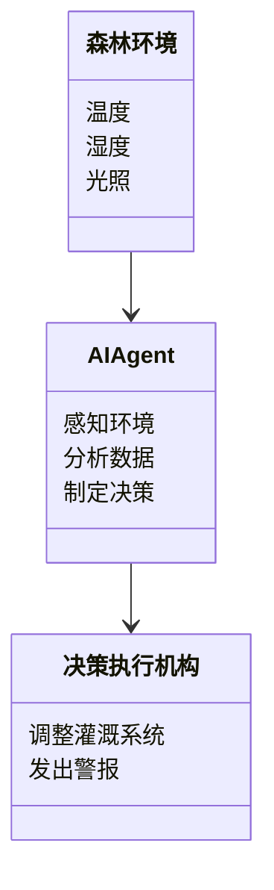
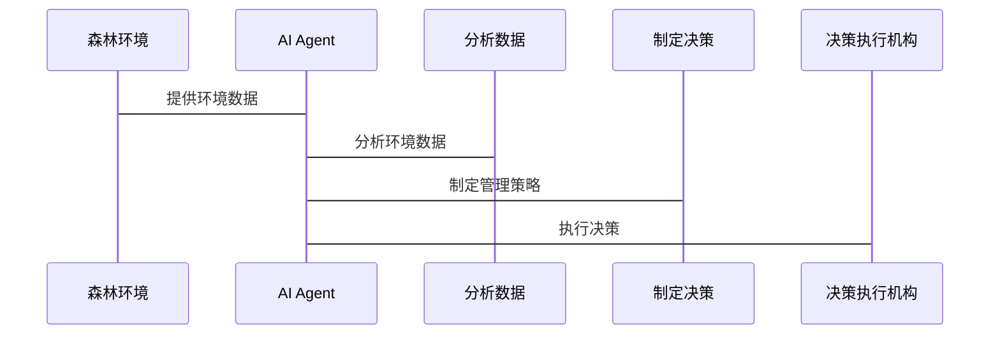

                 


# AI Agent在智能森林生态系统管理中的实践

> 关键词：AI Agent，智能森林，生态系统管理，强化学习，数学模型，系统架构

> 摘要：本文探讨了AI Agent在智能森林生态系统管理中的应用，从背景、核心概念、算法原理到系统架构和项目实战，详细分析了AI Agent在森林资源监测、优化配置和生态恢复中的作用。文章还结合了具体的算法模型和代码实现，为读者提供了深入的技术解读。

---

# 正文

## 第一部分: AI Agent与智能森林生态系统管理的背景

### 第1章: AI Agent与智能森林生态系统管理的背景

#### 1.1 智能森林生态系统管理的背景

##### 1.1.1 森林生态系统管理的传统模式
传统的森林管理主要依赖人工巡护、定期监测和经验判断。这种方式效率低下，且难以应对复杂多变的生态问题。例如，人工巡护无法覆盖所有区域，且在面对自然灾害（如火灾、虫灾）时反应速度较慢。

##### 1.1.2 AI Agent如何解决这些问题
AI Agent（人工智能代理）通过实时数据采集、智能分析和自主决策，能够显著提升森林管理的效率和精准度。例如，AI Agent可以实时监控森林中的环境数据（如温度、湿度、光照），并根据数据预测潜在的生态风险。

##### 1.1.3 AI Agent在森林管理中的应用前景
随着技术的进步，AI Agent在森林资源监测、病虫害防治、火灾预警等领域展现出巨大潜力。通过结合无人机、物联网和大数据分析，AI Agent能够实现森林生态系统的智能化管理。

#### 1.2 AI Agent的核心概念与特点

##### 1.2.1 AI Agent的定义
AI Agent是一种能够感知环境、自主决策并执行任务的智能实体。它能够通过传感器获取数据，利用算法进行分析，并根据结果采取行动。

##### 1.2.2 AI Agent的核心特点
- **自主性**：能够在无外部干预的情况下完成任务。
- **反应性**：能够实时感知环境变化并做出反应。
- **学习能力**：通过机器学习算法不断优化决策模型。

#### 1.3 智能森林生态系统管理的挑战与机遇

##### 1.3.1 森林资源管理的复杂性
森林生态系统是一个复杂的系统，涉及生物多样性和环境变化等多种因素。传统的管理方式难以应对这种复杂性。

##### 1.3.2 AI Agent在生态监测中的作用
AI Agent可以通过无人机、传感器等设备实时监测森林的环境数据，帮助管理者及时发现潜在问题。

##### 1.3.3 智能化管理的潜在效益
通过AI Agent的智能化管理，可以实现资源的优化配置，减少浪费，提高管理效率。

## 第二部分: AI Agent的核心概念与生态系统管理的联系

### 第2章: AI Agent的核心概念与原理

#### 2.1 AI Agent的原理

##### 2.1.1 感知与决策机制
AI Agent通过传感器获取环境数据，利用算法进行分析，生成决策方案。

##### 2.1.2 学习与优化算法
AI Agent通过机器学习算法不断优化自身的决策模型。例如，强化学习算法通过奖励机制，使AI Agent能够在复杂的环境中做出最优决策。

##### 2.1.3 与环境的交互方式
AI Agent通过执行动作与环境互动，例如，调整灌溉系统或发出警报信号。

#### 2.2 AI Agent与生态系统管理的联系

##### 2.2.1 AI Agent在生态监测中的应用
AI Agent可以通过无人机和传感器实时监测森林的环境数据，帮助管理者及时发现潜在的生态问题。

##### 2.2.2 AI Agent在资源优化配置中的作用
通过分析森林资源的分布和需求，AI Agent可以帮助管理者优化资源配置，提高资源利用效率。

##### 2.2.3 AI Agent在生态恢复中的潜在价值
AI Agent可以协助制定生态恢复计划，例如，通过分析土壤和气候数据，优化植被恢复策略。

#### 2.3 AI Agent的生态系统管理中的核心要素

##### 2.3.1 数据采集与处理
AI Agent需要通过传感器和无人机等设备采集环境数据，并进行预处理。

##### 2.3.2 模型构建与优化
通过机器学习算法构建生态模型，并不断优化模型以提高预测精度。

##### 2.3.3 决策与执行
AI Agent根据模型预测结果做出决策，并通过执行机构（如灌溉系统）实施。

## 第三部分: AI Agent的算法原理与数学模型

### 第3章: AI Agent的算法原理

#### 3.1 强化学习算法

##### 3.1.1 强化学习的基本原理
强化学习是一种通过试错学习的方法，AI Agent通过与环境的交互获得奖励或惩罚，从而优化决策策略。

##### 3.1.2 Q-learning算法的实现
Q-learning算法是一种常用的强化学习算法，其核心思想是通过不断更新Q值表，找到最优的决策策略。

##### 3.1.3 算法的数学模型
$$ Q(s, a) = r + \gamma \max_{a'} Q(s', a') $$
其中，\( Q(s, a) \) 表示状态 \( s \) 下采取动作 \( a \) 的价值，\( r \) 是奖励，\( \gamma \) 是折扣因子，\( Q(s', a') \) 是下一个状态下的价值。

#### 3.2 监督学习算法

##### 3.2.1 监督学习的基本原理
监督学习是一种通过训练数据学习映射关系的方法，AI Agent通过输入数据和标签，学习如何做出预测或分类。

##### 3.2.2 回归与分类任务
回归任务用于预测连续值（如温度预测），分类任务用于将数据分为不同的类别（如病虫害分类）。

##### 3.2.3 算法的数学模型
$$ y = w x + b $$
其中，\( y \) 是输出，\( w \) 是权重，\( x \) 是输入，\( b \) 是偏置。

#### 3.3 聚类算法

##### 3.3.1 K-means算法的实现
K-means算法是一种常用的聚类算法，通过将数据点划分为K个簇，找到簇中心。

##### 3.3.2 算法的数学模型
$$ \text{目标函数} = \sum_{i=1}^{n} \min_{j=1}^{K} (x_i - c_j)^2 $$
其中，\( x_i \) 是数据点，\( c_j \) 是簇中心，\( n \) 是数据点数量，\( K \) 是簇的数量。

---

## 第四部分: 系统分析与架构设计

### 第4章: 智能森林生态系统管理系统的架构设计

#### 4.1 问题场景介绍
智能森林管理系统需要实时监测森林的环境数据，并根据数据做出决策，例如火灾预警和病虫害防治。

#### 4.2 项目介绍
本项目旨在构建一个基于AI Agent的智能森林管理系统，通过无人机、传感器和数据分析平台实现森林的智能化管理。

#### 4.3 系统功能设计

##### 4.3.1 领域模型（Mermaid类图）


#### 4.4 系统架构设计（Mermaid架构图）
```mermaid
docker
    servers {
        AI Agent服务
        数据分析平台
    }
    clients {
        传感器节点
        无人机
    }
    communication {
        传感器 -> AI Agent
        AI Agent -> 执行机构
    }
```

#### 4.5 系统接口设计

##### 4.5.1 传感器接口
传感器节点通过无线通信模块将数据传输到AI Agent。

##### 4.5.2 决策执行接口
AI Agent通过控制接口（如API）调整灌溉系统或发出警报。

#### 4.6 系统交互（Mermaid序列图）


---

## 第五部分: 项目实战

### 第5章: 项目实战与代码实现

#### 5.1 环境安装

##### 5.1.1 安装Python环境
使用Anaconda或虚拟环境安装Python 3.8以上版本。

##### 5.1.2 安装依赖库
安装必要的库，例如：
```bash
pip install numpy pandas scikit-learn matplotlib
```

#### 5.2 系统核心实现源代码

##### 5.2.1 强化学习算法实现（Q-learning）
```python
import numpy as np

class QLearningAgent:
    def __init__(self, state_space_size, action_space_size, gamma=0.9):
        self.gamma = gamma
        self.Q = np.zeros((state_space_size, action_space_size))
    
    def act(self, state, epsilon=0.1):
        if np.random.random() < epsilon:
            return np.random.randint(0, action_space_size)
        return np.argmax(self.Q[state, :])
    
    def update(self, state, action, reward, next_state):
        self.Q[state, action] = reward + self.gamma * np.max(self.Q[next_state, :])
```

##### 5.2.2 数据分析与可视化
```python
import pandas as pd
import matplotlib.pyplot as plt

def visualize_data(dataframe):
    dataframe.plot(kind='line')
    plt.show()
```

#### 5.3 代码应用解读与分析
以上代码实现了AI Agent的基本功能，包括数据采集、分析和决策执行。通过强化学习算法，AI Agent能够不断优化其决策策略，提高管理效率。

#### 5.4 实际案例分析
以火灾预警为例，AI Agent通过分析森林的环境数据，预测火灾风险，并及时发出警报。

#### 5.5 项目小结
通过本项目，我们可以看到AI Agent在智能森林管理中的巨大潜力。结合强化学习和数据分析，AI Agent能够显著提升森林管理的效率和精准度。

---

## 第六部分: 最佳实践、小结、注意事项、拓展阅读

### 第6章: 最佳实践与注意事项

#### 6.1 最佳实践
- 定期更新模型，确保其准确性。
- 与生态学家合作，确保决策的科学性。

#### 6.2 小结
本文详细探讨了AI Agent在智能森林管理中的应用，从背景、算法到系统架构，为读者提供了全面的技术解读。

#### 6.3 注意事项
- 数据的准确性和完整性对AI Agent的性能至关重要。
- 需要考虑到系统的鲁棒性和容错性，确保在极端情况下仍能正常运行。

#### 6.4 拓展阅读
- 《强化学习入门》
- 《机器学习在生态学中的应用》

---

## 作者信息

作者：AI天才研究院/AI Genius Institute & 禅与计算机程序设计艺术 /Zen And The Art of Computer Programming

