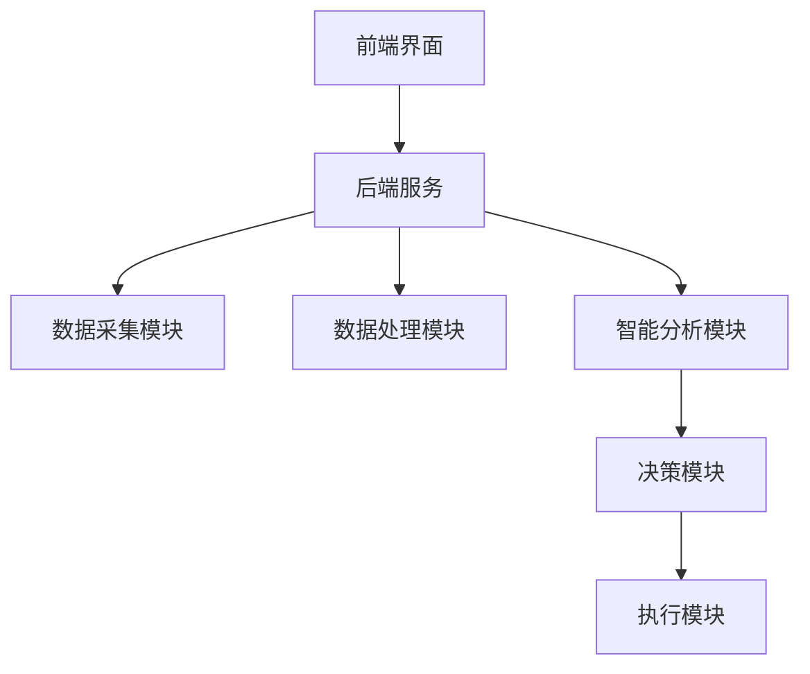
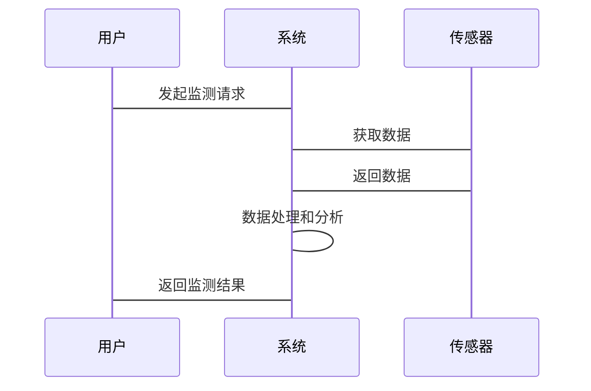

                 


# AI Agent在智能森林资源监测中的实践

> **关键词**: AI Agent, 森林资源监测, 机器学习, 深度学习, 多智能体协作, 自然资源管理

> **摘要**: 本文探讨了AI Agent在智能森林资源监测中的应用实践。通过分析森林资源监测的背景与问题，详细阐述了AI Agent的核心概念、技术原理、算法实现、系统设计以及项目实战。文章还结合实际案例，分析了AI Agent在森林资源监测中的优势，并提出了最佳实践建议。最后，总结了AI Agent在智能森林资源监测中的应用前景。

---

## 第一部分: AI Agent在智能森林资源监测中的背景与现状

### 第1章: 智能森林资源监测的背景与问题

#### 1.1 森林资源监测的重要性

森林是地球上最重要的自然资源之一，覆盖着全球陆地面积的30%以上。森林资源不仅为人类提供了木材、药材、食物等物质资源，还在调节气候、保持水土、保护生物多样性等方面发挥着不可替代的作用。然而，随着人类活动的加剧，森林资源正面临着严重的威胁，包括非法砍伐、火灾、病虫害等。传统的森林资源监测方法依赖人工巡护和简单的传感器设备，效率低、成本高且覆盖面有限，难以应对复杂多变的森林资源管理需求。

#### 1.2 AI Agent的基本概念与特点

AI Agent（人工智能代理）是指能够感知环境、自主决策并执行任务的智能实体。AI Agent的核心特征包括：

1. **自主性**：能够在没有外部干预的情况下自主运行。
2. **反应性**：能够实时感知环境变化并做出响应。
3. **目标导向性**：具有明确的目标，并通过规划和推理实现目标。
4. **学习能力**：能够通过经验不断优化自身的性能。

AI Agent与传统自动化系统的区别在于，AI Agent具备更强的智能性和适应性，能够处理复杂、动态的环境问题。

#### 1.3 森林资源监测中的问题与挑战

在森林资源监测中，面临的主要问题包括：

1. **数据采集的复杂性**：森林环境复杂，数据来源多样，包括卫星遥感、无人机、地面传感器等。
2. **数据处理的实时性要求**：需要快速处理海量数据，并及时做出决策。
3. **监测结果的准确性与可靠性**：传统的监测方法容易受到人为因素和设备精度的限制。

#### 1.4 本章小结

本章从森林资源监测的重要性出发，介绍了AI Agent的基本概念和特点，并分析了森林资源监测中的问题与挑战。AI Agent的引入为解决这些问题提供了新的思路和技术手段。

---

## 第二部分: AI Agent的核心概念与技术原理

### 第2章: AI Agent在森林资源监测中的核心概念

#### 2.1 AI Agent的基本原理

AI Agent的核心模块包括感知模块、决策模块和执行模块：

1. **感知模块**：通过传感器、摄像头等设备获取环境数据，并进行预处理和特征提取。
2. **决策模块**：基于感知数据，结合历史数据和知识库，通过机器学习算法进行分析和预测，生成决策方案。
3. **执行模块**：根据决策结果，通过执行器（如无人机、智能设备）完成任务。

#### 2.2 多智能体协作机制

在森林资源监测中，通常需要多个AI Agent协同工作，例如：

1. **多智能体系统的特点**：任务分配、协同决策、信息共享。
2. **协作机制的实现方式**：基于通信协议的分布式协作、基于图模型的协同推理。
3. **协作中的通信与协调问题**：信息同步、冲突解决、任务分配。

#### 2.3 森林资源监测中的AI Agent架构

根据应用场景的不同，AI Agent的架构可以分为以下几种：

1. **分层架构**：将系统划分为感知层、决策层和执行层。
2. **分布式架构**：多个AI Agent协同工作，每个代理负责特定的任务。
3. **混合式架构**：结合分层架构和分布式架构，兼顾任务分解和协作效率。

#### 2.4 本章小结

本章详细介绍了AI Agent的核心模块和基本原理，并探讨了多智能体协作机制在森林资源监测中的应用。通过合理的架构设计，可以提高系统的智能化水平和任务执行效率。

---

## 第三部分: AI Agent的算法原理与实现

### 第3章: AI Agent的算法原理

#### 3.1 机器学习算法在AI Agent中的应用

1. **监督学习**：用于分类任务，如森林火灾风险评估。
2. **无监督学习**：用于聚类任务，如异常监测。
3. **强化学习**：用于动态决策，如路径规划。

#### 3.2 深度学习在AI Agent中的应用

1. **卷积神经网络（CNN）**：用于图像识别，如森林病虫害检测。
2. **循环神经网络（RNN）**：用于时间序列分析，如森林生长趋势预测。
3. **生成对抗网络（GAN）**：用于数据增强和模拟。

#### 3.3 算法实现的步骤

1. **数据预处理**：清洗、归一化、特征提取。
2. **模型训练**：选择合适的算法，训练模型。
3. **模型评估**：通过准确率、召回率等指标评估模型性能。
4. **模型优化**：调整超参数，优化模型。

---

## 第四部分: 系统设计与实现

### 第4章: 智能森林资源监测系统的设计与实现

#### 4.1 系统功能设计

1. **数据采集**：通过卫星、无人机、传感器等获取森林资源数据。
2. **数据处理**：实时处理数据，生成可分析的格式。
3. **智能分析**：利用AI Agent进行分析和决策。
4. **结果展示**：通过可视化界面展示监测结果。

#### 4.2 系统架构设计

以下是系统的架构设计图：



#### 4.3 系统接口设计

1. **数据接口**：与传感器和无人机连接，获取实时数据。
2. **用户接口**：提供人机交互界面，供用户查看和操作。
3. **通信接口**：与其他系统或AI Agent进行通信。

#### 4.4 系统交互流程

以下是系统交互流程图：



---

## 第五部分: 项目实战与分析

### 第5章: 项目实战

#### 5.1 环境安装

1. 安装Python和相关库：
   ```bash
   pip install numpy pandas scikit-learn tensorflow
   ```

2. 安装可视化工具：
   ```bash
   pip install matplotlib seaborn
   ```

#### 5.2 核心代码实现

以下是AI Agent的核心代码示例：

```python
import numpy as np
from sklearn import tree

# 数据预处理
X = np.array([[特征1, 特征2, ...], [...]])
y = np.array([标签1, 标签2, ...])

# 模型训练
model = tree.DecisionTreeClassifier()
model.fit(X, y)

# 模型预测
new_data = np.array([[新特征1, 新特征2, ...]])
print(model.predict(new_data))
```

#### 5.3 实际案例分析

以森林火灾风险评估为例，AI Agent可以通过分析气象数据、植被类型和地形特征，预测火灾风险等级。以下是模型的训练过程：

$$
\text{损失函数} = \sum_{i=1}^{n} (y_i - \hat{y}_i)^2
$$

通过优化损失函数，模型可以不断改进预测精度。

---

## 第六部分: 最佳实践与总结

### 第6章: 最佳实践与总结

#### 6.1 最佳实践

1. **数据质量**：确保数据的完整性和准确性。
2. **模型调优**：通过交叉验证和网格搜索优化模型性能。
3. **系统安全**：保护系统的数据安全和网络安全。
4. **伦理问题**：确保AI Agent的应用符合伦理规范。

#### 6.2 总结

本文详细探讨了AI Agent在智能森林资源监测中的应用实践，从理论到实际案例，全面分析了AI Agent的核心概念、技术原理和系统设计。AI Agent的应用显著提高了森林资源监测的效率和准确性，为自然资源管理提供了新的思路和技术手段。

---

**作者：AI天才研究院 & 禅与计算机程序设计艺术**

