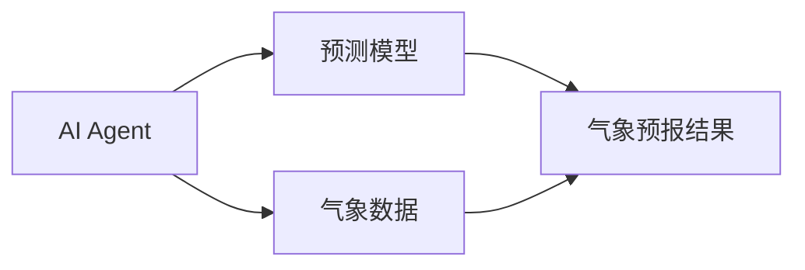
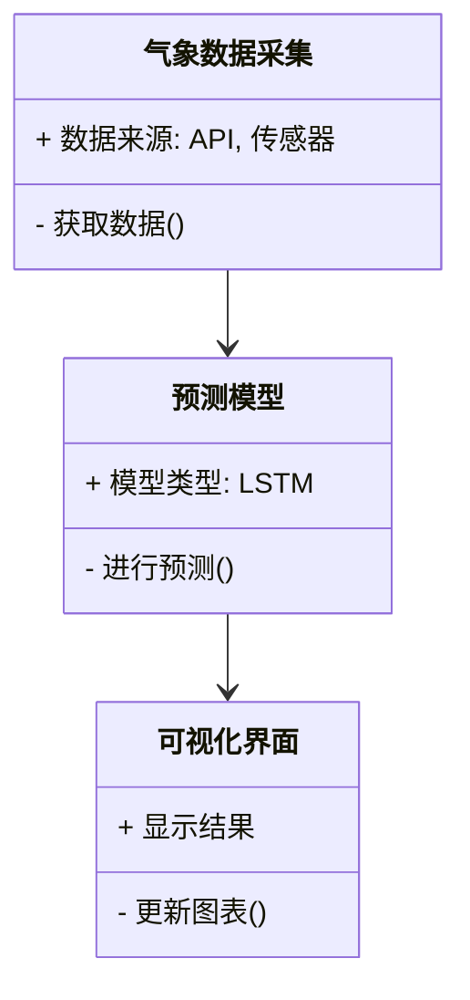
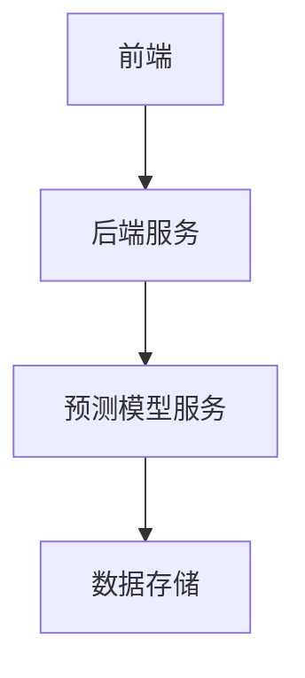

                 


# AI Agent在智能气象预报中的实践

> 关键词：AI Agent, 智能气象预报, 机器学习, 时间序列预测, 系统架构设计

> 摘要：本文探讨AI Agent在智能气象预报中的应用，从背景、核心概念、算法原理到系统架构设计和项目实战，详细分析其在气象预报中的实践价值，并结合实际案例进行深入解读。

---

## 第一部分: AI Agent与智能气象预报的背景与基础

### 第1章: AI Agent与智能气象预报的背景介绍

#### 1.1 AI Agent的基本概念

- **1.1.1 AI Agent的定义与核心特点**
  - AI Agent（人工智能代理）是指能够感知环境并采取行动以实现目标的智能体。
  - 核心特点包括自主性、反应性、目标导向和社会能力。

- **1.1.2 AI Agent的分类与应用场景**
  - 分为简单反射型、基于模型的反射型、目标驱动型和效用驱动型。
  - 应用于自动驾驶、智能助手、游戏AI和气象预测等领域。

- **1.1.3 AI Agent在气象预报中的潜在价值**
  - 提供实时数据处理、动态预测和个性化建议。

#### 1.2 智能气象预报的背景与发展

- **1.2.1 气象预报的传统方法与挑战**
  - 传统方法依赖统计分析和数值模拟，存在精度低和实时性差的问题。

- **1.2.2 智能化气象预报的需求与趋势**
  - 需求：提高准确性、实时性和个性化服务。
  - 趋势：向智能化、数据驱动和多模态预测发展。

- **1.2.3 AI Agent在气象预报中的问题背景与目标**
  - 问题：传统方法难以应对复杂天气变化。
  - 目标：利用AI Agent实现高效、智能的气象预报。

#### 1.3 本章小结

- AI Agent与气象预报的核心联系在于提升预测效率和准确性。
- 本章内容为后续章节奠定基础。

---

## 第二部分: AI Agent与智能气象预报的核心概念与联系

### 第2章: AI Agent与智能气象预报的核心概念

#### 2.1 AI Agent的核心原理

- **2.1.1 AI Agent的感知与决策机制**
  - 感知：通过传感器和API获取气象数据。
  - 决策：基于强化学习选择最优预测模型。

- **2.1.2 基于强化学习的AI Agent行为**
  - 通过奖励机制优化预测策略。

#### 2.2 AI Agent与气象预报模型的对比分析

- **对比表格：AI Agent与传统气象模型的属性特征**

| 属性          | AI Agent                     | 传统气象模型           |
|---------------|------------------------------|------------------------|
| 数据需求      | 高，需多源实时数据           | 较低，依赖历史数据       |
| 模型更新      | 频繁，基于反馈             | 偶尔，基于新数据         |
| 可解释性      | 较低，基于复杂算法         | 较高，基于统计分析       |

- **Mermaid实体关系图**



---

## 第三部分: AI Agent的算法原理与实现

### 第3章: 基于机器学习的气象预测算法

#### 3.1 时间序列预测模型的选择与实现

- **模型选择：使用LSTM进行时间序列预测**


- **Python代码示例**

```python
import numpy as np
import pandas as pd
from sklearn.preprocessing import MinMaxScaler
from tensorflow.keras.models import Sequential
from tensorflow.keras.layers import LSTM, Dense

# 数据预处理
data = pd.read_csv('气象数据.csv')
scaler = MinMaxScaler()
data_scaled = scaler.fit_transform(data)

# 模型构建
model = Sequential()
model.add(LSTM(50, return_sequences=True, input_shape=(timesteps, features)))
model.add(Dense(1))
model.compile(optimizer='adam', loss='mean_squared_error')

# 训练
model.fit(X_train, y_train, epochs=50, batch_size=32)
```

- **数学模型：LSTM结构**

$$
f(t) = \text{LSTM}(t-1, h(t-1), c(t-1))
$$

其中，$h(t)$是隐藏状态，$c(t)$是细胞状态。

---

## 第四部分: 智能气象预报系统的架构设计

### 第4章: 系统分析与架构设计

#### 4.1 问题场景与系统功能设计

- **问题场景：实时气象监测与预测**
- **系统功能：数据采集、预测、可视化**

#### 4.2 领域模型类图设计



#### 4.3 系统架构设计



---

## 第五部分: 项目实战与案例分析

### 第5章: 项目实战

#### 5.1 环境安装与数据准备

- **环境：Python 3.8，TensorFlow 2.5，Jupyter Notebook**
- **数据：获取公开气象数据集**

#### 5.2 核心代码实现

```python
import numpy as np
import pandas as pd
from sklearn.preprocessing import MinMaxScaler
from tensorflow.keras.models import Sequential
from tensorflow.keras.layers import LSTM, Dense

# 数据预处理
data = pd.read_csv('气象数据.csv')
scaler = MinMaxScaler()
data_scaled = scaler.fit_transform(data)

# 划分训练集和测试集
timesteps = 30
features = 5
X_train, y_train = get_train_data(data_scaled, timesteps, features)
X_test, y_test = get_test_data(data_scaled, timesteps, features)

# 模型构建与训练
model = Sequential()
model.add(LSTM(50, return_sequences=True, input_shape=(timesteps, features)))
model.add(Dense(1))
model.compile(optimizer='adam', loss='mean_squared_error')
model.fit(X_train, y_train, epochs=50, batch_size=32)
```

#### 5.3 案例分析与解读

- **案例：基于LSTM的温度预测**
- **分析：模型预测与实际数据对比，计算误差**

---

## 第六部分: 总结与展望

### 第6章: 总结与最佳实践

#### 6.1 最佳实践

- **数据质量：确保数据准确性和完整性**
- **模型优化：定期更新模型参数**
- **系统维护：及时修复问题，优化性能**

#### 6.2 未来展望

- **多模态预测：结合卫星图像和气象数据**
- **分布式计算：提高处理能力**
- **边缘计算：实现实时预测**

---

## 作者：AI天才研究院 & Zen And The Art of Computer Programming

