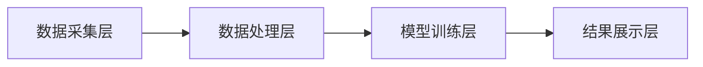
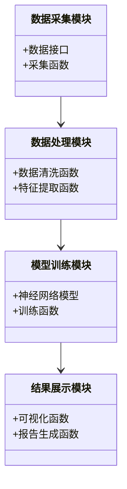
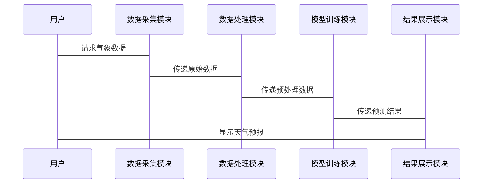

                 


# AI Agent在智能气象预报系统中的实践

> **关键词**：AI Agent, 智能气象预报, 机器学习, 深度学习, 气象数据分析  
> **摘要**：本文探讨了AI Agent在智能气象预报系统中的实践应用，分析了AI Agent的核心概念、算法原理，以及在气象数据处理、预测模型构建、结果分析和可视化等环节的具体实现。通过系统架构设计和项目实战，展示了如何利用AI技术提升气象预报的准确性、实时性和智能化水平。

---

## 第一部分: AI Agent在智能气象预报系统中的背景与概念

### 第1章: AI Agent与智能气象预报概述

#### 1.1 AI Agent的基本概念

##### 1.1.1 AI Agent的定义与特点

AI Agent（人工智能代理）是一种能够感知环境、执行任务并做出决策的智能实体。它具有以下特点：

- **自主性**：能够在没有外部干预的情况下自主运行。
- **反应性**：能够实时感知环境并做出响应。
- **目标导向性**：通过预设的目标或任务驱动行为。
- **学习能力**：能够通过数据和经验不断优化性能。

##### 1.1.2 AI Agent的核心原理

AI Agent的核心原理是通过数据驱动和模型驱动的方式，结合感知、推理、学习和决策等过程，实现对复杂问题的智能化处理。

##### 1.1.3 AI Agent与传统气象预报的区别

传统气象预报依赖于人工经验、统计模型和物理模型，而AI Agent则通过机器学习、深度学习等技术，能够处理海量非结构化数据，发现隐藏的模式，并提供更精准的预测。

#### 1.2 智能气象预报的背景与需求

##### 1.2.1 气象预报的重要性与挑战

气象预报在农业、交通、能源、环境保护等领域具有重要作用。然而，气象数据的复杂性、不确定性以及实时性要求，使得传统方法难以满足需求。

##### 1.2.2 AI技术在气象预报中的应用潜力

AI技术能够通过处理多源异构数据（如卫星数据、气象站数据、历史数据等），构建高精度的预测模型，并实时更新预测结果。

##### 1.2.3 智能气象预报系统的建设目标

智能气象预报系统的建设目标是通过AI Agent技术，实现气象数据的智能采集、分析、预测和展示，提升预报的准确性和实时性。

## 第二部分: AI Agent的核心概念与算法原理

### 第2章: AI Agent的核心概念与原理

#### 2.1 AI Agent的类型与特点

##### 2.1.1 基于规则的AI Agent

基于规则的AI Agent通过预设的规则和条件进行决策。例如，在气象预报中，可以根据温度、湿度等指标设置阈值，触发相应的预警。

##### 2.1.2 基于机器学习的AI Agent

基于机器学习的AI Agent能够通过历史数据训练模型，并根据新数据预测未来的气象变化。例如，使用支持向量机（SVM）或随机森林（Random Forest）进行分类或回归预测。

##### 2.1.3 基于深度学习的AI Agent

基于深度学习的AI Agent能够处理复杂的非结构化数据，例如卫星图像和雷达回波图。通过卷积神经网络（CNN）或循环神经网络（RNN）进行特征提取和序列预测。

#### 2.2 AI Agent的核心算法与实现

##### 2.2.1 监督学习算法

监督学习算法通过标注数据训练模型，例如使用线性回归或支持向量回归（SVR）进行气象参数的预测。

##### 2.2.2 无监督学习算法

无监督学习算法用于发现数据中的隐藏结构，例如使用聚类算法（K-means）对气象数据进行分类。

##### 2.2.3 强化学习算法

强化学习算法通过与环境的交互获得奖励，例如在气象预报中，AI Agent可以通过模拟环境中的天气变化，学习最优的预测策略。

#### 2.3 AI Agent的数学模型与公式

##### 2.3.1 线性回归模型

线性回归模型用于预测连续的气象参数，例如温度：

$$y = \beta_0 + \beta_1x + \epsilon$$

其中，$y$ 是预测值，$x$ 是输入特征，$\beta_0$ 和 $\beta_1$ 是模型参数，$\epsilon$ 是误差项。

##### 2.3.2 神经网络模型

神经网络模型用于处理复杂的非线性关系，例如使用多层感知机（MLP）进行分类任务：

$$a^{(l)} = \sigma(w^{(l)}a^{(l-1)} + b^{(l)})$$

其中，$a^{(l)}$ 是第$l$层的激活值，$w^{(l)}$ 是权重矩阵，$b^{(l)}$ 是偏置项，$\sigma$ 是激活函数（如ReLU或Sigmoid）。

##### 2.3.3 损失函数与优化算法

损失函数用于衡量模型预测值与真实值之间的差异，例如均方误差（MSE）：

$$\text{损失函数} = \frac{1}{n}\sum_{i=1}^{n}(y_i - \hat{y}_i)^2$$

优化算法用于最小化损失函数，例如使用Adam优化器：

$$\theta_{t+1} = \theta_t - \eta \frac{\rho_1}{\sqrt{\rho_2}} \frac{\partial L}{\partial \theta}$$

其中，$\theta$ 是模型参数，$\eta$ 是学习率，$\rho_1$ 和 $\rho_2$ 是动量参数。

#### 2.4 本章小结

本章介绍了AI Agent的核心概念与算法原理，包括不同类型的AI Agent及其应用场景，以及监督学习、无监督学习和强化学习算法的数学模型和优化方法。

---

## 第三部分: AI Agent在智能气象预报系统中的系统架构与设计

### 第3章: 智能气象预报系统架构设计

#### 3.1 系统功能需求分析

##### 3.1.1 数据采集模块

数据采集模块负责收集气象数据，包括卫星数据、气象站数据、雷达数据等。

##### 3.1.2 数据处理模块

数据处理模块对采集的数据进行清洗、归一化和特征提取，例如使用时间序列分析提取气象趋势特征。

##### 3.1.3 模型训练模块

模型训练模块通过机器学习或深度学习算法训练预测模型，并对模型进行评估和优化。

##### 3.1.4 结果展示模块

结果展示模块将预测结果以可视化的方式呈现，例如生成天气预报图或警报信息。

#### 3.2 系统架构设计

##### 3.2.1 分层架构设计

分层架构设计将系统划分为数据采集层、数据处理层、模型训练层和结果展示层，每一层负责不同的功能。



##### 3.2.2 模块化设计

模块化设计将系统划分为独立的模块，每个模块负责特定的功能，例如数据采集模块、数据处理模块、模型训练模块和结果展示模块。



#### 3.3 系统接口设计

系统接口设计定义了模块之间的交互接口，例如数据采集模块通过API向数据处理模块传递数据，数据处理模块通过队列向模型训练模块传递预处理后的数据。

#### 3.4 系统交互设计

系统交互设计通过序列图展示了模块之间的协作过程。



#### 3.5 本章小结

本章详细介绍了智能气象预报系统的架构设计，包括分层架构、模块化设计、系统接口设计和系统交互设计。

---

## 第四部分: AI Agent在智能气象预报系统中的项目实战

### 第4章: 项目实战

#### 4.1 环境配置

##### 4.1.1 安装Python

安装Python 3.8及以上版本，并安装必要的库，例如NumPy、Pandas、Matplotlib、Scikit-learn、Keras和TensorFlow。

##### 4.1.2 安装数据处理库

安装数据处理库，例如Pandas和NumPy。

##### 4.1.3 安装机器学习库

安装机器学习库，例如Scikit-learn、XGBoost和LightGBM。

##### 4.1.4 安装深度学习库

安装深度学习库，例如Keras和TensorFlow。

#### 4.2 系统核心实现

##### 4.2.1 数据预处理

数据预处理包括数据清洗、归一化和特征提取。

```python
import pandas as pd
import numpy as np

# 读取数据
data = pd.read_csv('weather.csv')

# 数据清洗
data.dropna(inplace=True)

# 数据归一化
from sklearn.preprocessing import MinMaxScaler
scaler = MinMaxScaler()
normalized_data = scaler.fit_transform(data[['温度', '湿度', '风速']])

# 特征提取
from sklearn.feature_selection import SelectKBest
selector = SelectKBest(k=3)
selected_features = selector.fit_transform(normalized_data, data['标签'])
```

##### 4.2.2 模型训练

模型训练包括选择模型、训练模型和评估模型。

```python
# 线性回归模型
from sklearn.linear_model import LinearRegression
model = LinearRegression()

# 支持向量回归模型
from sklearn.svm import SVR
model = SVR(kernel='rbf')

# 神经网络模型
from keras.models import Sequential
from keras.layers import Dense
model = Sequential()
model.add(Dense(64, activation='relu', input_dim=3))
model.add(Dense(1, activation='linear'))
model.compile(loss='mean_squared_error', optimizer='adam')
model.fit(normalized_data, data['标签'], epochs=100, batch_size=32)
```

##### 4.2.3 结果分析与可视化

结果分析与可视化包括绘制预测结果图和生成报告。

```python
import matplotlib.pyplot as plt

# 绘制真实值与预测值的对比图
plt.figure(figsize=(10, 6))
plt.plot(data['日期'], data['标签'], label='真实值')
plt.plot(data['日期'], predictions, label='预测值')
plt.xlabel('日期')
plt.ylabel('气象参数')
plt.legend()
plt.show()

# 生成报告
from reportlab.pdfgen import canvas
from reportlab.lib import colors

# 创建PDF报告
c = canvas.Canvas('气象预报报告.pdf')
c.setFont('Helvetica', 12)
c.drawString(50, 750, '气象预报报告')
c.drawString(50, 730, '预测结果如下：')
c.drawImage('预测图.png', 50, 650, width=400, height=300)
c.save()
```

#### 4.3 项目小结

本章通过项目实战展示了AI Agent在智能气象预报系统中的具体实现，包括数据预处理、模型训练和结果分析与可视化。

---

## 第五部分: 总结与展望

### 第5章: 总结与展望

#### 5.1 本章总结

本文详细探讨了AI Agent在智能气象预报系统中的实践应用，分析了AI Agent的核心概念、算法原理，以及在气象数据处理、预测模型构建、结果分析和可视化等环节的具体实现。

#### 5.2 小结

通过本章的分析，我们可以看到，AI Agent技术能够显著提升气象预报的准确性和实时性，为气象服务和决策提供强有力的技术支持。

#### 5.3 注意事项

在实际应用中，需要注意数据的质量、模型的泛化能力以及系统的实时性要求。

#### 5.4 拓展阅读

读者可以进一步阅读相关领域的文献，例如《深度学习在气象预测中的应用》和《强化学习在智能决策中的实践》。

---

## 作者：AI天才研究院/AI Genius Institute & 禅与计算机程序设计艺术 /Zen And The Art of Computer Programming

---

**本文总结**：通过本文的探讨，我们可以看到，AI Agent技术在智能气象预报系统中的应用前景广阔，能够为气象服务提供更高效、更准确的技术支持。

