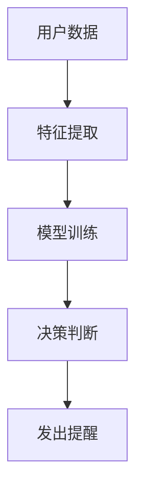
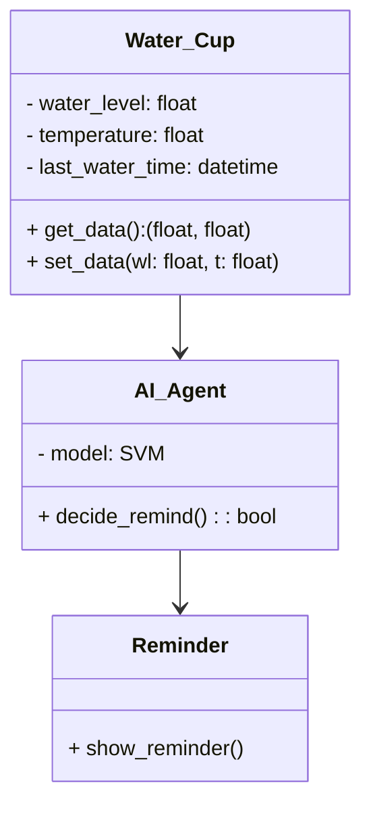
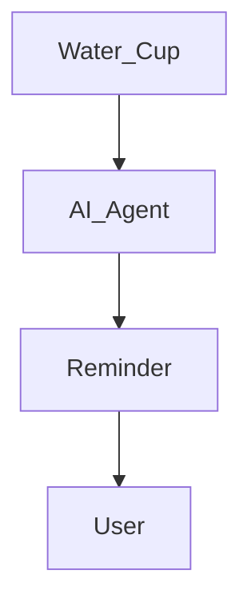
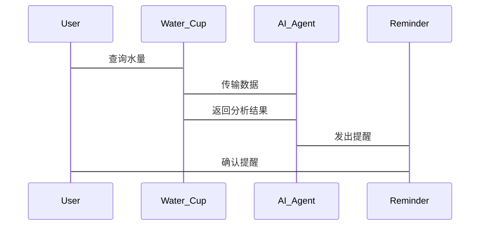

                 


# AI Agent在智能水杯中的饮水提醒

> 关键词：AI Agent, 智能水杯, 饮水提醒, 物联网, 人工智能, 传感器数据

> 摘要：本文详细探讨了AI Agent在智能水杯中的饮水提醒功能，从背景、概念、算法、系统架构到实际应用，全面分析了AI Agent在智能水杯中的实现与优化。文章通过详细的技术分析和案例展示，揭示了AI Agent如何通过智能水杯实现高效的饮水提醒，为读者提供了全面的技术视角。

---

## 第一部分: AI Agent在智能水杯中的背景与应用

### 第1章: AI Agent与智能水杯的背景介绍

#### 1.1 AI Agent的基本概念

##### 1.1.1 什么是AI Agent
AI Agent，即人工智能代理，是一种能够感知环境并采取行动以实现目标的智能实体。它通过传感器获取数据，利用算法进行决策，并通过执行器与环境交互。AI Agent的核心在于其自主性、反应性、目标导向性和社交能力。

##### 1.1.2 AI Agent的核心功能与特点
- **自主性**：能够在没有外部干预的情况下自主运行。
- **反应性**：能够根据环境变化实时调整行为。
- **目标导向性**：所有行动都围绕特定目标展开。
- **社交能力**：能够与其他系统或用户进行交互和协作。

##### 1.1.3 AI Agent在智能设备中的应用
AI Agent广泛应用于智能家居、自动驾驶、医疗设备等领域。在智能水杯中的应用主要体现在数据采集、用户行为分析和智能提醒等方面。

#### 1.2 智能水杯的发展现状

##### 1.2.1 智能水杯的定义与分类
智能水杯是一种结合了物联网技术的智能设备，能够监测水质、温度、水量，并通过AI技术提供个性化服务。根据功能的不同，智能水杯可以分为基础款、进阶款和高端款。

##### 1.2.2 智能水杯的主要功能与技术
- **功能**：实时监测水量、温度，记录饮水量，提供饮水提醒。
- **技术**：传感器技术、物联网通信、AI算法。

##### 1.2.3 智能水杯的市场现状与发展趋势
目前，智能水杯市场增长迅速，主要得益于人们对健康的关注增加和技术的进步。未来，智能水杯将更加智能化，集成更多健康监测功能。

#### 1.3 饮水提醒的必要性与应用场景

##### 1.3.1 饮水提醒的重要性
人体每天需要摄入约2升水，但很多人因为忙碌或其他原因容易忘记饮水，导致身体缺水，影响健康。

##### 1.3.2 饮水提醒的主要应用场景
- **日常生活**：提醒用户按时饮水，保持身体水分平衡。
- **运动场景**：在运动中实时监测水分流失，及时提醒补水。
- **健康监测**：结合健康数据，提供个性化饮水建议。

##### 1.3.3 AI Agent在饮水提醒中的优势
AI Agent能够根据用户的饮水习惯、活动量和健康状况，提供个性化的饮水提醒，相比传统定时提醒更加智能和科学。

---

### 第2章: AI Agent在智能水杯中的核心概念与联系

#### 2.1 AI Agent的核心概念原理

##### 2.1.1 AI Agent的感知层
感知层通过传感器获取数据，如水杯的水量、温度等。这些数据经过预处理后，传输给决策层。

##### 2.1.2 AI Agent的决策层
决策层利用机器学习算法，分析感知层提供的数据，判断是否需要发出饮水提醒。

##### 2.1.3 AI Agent的执行层
执行层根据决策层的指令，通过显示、声音等方式提醒用户饮水。

#### 2.2 AI Agent与智能水杯的关系

##### 2.2.1 AI Agent作为智能水杯的核心模块
AI Agent是智能水杯的“大脑”，负责数据处理和决策。

##### 2.2.2 智能水杯与AI Agent的交互流程
1. 传感器采集数据
2. AI Agent分析数据
3. AI Agent发出提醒指令
4. 用户与系统交互

#### 2.3 AI Agent与传统饮水提醒方式的对比

##### 2.3.1 传统饮水提醒方式的优缺点
- **优点**：简单、成本低
- **缺点**：缺乏个性化，提醒时间固定

##### 2.3.2 AI Agent饮水提醒的优势
- **个性化**：根据用户习惯调整提醒时间
- **实时性**：实时监测身体水分需求
- **智能化**：结合健康数据提供科学建议

##### 2.3.3 AI Agent与智能水杯的结合
通过AI Agent，智能水杯能够实现更加智能和个性化的饮水提醒，提升用户体验。

---

### 第3章: AI Agent在智能水杯中的算法原理

#### 3.1 AI Agent的核心算法

##### 3.1.1 数据收集与特征提取
传感器收集数据，如水量、温度、用户饮水习惯等。

##### 3.1.2 AI Agent的决策算法
使用机器学习算法，如支持向量机（SVM）或随机森林（Random Forest），对数据进行分类或回归分析，判断是否需要提醒饮水。

##### 3.1.3 算法流程图


##### 3.1.4 代码示例
```python
import numpy as np
from sklearn import svm

# 示例数据
X = np.array([[25, 1000], [30, 800], [28, 950]])
y = np.array([1, 0, 1])

# 训练模型
model = svm.SVC()
model.fit(X, y)

# 预测
new_data = np.array([[27, 900]])
print(model.predict(new_data))
```

---

#### 3.2 数学模型与公式推导

##### 3.2.1 饮水提醒模型
建立一个基于时间序列的饮水提醒模型，公式如下：
$$
D(t) = a \cdot t + b
$$
其中，D(t)表示饮水量，t表示时间，a和b为模型参数。

##### 3.2.2 模型训练与优化
通过最小二乘法优化模型参数：
$$
\hat{a} = \frac{\sum (t_i - \bar{t})(D_i - \bar{D})}{\sum (t_i - \bar{t})^2}
$$
$$
\hat{b} = \bar{D} - \hat{a} \cdot \bar{t}
$$

##### 3.2.3 案例分析
假设用户在过去一天的饮水量数据如下：
$$
t = [1, 2, 3, 4, 5], D = [800, 750, 850, 780, 820]
$$
计算得到：
$$
\hat{a} = 10, \hat{b} = 700
$$
模型为：
$$
D(t) = 10t + 700
$$
预测下一小时的饮水量为：
$$
D(6) = 10 \cdot 6 + 700 = 760
$$

---

## 第四部分: 系统分析与架构设计方案

### 第4章: 系统分析与架构设计

#### 4.1 项目背景与需求分析

##### 4.1.1 项目背景
智能水杯项目旨在通过AI Agent实现智能化的饮水提醒，帮助用户保持健康。

##### 4.1.2 系统功能需求
- 实时监测水量和温度
- 用户饮水习惯分析
- 个性化饮水提醒

#### 4.2 系统架构设计

##### 4.2.1 领域模型


##### 4.2.2 系统架构


#### 4.3 系统接口设计

##### 4.3.1 API接口
- `GET /data`：获取水杯数据
- `POST /reminder`：发送提醒指令

#### 4.4 系统交互流程

##### 4.4.1 交互流程图


---

## 第五部分: 项目实战

### 第5章: 项目实战

#### 5.1 环境搭建与安装

##### 5.1.1 系统环境
- Python 3.8+
- Linux或Windows系统

##### 5.1.2 安装依赖
```bash
pip install numpy scikit-learn mermaid4jupyter jupyter
```

#### 5.2 系统核心实现

##### 5.2.1 核心代码实现
```python
import numpy as np
from sklearn import svm
import time

# 数据预处理
def preprocess(data):
    return data

# AI Agent实现
class AI-Agent:
    def __init__(self):
        self.model = svm.SVC()

    def train(self, X, y):
        self.model.fit(X, y)

    def predict(self, X):
        return self.model.predict(X)

# 提醒模块
class Reminder:
    def show_reminder(self):
        print("请喝水！")

# 主程序
if __name__ == "__main__":
    water_data = [[25, 1000], [28, 950], [30, 800]]
    target = [1, 1, 0]
    agent = AI-Agent()
    agent.train(water_data, target)
    new_data = [[27, 900]]
    prediction = agent.predict(new_data)
    if prediction[0] == 1:
        reminder = Reminder()
        reminder.show_reminder()
```

#### 5.3 案例分析与总结

##### 5.3.1 案例分析
假设用户在过去一周的饮水记录如下：
$$
t = [1, 2, 3, 4, 5, 6, 7], D = [800, 750, 850, 780, 820, 800, 790]
$$
通过模型预测，系统发现用户的饮水量在工作日有所下降，因此在工作日提供更多饮水提醒。

##### 5.3.2 项目总结
通过AI Agent实现智能饮水提醒，不仅提升了用户体验，还通过数据分析为用户提供更科学的饮水建议。

---

## 第六部分: 最佳实践与小结

### 第6章: 最佳实践与注意事项

#### 6.1 最佳实践

##### 6.1.1 数据隐私保护
确保用户数据的安全性，避免数据泄露。

##### 6.1.2 传感器选择
选择精度高、响应快的传感器，确保数据的准确性。

##### 6.1.3 系统优化
定期更新模型，优化算法，提升系统的准确性和响应速度。

#### 6.2 小结

##### 6.2.1 项目回顾
通过AI Agent实现智能水杯的饮水提醒，不仅提升了用户体验，还通过数据分析为用户提供更科学的饮水建议。

##### 6.2.2 项目展望
未来，可以进一步优化算法，引入更多健康监测功能，如心率监测、血氧检测等，为用户提供更全面的健康服务。

---

## 作者信息

作者：AI天才研究院/AI Genius Institute & 禅与计算机程序设计艺术 /Zen And The Art of Computer Programming

---

感谢您的耐心阅读！希望本文能为您提供有价值的技术见解和实践指导。

